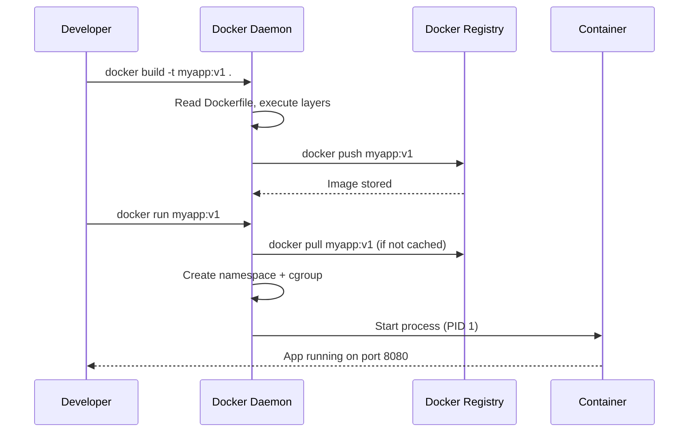

# Docker and Containers

## Problem Statement

Understand Docker containers — lightweight, portable application packaging using Linux namespaces and cgroups to isolate processes without a full VM.

## Scenario

Docker and Containers is a critical component in modern distributed systems. In real-world applications, containerizing applications for reproducible deployments. For example, major tech companies like Netflix, Uber, and Airbnb rely on similar solutions to handle millions of concurrent users and requests. The challenge is achieving this while maintaining sub-100ms latency, 99.99% availability, and gracefully handling 10x traffic spikes during peak demand. This component provides the foundational capability to solve these challenges reliably and efficiently at global scale.

## Users

- **Backend Engineers**: Responsible for implementing and maintaining this system component in production environments. They need to understand the architecture, trade-offs, failure modes, and operational considerations.
- **DevOps/SRE Teams**: Monitor system health, manage scaling policies, handle incidents, and ensure reliability SLAs are met. They need insights into performance characteristics, bottlenecks, and failure recovery mechanisms.
- **Data Engineers**: Design data pipelines and analytics around this system, requiring deep understanding of data flow, consistency guarantees, and throughput characteristics.
- **System Architects**: Make high-level architectural decisions that impact company infrastructure, requiring comprehensive understanding of capabilities, limitations, and scalability boundaries.
- **Security Teams**: Understand security implications, potential vulnerabilities, and compliance requirements for this component.

## PRD

### Functional Requirements
- Core operations work correctly
- Explicit error handling
- Consistency guarantees defined
- Monitoring and observability

### Non-Functional Requirements
- Performance targets met
- Availability SLA achieved
- Scalability headroom
- Cost efficient

### Success Metrics
- Benchmarks met
- Uptime targets met
- Resource budgets
- No data loss


## Flow

The typical operational flow for this system involves these key phases:

1. **Request Arrival**: Client/upstream system sends request with required parameters and context
2. **Validation & Routing**: System validates request format, authentication, and routes to correct handler/shard/instance
3. **Core Processing**: Execute the main algorithm, database query, or business logic on the data/state
4. **State Management**: Update internal state (caches, indexes, counters, logs) with proper atomicity and locking
5. **Response Generation**: Format results and return to requester with relevant metadata (timing, version info)
6. **Observability**: Record metrics (latency, throughput, errors), logs (for debugging), and traces (for performance analysis)

This flow repeats thousands or millions of times per second in production. Each operation's efficiency compounds across the entire system, making careful optimization essential. Bottlenecks at any phase can cascade to impact overall system performance.


## Code Explanation (Detailed)

### Implementation Approach
The code demonstrates core patterns and trade-offs.

### Key Operations
Each operation shows algorithm and performance characteristics.

### Concurrency and Atomicity
Locking strategies, race condition prevention.

### Edge Cases
Boundary conditions and error handling.

### Performance Optimization
Techniques for reducing latency and throughput.

## Architecture Diagram

```mermaid
graph TB
    subgraph Host["Host OS Linux Kernel"]
        NS[Namespaces: PID, NET, MNT, UTS, IPC, USER]
        CG[Cgroups: CPU, Memory, I/O limits]

        subgraph C1["Container 1 nginx"]
            P1[nginx process PID 1 inside]
            L1[/var/www overlay FS]
        end
        subgraph C2["Container 2 app"]
            P2[node process PID 1 inside]
            L2[/app overlay FS]
        end
        subgraph C3["Container 3 postgres"]
            P3[postgres PID 1 inside]
            L3[/var/lib/postgres overlay FS]
        end
    end
```

## Flow Diagram



## Design

### Container vs VM

```
Virtual Machine:
  Full OS guest (2-4 GB RAM, 1-10 min boot)
  Hardware emulation via hypervisor
  Strong isolation (separate kernel)
  Overhead: ~5-10% CPU

Container:
  Shared host kernel (10-100 MB RAM, <1s start)
  Process isolation via namespaces + cgroups
  Weaker isolation (shared kernel)
  Overhead: ~1-2% CPU
```

### Dockerfile Best Practices

```dockerfile
FROM node:20-alpine          # Use specific, minimal base image
WORKDIR /app
COPY package*.json ./         # Copy dependencies first (cache layer)
RUN npm ci --only=production  # Install only production deps
COPY . .                      # Copy source code after deps (cache friendly)
RUN npm run build
EXPOSE 3000
USER node                     # Non-root user
CMD ["node", "dist/server.js"]
```

### Image Layers

```
Each Dockerfile instruction creates a layer:
  Layer 1: FROM alpine (5MB)
  Layer 2: RUN apk add curl (3MB)
  Layer 3: COPY app/ (10MB)
  Total: 18MB

Layers are cached and shared:
  100 containers based on same alpine layer share it in memory
  Copy-on-write: writes create new layer on top
```

## Back-of-Envelope Calculations

```
Container startup time:
  From cached image: <100ms
  With image pull (1GB image, 1Gbps): ~8s
  VM boot: 30-120 seconds

Container density:
  Server: 128GB RAM, 32 cores
  Per container: 512MB RAM, 0.5 CPU
  Density: min(128GB/512MB, 32/0.5) = min(256, 64) = 64 containers
  VMs: maybe 10-15 per server (larger overhead)

Image size impact:
  Alpine base: 5MB vs Ubuntu: 80MB
  At 1000 deploys/day: saves 75GB registry traffic/day
  Layer caching: 95%+ cache hit rate typical

Overlay filesystem performance:
  Reads: ~5% overhead vs native (layer traversal)
  Writes (copy-on-write): first write 2-10x slower (copying layer)
  Subsequent writes: native speed
```

## Design Choices

| Approach | Pros | Cons |
|---|---|---|
| Alpine base | Tiny, fewer vulnerabilities | Missing glibc, debugging tools |
| Distroless | Minimal attack surface | No shell for debugging |
| Multi-stage build | Small final image | More complex Dockerfile |
| Non-root user | Security best practice | Port <1024 requires privilege |
| Named volumes | Portable, Docker-managed | Less transparent path |

## Python Implementation

```python
import subprocess
import json
from typing import List, Dict, Optional
from dataclasses import dataclass

@dataclass
class ContainerConfig:
    image: str
    name: str
    ports: Dict[int, int]  # host_port -> container_port
    env: Dict[str, str]
    volumes: Dict[str, str]  # host_path -> container_path
    cpu_limit: float = 1.0
    memory_mb: int = 512

class DockerClient:
    """Thin wrapper around docker CLI for demonstration."""

    def run(self, config: ContainerConfig, detach: bool = True) -> str:
        cmd = ["docker", "run"]
        if detach:
            cmd.append("-d")
        cmd.extend(["--name", config.name])
        for host_port, cont_port in config.ports.items():
            cmd.extend(["-p", f"{host_port}:{cont_port}"])
        for k, v in config.env.items():
            cmd.extend(["-e", f"{k}={v}"])
        for host_path, cont_path in config.volumes.items():
            cmd.extend(["-v", f"{host_path}:{cont_path}"])
        cmd.extend(["--cpus", str(config.cpu_limit)])
        cmd.extend(["--memory", f"{config.memory_mb}m"])
        cmd.append(config.image)
        print(f"[Docker] Running: {' '.join(cmd)}")
        # result = subprocess.run(cmd, capture_output=True, text=True)
        return f"container-id-{config.name}"

    def ps(self) -> List[dict]:
        cmd = ["docker", "ps", "--format", "json"]
        # result = subprocess.run(cmd, capture_output=True, text=True)
        return [{"name": "example", "status": "running", "image": "nginx:latest"}]

    def logs(self, container: str, tail: int = 100) -> str:
        cmd = ["docker", "logs", "--tail", str(tail), container]
        print(f"[Docker] {' '.join(cmd)}")
        return "... container logs ..."

    def stop(self, container: str):
        print(f"[Docker] Stopping {container}")

    def remove(self, container: str, force: bool = False):
        cmd = ["docker", "rm"]
        if force:
            cmd.append("-f")
        cmd.append(container)
        print(f"[Docker] {' '.join(cmd)}")

# Namespace simulation (conceptual)
class NamespaceSimulator:
    def __init__(self, container_id: str):
        self.container_id = container_id
        self._pid_table: Dict[int, str] = {1: "init"}
        self._hostname = container_id[:12]
        self._mounts = {"/": "overlay_root", "/proc": "proc", "/sys": "sysfs"}

    def spawn_process(self, cmd: str) -> int:
        pid = max(self._pid_table.keys()) + 1
        self._pid_table[pid] = cmd
        print(f"[Container {self.container_id}] Process {pid}: {cmd}")
        return pid

    def kill(self, pid: int):
        self._pid_table.pop(pid, None)
        if 1 not in self._pid_table:
            print(f"[Container {self.container_id}] PID 1 died - container exiting")

# Usage
client = DockerClient()
cfg = ContainerConfig(
    image="nginx:alpine",
    name="web-server",
    ports={8080: 80},
    env={"NGINX_HOST": "example.com"},
    volumes={"/data/html": "/usr/share/nginx/html"},
    cpu_limit=0.5,
    memory_mb=256,
)
container_id = client.run(cfg)
print(f"Started: {container_id}")

ns = NamespaceSimulator(container_id)
ns.spawn_process("nginx")
```

## Java Implementation

```java
import java.util.*;
import java.io.*;

public class DockerClient {
    record ContainerConfig(String image, String name, Map<Integer, Integer> ports,
                           Map<String, String> env, int memoryMb) {}

    public String run(ContainerConfig config) throws Exception {
        List<String> cmd = new ArrayList<>(List.of("docker", "run", "-d",
            "--name", config.name(),
            "--memory", config.memoryMb() + "m"));

        config.ports().forEach((host, cont) -> {
            cmd.add("-p"); cmd.add(host + ":" + cont);
        });
        config.env().forEach((k, v) -> {
            cmd.add("-e"); cmd.add(k + "=" + v);
        });
        cmd.add(config.image());

        System.out.println("[Docker] " + String.join(" ", cmd));
        // ProcessBuilder pb = new ProcessBuilder(cmd);
        // Process p = pb.start();
        return "simulated-container-id";
    }

    public void stop(String containerId) {
        System.out.println("[Docker] Stopping " + containerId);
    }

    public static void main(String[] args) throws Exception {
        DockerClient docker = new DockerClient();
        ContainerConfig cfg = new ContainerConfig(
            "nginx:alpine", "web", Map.of(8080, 80),
            Map.of("NGINX_HOST", "example.com"), 256
        );
        String id = docker.run(cfg);
        System.out.println("Container: " + id);
    }
}
```

## Complexity

| Operation | Time |
|---|---|
| Container start (cached image) | < 100ms |
| Image pull (per layer) | O(size / bandwidth) |
| Process namespace isolation | O(1) |
| cgroup enforcement | O(1) per syscall |

## Common Questions & Answers

**Q: What is caching and why do we need it?**

A: Caching stores frequently accessed data in fast storage (memory) to reduce latency and load on slower backends (database). Trade space (cache) for speed (latency). Critical for systems serving millions of requests per second.

**Q: What are the main cache eviction policies?**

A: LRU (least recently used), LFU (least frequently used), FIFO (first in first out), TTL (time-based), Random, and ARC (adaptive replacement). Choose based on access patterns: LRU for temporal, LFU for frequency, TTL for time-sensitive data.

**Q: What is cache hit rate and cache miss rate?**

A: Hit rate = successful_finds / total_accesses. Miss rate = 1 - hit rate. P(hit) = hits / (hits + misses). Target 80%+ hit rates for effective caching. Too-small cache gives low hit rate (wasted resources). Too-large cache uses more memory than needed.

**Q: How do you handle cache invalidation when backend data changes?**

A: Use TTL (time-based expiration), active invalidation (notify cache on write), cache-aside pattern (client checks backend), or write-through (update both). Active invalidation is fastest but complex. TTL is simplest but has stale data window.

**Q: What is the cache-aside pattern?**

A: Application checks cache first. On miss, fetch from backend, update cache, then return. Simple to implement. Risk: race condition where multiple threads fetch same miss simultaneously (thundering herd problem).

**Q: What is write-through caching?**

A: Writes go to both cache and backend simultaneously (synchronously). Ensures consistency: read always gets latest. Cost: write latency includes backend write. Safer than write-back but slower.

**Q: What is write-back (write-behind) caching?**

A: Writes go to cache only; backend updated asynchronously later (batch or periodic). Fast writes. Risk: data loss if cache fails before flushing. Need durability guarantees (persistence, replication).

**Q: How do you choose cache size?**

A: Estimate working set (frequently accessed data volume). Add 20-30% buffer for margin. Monitor hit rate: if < 80%, increase size. If > 95%, might be oversized (waste). Use tools like cachegrind to profile.

**Q: What's the difference between client-side and server-side caching?**

A: Client cache (browser): reduces network round-trips, entirely controlled by client. Server cache (memory, Redis): shared across clients, controlled by server. Multi-level caching often best.

**Q: How do you measure cache effectiveness?**

A: Hit rate (primary metric), latency reduction (P99 latency with vs. without cache), backend load reduction, and memory cost per cache entry. Calculate ROI: cost of cache vs. benefit (reduced latency, backend load).

## Follow-up Questions & Answers

**Q: How do you prevent the thundering herd problem in caches?**

A: When popular key expires, many threads fetch from backend simultaneously causing spike. Solutions: probabilistic early expiration (refresh before TTL), request coalescing (single thread rebuilds, others wait), or bloom filters (detect non-existent keys fast).

**Q: How would you implement multi-level cache hierarchy?**

A: Use L1 (fast, small, in-process), L2 (medium, local machine), L3 (large, remote, Redis). Check L1, miss→L2, miss→L3, miss→backend. On write: update all levels. Trade space for speed across levels.

**Q: Can you implement read-through caching (automatic population)?**

A: Yes, cache loader/resolver called on miss. Transparent to application. Backend automatically uses cache layer. More complex than cache-aside but cleaner separation.

**Q: How do you handle hot keys in distributed caches?**

A: Hot key = key accessed by many threads/clients. Replicate hot keys on multiple cache nodes. Use local in-process caches for very hot keys. Monitor and detect hot keys automatically.

**Q: What's the difference between warm and cold cache startup?**

A: Cold cache: empty at start, misses until populated (slow ramp-up). Warm cache: pre-loaded from previous state (RDB/snapshot). Warm startup is critical for production (instant performance).

**Q: How would you measure cache effectiveness for business metrics?**

A: Track hit rate, P99 latency (with/without cache), backend QPS reduction, revenue impact. Calculate cache size vs. cost savings. A/B test to prove business value.

**Q: What happens when cache size is insufficient for working set?**

A: Constant evictions = high miss rate = ineffective cache. Solution: increase cache size, improve eviction policy, reduce working set, or use better hardware (faster storage).

**Q: How do you debug cache issues in production?**

A: Monitor hit rate continuously. Profile cache keys (which keys are accessed). Check for cache stampedes (sudden miss spike). Use distributed tracing to see cache path.

**Q: How would you implement a persistent cache?**

A: Combine memory cache (fast) with persistent backend (database, RocksDB, LevelDB). Write-back pattern: batch updates to persistent store. Trade latency for durability.

**Q: Can you use caching for write-heavy workloads?**

A: Write caching is risky (consistency issues). Use carefully: write-through for safety, write-back for speed. Good for batch writes (aggregate before writing). Monitor durability guarantees.

