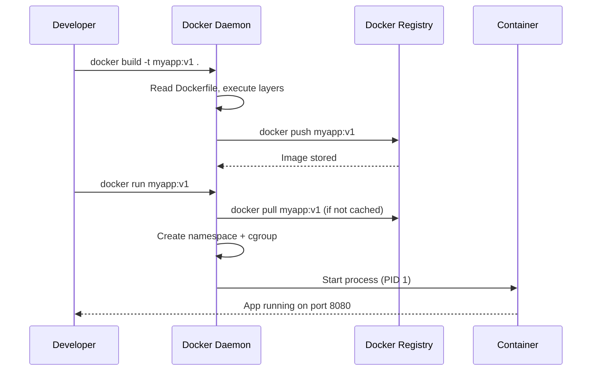

# Docker and Containers

## Problem Statement

Understand Docker containers — lightweight, portable application packaging using Linux namespaces and cgroups to isolate processes without a full VM.

## Architecture Diagram

```mermaid
graph TB
    subgraph Host["Host OS Linux Kernel"]
        NS[Namespaces: PID, NET, MNT, UTS, IPC, USER]
        CG[Cgroups: CPU, Memory, I/O limits]

        subgraph C1["Container 1 nginx"]
            P1[nginx process PID 1 inside]
            L1[/var/www overlay FS]
        end
        subgraph C2["Container 2 app"]
            P2[node process PID 1 inside]
            L2[/app overlay FS]
        end
        subgraph C3["Container 3 postgres"]
            P3[postgres PID 1 inside]
            L3[/var/lib/postgres overlay FS]
        end
    end
```

## Flow Diagram



## Design

### Container vs VM

```
Virtual Machine:
  Full OS guest (2-4 GB RAM, 1-10 min boot)
  Hardware emulation via hypervisor
  Strong isolation (separate kernel)
  Overhead: ~5-10% CPU

Container:
  Shared host kernel (10-100 MB RAM, <1s start)
  Process isolation via namespaces + cgroups
  Weaker isolation (shared kernel)
  Overhead: ~1-2% CPU
```

### Dockerfile Best Practices

```dockerfile
FROM node:20-alpine          # Use specific, minimal base image
WORKDIR /app
COPY package*.json ./         # Copy dependencies first (cache layer)
RUN npm ci --only=production  # Install only production deps
COPY . .                      # Copy source code after deps (cache friendly)
RUN npm run build
EXPOSE 3000
USER node                     # Non-root user
CMD ["node", "dist/server.js"]
```

### Image Layers

```
Each Dockerfile instruction creates a layer:
  Layer 1: FROM alpine (5MB)
  Layer 2: RUN apk add curl (3MB)
  Layer 3: COPY app/ (10MB)
  Total: 18MB

Layers are cached and shared:
  100 containers based on same alpine layer share it in memory
  Copy-on-write: writes create new layer on top
```

## Common Questions & Answers

**Q: How are containers isolated?** A: Linux namespaces isolate: PID (process IDs), NET (network interfaces), MNT (filesystem), UTS (hostname), IPC (shared memory), USER (user IDs). Cgroups limit resource usage.

**Q: Container vs process?** A: A container IS a process (or process group) with namespace and cgroup restrictions. `docker run` ultimately calls `clone()` syscall with namespace flags.

**Q: What happens when PID 1 dies?** A: Container exits. PID 1 in container is special — must handle signals (SIGTERM) and reap zombie children. Use `tini` or `dumb-init` as PID 1 wrapper if your process doesn't handle this.

**Q: How do containers communicate?** A: Default bridge network: containers get IPs in 172.17.0.0/16. Custom networks enable DNS resolution by container name. Host networking: share host's network namespace (no isolation).

**Q: What is a Docker volume vs bind mount?** A: Volume: managed by Docker, stored in /var/lib/docker/volumes, portable. Bind mount: maps host path directly into container (easier for dev, less portable).

## Back-of-Envelope Calculations

```
Container startup time:
  From cached image: <100ms
  With image pull (1GB image, 1Gbps): ~8s
  VM boot: 30-120 seconds

Container density:
  Server: 128GB RAM, 32 cores
  Per container: 512MB RAM, 0.5 CPU
  Density: min(128GB/512MB, 32/0.5) = min(256, 64) = 64 containers
  VMs: maybe 10-15 per server (larger overhead)

Image size impact:
  Alpine base: 5MB vs Ubuntu: 80MB
  At 1000 deploys/day: saves 75GB registry traffic/day
  Layer caching: 95%+ cache hit rate typical

Overlay filesystem performance:
  Reads: ~5% overhead vs native (layer traversal)
  Writes (copy-on-write): first write 2-10x slower (copying layer)
  Subsequent writes: native speed
```

## Design Choices

| Approach | Pros | Cons |
|---|---|---|
| Alpine base | Tiny, fewer vulnerabilities | Missing glibc, debugging tools |
| Distroless | Minimal attack surface | No shell for debugging |
| Multi-stage build | Small final image | More complex Dockerfile |
| Non-root user | Security best practice | Port <1024 requires privilege |
| Named volumes | Portable, Docker-managed | Less transparent path |

## Follow-up Questions

1. How does Docker handle networking between containers on different hosts?
2. What is the difference between ENTRYPOINT and CMD?
3. How do you reduce Docker image size for production?
4. What is BuildKit and how does it improve builds?
5. How do you handle secrets in Docker (not in ENV vars)?

## Python Implementation

```python
import subprocess
import json
from typing import List, Dict, Optional
from dataclasses import dataclass

@dataclass
class ContainerConfig:
    image: str
    name: str
    ports: Dict[int, int]  # host_port -> container_port
    env: Dict[str, str]
    volumes: Dict[str, str]  # host_path -> container_path
    cpu_limit: float = 1.0
    memory_mb: int = 512

class DockerClient:
    """Thin wrapper around docker CLI for demonstration."""

    def run(self, config: ContainerConfig, detach: bool = True) -> str:
        cmd = ["docker", "run"]
        if detach:
            cmd.append("-d")
        cmd.extend(["--name", config.name])
        for host_port, cont_port in config.ports.items():
            cmd.extend(["-p", f"{host_port}:{cont_port}"])
        for k, v in config.env.items():
            cmd.extend(["-e", f"{k}={v}"])
        for host_path, cont_path in config.volumes.items():
            cmd.extend(["-v", f"{host_path}:{cont_path}"])
        cmd.extend(["--cpus", str(config.cpu_limit)])
        cmd.extend(["--memory", f"{config.memory_mb}m"])
        cmd.append(config.image)
        print(f"[Docker] Running: {' '.join(cmd)}")
        # result = subprocess.run(cmd, capture_output=True, text=True)
        return f"container-id-{config.name}"

    def ps(self) -> List[dict]:
        cmd = ["docker", "ps", "--format", "json"]
        # result = subprocess.run(cmd, capture_output=True, text=True)
        return [{"name": "example", "status": "running", "image": "nginx:latest"}]

    def logs(self, container: str, tail: int = 100) -> str:
        cmd = ["docker", "logs", "--tail", str(tail), container]
        print(f"[Docker] {' '.join(cmd)}")
        return "... container logs ..."

    def stop(self, container: str):
        print(f"[Docker] Stopping {container}")

    def remove(self, container: str, force: bool = False):
        cmd = ["docker", "rm"]
        if force:
            cmd.append("-f")
        cmd.append(container)
        print(f"[Docker] {' '.join(cmd)}")

# Namespace simulation (conceptual)
class NamespaceSimulator:
    def __init__(self, container_id: str):
        self.container_id = container_id
        self._pid_table: Dict[int, str] = {1: "init"}
        self._hostname = container_id[:12]
        self._mounts = {"/": "overlay_root", "/proc": "proc", "/sys": "sysfs"}

    def spawn_process(self, cmd: str) -> int:
        pid = max(self._pid_table.keys()) + 1
        self._pid_table[pid] = cmd
        print(f"[Container {self.container_id}] Process {pid}: {cmd}")
        return pid

    def kill(self, pid: int):
        self._pid_table.pop(pid, None)
        if 1 not in self._pid_table:
            print(f"[Container {self.container_id}] PID 1 died - container exiting")

# Usage
client = DockerClient()
cfg = ContainerConfig(
    image="nginx:alpine",
    name="web-server",
    ports={8080: 80},
    env={"NGINX_HOST": "example.com"},
    volumes={"/data/html": "/usr/share/nginx/html"},
    cpu_limit=0.5,
    memory_mb=256,
)
container_id = client.run(cfg)
print(f"Started: {container_id}")

ns = NamespaceSimulator(container_id)
ns.spawn_process("nginx")
```

## Java Implementation

```java
import java.util.*;
import java.io.*;

public class DockerClient {
    record ContainerConfig(String image, String name, Map<Integer, Integer> ports,
                           Map<String, String> env, int memoryMb) {}

    public String run(ContainerConfig config) throws Exception {
        List<String> cmd = new ArrayList<>(List.of("docker", "run", "-d",
            "--name", config.name(),
            "--memory", config.memoryMb() + "m"));

        config.ports().forEach((host, cont) -> {
            cmd.add("-p"); cmd.add(host + ":" + cont);
        });
        config.env().forEach((k, v) -> {
            cmd.add("-e"); cmd.add(k + "=" + v);
        });
        cmd.add(config.image());

        System.out.println("[Docker] " + String.join(" ", cmd));
        // ProcessBuilder pb = new ProcessBuilder(cmd);
        // Process p = pb.start();
        return "simulated-container-id";
    }

    public void stop(String containerId) {
        System.out.println("[Docker] Stopping " + containerId);
    }

    public static void main(String[] args) throws Exception {
        DockerClient docker = new DockerClient();
        ContainerConfig cfg = new ContainerConfig(
            "nginx:alpine", "web", Map.of(8080, 80),
            Map.of("NGINX_HOST", "example.com"), 256
        );
        String id = docker.run(cfg);
        System.out.println("Container: " + id);
    }
}
```

## Complexity

| Operation | Time |
|---|---|
| Container start (cached image) | < 100ms |
| Image pull (per layer) | O(size / bandwidth) |
| Process namespace isolation | O(1) |
| cgroup enforcement | O(1) per syscall |
