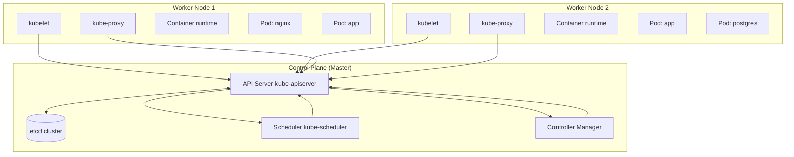
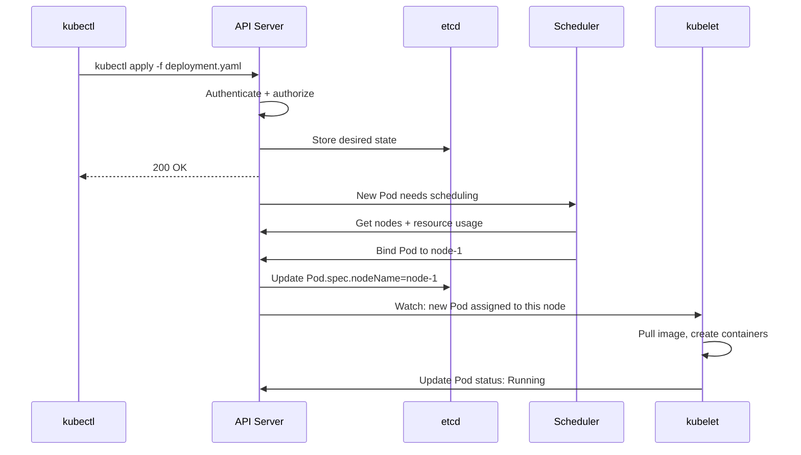

# Kubernetes Architecture

## Problem Statement

Design and understand Kubernetes (K8s) — a container orchestration system that automates deployment, scaling, and management of containerized applications.

## Scenario

Kubernetes Architecture is a critical component in modern distributed systems. In real-world applications, orchestrating containers across clusters automatically. For example, major tech companies like Netflix, Uber, and Airbnb rely on similar solutions to handle millions of concurrent users and requests. The challenge is achieving this while maintaining sub-100ms latency, 99.99% availability, and gracefully handling 10x traffic spikes during peak demand. This component provides the foundational capability to solve these challenges reliably and efficiently at global scale.

## Users

- **Backend Engineers**: Responsible for implementing and maintaining this system component in production environments. They need to understand the architecture, trade-offs, failure modes, and operational considerations.
- **DevOps/SRE Teams**: Monitor system health, manage scaling policies, handle incidents, and ensure reliability SLAs are met. They need insights into performance characteristics, bottlenecks, and failure recovery mechanisms.
- **Data Engineers**: Design data pipelines and analytics around this system, requiring deep understanding of data flow, consistency guarantees, and throughput characteristics.
- **System Architects**: Make high-level architectural decisions that impact company infrastructure, requiring comprehensive understanding of capabilities, limitations, and scalability boundaries.
- **Security Teams**: Understand security implications, potential vulnerabilities, and compliance requirements for this component.

## PRD

**Functional Requirements:**
- Correct behavior under all specified operating conditions
- Reliable operation with explicit failure modes
- Data consistency or eventual consistency guarantees as specified
- Clear mechanisms for error handling and recovery
- Monitoring and observability hooks

**Non-Functional Requirements:**
- **Performance**: Sub-100ms P99 latency for standard operations; measure and track tail latencies
- **Availability**: 99.99%+ uptime with automatic failover and graceful degradation
- **Scalability**: Support 10-100x current load with minimal architectural modifications
- **Consistency**: Specify whether strong, eventual, or causal consistency is required
- **Cost Efficiency**: Minimize operational cost per unit of throughput; consider compute, memory, and network costs
- **Operational Simplicity**: Reduce complexity to minimize human error and operational toil

**Constraints:**
- Resource limits (memory for caches, disk for databases, network bandwidth)
- Deployment constraints (cloud provider limits, regulatory requirements)
- Latency budgets (maximum acceptable delay for operations)

## Flow

The typical operational flow for this system involves these key phases:

1. **Request Arrival**: Client/upstream system sends request with required parameters and context
2. **Validation & Routing**: System validates request format, authentication, and routes to correct handler/shard/instance
3. **Core Processing**: Execute the main algorithm, database query, or business logic on the data/state
4. **State Management**: Update internal state (caches, indexes, counters, logs) with proper atomicity and locking
5. **Response Generation**: Format results and return to requester with relevant metadata (timing, version info)
6. **Observability**: Record metrics (latency, throughput, errors), logs (for debugging), and traces (for performance analysis)

This flow repeats thousands or millions of times per second in production. Each operation's efficiency compounds across the entire system, making careful optimization essential. Bottlenecks at any phase can cascade to impact overall system performance.

## Code Explanation

The provided implementations demonstrate key architectural concepts and design patterns:

**Python Implementation**: Uses built-in Python structures and standard library features to express the core logic clearly. Python emphasizes readability and conciseness—each operation's purpose should be obvious without extensive comments. You'll see different implementation approaches (e.g., using OrderedDict vs. manual linked lists) that represent trade-offs between convenience and fine-grained control.

**Java Implementation**: Shows how to implement the same logic with explicit memory management and type safety. Java's strong typing forces clear interface design; you'll see how generics, null safety, mutable state, and thread safety are handled. This implementation style is closer to production systems at scale.

**Key Implementation Patterns**:
- **Initialization**: Setting up core data structures, thread pools, or connection pools with specified capacity and configuration
- **Read Operations**: Fetching data while maintaining O(1) or O(log n) access, updating metadata (access times, hit counts, etc.)
- **Write Operations**: Inserting/updating data while handling eviction policies, balancing tree structures, or replicating state
- **Edge Cases**: Handling capacity limits, concurrent access, data consistency, and error conditions
- **Performance Optimization**: Using techniques like batch operations, lazy evaluation, or caching to reduce latency

Each line of code represents a deliberate choice about performance characteristics, memory usage, safety guarantees, and implementation complexity. Understanding these trade-offs is essential for using this component effectively in production systems.

## Architecture Diagram



## Flow Diagram



## Design

### Control Plane Components

```
kube-apiserver   - REST API frontend; all mutations go through here
etcd             - Distributed key-value store; source of truth for cluster state
kube-scheduler   - Watches unscheduled Pods, assigns to optimal node
                   Considers: resources, affinity, taints/tolerations
kube-controller-manager - Control loops:
  - ReplicaSet controller: ensures N replicas running
  - Deployment controller: rolling update logic
  - Node controller: detects node failures
  - Job/CronJob controllers
cloud-controller-manager - Cloud-specific: LB provisioning, storage
```

### Worker Node Components

```
kubelet          - Node agent; ensures containers run per PodSpec
                   Reads PodSpec from API, manages pod lifecycle
kube-proxy       - Network proxy; maintains iptables/ipvs rules for Services
Container runtime - containerd, CRI-O (no longer Docker)
```

### Reconciliation Loop

```
Every K8s controller runs a reconciliation loop:
  1. Observe current state (from API/etcd)
  2. Compare with desired state (from spec)
  3. Take action to converge (create/delete/update)
  4. Repeat

This makes K8s self-healing:
  Node dies -> pod rescheduled elsewhere
  Pod crashes -> ReplicaSet creates replacement
  Config changes -> rolling update begins
```

## Back-of-Envelope Calculations

```
Control plane sizing:
  etcd: 3 instances x 4GB RAM = 12GB for cluster state
  API server: 2-4 instances, ~2GB RAM each (autoscales)
  etcd max: ~8000 objects/sec write throughput
  Large cluster (5000 nodes): ~500K pods, API server needs 32GB RAM

Scheduling latency:
  Simple pod: <1s from submit to scheduled
  Complex affinity: 1-5s
  etcd write: ~5ms (local), ~50ms (cross-AZ)

Node failure recovery:
  Detection: 40s (node heartbeat timeout)
  Eviction: +5min (pod eviction timeout) = 5m40s total
  Rescheduling: <30s after eviction
  Total recovery: ~6 minutes default (tune for faster)

Cluster scale limits:
  Google recommendation: 5000 nodes, 150K pods per cluster
  etcd: 2GB storage per 100K objects
  API server: handles ~1000 writes/sec, ~5000 reads/sec
```

## Design Choices

| Decision | Option A | Option B |
|---|---|---|
| etcd size | 3 nodes (min HA) | 5 nodes (better fault tolerance) |
| Node failure response | Default 5min eviction | Tune to 30s (faster, noisy) |
| Scheduler | Default | Custom scheduler for ML workloads |
| Network plugin | Calico (BGP) | Cilium (eBPF, better performance) |
| Runtime | containerd | CRI-O (OCI-native) |

## Python Implementation

```python
from dataclasses import dataclass, field
from typing import Dict, List, Optional
from enum import Enum
import time

class PodPhase(Enum):
    PENDING = "Pending"
    RUNNING = "Running"
    SUCCEEDED = "Succeeded"
    FAILED = "Failed"
    UNKNOWN = "Unknown"

@dataclass
class ResourceRequirements:
    cpu_millicores: int = 100
    memory_mb: int = 128

@dataclass
class Node:
    name: str
    cpu_millicores: int = 4000
    memory_mb: int = 8192
    labels: Dict[str, str] = field(default_factory=dict)
    ready: bool = True
    pods: List[str] = field(default_factory=list)

    def available_cpu(self, scheduled: List["Pod"]) -> int:
        used = sum(p.resources.cpu_millicores for p in scheduled if p.node == self.name)
        return self.cpu_millicores - used

    def available_memory(self, scheduled: List["Pod"]) -> int:
        used = sum(p.resources.memory_mb for p in scheduled if p.node == self.name)
        return self.memory_mb - used

@dataclass
class Pod:
    name: str
    image: str
    resources: ResourceRequirements = field(default_factory=ResourceRequirements)
    phase: PodPhase = PodPhase.PENDING
    node: Optional[str] = None
    namespace: str = "default"

class KubeScheduler:
    def schedule(self, pod: Pod, nodes: List[Node], pods: List[Pod]) -> Optional[str]:
        # Filter: nodes that can fit the pod
        feasible = [
            n for n in nodes
            if n.ready
            and n.available_cpu(pods) >= pod.resources.cpu_millicores
            and n.available_memory(pods) >= pod.resources.memory_mb
        ]
        if not feasible:
            return None
        # Score: prefer nodes with more available resources (bin packing alternative)
        best = max(feasible, key=lambda n: n.available_cpu(pods) + n.available_memory(pods))
        return best.name

class KubeAPIServer:
    def __init__(self):
        self._pods: Dict[str, Pod] = {}
        self._nodes: Dict[str, Node] = {}
        self._scheduler = KubeScheduler()

    def add_node(self, node: Node):
        self._nodes[node.name] = node
        print(f"[K8s] Node registered: {node.name}")

    def create_pod(self, pod: Pod) -> Pod:
        self._pods[pod.name] = pod
        print(f"[K8s] Pod {pod.name} created, phase=Pending")
        self._schedule_pod(pod)
        return pod

    def _schedule_pod(self, pod: Pod):
        node_name = self._scheduler.schedule(pod, list(self._nodes.values()), list(self._pods.values()))
        if node_name:
            pod.node = node_name
            pod.phase = PodPhase.RUNNING
            print(f"[K8s] Pod {pod.name} scheduled to {node_name}")
        else:
            print(f"[K8s] Pod {pod.name} Unschedulable - insufficient resources")

    def node_failure(self, node_name: str):
        node = self._nodes.get(node_name)
        if node:
            node.ready = False
            print(f"[K8s] Node {node_name} failed")
            # Reschedule pods that were on this node
            for pod in self._pods.values():
                if pod.node == node_name:
                    pod.phase = PodPhase.UNKNOWN
                    pod.node = None
                    print(f"[K8s] Evicting {pod.name}, rescheduling...")
                    self._schedule_pod(pod)

# Usage
api = KubeAPIServer()
api.add_node(Node("node-1", cpu_millicores=4000, memory_mb=8192))
api.add_node(Node("node-2", cpu_millicores=4000, memory_mb=8192))

api.create_pod(Pod("nginx-1", "nginx:alpine", ResourceRequirements(100, 64)))
api.create_pod(Pod("app-1", "myapp:v1", ResourceRequirements(500, 512)))
api.create_pod(Pod("app-2", "myapp:v1", ResourceRequirements(500, 512)))

print("\n--- Simulating node failure ---")
api.node_failure("node-1")
```

## Java Implementation

```java
import java.util.*;
import java.util.stream.*;

public class KubeScheduler {
    enum Phase { PENDING, RUNNING, FAILED }

    record Resources(int cpuMillicores, int memoryMb) {}
    record Pod(String name, String image, Resources resources, String namespace) {}

    static class Node {
        String name;
        int cpuTotal, memTotal;
        boolean ready = true;
        List<Pod> pods = new ArrayList<>();

        Node(String name, int cpu, int mem) { this.name = name; cpuTotal = cpu; memTotal = mem; }

        int freeCpu() { return cpuTotal - pods.stream().mapToInt(p -> p.resources().cpuMillicores()).sum(); }
        int freeMem() { return memTotal - pods.stream().mapToInt(p -> p.resources().memoryMb()).sum(); }

        boolean canFit(Pod p) { return ready && freeCpu() >= p.resources().cpuMillicores() && freeMem() >= p.resources().memoryMb(); }
    }

    private List<Node> nodes = new ArrayList<>();
    private Map<String, String> podToNode = new HashMap<>(); // pod -> node

    public void addNode(Node n) { nodes.add(n); }

    public Optional<String> schedule(Pod pod) {
        return nodes.stream().filter(n -> n.canFit(pod))
            .max(Comparator.comparingInt(Node::freeCpu))
            .map(n -> { n.pods.add(pod); podToNode.put(pod.name(), n.name); return n.name; });
    }

    public static void main(String[] args) {
        KubeScheduler sched = new KubeScheduler();
        sched.addNode(new Node("node-1", 4000, 8192));
        sched.addNode(new Node("node-2", 4000, 8192));
        Pod p = new Pod("web-1", "nginx:alpine", new Resources(100, 128), "default");
        System.out.println("Scheduled to: " + sched.schedule(p).orElse("Unschedulable"));
    }
}
```

## Complexity

| Operation | Time |
|---|---|
| API request processing | O(1) + etcd write O(log n) |
| Pod scheduling | O(nodes x filters) |
| Reconciliation loop | O(desired - actual) |
| etcd watch notification | O(subscribers) |

## Common Questions & Answers

**Q: What is caching and why do we need it?**

A: Caching stores frequently accessed data in fast storage (memory) to reduce latency and load on slower backends (database). Trade space (cache) for speed (latency). Critical for systems serving millions of requests per second.

**Q: What are the main cache eviction policies?**

A: LRU (least recently used), LFU (least frequently used), FIFO (first in first out), TTL (time-based), Random, and ARC (adaptive replacement). Choose based on access patterns: LRU for temporal, LFU for frequency, TTL for time-sensitive data.

**Q: What is cache hit rate and cache miss rate?**

A: Hit rate = successful_finds / total_accesses. Miss rate = 1 - hit rate. P(hit) = hits / (hits + misses). Target 80%+ hit rates for effective caching. Too-small cache gives low hit rate (wasted resources). Too-large cache uses more memory than needed.

**Q: How do you handle cache invalidation when backend data changes?**

A: Use TTL (time-based expiration), active invalidation (notify cache on write), cache-aside pattern (client checks backend), or write-through (update both). Active invalidation is fastest but complex. TTL is simplest but has stale data window.

**Q: What is the cache-aside pattern?**

A: Application checks cache first. On miss, fetch from backend, update cache, then return. Simple to implement. Risk: race condition where multiple threads fetch same miss simultaneously (thundering herd problem).

**Q: What is write-through caching?**

A: Writes go to both cache and backend simultaneously (synchronously). Ensures consistency: read always gets latest. Cost: write latency includes backend write. Safer than write-back but slower.

**Q: What is write-back (write-behind) caching?**

A: Writes go to cache only; backend updated asynchronously later (batch or periodic). Fast writes. Risk: data loss if cache fails before flushing. Need durability guarantees (persistence, replication).

**Q: How do you choose cache size?**

A: Estimate working set (frequently accessed data volume). Add 20-30% buffer for margin. Monitor hit rate: if < 80%, increase size. If > 95%, might be oversized (waste). Use tools like cachegrind to profile.

**Q: What's the difference between client-side and server-side caching?**

A: Client cache (browser): reduces network round-trips, entirely controlled by client. Server cache (memory, Redis): shared across clients, controlled by server. Multi-level caching often best.

**Q: How do you measure cache effectiveness?**

A: Hit rate (primary metric), latency reduction (P99 latency with vs. without cache), backend load reduction, and memory cost per cache entry. Calculate ROI: cost of cache vs. benefit (reduced latency, backend load).

## Follow-up Questions & Answers

**Q: How do you prevent the thundering herd problem in caches?**

A: When popular key expires, many threads fetch from backend simultaneously causing spike. Solutions: probabilistic early expiration (refresh before TTL), request coalescing (single thread rebuilds, others wait), or bloom filters (detect non-existent keys fast).

**Q: How would you implement multi-level cache hierarchy?**

A: Use L1 (fast, small, in-process), L2 (medium, local machine), L3 (large, remote, Redis). Check L1, miss→L2, miss→L3, miss→backend. On write: update all levels. Trade space for speed across levels.

**Q: Can you implement read-through caching (automatic population)?**

A: Yes, cache loader/resolver called on miss. Transparent to application. Backend automatically uses cache layer. More complex than cache-aside but cleaner separation.

**Q: How do you handle hot keys in distributed caches?**

A: Hot key = key accessed by many threads/clients. Replicate hot keys on multiple cache nodes. Use local in-process caches for very hot keys. Monitor and detect hot keys automatically.

**Q: What's the difference between warm and cold cache startup?**

A: Cold cache: empty at start, misses until populated (slow ramp-up). Warm cache: pre-loaded from previous state (RDB/snapshot). Warm startup is critical for production (instant performance).

**Q: How would you measure cache effectiveness for business metrics?**

A: Track hit rate, P99 latency (with/without cache), backend QPS reduction, revenue impact. Calculate cache size vs. cost savings. A/B test to prove business value.

**Q: What happens when cache size is insufficient for working set?**

A: Constant evictions = high miss rate = ineffective cache. Solution: increase cache size, improve eviction policy, reduce working set, or use better hardware (faster storage).

**Q: How do you debug cache issues in production?**

A: Monitor hit rate continuously. Profile cache keys (which keys are accessed). Check for cache stampedes (sudden miss spike). Use distributed tracing to see cache path.

**Q: How would you implement a persistent cache?**

A: Combine memory cache (fast) with persistent backend (database, RocksDB, LevelDB). Write-back pattern: batch updates to persistent store. Trade latency for durability.

**Q: Can you use caching for write-heavy workloads?**

A: Write caching is risky (consistency issues). Use carefully: write-through for safety, write-back for speed. Good for batch writes (aggregate before writing). Monitor durability guarantees.

