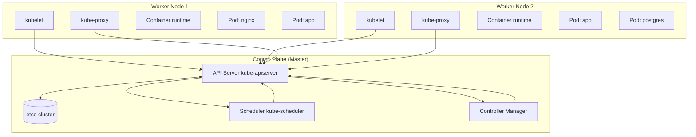
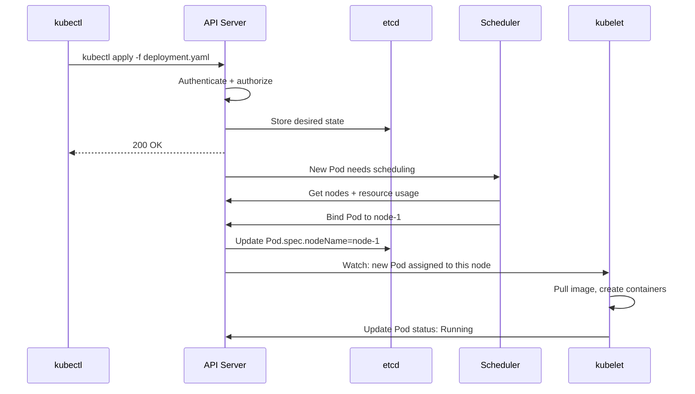

# Kubernetes Architecture

## Problem Statement

Design and understand Kubernetes (K8s) — a container orchestration system that automates deployment, scaling, and management of containerized applications.

## Architecture Diagram



## Flow Diagram



## Design

### Control Plane Components

```
kube-apiserver   - REST API frontend; all mutations go through here
etcd             - Distributed key-value store; source of truth for cluster state
kube-scheduler   - Watches unscheduled Pods, assigns to optimal node
                   Considers: resources, affinity, taints/tolerations
kube-controller-manager - Control loops:
  - ReplicaSet controller: ensures N replicas running
  - Deployment controller: rolling update logic
  - Node controller: detects node failures
  - Job/CronJob controllers
cloud-controller-manager - Cloud-specific: LB provisioning, storage
```

### Worker Node Components

```
kubelet          - Node agent; ensures containers run per PodSpec
                   Reads PodSpec from API, manages pod lifecycle
kube-proxy       - Network proxy; maintains iptables/ipvs rules for Services
Container runtime - containerd, CRI-O (no longer Docker)
```

### Reconciliation Loop

```
Every K8s controller runs a reconciliation loop:
  1. Observe current state (from API/etcd)
  2. Compare with desired state (from spec)
  3. Take action to converge (create/delete/update)
  4. Repeat

This makes K8s self-healing:
  Node dies -> pod rescheduled elsewhere
  Pod crashes -> ReplicaSet creates replacement
  Config changes -> rolling update begins
```

## Common Questions & Answers

**Q: Why is etcd so critical?** A: etcd stores ALL cluster state. Lose etcd without backup = lose your cluster. Run 3 or 5 etcd instances (odd number for quorum). Back up regularly.

**Q: How does the scheduler pick a node?** A: Filtering (remove nodes that can't run pod: resources, taints), then Scoring (rank remaining nodes by best fit, affinity, spreading). Highest score wins.

**Q: What is a namespace in K8s?** A: Logical isolation within a cluster. Different from Linux namespaces. Used for multi-tenancy, RBAC scoping, resource quotas per team.

**Q: How does K8s handle node failure?** A: Node controller detects node unreachable (after 40s). Pods on failed node marked as Unknown. After 5min, evicted and rescheduled to healthy nodes.

**Q: What is a DaemonSet?** A: Ensures one pod per node (or subset of nodes). Use cases: log collection (Fluentd), monitoring (node-exporter), network plugins (Calico).

## Back-of-Envelope Calculations

```
Control plane sizing:
  etcd: 3 instances x 4GB RAM = 12GB for cluster state
  API server: 2-4 instances, ~2GB RAM each (autoscales)
  etcd max: ~8000 objects/sec write throughput
  Large cluster (5000 nodes): ~500K pods, API server needs 32GB RAM

Scheduling latency:
  Simple pod: <1s from submit to scheduled
  Complex affinity: 1-5s
  etcd write: ~5ms (local), ~50ms (cross-AZ)

Node failure recovery:
  Detection: 40s (node heartbeat timeout)
  Eviction: +5min (pod eviction timeout) = 5m40s total
  Rescheduling: <30s after eviction
  Total recovery: ~6 minutes default (tune for faster)

Cluster scale limits:
  Google recommendation: 5000 nodes, 150K pods per cluster
  etcd: 2GB storage per 100K objects
  API server: handles ~1000 writes/sec, ~5000 reads/sec
```

## Design Choices

| Decision | Option A | Option B |
|---|---|---|
| etcd size | 3 nodes (min HA) | 5 nodes (better fault tolerance) |
| Node failure response | Default 5min eviction | Tune to 30s (faster, noisy) |
| Scheduler | Default | Custom scheduler for ML workloads |
| Network plugin | Calico (BGP) | Cilium (eBPF, better performance) |
| Runtime | containerd | CRI-O (OCI-native) |

## Follow-up Questions

1. How does etcd achieve consensus using Raft?
2. How do you upgrade a Kubernetes cluster with zero downtime?
3. What is the Container Runtime Interface (CRI)?
4. How does K8s handle multi-tenancy with namespaces?
5. Design a highly available Kubernetes control plane.

## Python Implementation

```python
from dataclasses import dataclass, field
from typing import Dict, List, Optional
from enum import Enum
import time

class PodPhase(Enum):
    PENDING = "Pending"
    RUNNING = "Running"
    SUCCEEDED = "Succeeded"
    FAILED = "Failed"
    UNKNOWN = "Unknown"

@dataclass
class ResourceRequirements:
    cpu_millicores: int = 100
    memory_mb: int = 128

@dataclass
class Node:
    name: str
    cpu_millicores: int = 4000
    memory_mb: int = 8192
    labels: Dict[str, str] = field(default_factory=dict)
    ready: bool = True
    pods: List[str] = field(default_factory=list)

    def available_cpu(self, scheduled: List["Pod"]) -> int:
        used = sum(p.resources.cpu_millicores for p in scheduled if p.node == self.name)
        return self.cpu_millicores - used

    def available_memory(self, scheduled: List["Pod"]) -> int:
        used = sum(p.resources.memory_mb for p in scheduled if p.node == self.name)
        return self.memory_mb - used

@dataclass
class Pod:
    name: str
    image: str
    resources: ResourceRequirements = field(default_factory=ResourceRequirements)
    phase: PodPhase = PodPhase.PENDING
    node: Optional[str] = None
    namespace: str = "default"

class KubeScheduler:
    def schedule(self, pod: Pod, nodes: List[Node], pods: List[Pod]) -> Optional[str]:
        # Filter: nodes that can fit the pod
        feasible = [
            n for n in nodes
            if n.ready
            and n.available_cpu(pods) >= pod.resources.cpu_millicores
            and n.available_memory(pods) >= pod.resources.memory_mb
        ]
        if not feasible:
            return None
        # Score: prefer nodes with more available resources (bin packing alternative)
        best = max(feasible, key=lambda n: n.available_cpu(pods) + n.available_memory(pods))
        return best.name

class KubeAPIServer:
    def __init__(self):
        self._pods: Dict[str, Pod] = {}
        self._nodes: Dict[str, Node] = {}
        self._scheduler = KubeScheduler()

    def add_node(self, node: Node):
        self._nodes[node.name] = node
        print(f"[K8s] Node registered: {node.name}")

    def create_pod(self, pod: Pod) -> Pod:
        self._pods[pod.name] = pod
        print(f"[K8s] Pod {pod.name} created, phase=Pending")
        self._schedule_pod(pod)
        return pod

    def _schedule_pod(self, pod: Pod):
        node_name = self._scheduler.schedule(pod, list(self._nodes.values()), list(self._pods.values()))
        if node_name:
            pod.node = node_name
            pod.phase = PodPhase.RUNNING
            print(f"[K8s] Pod {pod.name} scheduled to {node_name}")
        else:
            print(f"[K8s] Pod {pod.name} Unschedulable - insufficient resources")

    def node_failure(self, node_name: str):
        node = self._nodes.get(node_name)
        if node:
            node.ready = False
            print(f"[K8s] Node {node_name} failed")
            # Reschedule pods that were on this node
            for pod in self._pods.values():
                if pod.node == node_name:
                    pod.phase = PodPhase.UNKNOWN
                    pod.node = None
                    print(f"[K8s] Evicting {pod.name}, rescheduling...")
                    self._schedule_pod(pod)

# Usage
api = KubeAPIServer()
api.add_node(Node("node-1", cpu_millicores=4000, memory_mb=8192))
api.add_node(Node("node-2", cpu_millicores=4000, memory_mb=8192))

api.create_pod(Pod("nginx-1", "nginx:alpine", ResourceRequirements(100, 64)))
api.create_pod(Pod("app-1", "myapp:v1", ResourceRequirements(500, 512)))
api.create_pod(Pod("app-2", "myapp:v1", ResourceRequirements(500, 512)))

print("\n--- Simulating node failure ---")
api.node_failure("node-1")
```

## Java Implementation

```java
import java.util.*;
import java.util.stream.*;

public class KubeScheduler {
    enum Phase { PENDING, RUNNING, FAILED }

    record Resources(int cpuMillicores, int memoryMb) {}
    record Pod(String name, String image, Resources resources, String namespace) {}

    static class Node {
        String name;
        int cpuTotal, memTotal;
        boolean ready = true;
        List<Pod> pods = new ArrayList<>();

        Node(String name, int cpu, int mem) { this.name = name; cpuTotal = cpu; memTotal = mem; }

        int freeCpu() { return cpuTotal - pods.stream().mapToInt(p -> p.resources().cpuMillicores()).sum(); }
        int freeMem() { return memTotal - pods.stream().mapToInt(p -> p.resources().memoryMb()).sum(); }

        boolean canFit(Pod p) { return ready && freeCpu() >= p.resources().cpuMillicores() && freeMem() >= p.resources().memoryMb(); }
    }

    private List<Node> nodes = new ArrayList<>();
    private Map<String, String> podToNode = new HashMap<>(); // pod -> node

    public void addNode(Node n) { nodes.add(n); }

    public Optional<String> schedule(Pod pod) {
        return nodes.stream().filter(n -> n.canFit(pod))
            .max(Comparator.comparingInt(Node::freeCpu))
            .map(n -> { n.pods.add(pod); podToNode.put(pod.name(), n.name); return n.name; });
    }

    public static void main(String[] args) {
        KubeScheduler sched = new KubeScheduler();
        sched.addNode(new Node("node-1", 4000, 8192));
        sched.addNode(new Node("node-2", 4000, 8192));
        Pod p = new Pod("web-1", "nginx:alpine", new Resources(100, 128), "default");
        System.out.println("Scheduled to: " + sched.schedule(p).orElse("Unschedulable"));
    }
}
```

## Complexity

| Operation | Time |
|---|---|
| API request processing | O(1) + etcd write O(log n) |
| Pod scheduling | O(nodes x filters) |
| Reconciliation loop | O(desired - actual) |
| etcd watch notification | O(subscribers) |
