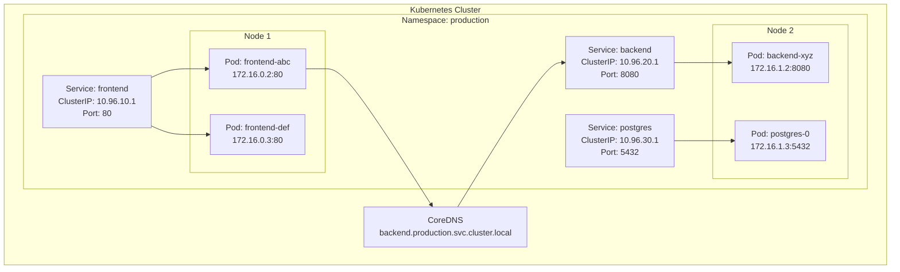
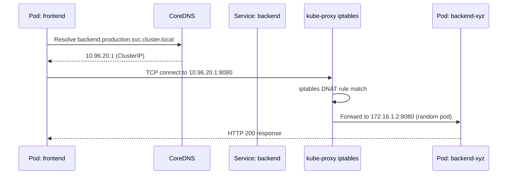

# Kubernetes Pods and Services

## Problem Statement

Understand how Kubernetes Pods (the smallest deployable unit) and Services (stable network endpoints) work together to enable reliable inter-container communication inside a cluster.

## Scenario

Kubernetes Pods and Services is a critical component in modern distributed systems. In real-world applications, orchestrating containers across clusters automatically. For example, major tech companies like Netflix, Uber, and Airbnb rely on similar solutions to handle millions of concurrent users and requests. The challenge is achieving this while maintaining sub-100ms latency, 99.99% availability, and gracefully handling 10x traffic spikes during peak demand. This component provides the foundational capability to solve these challenges reliably and efficiently at global scale.

## Users

- **Backend Engineers**: Responsible for implementing and maintaining this system component in production environments. They need to understand the architecture, trade-offs, failure modes, and operational considerations.
- **DevOps/SRE Teams**: Monitor system health, manage scaling policies, handle incidents, and ensure reliability SLAs are met. They need insights into performance characteristics, bottlenecks, and failure recovery mechanisms.
- **Data Engineers**: Design data pipelines and analytics around this system, requiring deep understanding of data flow, consistency guarantees, and throughput characteristics.
- **System Architects**: Make high-level architectural decisions that impact company infrastructure, requiring comprehensive understanding of capabilities, limitations, and scalability boundaries.
- **Security Teams**: Understand security implications, potential vulnerabilities, and compliance requirements for this component.

## PRD

**Functional Requirements:**
- Correct behavior under all specified operating conditions
- Reliable operation with explicit failure modes
- Data consistency or eventual consistency guarantees as specified
- Clear mechanisms for error handling and recovery
- Monitoring and observability hooks

**Non-Functional Requirements:**
- **Performance**: Sub-100ms P99 latency for standard operations; measure and track tail latencies
- **Availability**: 99.99%+ uptime with automatic failover and graceful degradation
- **Scalability**: Support 10-100x current load with minimal architectural modifications
- **Consistency**: Specify whether strong, eventual, or causal consistency is required
- **Cost Efficiency**: Minimize operational cost per unit of throughput; consider compute, memory, and network costs
- **Operational Simplicity**: Reduce complexity to minimize human error and operational toil

**Constraints:**
- Resource limits (memory for caches, disk for databases, network bandwidth)
- Deployment constraints (cloud provider limits, regulatory requirements)
- Latency budgets (maximum acceptable delay for operations)

## Flow

The typical operational flow for this system involves these key phases:

1. **Request Arrival**: Client/upstream system sends request with required parameters and context
2. **Validation & Routing**: System validates request format, authentication, and routes to correct handler/shard/instance
3. **Core Processing**: Execute the main algorithm, database query, or business logic on the data/state
4. **State Management**: Update internal state (caches, indexes, counters, logs) with proper atomicity and locking
5. **Response Generation**: Format results and return to requester with relevant metadata (timing, version info)
6. **Observability**: Record metrics (latency, throughput, errors), logs (for debugging), and traces (for performance analysis)

This flow repeats thousands or millions of times per second in production. Each operation's efficiency compounds across the entire system, making careful optimization essential. Bottlenecks at any phase can cascade to impact overall system performance.

## Code Explanation

The provided implementations demonstrate key architectural concepts and design patterns:

**Python Implementation**: Uses built-in Python structures and standard library features to express the core logic clearly. Python emphasizes readability and conciseness—each operation's purpose should be obvious without extensive comments. You'll see different implementation approaches (e.g., using OrderedDict vs. manual linked lists) that represent trade-offs between convenience and fine-grained control.

**Java Implementation**: Shows how to implement the same logic with explicit memory management and type safety. Java's strong typing forces clear interface design; you'll see how generics, null safety, mutable state, and thread safety are handled. This implementation style is closer to production systems at scale.

**Key Implementation Patterns**:
- **Initialization**: Setting up core data structures, thread pools, or connection pools with specified capacity and configuration
- **Read Operations**: Fetching data while maintaining O(1) or O(log n) access, updating metadata (access times, hit counts, etc.)
- **Write Operations**: Inserting/updating data while handling eviction policies, balancing tree structures, or replicating state
- **Edge Cases**: Handling capacity limits, concurrent access, data consistency, and error conditions
- **Performance Optimization**: Using techniques like batch operations, lazy evaluation, or caching to reduce latency

Each line of code represents a deliberate choice about performance characteristics, memory usage, safety guarantees, and implementation complexity. Understanding these trade-offs is essential for using this component effectively in production systems.

## Architecture Diagram



## Flow Diagram



## Design

### Pod Anatomy

```
Pod = one or more containers sharing:
  - Network namespace (same IP, port space)
  - IPC namespace (can communicate via localhost)
  - Optional: shared volumes

Pod spec:
  containers:
    - name: app
      image: myapp:v1
      ports: [{containerPort: 8080}]
      resources:
        requests: {cpu: "100m", memory: "128Mi"}
        limits:   {cpu: "500m", memory: "512Mi"}
      readinessProbe:
        httpGet: {path: /health, port: 8080}
        initialDelaySeconds: 5
        periodSeconds: 10
      livenessProbe:
        httpGet: {path: /health, port: 8080}
        failureThreshold: 3
```

### Service Types

```
ClusterIP (default):
  - Stable virtual IP inside cluster
  - kube-proxy creates iptables/IPVS rules
  - DNS: <svc>.<ns>.svc.cluster.local
  - Not accessible outside cluster

NodePort:
  - Exposes port 30000-32767 on every node
  - External: <NodeIP>:<NodePort>
  - ClusterIP also created
  - Use case: dev/test, bare metal

LoadBalancer:
  - Provisions cloud LB (AWS ELB, GCP LB)
  - Routes external traffic to NodePort
  - Gets external IP from cloud provider
  - Use case: production internet-facing services

ExternalName:
  - CNAME to external DNS name
  - Use case: migrate external services into cluster
  - No proxying, just DNS alias

Headless (ClusterIP: None):
  - No VIP; DNS returns individual Pod IPs
  - Use case: StatefulSets, custom load balancing
  - Direct pod addressing via DNS
```

### Endpoints and EndpointSlices

```
Service selects pods via label selector:
  selector:
    app: backend
    version: v1

Endpoints controller:
  - Watches pods matching selector
  - Updates Endpoints object with ready pod IPs
  - kube-proxy watches Endpoints for rule updates

EndpointSlices (K8s 1.21+):
  - Shards endpoint data (max 100 pods per slice)
  - Better scalability: less etcd/API churn
  - Required for large services (>1000 pods)
```

## Common Questions & Answers

**Q: Why not connect directly to Pod IPs?** A: Pod IPs are ephemeral — pods get new IPs on restart. Services provide a stable VIP backed by iptables rules. Pod IPs change; Service ClusterIP doesn't.

**Q: How does kube-proxy implement Services?** A: Three modes: (1) iptables: PREROUTING DNAT rules, stateless, default. (2) IPVS: kernel-level LB, O(1) vs O(n) for large clusters. (3) userspace (deprecated). Cilium replaces kube-proxy entirely with eBPF.

**Q: What is a readiness vs liveness probe?** A: Readiness: Is pod ready to serve traffic? Failing = removed from Service endpoints (no traffic). Liveness: Is pod alive? Failing = kubelet restarts container. Readiness gate prevents bad deploys; liveness gate restarts hung processes.

**Q: What is a sidecar container?** A: Second container in the same pod sharing network/volumes. Use cases: Envoy proxy (service mesh), log shipper (Fluentd), secret injector (Vault agent). Communication via localhost.

**Q: How does DNS work within the cluster?** A: CoreDNS runs as a deployment. Each pod gets `/etc/resolv.conf` pointing to CoreDNS ClusterIP. Resolution order: full name → `<name>.<namespace>.svc.cluster.local` → search domains.

## Back-of-Envelope Calculations

```
Service iptables scaling:
  1000 pods x 5 services each = 5000 iptables rules
  iptables rule lookup: O(n) = 5ms for 5000 rules
  IPVS rule lookup: O(1) = <0.1ms (hash table)
  Large clusters (10K pods): IPVS mandatory

Pod startup time:
  Image cached: ~1-2s (namespace + cgroup setup)
  Image pull (500MB): +10-30s
  Readiness probe delay: +5-30s
  Total first deploy: 15-60s

Service endpoint update latency:
  Pod ready -> Endpoints updated: ~1s
  kube-proxy applies new rules: ~1-5s
  Total: ~2-6s from pod ready to receiving traffic

DNS query overhead:
  Intra-cluster DNS: ~0.5ms (CoreDNS is in-cluster)
  Connection reuse: DNS only on first request
  ndots:5 setting: 5 DNS queries before short form resolves
```

## Design Choices

| Approach | Pros | Cons |
|---|---|---|
| ClusterIP + Ingress | Standard, portable | Extra hop through Ingress |
| NodePort direct | No LB dependency | Exposes all nodes, port range limited |
| LoadBalancer per service | Simple external access | $$ per LB, cloud-specific |
| iptables mode | Widely supported | O(n) rules, high-latency large clusters |
| IPVS mode | O(1) lookup, better LB algos | Requires kernel module |
| Cilium (eBPF) | Fastest, no kube-proxy | Newer, less battle-tested |

## Follow-up Questions

1. How does Kubernetes DNS resolve headless services for StatefulSets?
2. What is the difference between a Service and an Ingress?
3. How do you achieve session affinity (sticky sessions) with Services?
4. How does Network Policy restrict pod-to-pod traffic?
5. What happens to in-flight requests when a pod is terminated?

## Python Implementation

```python
from dataclasses import dataclass, field
from typing import Dict, List, Optional
import hashlib
import random

@dataclass
class Container:
    name: str
    image: str
    port: int
    cpu_request: int = 100   # millicores
    memory_mb: int = 128
    ready: bool = False

@dataclass
class Pod:
    name: str
    namespace: str
    labels: Dict[str, str]
    containers: List[Container]
    ip: str = ""
    phase: str = "Pending"

    def is_ready(self) -> bool:
        return all(c.ready for c in self.containers) and self.phase == "Running"

@dataclass
class Service:
    name: str
    namespace: str
    selector: Dict[str, str]
    port: int
    target_port: int
    service_type: str = "ClusterIP"
    cluster_ip: str = ""

class CoreDNS:
    def __init__(self):
        self._records: Dict[str, str] = {}

    def register(self, svc: Service):
        fqdn = f"{svc.name}.{svc.namespace}.svc.cluster.local"
        self._records[fqdn] = svc.cluster_ip
        self._records[svc.name] = svc.cluster_ip  # short name

    def resolve(self, name: str, namespace: str = "default") -> Optional[str]:
        # Try FQDN first, then short name
        fqdn = f"{name}.{namespace}.svc.cluster.local"
        return self._records.get(fqdn) or self._records.get(name)

class EndpointsController:
    def __init__(self):
        self._endpoints: Dict[str, List[str]] = {}

    def reconcile(self, svc: Service, pods: List[Pod]) -> List[str]:
        ready_ips = []
        for pod in pods:
            if pod.namespace == svc.namespace and pod.is_ready():
                if all(pod.labels.get(k) == v for k, v in svc.selector.items()):
                    ready_ips.append(f"{pod.ip}:{svc.target_port}")
        self._endpoints[svc.name] = ready_ips
        return ready_ips

    def get_endpoints(self, svc_name: str) -> List[str]:
        return self._endpoints.get(svc_name, [])

class KubeProxy:
    def __init__(self, endpoints_ctrl: EndpointsController):
        self._ep = endpoints_ctrl
        self._mode = "iptables"  # or "ipvs"

    def route(self, svc_name: str, client_ip: str = "") -> Optional[str]:
        endpoints = self._ep.get_endpoints(svc_name)
        if not endpoints:
            return None
        # iptables random selection (real: DNAT rule with probability chain)
        if self._mode == "ipvs":
            # IPVS round-robin: hash by client IP for session affinity
            idx = int(hashlib.md5(client_ip.encode()).hexdigest(), 16) % len(endpoints)
            return endpoints[idx]
        return random.choice(endpoints)

# Simulation
dns = CoreDNS()
ep_ctrl = EndpointsController()
proxy = KubeProxy(ep_ctrl)

# Register services
backend_svc = Service(
    name="backend", namespace="production",
    selector={"app": "backend"}, port=8080, target_port=8080,
    cluster_ip="10.96.20.1"
)
dns.register(backend_svc)

# Create pods
pods = [
    Pod("backend-abc", "production", {"app": "backend"}, [Container("app", "myapp:v1", 8080, ready=True)], "172.16.1.2", "Running"),
    Pod("backend-def", "production", {"app": "backend"}, [Container("app", "myapp:v1", 8080, ready=True)], "172.16.1.3", "Running"),
    Pod("backend-ghi", "production", {"app": "backend"}, [Container("app", "myapp:v1", 8080, ready=False)], "172.16.1.4", "Pending"),
]

# Reconcile endpoints (only ready pods)
endpoints = ep_ctrl.reconcile(backend_svc, pods)
print(f"Active endpoints: {endpoints}")  # Only 2 ready pods

# DNS resolution
cluster_ip = dns.resolve("backend", "production")
print(f"Resolved backend -> {cluster_ip}")

# kube-proxy routes (bypassing ClusterIP -> real pod)
for i in range(4):
    target = proxy.route("backend", client_ip=f"172.16.0.{i}")
    print(f"  Request {i} -> {target}")
```

## Java Implementation

```java
import java.util.*;
import java.util.stream.*;

public class K8sServiceMesh {
    record Container(String name, String image, int port, boolean ready) {}
    record Label(String key, String value) {}

    static class Pod {
        String name, namespace, ip, phase;
        Map<String, String> labels;
        List<Container> containers;

        Pod(String name, String ns, String ip, Map<String, String> labels, List<Container> containers, String phase) {
            this.name = name; this.namespace = ns; this.ip = ip;
            this.labels = labels; this.containers = containers; this.phase = phase;
        }

        boolean isReady() {
            return "Running".equals(phase) && containers.stream().allMatch(c -> c.ready());
        }
    }

    record Service(String name, String namespace, Map<String, String> selector, int port, int targetPort, String clusterIp) {}

    static class EndpointsController {
        private Map<String, List<String>> endpoints = new HashMap<>();

        List<String> reconcile(Service svc, List<Pod> pods) {
            List<String> ready = pods.stream()
                .filter(p -> p.namespace.equals(svc.namespace()) && p.isReady())
                .filter(p -> svc.selector().entrySet().stream()
                    .allMatch(e -> e.getValue().equals(p.labels.get(e.getKey()))))
                .map(p -> p.ip + ":" + svc.targetPort())
                .collect(Collectors.toList());
            endpoints.put(svc.name(), ready);
            return ready;
        }

        List<String> get(String svcName) { return endpoints.getOrDefault(svcName, List.of()); }
    }

    static class KubeProxy {
        EndpointsController ep;
        Random rng = new Random();
        KubeProxy(EndpointsController ep) { this.ep = ep; }

        Optional<String> route(String svcName) {
            List<String> eps = ep.get(svcName);
            if (eps.isEmpty()) return Optional.empty();
            return Optional.of(eps.get(rng.nextInt(eps.size())));
        }
    }

    public static void main(String[] args) {
        Service svc = new Service("backend", "production",
            Map.of("app", "backend"), 8080, 8080, "10.96.20.1");

        List<Pod> pods = List.of(
            new Pod("backend-1", "production", "172.16.1.2",
                Map.of("app", "backend"),
                List.of(new Container("app", "myapp:v1", 8080, true)), "Running"),
            new Pod("backend-2", "production", "172.16.1.3",
                Map.of("app", "backend"),
                List.of(new Container("app", "myapp:v1", 8080, false)), "Pending")
        );

        EndpointsController epCtrl = new EndpointsController();
        List<String> eps = epCtrl.reconcile(svc, pods);
        System.out.println("Active endpoints: " + eps);

        KubeProxy proxy = new KubeProxy(epCtrl);
        for (int i = 0; i < 3; i++) {
            System.out.println("  Route -> " + proxy.route("backend").orElse("no endpoint"));
        }
    }
}
```

## Complexity

| Operation | Time |
|---|---|
| Service DNS resolution | O(1) (CoreDNS hash map) |
| kube-proxy iptables route | O(n) rules |
| kube-proxy IPVS route | O(1) |
| Endpoint reconciliation | O(pods x label_keys) |
| Pod readiness probe check | O(containers) |
