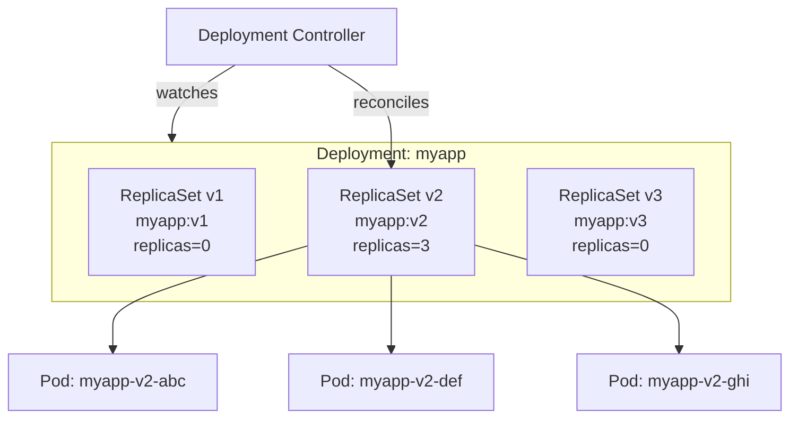
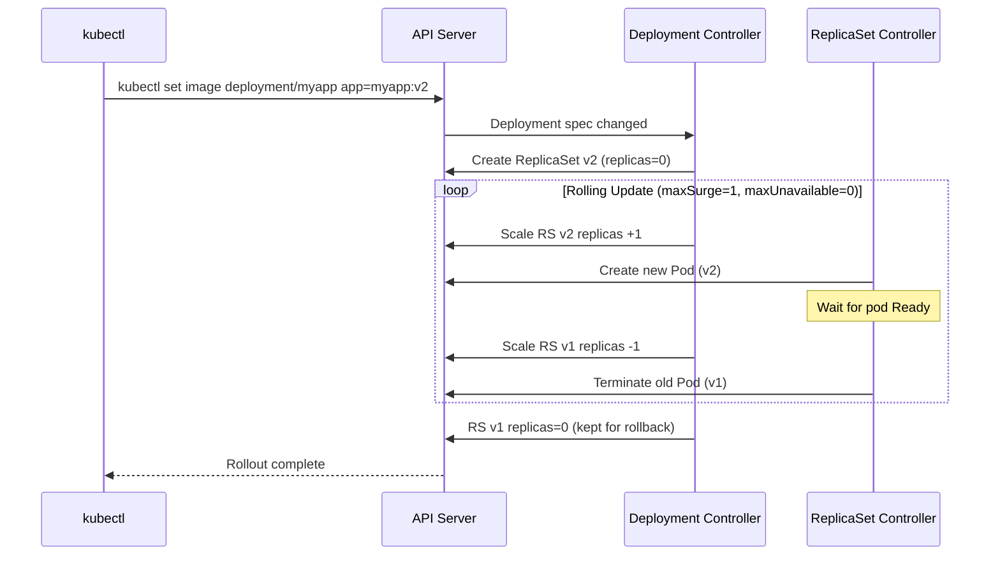

# Kubernetes Deployments and Rolling Updates

## Problem Statement

Design and understand Kubernetes Deployments — the mechanism for declaratively managing pod lifecycle including rolling updates, rollbacks, and self-healing.

## Architecture Diagram



## Flow Diagram



## Design

### Deployment Strategy

```
RollingUpdate (default):
  maxSurge: 1          # Extra pods above desired during update
  maxUnavailable: 0    # No downtime; always desired count running
  
  Example (3 replicas):
    Phase 1: v1=3, v2=0 (start)
    Phase 2: v1=3, v2=1 (surge)
    Phase 3: v1=2, v2=1 (kill old)
    Phase 4: v1=2, v2=2 (surge)
    Phase 5: v1=1, v2=2 (kill old)
    Phase 6: v1=1, v2=3 (surge)
    Phase 7: v1=0, v2=3 (done)
  
  Total time: ~7 pod transitions

Recreate:
  Kills ALL old pods, then creates new ones
  Downtime during transition
  Use case: stateful apps that can't run two versions

Blue-Green (via Deployment swap):
  Maintain two full deployments
  Switch Service selector to point to new version
  Instant cutover, no incremental rollout
  Cost: 2x resources during update
```

### Rollback Mechanism

```
Revision history:
  Deployment keeps old ReplicaSets (revisionHistoryLimit: 10)
  kubectl rollout undo deployment/myapp
    -> scales RS v2 down, RS v1 back up

  kubectl rollout undo deployment/myapp --to-revision=3
    -> rolls back to specific revision

Rollout status:
  kubectl rollout status deployment/myapp
  -> watches for completion or failure

Pause/resume:
  kubectl rollout pause deployment/myapp
  kubectl set image deployment/myapp app=myapp:v3
  kubectl rollout resume deployment/myapp
  -> Batch changes before rolling update begins
```

### readinessProbe Integration

```
Rolling update waits for pod Ready before proceeding:
  1. New pod scheduled
  2. Containers start
  3. readinessProbe executes (HTTP GET /health, TCP check, or exec)
  4. Probe succeeds -> pod added to Service endpoints
  5. Deployment controller proceeds to next step

minReadySeconds: 30
  -> Pod must be ready for 30s before counted as available
  -> Prevents fast-failing pods from appearing ready

progressDeadlineSeconds: 600
  -> Deployment fails if not complete in 600s
  -> Triggers DeadlineExceeded condition
```

## Common Questions & Answers

**Q: What is the difference between Deployment and ReplicaSet?** A: ReplicaSet ensures N pods running. Deployment manages ReplicaSets for updates/rollbacks. Never create ReplicaSets directly — use Deployments.

**Q: How does zero-downtime rollout work?** A: `maxUnavailable: 0` ensures old pods stay until new pods are Ready. New pod becomes Ready (readiness probe passes) before old pod is terminated.

**Q: What happens if a rollout gets stuck?** A: `progressDeadlineSeconds` triggers failure condition. `kubectl rollout undo` rolls back. Common causes: image pull failure, OOMKilled, readiness probe never passes.

**Q: How many old ReplicaSets are kept?** A: `revisionHistoryLimit` (default: 10). Old RS kept at replicas=0. Each is a rollback point. Set to 2-3 in production to save etcd space.

**Q: Can you do canary deployments?** A: Not natively. Options: (1) Two deployments with different label subsets and weighted Service. (2) Argo Rollouts for fine-grained traffic shifting. (3) Service mesh (Istio) for percentage-based routing.

## Back-of-Envelope Calculations

```
Rolling update duration:
  3 replicas, 1 new pod at a time
  Pod startup (image cached): 5s + readiness probe: 10s = 15s per pod
  Total: 3 x 15s = 45s
  
  With minReadySeconds=30: 3 x (15+30) = 135s = 2.25min

Rollback speed:
  Instant (old RS just scales up, no image pull needed)
  Effective: same as rolling update to old version = 45s

ReplicaSet storage cost:
  10 old RS * 3 pod templates * ~2KB each = 60KB in etcd
  Trivial, but with 1000 deployments: 60MB just for RS metadata

maxSurge impact:
  maxSurge=25% on 100 replicas: 25 extra pods during update
  If pod = 0.5 CPU, 512MB: 25 x 0.5 = 12.5 CPU, 25 x 512MB = 12.5 GB extra
  Size your cluster with maxSurge headroom
```

## Design Choices

| Strategy | Downtime | Resource Cost | Rollback Speed | Use Case |
|---|---|---|---|---|
| RollingUpdate | None | Low (surge only) | Slow (re-roll) | Most services |
| Recreate | Yes | None | Instant | DB migrations |
| Blue-Green | None | 2x | Instant | Critical services |
| Canary (Argo) | None | Gradual | Fast | Risk-averse deploys |

## Follow-up Questions

1. How do you implement a canary release with Kubernetes native primitives?
2. What is Argo Rollouts and how does it extend Kubernetes deployment strategies?
3. How does a Deployment handle a node failure during a rolling update?
4. What is the difference between `kubectl apply` and `kubectl replace`?
5. How do you drain a node safely without dropping traffic?

## Python Implementation

```python
from dataclasses import dataclass, field
from typing import Dict, List, Optional
from enum import Enum
import time

class RolloutPhase(Enum):
    IDLE = "Idle"
    PROGRESSING = "Progressing"
    COMPLETE = "Complete"
    FAILED = "Failed"

@dataclass
class PodTemplate:
    image: str
    cpu_millicores: int = 100
    memory_mb: int = 128
    readiness_delay_s: float = 1.0  # Simulated readiness check time

@dataclass
class ReplicaSet:
    name: str
    template: PodTemplate
    desired: int = 0
    ready: int = 0
    revision: int = 0

    def scale(self, n: int):
        delta = n - self.desired
        self.desired = n
        if delta > 0:
            # Simulate pod startup + readiness
            time.sleep(self.template.readiness_delay_s * delta)
            self.ready = self.desired
            print(f"  [RS {self.name}] scaled up to {self.desired} (ready={self.ready})")
        elif delta < 0:
            self.ready = self.desired
            print(f"  [RS {self.name}] scaled down to {self.desired}")

@dataclass
class Deployment:
    name: str
    replicas: int
    max_surge: int = 1
    max_unavailable: int = 0
    revision_history_limit: int = 3

    _current_rs: Optional[ReplicaSet] = field(default=None, repr=False)
    _history: List[ReplicaSet] = field(default_factory=list, repr=False)
    _revision: int = field(default=0, repr=False)

    def apply(self, template: PodTemplate):
        self._revision += 1
        new_rs = ReplicaSet(
            name=f"{self.name}-rs-{self._revision}",
            template=template,
            revision=self._revision
        )
        print(f"\n[Deployment {self.name}] Rolling update to {template.image} (rev {self._revision})")
        self._rolling_update(new_rs)
        if self._current_rs:
            self._history.append(self._current_rs)
        self._current_rs = new_rs
        # Trim history
        while len(self._history) > self.revision_history_limit:
            removed = self._history.pop(0)
            print(f"  [History] Pruned {removed.name}")

    def _rolling_update(self, new_rs: ReplicaSet):
        old_rs = self._current_rs
        if old_rs is None:
            new_rs.scale(self.replicas)
            return

        desired = self.replicas
        max_total = desired + self.max_surge
        min_available = desired - self.max_unavailable

        new_running = 0
        old_running = old_rs.ready

        while new_running < desired or old_running > 0:
            # Scale up new RS (up to max_total)
            if new_running < desired and new_running + old_running < max_total:
                step = min(self.max_surge, desired - new_running)
                new_running += step
                new_rs.scale(new_running)

            # Scale down old RS (maintain min_available)
            if old_running > 0 and new_running + old_running - 1 >= min_available:
                step = min(old_running, new_running + old_running - min_available)
                old_running -= step
                old_rs.scale(old_running)

        print(f"  [Rollout] Complete: {new_rs.name} ready={new_rs.ready}")

    def rollback(self, revision: Optional[int] = None) -> bool:
        if not self._history:
            print("[Rollback] No history available")
            return False
        if revision:
            target = next((rs for rs in self._history if rs.revision == revision), None)
        else:
            target = self._history[-1]
        if not target:
            print(f"[Rollback] Revision {revision} not found")
            return False
        print(f"\n[Deployment {self.name}] Rolling back to {target.template.image}")
        self._history.remove(target)
        self._rolling_update(target)
        if self._current_rs:
            self._history.append(self._current_rs)
        self._current_rs = target
        return True

# Usage
deploy = Deployment("myapp", replicas=3, max_surge=1, max_unavailable=0)
deploy.apply(PodTemplate("myapp:v1", readiness_delay_s=0.1))
deploy.apply(PodTemplate("myapp:v2", readiness_delay_s=0.1))
deploy.apply(PodTemplate("myapp:v3", readiness_delay_s=0.1))

print("\n--- Rollback ---")
deploy.rollback()  # Back to v2
```

## Java Implementation

```java
import java.util.*;

public class KubeDeployment {
    record PodTemplate(String image, int cpuMillicores) {}

    static class ReplicaSet {
        String name; PodTemplate template; int desired = 0, ready = 0; int revision;
        ReplicaSet(String name, PodTemplate template, int revision) {
            this.name = name; this.template = template; this.revision = revision;
        }
        void scale(int n) {
            desired = n; ready = n;
            System.out.printf("  [RS %s] replicas=%d%n", name, desired);
        }
    }

    String name; int replicas, maxSurge, maxUnavailable;
    ReplicaSet current; Deque<ReplicaSet> history = new ArrayDeque<>();
    int rev = 0;

    KubeDeployment(String name, int replicas, int maxSurge, int maxUnavailable) {
        this.name = name; this.replicas = replicas;
        this.maxSurge = maxSurge; this.maxUnavailable = maxUnavailable;
    }

    void apply(PodTemplate template) {
        ReplicaSet newRS = new ReplicaSet(name + "-rs-" + (++rev), template, rev);
        System.out.printf("%n[Deployment %s] Update to %s%n", name, template.image());
        rollingUpdate(newRS);
        if (current != null) { history.addLast(current); }
        current = newRS;
        while (history.size() > 3) history.pollFirst();
    }

    private void rollingUpdate(ReplicaSet newRS) {
        if (current == null) { newRS.scale(replicas); return; }
        int newRunning = 0, oldRunning = current.ready;
        while (newRunning < replicas || oldRunning > 0) {
            if (newRunning < replicas && newRunning + oldRunning < replicas + maxSurge) {
                newRS.scale(++newRunning);
            }
            if (oldRunning > 0 && newRunning + oldRunning - 1 >= replicas - maxUnavailable) {
                current.scale(--oldRunning);
            }
        }
    }

    void rollback() {
        if (history.isEmpty()) { System.out.println("[Rollback] No history"); return; }
        ReplicaSet target = history.pollLast();
        System.out.printf("[Rollback] to %s%n", target.template.image());
        rollingUpdate(target);
        if (current != null) history.addLast(current);
        current = target;
    }

    public static void main(String[] args) {
        KubeDeployment d = new KubeDeployment("myapp", 3, 1, 0);
        d.apply(new PodTemplate("myapp:v1", 100));
        d.apply(new PodTemplate("myapp:v2", 100));
        System.out.println("\n--- Rollback ---");
        d.rollback();
    }
}
```

## Complexity

| Operation | Time |
|---|---|
| Rolling update (N replicas, surge=1) | O(N) pod transitions |
| Rollback | O(N) (same as update) |
| Revision history lookup | O(revisionHistoryLimit) |
| Deployment controller reconcile | O(1) per loop |
