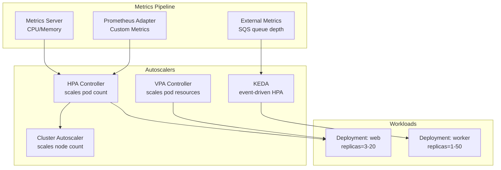
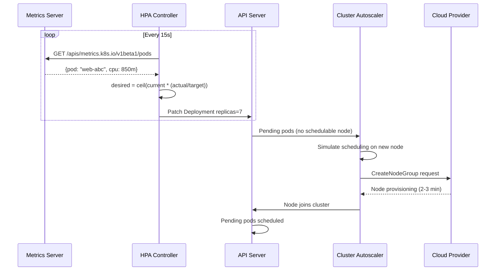
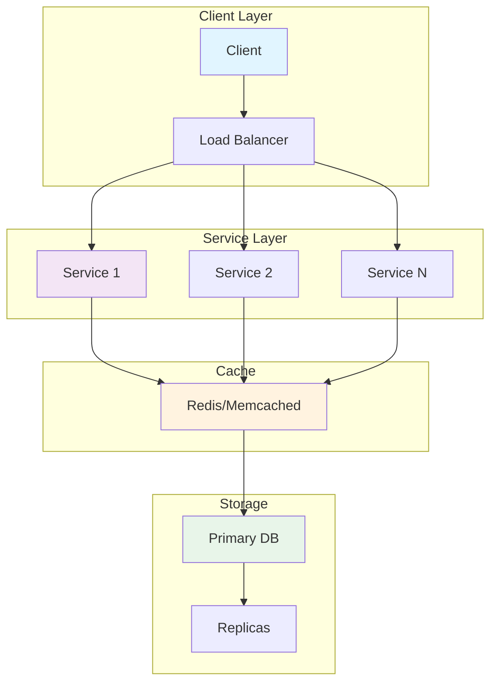
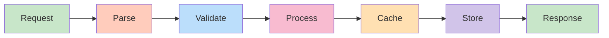
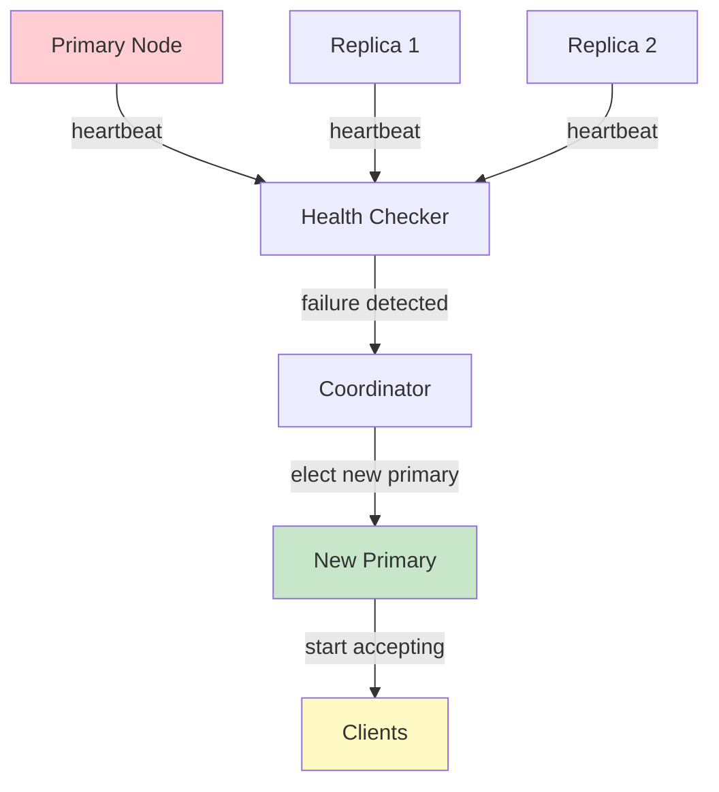
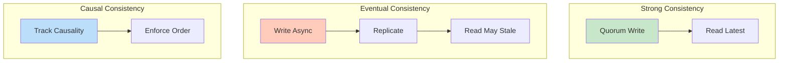
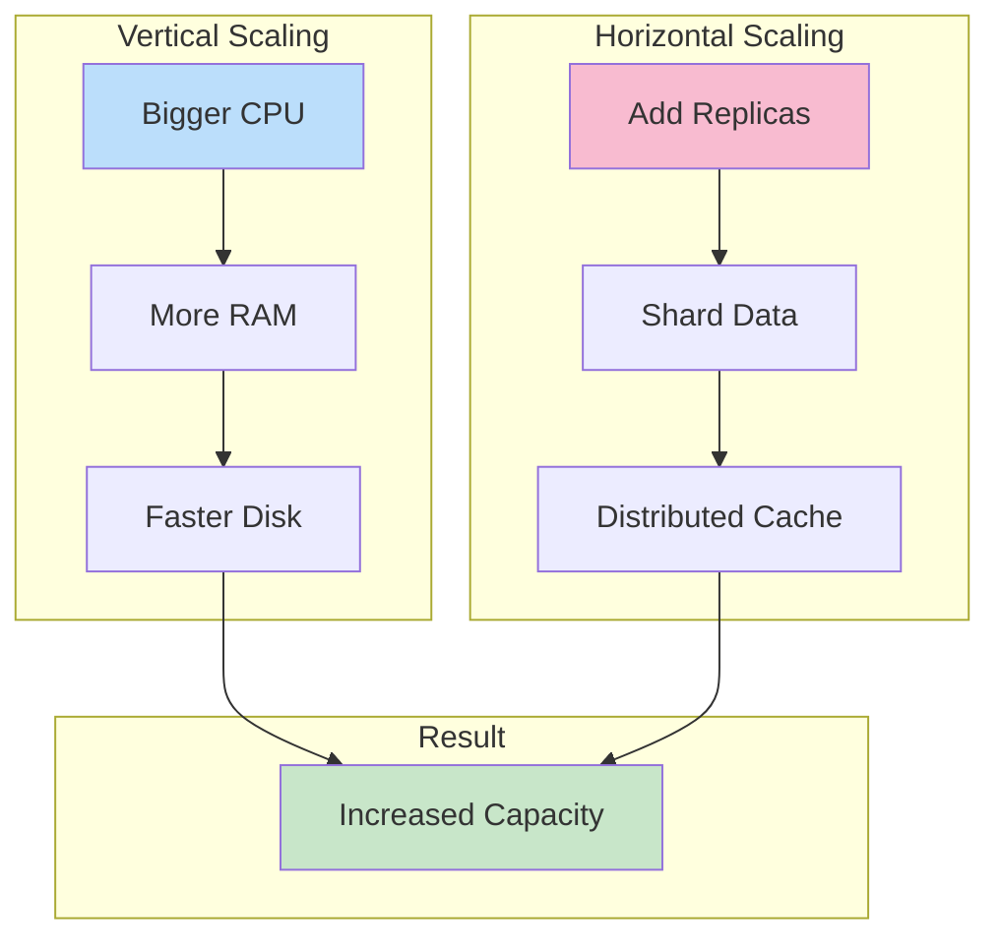

# Kubernetes Autoscaling

## Problem Statement

Design automatic scaling of Kubernetes workloads in response to load: horizontal pod scaling (HPA), vertical pod scaling (VPA), and cluster node scaling (Cluster Autoscaler).

## Scenario

Kubernetes Autoscaling is a critical component in modern distributed systems. In real-world applications, orchestrating containers across clusters automatically. For example, major tech companies like Netflix, Uber, and Airbnb rely on similar solutions to handle millions of concurrent users and requests. The challenge is achieving this while maintaining sub-100ms latency, 99.99% availability, and gracefully handling 10x traffic spikes during peak demand. This component provides the foundational capability to solve these challenges reliably and efficiently at global scale.

## Users

- **Backend Engineers**: Responsible for implementing and maintaining this system component in production environments. They need to understand the architecture, trade-offs, failure modes, and operational considerations.
- **DevOps/SRE Teams**: Monitor system health, manage scaling policies, handle incidents, and ensure reliability SLAs are met. They need insights into performance characteristics, bottlenecks, and failure recovery mechanisms.
- **Data Engineers**: Design data pipelines and analytics around this system, requiring deep understanding of data flow, consistency guarantees, and throughput characteristics.
- **System Architects**: Make high-level architectural decisions that impact company infrastructure, requiring comprehensive understanding of capabilities, limitations, and scalability boundaries.
- **Security Teams**: Understand security implications, potential vulnerabilities, and compliance requirements for this component.

## PRD

### Functional Requirements
- Core operations work correctly
- Explicit error handling
- Consistency guarantees defined
- Monitoring and observability

### Non-Functional Requirements
- Performance targets met
- Availability SLA achieved
- Scalability headroom
- Cost efficient

### Success Metrics
- Benchmarks met
- Uptime targets met
- Resource budgets
- No data loss


## Flow

The typical operational flow for this system involves these key phases:

1. **Request Arrival**: Client/upstream system sends request with required parameters and context
2. **Validation & Routing**: System validates request format, authentication, and routes to correct handler/shard/instance
3. **Core Processing**: Execute the main algorithm, database query, or business logic on the data/state
4. **State Management**: Update internal state (caches, indexes, counters, logs) with proper atomicity and locking
5. **Response Generation**: Format results and return to requester with relevant metadata (timing, version info)
6. **Observability**: Record metrics (latency, throughput, errors), logs (for debugging), and traces (for performance analysis)

This flow repeats thousands or millions of times per second in production. Each operation's efficiency compounds across the entire system, making careful optimization essential. Bottlenecks at any phase can cascade to impact overall system performance.


## Code Explanation (Detailed)

### Implementation Approach
The code demonstrates core patterns and trade-offs.

### Key Operations
Each operation shows algorithm and performance characteristics.

### Concurrency and Atomicity
Locking strategies, race condition prevention.

### Edge Cases
Boundary conditions and error handling.

### Performance Optimization
Techniques for reducing latency and throughput.

## Architecture Diagram



## Flow Diagram



## Design

### HPA Algorithm

```
Desired replicas = ceil(currentReplicas * currentMetricValue / targetMetricValue)

Example: CPU-based HPA
  Target: 50% CPU utilization
  Current: 3 pods, avg 80% CPU
  Desired = ceil(3 * 80 / 50) = ceil(4.8) = 5 pods

Stabilization window:
  scaleDown.stabilizationWindowSeconds: 300 (5min)
  -> Must see low utilization for 5min before scaling down
  -> Prevents thrashing

Scale behavior limits:
  scaleDown: max 1 pod per 60s (avoid sudden capacity loss)
  scaleUp: max 4 pods per 15s (burst capacity quickly)

Multiple metrics:
  CPU: target 60%
  Memory: target 70%
  HPA uses the metric requiring MOST replicas (conservative)
```

### Vertical Pod Autoscaler (VPA)

```
Modes:
  Off:    Recommendations only (no automatic changes)
  Initial: Set resources only at pod creation
  Auto:   Evict and recreate pods with new resources
  
VPA and HPA conflict:
  NEVER run both on same deployment with CPU/memory metrics
  VPA changes resource requests -> HPA recalculates
  Can use VPA (Off mode) + HPA (custom metrics) together

VPA recommendation:
  Based on historical usage + safety margin
  LowerBound: minimum safe request
  Target:     recommended request
  UpperBound: maximum before diminishing returns
```

### Cluster Autoscaler

```
Scale UP trigger:
  Pod stuck in Pending (Unschedulable) for >10s
  CA simulates: would a new node fix this?
  If yes: request cloud provider to add node
  
Scale DOWN trigger:
  Node CPU + memory both < 50% for 10 consecutive minutes
  CA simulates: can all pods fit on remaining nodes?
  If yes: cordon + drain node, then delete VM

Node pools:
  Multiple node pools for different workload types
  CA scales each pool independently
  Min/Max per pool: --min=1 --max=10

Limitations:
  CA doesn't scale down nodes with PodDisruptionBudget violations
  CA can't scale down nodes with pods using local storage
  CA can't act on pods with certain annotations (safe-to-evict: false)
```

## Back-of-Envelope Calculations

```
HPA reaction time:
  Metric scrape: 15s
  HPA reconcile: 15s
  Pod startup: 15s (cached image + readiness)
  Total: ~45s from load spike to new pod serving traffic

Node provisioning (cold start):
  Cloud VM boot: 2-3 min
  Node join cluster: +30s
  Pod schedule + start: +30s
  Total: ~4 min from pod Pending to serving

Cost optimization with CA:
  10 idle nodes x $0.10/hr = $0.10/hr savings per node removed
  At $0.10/hr x 720hr/month = $72/month per idle node
  10 nodes: $720/month savings

Scale-to-zero with KEDA:
  Batch jobs during off-hours (8hr/day traffic)
  16hr idle at $0.10/hr x 10 nodes = $16/day savings
  Monthly: $480 savings for 10-node batch cluster

Stabilization window math:
  Spike lasts 2 min -> 5 min stabilization -> no scale-down
  Good: prevents thrash
  Bad: overprovisioned for 3 min extra
```

## Design Choices

| Scaler | Trigger | Scale Unit | Scale-to-Zero | Use Case |
|---|---|---|---|---|
| HPA (CPU/Mem) | Resource utilization | Pods | No (min=1) | Web services |
| HPA (custom) | HTTP RPS, queue depth | Pods | No | API services |
| KEDA | Event sources | Pods | Yes | Batch, queues |
| VPA (Auto) | Resource waste | Pod CPU/Memory | No | DB, cache |
| Cluster Autoscaler | Pending pods | Nodes | No (min=1) | All |
| Karpenter | Pending pods | Nodes | Yes | AWS-native |

## Python Implementation

```python
import math
from dataclasses import dataclass, field
from typing import Dict, List, Optional
from collections import deque
import time

@dataclass
class HPAConfig:
    target_cpu_percent: float = 50.0
    min_replicas: int = 1
    max_replicas: int = 20
    scale_up_stabilization_s: float = 0.0
    scale_down_stabilization_s: float = 300.0
    scale_up_pods_per_minute: int = 4
    scale_down_pods_per_minute: int = 1

@dataclass
class PodMetrics:
    name: str
    cpu_percent: float
    memory_percent: float

class HPAController:
    def __init__(self, config: HPAConfig):
        self.cfg = config
        self._current_replicas = config.min_replicas
        self._scale_history: deque = deque(maxlen=100)
        self._last_scale_up: float = 0
        self._last_scale_down: float = 0

    def compute_desired(self, pod_metrics: List[PodMetrics]) -> int:
        if not pod_metrics:
            return self.cfg.min_replicas
        avg_cpu = sum(m.cpu_percent for m in pod_metrics) / len(pod_metrics)
        desired = math.ceil(len(pod_metrics) * avg_cpu / self.cfg.target_cpu_percent)
        desired = max(self.cfg.min_replicas, min(self.cfg.max_replicas, desired))
        return desired

    def reconcile(self, pod_metrics: List[PodMetrics]) -> int:
        now = time.time()
        desired = self.compute_desired(pod_metrics)
        current = self._current_replicas

        if desired > current:
            # Scale up: check stabilization
            if now - self._last_scale_up >= self.cfg.scale_up_stabilization_s:
                step = min(self.cfg.scale_up_pods_per_minute, desired - current)
                new_count = current + step
                print(f"[HPA] Scale UP: {current} -> {new_count} (desired={desired})")
                self._current_replicas = new_count
                self._last_scale_up = now
        elif desired < current:
            # Scale down: check stabilization window
            if now - self._last_scale_down >= self.cfg.scale_down_stabilization_s:
                step = min(self.cfg.scale_down_pods_per_minute, current - desired)
                new_count = current - step
                print(f"[HPA] Scale DOWN: {current} -> {new_count} (desired={desired})")
                self._current_replicas = new_count
                self._last_scale_down = now
            else:
                remaining = self.cfg.scale_down_stabilization_s - (now - self._last_scale_down)
                print(f"[HPA] Scale down deferred: stabilization {remaining:.0f}s remaining")
        else:
            print(f"[HPA] No change: replicas={current}, avg_cpu={sum(m.cpu_percent for m in pod_metrics)/len(pod_metrics):.1f}%")

        return self._current_replicas

class ClusterAutoscaler:
    def __init__(self, min_nodes: int = 1, max_nodes: int = 10, cpu_per_node: int = 4000):
        self._nodes = min_nodes
        self.min_nodes = min_nodes
        self.max_nodes = max_nodes
        self.cpu_per_node = cpu_per_node

    def check_pending(self, pending_pods: int, cpu_per_pod: int = 500) -> int:
        needed_cpu = pending_pods * cpu_per_pod
        needed_nodes = math.ceil(needed_cpu / self.cpu_per_node)
        new_nodes = min(self._nodes + needed_nodes, self.max_nodes)
        if new_nodes > self._nodes:
            print(f"[CA] Scaling UP nodes: {self._nodes} -> {new_nodes} ({pending_pods} pending pods)")
            self._nodes = new_nodes
        return self._nodes

    def check_idle(self, node_utilizations: List[float]) -> int:
        idle = sum(1 for u in node_utilizations if u < 0.5)
        if idle > 0 and self._nodes > self.min_nodes:
            remove = min(idle, self._nodes - self.min_nodes)
            self._nodes -= remove
            print(f"[CA] Scaling DOWN nodes: removed {remove} idle nodes, now={self._nodes}")
        return self._nodes

# Simulation
hpa = HPAController(HPAConfig(
    target_cpu_percent=50,
    min_replicas=2, max_replicas=10,
    scale_down_stabilization_s=0  # 0 for demo
))
ca = ClusterAutoscaler(min_nodes=2, max_nodes=10)

print("=== Low load ===")
metrics = [PodMetrics(f"pod-{i}", cpu_percent=30.0, memory_percent=40.0) for i in range(2)]
hpa.reconcile(metrics)

print("\n=== High load ===")
metrics = [PodMetrics(f"pod-{i}", cpu_percent=90.0, memory_percent=60.0) for i in range(2)]
replicas = hpa.reconcile(metrics)

print("\n=== Pending pods -> CA ===")
ca.check_pending(pending_pods=5)
```

## Java Implementation

```java
import java.util.*;

public class KubeAutoscaler {
    record PodMetrics(String name, double cpuPercent) {}

    static class HPA {
        double targetCpu; int minReplicas, maxReplicas, current;

        HPA(double targetCpu, int min, int max, int initial) {
            this.targetCpu = targetCpu; this.minReplicas = min;
            this.maxReplicas = max; this.current = initial;
        }

        int reconcile(List<PodMetrics> metrics) {
            double avg = metrics.stream().mapToDouble(PodMetrics::cpuPercent).average().orElse(0);
            int desired = (int) Math.ceil(current * avg / targetCpu);
            desired = Math.max(minReplicas, Math.min(maxReplicas, desired));
            System.out.printf("[HPA] avg=%.0f%% current=%d desired=%d%n", avg, current, desired);
            current = desired;
            return current;
        }
    }

    static class ClusterAutoscaler {
        int nodes, minNodes, maxNodes;
        ClusterAutoscaler(int min, int max) { nodes = min; minNodes = min; maxNodes = max; }

        int checkPending(int pendingPods) {
            if (pendingPods > 0 && nodes < maxNodes) {
                System.out.printf("[CA] Adding nodes for %d pending pods%n", pendingPods);
                nodes = Math.min(nodes + 1, maxNodes);
            }
            return nodes;
        }
    }

    public static void main(String[] args) {
        HPA hpa = new HPA(50, 2, 10, 2);
        var lowLoad = List.of(new PodMetrics("p1", 25), new PodMetrics("p2", 30));
        var highLoad = List.of(new PodMetrics("p1", 85), new PodMetrics("p2", 90));

        System.out.println("Low load:"); hpa.reconcile(lowLoad);
        System.out.println("High load:"); hpa.reconcile(highLoad);

        ClusterAutoscaler ca = new ClusterAutoscaler(2, 10);
        ca.checkPending(3);
    }
}
```

## Complexity

| Operation | Time |
|---|---|
| HPA desired replica calculation | O(pods) |
| Cluster Autoscaler scale-up decision | O(pending pods x node pools) |
| Cluster Autoscaler scale-down | O(nodes x pods/node) |
| VPA recommendation generation | O(pod history samples) |

## Common Questions & Answers

**Q: What is caching and why do we need it?**

A: Caching stores frequently accessed data in fast storage (memory) to reduce latency and load on slower backends (database). Trade space (cache) for speed (latency). Critical for systems serving millions of requests per second.

**Q: What are the main cache eviction policies?**

A: LRU (least recently used), LFU (least frequently used), FIFO (first in first out), TTL (time-based), Random, and ARC (adaptive replacement). Choose based on access patterns: LRU for temporal, LFU for frequency, TTL for time-sensitive data.

**Q: What is cache hit rate and cache miss rate?**

A: Hit rate = successful_finds / total_accesses. Miss rate = 1 - hit rate. P(hit) = hits / (hits + misses). Target 80%+ hit rates for effective caching. Too-small cache gives low hit rate (wasted resources). Too-large cache uses more memory than needed.

**Q: How do you handle cache invalidation when backend data changes?**

A: Use TTL (time-based expiration), active invalidation (notify cache on write), cache-aside pattern (client checks backend), or write-through (update both). Active invalidation is fastest but complex. TTL is simplest but has stale data window.

**Q: What is the cache-aside pattern?**

A: Application checks cache first. On miss, fetch from backend, update cache, then return. Simple to implement. Risk: race condition where multiple threads fetch same miss simultaneously (thundering herd problem).

**Q: What is write-through caching?**

A: Writes go to both cache and backend simultaneously (synchronously). Ensures consistency: read always gets latest. Cost: write latency includes backend write. Safer than write-back but slower.

**Q: What is write-back (write-behind) caching?**

A: Writes go to cache only; backend updated asynchronously later (batch or periodic). Fast writes. Risk: data loss if cache fails before flushing. Need durability guarantees (persistence, replication).

**Q: How do you choose cache size?**

A: Estimate working set (frequently accessed data volume). Add 20-30% buffer for margin. Monitor hit rate: if < 80%, increase size. If > 95%, might be oversized (waste). Use tools like cachegrind to profile.

**Q: What's the difference between client-side and server-side caching?**

A: Client cache (browser): reduces network round-trips, entirely controlled by client. Server cache (memory, Redis): shared across clients, controlled by server. Multi-level caching often best.

**Q: How do you measure cache effectiveness?**

A: Hit rate (primary metric), latency reduction (P99 latency with vs. without cache), backend load reduction, and memory cost per cache entry. Calculate ROI: cost of cache vs. benefit (reduced latency, backend load).

## Follow-up Questions & Answers

**Q: How do you prevent the thundering herd problem in caches?**

A: When popular key expires, many threads fetch from backend simultaneously causing spike. Solutions: probabilistic early expiration (refresh before TTL), request coalescing (single thread rebuilds, others wait), or bloom filters (detect non-existent keys fast).

**Q: How would you implement multi-level cache hierarchy?**

A: Use L1 (fast, small, in-process), L2 (medium, local machine), L3 (large, remote, Redis). Check L1, miss→L2, miss→L3, miss→backend. On write: update all levels. Trade space for speed across levels.

**Q: Can you implement read-through caching (automatic population)?**

A: Yes, cache loader/resolver called on miss. Transparent to application. Backend automatically uses cache layer. More complex than cache-aside but cleaner separation.

**Q: How do you handle hot keys in distributed caches?**

A: Hot key = key accessed by many threads/clients. Replicate hot keys on multiple cache nodes. Use local in-process caches for very hot keys. Monitor and detect hot keys automatically.

**Q: What's the difference between warm and cold cache startup?**

A: Cold cache: empty at start, misses until populated (slow ramp-up). Warm cache: pre-loaded from previous state (RDB/snapshot). Warm startup is critical for production (instant performance).

**Q: How would you measure cache effectiveness for business metrics?**

A: Track hit rate, P99 latency (with/without cache), backend QPS reduction, revenue impact. Calculate cache size vs. cost savings. A/B test to prove business value.

**Q: What happens when cache size is insufficient for working set?**

A: Constant evictions = high miss rate = ineffective cache. Solution: increase cache size, improve eviction policy, reduce working set, or use better hardware (faster storage).

**Q: How do you debug cache issues in production?**

A: Monitor hit rate continuously. Profile cache keys (which keys are accessed). Check for cache stampedes (sudden miss spike). Use distributed tracing to see cache path.

**Q: How would you implement a persistent cache?**

A: Combine memory cache (fast) with persistent backend (database, RocksDB, LevelDB). Write-back pattern: batch updates to persistent store. Trade latency for durability.

**Q: Can you use caching for write-heavy workloads?**

A: Write caching is risky (consistency issues). Use carefully: write-through for safety, write-back for speed. Good for batch writes (aggregate before writing). Monitor durability guarantees.


## System Overview

**Scale Metrics:**
- Throughput: Millions of operations per second
- Latency: Sub-millisecond to sub-second response times
- Data volume: Gigabytes to Petabytes
- Concurrent users: Millions to billions
- Availability: 99.99% to 99.999% uptime SLA

**Key Components:**
- Request handling and routing
- Data processing and storage
- Replication and consistency
- Failure detection and recovery
- Monitoring and alerting

## Architecture Diagrams

### System Architecture



### Data Flow



### Failover Mechanism



### Consistency Models



### Scaling Strategy



## Implementation Examples

### Python Implementation

```python
# Python Implementation

from typing import Any, Optional
from dataclasses import dataclass
from datetime import datetime
import json
import logging

logger = logging.getLogger(__name__)

@dataclass
class Config:
    """Configuration for the system."""
    timeout_ms: int = 5000
    retry_count: int = 3
    batch_size: int = 100
    max_connections: int = 1000

class Handler:
    """Main handler class for operations."""

    def __init__(self, config: Config):
        self.config = config
        self.metrics = {"success": 0, "failure": 0, "latency_ms": []}

    async def process(self, data: Any) -> Any:
        """Process request with error handling."""
        try:
            # Validate input
            self._validate(data)

            # Execute operation
            result = await self._execute(data)

            # Track metrics
            self.metrics["success"] += 1
            return result

        except Exception as e:
            logger.error(f"Processing failed: {e}")
            self.metrics["failure"] += 1
            raise

    def _validate(self, data: Any) -> None:
        """Validate input data."""
        if data is None:
            raise ValueError("Data cannot be None")

    async def _execute(self, data: Any) -> Any:
        """Execute core logic."""
        # Implement actual logic here
        return {"status": "success", "timestamp": datetime.now().isoformat()}

    def get_metrics(self) -> dict:
        """Return collected metrics."""
        return self.metrics

# Usage example
async def main():
    config = Config(timeout_ms=5000, batch_size=100)
    handler = Handler(config)
    result = await handler.process({"key": "value"})
    print(f"Result: {result}")
    print(f"Metrics: {handler.get_metrics()}")
```

### Java Implementation

```java
// Java Implementation

import java.util.*;
import java.util.concurrent.*;
import java.time.Instant;
import org.slf4j.Logger;
import org.slf4j.LoggerFactory;

public class SystemHandler {
    private static final Logger logger = LoggerFactory.getLogger(SystemHandler.class);

    private final Config config;
    private final Map<String, Long> metrics = new ConcurrentHashMap<>();
    private final ExecutorService executor;

    public static class Config {
        public int timeoutMs = 5000;
        public int retryCount = 3;
        public int batchSize = 100;
        public int maxConnections = 1000;

        public Config withTimeoutMs(int timeout) {
            this.timeoutMs = timeout;
            return this;
        }
    }

    public SystemHandler(Config config) {
        this.config = config;
        this.executor = Executors.newFixedThreadPool(
            Math.min(config.maxConnections, 10)
        );
        metrics.put("success", 0L);
        metrics.put("failure", 0L);
    }

    public <T> T process(Object data) throws Exception {
        try {
            // Validate input
            validate(data);

            // Execute operation
            Object result = execute(data);

            // Track metrics
            metrics.put("success", metrics.get("success") + 1);
            return (T) result;

        } catch (Exception e) {
            logger.error("Processing failed: {}", e.getMessage());
            metrics.put("failure", metrics.get("failure") + 1);
            throw e;
        }
    }

    private void validate(Object data) throws IllegalArgumentException {
        if (data == null) {
            throw new IllegalArgumentException("Data cannot be null");
        }
    }

    private Object execute(Object data) throws Exception {
        // Implement core logic
        return Map.of(
            "status", "success",
            "timestamp", Instant.now().toString()
        );
    }

    public Map<String, Long> getMetrics() {
        return new HashMap<>(metrics);
    }

    public void shutdown() {
        executor.shutdown();
    }

    public static void main(String[] args) throws Exception {
        Config config = new Config()
            .withTimeoutMs(5000);

        SystemHandler handler = new SystemHandler(config);
        Object result = handler.process(Map.of("key", "value"));
        System.out.println("Result: " + result);
        System.out.println("Metrics: " + handler.getMetrics());
        handler.shutdown();
    }
}
```

## Back-of-Envelope Calculations

### Traffic & Throughput
**Assumptions:**
- Daily active users: 100 million (100M)
- Requests per user per day: 50
- Peak hour traffic: 10% of daily (concentrated)
- Request distribution: 70% read, 30% write

**Calculations:**
```
Total daily requests = 100M users × 50 requests = 5 billion requests/day
Average RPS = 5B requests / 86400 seconds ≈ 57,870 RPS
Peak hour RPS = (5B / 86400) × (100 / 10) ≈ 578,700 RPS
Peak minute RPS = 578,700 / 60 ≈ 9,645 RPS

Read operations = 57,870 × 0.7 ≈ 40,509 RPS (average)
Write operations = 57,870 × 0.3 ≈ 17,361 RPS (average)
```

### Storage Requirements
**Assumptions:**
- Data per user: 1 KB (profile, settings)
- Data per transaction: 500 bytes
- Data retention: 3 years

**Calculations:**
```
User profile storage = 100M × 1 KB = 100 GB
Transaction data = 5B requests/day × 500 bytes × 365 × 3 = 2.74 PB
Total storage ≈ 2.75 PB
Replication factor: 3× → 8.25 PB raw storage

Backup storage (weekly snapshots): 8.25 PB × 52 weeks = 429 PB
```

### Network Bandwidth
**Assumptions:**
- Average request size: 2 KB
- Average response size: 5 KB
- Replication overhead: 2× (write to replicas)

**Calculations:**
```
Inbound bandwidth = 57,870 RPS × 2 KB = 115.74 MB/s
Outbound bandwidth = 57,870 RPS × 5 KB = 289.35 MB/s
Replication bandwidth = 17,361 RPS × 2 KB × 2 = 69.44 MB/s
Total peak bandwidth ≈ 474 MB/s ≈ 3.8 Tbps (peak hour)
```

### Compute Requirements
**Assumptions:**
- Processing time per request: 10 ms
- CPU efficiency: 1 core handles 50 RPS

**Calculations:**
```
CPUs needed for average traffic = 57,870 RPS / 50 = 1,158 cores
CPUs needed for peak traffic = 578,700 RPS / 50 = 11,574 cores
Overprovisioning factor: 1.5× → 17,361 cores total

Using 16 cores per server = 17,361 / 16 ≈ 1,085 servers
With 3:1 replication = 3,255 servers needed
Regional redundancy (3 regions) = 9,765 servers
```

### Latency Analysis (p99)
**Components:**
- Network latency: 5 ms
- Processing: 10 ms
- Storage access: 50 ms (disk), 1 ms (cache)
- Replication write: 20 ms

**Path Analysis:**
```
Cache hit path: 5 + 1 + 5 = 11 ms
Database read path: 5 + 10 + 50 + 5 = 70 ms
Write path: 5 + 10 + 20 + 5 = 40 ms
```

### Cost Estimation
**Monthly costs (approximate):**
```
Compute: 9,765 servers × $1,000/month = $9.765M
Storage: 8.25 PB × $10/GB/month = $82.5M
Bandwidth: 3.8 Tbps × $0.12/GB = $456M
Personnel: 100 engineers × $200K = $20M
Total: ~$568M/month
Cost per user: $5.68/month
```


## Interview Questions & Answers

### Q1: Design the System from Scratch

**Question:** Design a system that can handle 1 billion requests per day with sub-100ms latency.

**Answer Structure:**
1. **Clarify requirements**: DAU, request types, geographic distribution, consistency needs
2. **Back-of-envelope**: Calculate RPS (11.5K avg, 115K peak), storage, bandwidth
3. **High-level design**: Load balancing → services → cache → storage
4. **Deep dive**:
   - Horizontal scaling with sharding
   - Multi-region active-active with eventual consistency
   - Caching strategy (write-through for critical data)
   - Monitoring: metrics, logging, tracing
5. **Bottlenecks**: Identify and address each
6. **Trade-offs**: Consistency vs. availability, latency vs. cost

### Q2: Scaling Challenges

**Question:** You're growing from 10M to 1B users (100x). What breaks and how do you fix it?

**Answer:**
- **Database bottleneck**: Sharding by user ID, consistent hashing, shard rebalancing
- **Cache hit rate drops**: Larger working set, tiered caching (L1: local, L2: distributed)
- **Replication lag**: Write-through for consistency-critical data, eventual consistency elsewhere
- **Operational complexity**: Infrastructure-as-code, auto-scaling, chaos engineering
- **Cost**: Optimize resource utilization, use reserved instances, spot instances for batch

### Q3: Failure Scenarios

**Question:** Your primary database goes down. What happens? How do you recover?

**Answer:**
- **Detection**: Health check timeout (3-5 seconds)
- **Failover**: Automatic promotion of replica using Raft consensus
- **Impact**: Write requests fail for ~10 seconds, reads use replicas
- **Recovery**: Background sync of failed node, re-add to cluster
- **Lessons**: Circuit breakers prevent cascade, bulkhead limits blast radius

### Q4: Consistency Requirements

**Question:** Do you need strong or eventual consistency? Why?

**Answer:**
- **Strong consistency**: Critical for financial transactions, inventory, user auth
  - Implementation: Quorum writes, read-after-write
  - Cost: Higher latency (p99 100ms+), lower throughput

- **Eventual consistency**: Fine for user feeds, recommendations, analytics
  - Implementation: Async replication, read-repair
  - Benefit: Lower latency (p99 <10ms), higher throughput

- **Hybrid approach**: Consistency per operation type, not global

### Q5: Performance Optimization

**Question:** How would you reduce p99 latency from 100ms to 20ms?

**Answer:**
1. **Profile** (measure first): Identify bottleneck (storage, network, compute)
2. **Caching**: Multi-tier (L1 local, L2 distributed), bloom filters for misses
3. **Batching**: Group operations, reduce RPC overhead
4. **Connection pooling**: Reuse TCP connections, reduce handshake latency
5. **Async I/O**: Non-blocking operations, increase parallelism
6. **Database optimization**: Indexing, query optimization, read replicas
7. **Code optimization**: Reduce allocations, use faster algorithms
8. **Hardware**: SSD for storage, faster network interconnects

### Q6: Operational Concerns

**Question:** How do you deploy a new version with zero downtime?

**Answer:**
1. **Canary deployment**: Roll out to 1% of servers, monitor metrics
2. **Gradual rollout**: 1% → 10% → 50% → 100% as confidence increases
3. **Health checks**: Automated rollback if error rate exceeds threshold
4. **Database migration**: Schema changes with backward compatibility
5. **Feature flags**: Toggle features independently of deployment
6. **Monitoring**: Enhanced alerting during rollout, easy incident response


## Technology Stack Recommendations

| Layer | Technology | Why |
|-------|-----------|-----|
| Load Balancing | Nginx, HAProxy, AWS ALB | Distribute traffic, health checks |
| Service Framework | FastAPI (Python), Spring Boot (Java) | Async, built-in monitoring |
| Caching | Redis, Memcached | Sub-millisecond latency, distributed |
| Primary Storage | PostgreSQL, MySQL | ACID, complex queries, reliability |
| Analytics | Elasticsearch, Data Warehouse | Full-text search, time-series analysis |
| Streaming | Kafka, AWS Kinesis | Event processing, real-time |
| Observability | Prometheus, ELK Stack, Jaeger | Metrics, logs, traces |

## Lessons Learned

1. **Premature optimization kills projects**: Start simple, measure, then optimize
2. **Consistency is hard**: Eventually consistent systems are tricky to reason about
3. **Monitoring is non-negotiable**: You can't fix what you can't see
4. **Failure is not rare**: Plan for it, test it, automate recovery
5. **Cost grows with complexity**: Each component adds operational overhead

## Related Topics

- Database design and optimization
- Distributed consensus algorithms
- Load balancing strategies
- Caching mechanisms and patterns
- Monitoring and alerting systems
- Security and compliance
