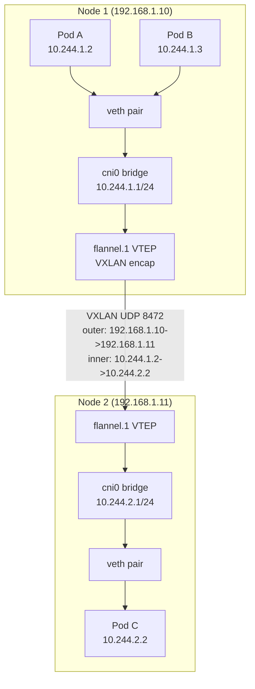
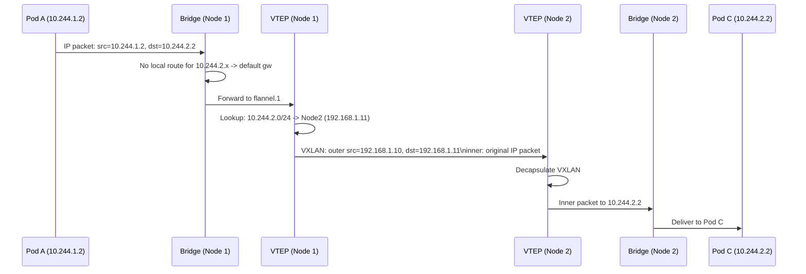

# Container Networking (CNI)

## Problem Statement

Understand how containers and pods communicate across nodes using the Container Network Interface (CNI), covering overlay networks, pod CIDR allocation, and network policies.

## Scenario

Container Networking (CNI) is a critical component in modern distributed systems. In real-world applications, handling complex business logic at scale with high reliability. For example, major tech companies like Netflix, Uber, and Airbnb rely on similar solutions to handle millions of concurrent users and requests. The challenge is achieving this while maintaining sub-100ms latency, 99.99% availability, and gracefully handling 10x traffic spikes during peak demand. This component provides the foundational capability to solve these challenges reliably and efficiently at global scale.

## Users

- **Backend Engineers**: Responsible for implementing and maintaining this system component in production environments. They need to understand the architecture, trade-offs, failure modes, and operational considerations.
- **DevOps/SRE Teams**: Monitor system health, manage scaling policies, handle incidents, and ensure reliability SLAs are met. They need insights into performance characteristics, bottlenecks, and failure recovery mechanisms.
- **Data Engineers**: Design data pipelines and analytics around this system, requiring deep understanding of data flow, consistency guarantees, and throughput characteristics.
- **System Architects**: Make high-level architectural decisions that impact company infrastructure, requiring comprehensive understanding of capabilities, limitations, and scalability boundaries.
- **Security Teams**: Understand security implications, potential vulnerabilities, and compliance requirements for this component.

## PRD

### Functional Requirements
- Core operations work correctly
- Explicit error handling
- Consistency guarantees defined
- Monitoring and observability

### Non-Functional Requirements
- Performance targets met
- Availability SLA achieved
- Scalability headroom
- Cost efficient

### Success Metrics
- Benchmarks met
- Uptime targets met
- Resource budgets
- No data loss


## Flow

The typical operational flow for this system involves these key phases:

1. **Request Arrival**: Client/upstream system sends request with required parameters and context
2. **Validation & Routing**: System validates request format, authentication, and routes to correct handler/shard/instance
3. **Core Processing**: Execute the main algorithm, database query, or business logic on the data/state
4. **State Management**: Update internal state (caches, indexes, counters, logs) with proper atomicity and locking
5. **Response Generation**: Format results and return to requester with relevant metadata (timing, version info)
6. **Observability**: Record metrics (latency, throughput, errors), logs (for debugging), and traces (for performance analysis)

This flow repeats thousands or millions of times per second in production. Each operation's efficiency compounds across the entire system, making careful optimization essential. Bottlenecks at any phase can cascade to impact overall system performance.


## Code Explanation (Detailed)

### Implementation Approach
The code demonstrates core patterns and trade-offs.

### Key Operations
Each operation shows algorithm and performance characteristics.

### Concurrency and Atomicity
Locking strategies, race condition prevention.

### Edge Cases
Boundary conditions and error handling.

### Performance Optimization
Techniques for reducing latency and throughput.

## Architecture Diagram



## Flow Diagram



## Design

### CNI Plugins

```
Flannel (simple, VXLAN overlay):
  - Assigns /24 subnet per node from larger /16
  - VXLAN tunnels between nodes (UDP port 8472)
  - Overhead: 50 bytes per packet (VXLAN header)
  - No network policy support (use with Calico NetworkPolicy)

Calico (BGP, no overlay):
  - Native IP routing via BGP between nodes
  - No encapsulation overhead (pure IP routing)
  - Full NetworkPolicy support
  - eBPF dataplane option for high performance

Cilium (eBPF):
  - Replaces kube-proxy entirely with eBPF
  - Kernel-level packet processing (no iptables)
  - Native NetworkPolicy + L7 (HTTP, gRPC) policies
  - Hubble for network observability
  - 10-30% lower latency than iptables

Weave:
  - Fast datapath + encrypted overlay
  - No configuration needed (auto-peer discovery)
  - Multicast via UDP broadcast for discovery
```

### Pod IP Assignment

```
IPAM (IP Address Management):
  Cluster CIDR: 10.244.0.0/16 (65534 pod IPs)
  Per-node: /24 subnet = 254 pods per node
  
  Node 1: 10.244.1.0/24 (10.244.1.1 - 10.244.1.254)
  Node 2: 10.244.2.0/24
  ...
  Node 255: 10.244.255.0/24

Pod lifecycle:
  1. kubelet calls CNI plugin (ADD)
  2. CNI creates veth pair: one end in pod ns, one in host ns
  3. CNI assigns IP from node subnet
  4. CNI adds routes in both namespaces
  5. Pod gets IP, default gateway

  On pod delete:
  1. kubelet calls CNI (DEL)
  2. veth pair removed, IP returned to pool
```

### Network Policy

```
Default: All pods can communicate with all pods (flat network)

NetworkPolicy example:
  spec:
    podSelector: {matchLabels: {app: backend}}
    policyTypes: [Ingress, Egress]
    ingress:
      - from:
        - podSelector: {matchLabels: {app: frontend}}
        ports: [{port: 8080}]
    egress:
      - to:
        - podSelector: {matchLabels: {app: postgres}}
        ports: [{port: 5432}]

Implementation: CNI plugin programs iptables/eBPF rules
  - Calico: iptables chains per policy
  - Cilium: eBPF maps for O(1) policy evaluation
```

## Back-of-Envelope Calculations

```
VXLAN overhead:
  Original packet: 1460 bytes (TCP MSS)
  VXLAN header: 8B + UDP: 8B + outer IP: 20B + outer Ethernet: 14B = 50B overhead
  Effective MTU: 1500 - 50 = 1450B (jumbo frames recommended)
  Overhead: 50/1460 = 3.4% bandwidth overhead

Pod density per node:
  Node subnet: /24 = 254 usable IPs
  Max 254 pods per node (default AWS EKS: 110)
  AWS VPC CNI: limited by instance type ENIs

CNI plugin add latency:
  IPAM + veth creation: ~5-10ms per pod start
  Negligible vs. image pull time (~10-30s)

Network policy at scale:
  iptables: 10K policies = 10K rules, ~5ms per packet evaluation
  Cilium eBPF: 10K policies = O(1) hash lookup, ~10 microseconds
  At 100K req/s: iptables adds 500ms/sec CPU, eBPF adds 1ms/sec CPU
```

## Design Choices

| CNI | Overhead | NetworkPolicy | Complexity | Use Case |
|---|---|---|---|---|
| Flannel | VXLAN +50B | No | Low | Simple dev/test |
| Calico (BGP) | None | Yes | Medium | Production, bare metal |
| Calico (IPIP) | +20B | Yes | Medium | Cloud (no BGP) |
| Cilium | None (eBPF) | L3-L7 | High | Performance-critical |
| AWS VPC CNI | None | No (use Calico) | Low | EKS (native VPC IPs) |

## Python Implementation

```python
from dataclasses import dataclass, field
from typing import Dict, List, Optional, Tuple
import ipaddress
import struct
import hashlib

@dataclass
class PodInterface:
    veth_host: str  # vethXXXX in host ns
    veth_pod: str   # eth0 in pod ns
    pod_ip: str
    gateway: str
    mac: str

class IPAMPool:
    def __init__(self, cluster_cidr: str = "10.244.0.0/16"):
        self._network = ipaddress.IPv4Network(cluster_cidr)
        self._subnets = list(self._network.subnets(prefixlen_diff=8))  # /24 per node
        self._node_subnets: Dict[str, ipaddress.IPv4Network] = {}
        self._allocated: Dict[str, set] = {}

    def assign_node_subnet(self, node_name: str) -> ipaddress.IPv4Network:
        idx = len(self._node_subnets)
        subnet = self._subnets[idx]
        self._node_subnets[node_name] = subnet
        self._allocated[node_name] = set()
        print(f"[IPAM] Node {node_name} assigned {subnet}")
        return subnet

    def allocate_pod_ip(self, node_name: str) -> Optional[str]:
        subnet = self._node_subnets.get(node_name)
        if not subnet:
            return None
        hosts = list(subnet.hosts())
        hosts = hosts[1:]  # Skip gateway (.1)
        for ip in hosts:
            ip_str = str(ip)
            if ip_str not in self._allocated[node_name]:
                self._allocated[node_name].add(ip_str)
                return ip_str
        return None  # Exhausted

    def release_pod_ip(self, node_name: str, ip: str):
        self._allocated[node_name].discard(ip)

    def gateway_for_node(self, node_name: str) -> str:
        subnet = self._node_subnets[node_name]
        return str(list(subnet.hosts())[0])  # .1 address

class VXLANNetwork:
    def __init__(self):
        self._node_vtep: Dict[str, str] = {}  # node -> physical IP
        self._subnet_to_node: Dict[str, str] = {}

    def register_node(self, node_name: str, node_ip: str, pod_subnet: str):
        self._node_vtep[node_name] = node_ip
        self._subnet_to_node[pod_subnet] = node_name
        print(f"[VXLAN] Registered {node_name}: {node_ip}, pod subnet: {pod_subnet}")

    def route_pod_to_pod(self, src_pod_ip: str, dst_pod_ip: str) -> dict:
        # Find which node hosts the dst pod
        dst_subnet = ".".join(dst_pod_ip.split(".")[:3]) + ".0/24"
        dst_node = self._subnet_to_node.get(dst_subnet)
        if not dst_node:
            return {"error": f"No route to {dst_pod_ip}"}
        dst_vtep = self._node_vtep[dst_node]
        return {
            "inner_src": src_pod_ip,
            "inner_dst": dst_pod_ip,
            "outer_src": "auto",  # source node's IP
            "outer_dst": dst_vtep,
            "protocol": "VXLAN",
            "vni": 1,
            "udp_port": 8472,
        }

class NetworkPolicyEngine:
    def __init__(self):
        self._policies: List[dict] = []

    def add_policy(self, namespace: str, pod_selector: Dict[str, str],
                   ingress_from: List[Dict], egress_to: List[Dict]):
        self._policies.append({
            "namespace": namespace,
            "pod_selector": pod_selector,
            "ingress": ingress_from,
            "egress": egress_to,
        })

    def _labels_match(self, pod_labels: Dict, selector: Dict) -> bool:
        return all(pod_labels.get(k) == v for k, v in selector.items())

    def is_allowed(self, src_pod_labels: Dict, dst_pod_labels: Dict,
                   dst_port: int, namespace: str) -> bool:
        applicable = [p for p in self._policies
                      if p["namespace"] == namespace
                      and self._labels_match(dst_pod_labels, p["pod_selector"])]
        if not applicable:
            return True  # No policy = allow all
        for policy in applicable:
            for rule in policy["ingress"]:
                from_sel = rule.get("from_selector", {})
                ports = rule.get("ports", [])
                if self._labels_match(src_pod_labels, from_sel):
                    if not ports or dst_port in ports:
                        return True
        return False

# Usage
ipam = IPAMPool("10.244.0.0/16")
vxlan = VXLANNetwork()

for node, ip in [("node-1", "192.168.1.10"), ("node-2", "192.168.1.11")]:
    subnet = ipam.assign_node_subnet(node)
    vxlan.register_node(node, ip, str(subnet))

pod1_ip = ipam.allocate_pod_ip("node-1")
pod2_ip = ipam.allocate_pod_ip("node-2")
print(f"\nPod IPs: node-1={pod1_ip}, node-2={pod2_ip}")

route = vxlan.route_pod_to_pod(pod1_ip, pod2_ip)
print(f"VXLAN route: {route}")

# Network policy
policy_engine = NetworkPolicyEngine()
policy_engine.add_policy(
    namespace="prod",
    pod_selector={"app": "backend"},
    ingress_from=[{"from_selector": {"app": "frontend"}, "ports": [8080]}],
    egress_to=[{"to_selector": {"app": "postgres"}, "ports": [5432]}]
)
print(f"\nFrontend -> Backend:8080 allowed: {policy_engine.is_allowed({'app':'frontend'}, {'app':'backend'}, 8080, 'prod')}")
print(f"Unknown -> Backend:8080 allowed: {policy_engine.is_allowed({'app':'unknown'}, {'app':'backend'}, 8080, 'prod')}")
```

## Java Implementation

```java
import java.util.*;
import java.util.stream.*;

public class ContainerNetworking {
    static class IPAMPool {
        private int nextNode = 1;
        private Map<String, Integer> nodeSubnets = new HashMap<>();
        private Map<String, Set<Integer>> allocated = new HashMap<>();

        String assignNodeSubnet(String node) {
            nodeSubnets.put(node, nextNode++);
            allocated.put(node, new HashSet<>());
            return "10.244." + nodeSubnets.get(node) + ".0/24";
        }

        String allocatePodIp(String node) {
            Set<Integer> used = allocated.get(node);
            for (int i = 2; i < 255; i++) {
                if (!used.contains(i)) {
                    used.add(i);
                    return "10.244." + nodeSubnets.get(node) + "." + i;
                }
            }
            return null;
        }
    }

    record VXLANPacket(String innerSrc, String innerDst, String outerDst) {}

    static VXLANPacket buildVXLAN(String srcPodIp, String dstPodIp, String dstNodeIp) {
        return new VXLANPacket(srcPodIp, dstPodIp, dstNodeIp);
    }

    public static void main(String[] args) {
        IPAMPool ipam = new IPAMPool();
        System.out.println(ipam.assignNodeSubnet("node-1"));
        System.out.println(ipam.assignNodeSubnet("node-2"));
        String pod1 = ipam.allocatePodIp("node-1");
        String pod2 = ipam.allocatePodIp("node-2");
        System.out.printf("Pod IPs: %s, %s%n", pod1, pod2);
        VXLANPacket pkt = buildVXLAN(pod1, pod2, "192.168.1.11");
        System.out.printf("VXLAN: %s -> %s via %s%n", pkt.innerSrc(), pkt.innerDst(), pkt.outerDst());
    }
}
```

## Complexity

| Operation | Time |
|---|---|
| Pod IP allocation | O(1) amortized |
| VXLAN encap/decap | O(1) |
| NetworkPolicy evaluation (iptables) | O(rules) |
| NetworkPolicy evaluation (Cilium eBPF) | O(1) |
| FDB lookup for VXLAN | O(1) hash table |

## Common Questions & Answers

**Q: What is caching and why do we need it?**

A: Caching stores frequently accessed data in fast storage (memory) to reduce latency and load on slower backends (database). Trade space (cache) for speed (latency). Critical for systems serving millions of requests per second.

**Q: What are the main cache eviction policies?**

A: LRU (least recently used), LFU (least frequently used), FIFO (first in first out), TTL (time-based), Random, and ARC (adaptive replacement). Choose based on access patterns: LRU for temporal, LFU for frequency, TTL for time-sensitive data.

**Q: What is cache hit rate and cache miss rate?**

A: Hit rate = successful_finds / total_accesses. Miss rate = 1 - hit rate. P(hit) = hits / (hits + misses). Target 80%+ hit rates for effective caching. Too-small cache gives low hit rate (wasted resources). Too-large cache uses more memory than needed.

**Q: How do you handle cache invalidation when backend data changes?**

A: Use TTL (time-based expiration), active invalidation (notify cache on write), cache-aside pattern (client checks backend), or write-through (update both). Active invalidation is fastest but complex. TTL is simplest but has stale data window.

**Q: What is the cache-aside pattern?**

A: Application checks cache first. On miss, fetch from backend, update cache, then return. Simple to implement. Risk: race condition where multiple threads fetch same miss simultaneously (thundering herd problem).

**Q: What is write-through caching?**

A: Writes go to both cache and backend simultaneously (synchronously). Ensures consistency: read always gets latest. Cost: write latency includes backend write. Safer than write-back but slower.

**Q: What is write-back (write-behind) caching?**

A: Writes go to cache only; backend updated asynchronously later (batch or periodic). Fast writes. Risk: data loss if cache fails before flushing. Need durability guarantees (persistence, replication).

**Q: How do you choose cache size?**

A: Estimate working set (frequently accessed data volume). Add 20-30% buffer for margin. Monitor hit rate: if < 80%, increase size. If > 95%, might be oversized (waste). Use tools like cachegrind to profile.

**Q: What's the difference between client-side and server-side caching?**

A: Client cache (browser): reduces network round-trips, entirely controlled by client. Server cache (memory, Redis): shared across clients, controlled by server. Multi-level caching often best.

**Q: How do you measure cache effectiveness?**

A: Hit rate (primary metric), latency reduction (P99 latency with vs. without cache), backend load reduction, and memory cost per cache entry. Calculate ROI: cost of cache vs. benefit (reduced latency, backend load).

## Follow-up Questions & Answers

**Q: How do you prevent the thundering herd problem in caches?**

A: When popular key expires, many threads fetch from backend simultaneously causing spike. Solutions: probabilistic early expiration (refresh before TTL), request coalescing (single thread rebuilds, others wait), or bloom filters (detect non-existent keys fast).

**Q: How would you implement multi-level cache hierarchy?**

A: Use L1 (fast, small, in-process), L2 (medium, local machine), L3 (large, remote, Redis). Check L1, miss→L2, miss→L3, miss→backend. On write: update all levels. Trade space for speed across levels.

**Q: Can you implement read-through caching (automatic population)?**

A: Yes, cache loader/resolver called on miss. Transparent to application. Backend automatically uses cache layer. More complex than cache-aside but cleaner separation.

**Q: How do you handle hot keys in distributed caches?**

A: Hot key = key accessed by many threads/clients. Replicate hot keys on multiple cache nodes. Use local in-process caches for very hot keys. Monitor and detect hot keys automatically.

**Q: What's the difference between warm and cold cache startup?**

A: Cold cache: empty at start, misses until populated (slow ramp-up). Warm cache: pre-loaded from previous state (RDB/snapshot). Warm startup is critical for production (instant performance).

**Q: How would you measure cache effectiveness for business metrics?**

A: Track hit rate, P99 latency (with/without cache), backend QPS reduction, revenue impact. Calculate cache size vs. cost savings. A/B test to prove business value.

**Q: What happens when cache size is insufficient for working set?**

A: Constant evictions = high miss rate = ineffective cache. Solution: increase cache size, improve eviction policy, reduce working set, or use better hardware (faster storage).

**Q: How do you debug cache issues in production?**

A: Monitor hit rate continuously. Profile cache keys (which keys are accessed). Check for cache stampedes (sudden miss spike). Use distributed tracing to see cache path.

**Q: How would you implement a persistent cache?**

A: Combine memory cache (fast) with persistent backend (database, RocksDB, LevelDB). Write-back pattern: batch updates to persistent store. Trade latency for durability.

**Q: Can you use caching for write-heavy workloads?**

A: Write caching is risky (consistency issues). Use carefully: write-through for safety, write-back for speed. Good for batch writes (aggregate before writing). Monitor durability guarantees.

