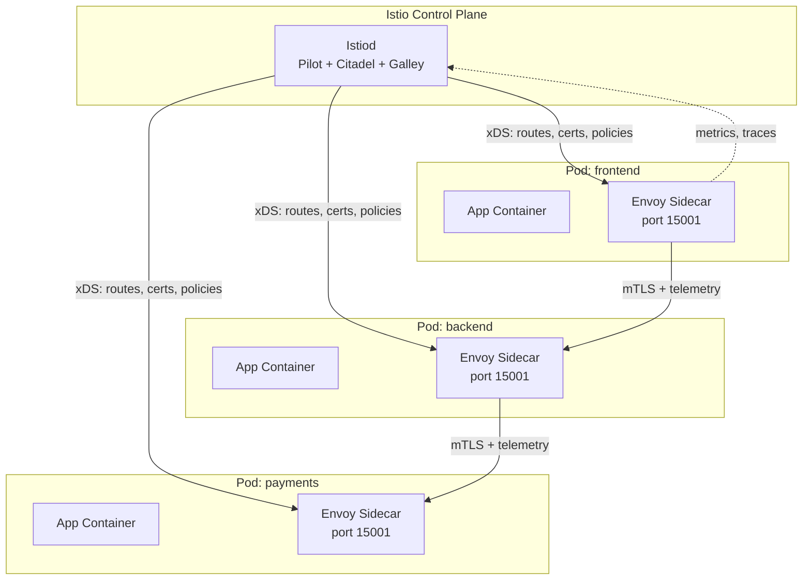
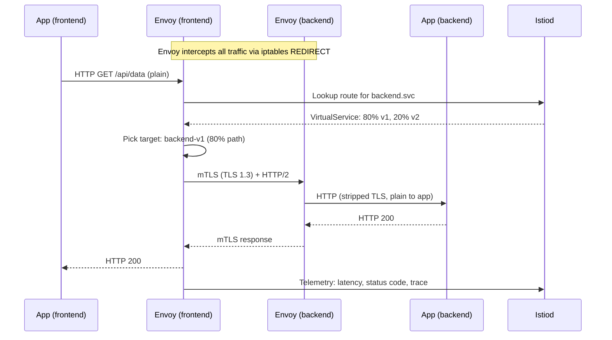

# Service Mesh and Istio

## Problem Statement

Design a service mesh that provides observability, traffic management, and security for microservices without modifying application code — using sidecar proxies (Envoy) injected alongside every pod.

## Architecture Diagram



## Flow Diagram



## Design

### Data Plane (Envoy Sidecar)

```
Envoy intercepts traffic via iptables REDIRECT (init container):
  iptables -t nat -A OUTPUT -p tcp -j REDIRECT --to-port 15001

What Envoy handles:
  - mTLS: mutual authentication between all services
  - Load balancing: consistent hashing, least request, round robin
  - Circuit breaking: fail fast on unhealthy upstream
  - Retries: automatic retry with exponential backoff
  - Timeouts: per-route timeout enforcement
  - Observability: traces (Jaeger), metrics (Prometheus), logs
  - Traffic shifting: canary deployments via weights

xDS API (from Istiod):
  LDS: Listener Discovery Service (ports to listen on)
  RDS: Route Discovery Service (routing rules)
  CDS: Cluster Discovery Service (upstream service endpoints)
  EDS: Endpoint Discovery Service (pod IPs per cluster)
```

### Control Plane (Istiod)

```
Pilot: Service discovery + traffic management
  - Translates Istio config (VirtualService, DestinationRule) to Envoy xDS
  - Monitors Kubernetes Services/Endpoints for live pod IPs

Citadel (now in Istiod): Certificate authority
  - Issues SPIFFE X.509 certificates to each workload
  - Identity: spiffe://cluster.local/ns/prod/sa/frontend
  - Rotates certs every 24h (configurable)

Galley: Config validation
  - Validates Istio CRDs before applying
  - Prevents misconfigured VirtualServices
```

### Traffic Management CRDs

```yaml
VirtualService:
  http:
    - route:
      - destination: {host: backend, subset: v1}
        weight: 80
      - destination: {host: backend, subset: v2}
        weight: 20
      timeout: 5s
      retries: {attempts: 3, retryOn: "5xx"}

DestinationRule:
  subsets:
    - name: v1; labels: {version: v1}
    - name: v2; labels: {version: v2}
  trafficPolicy:
    connectionPool:
      tcp: {maxConnections: 100}
      http: {http2MaxRequests: 1000}
    outlierDetection:  # Circuit breaker
      consecutiveGatewayErrors: 5
      interval: 30s
      baseEjectionTime: 30s
```

## Common Questions & Answers

**Q: What does "zero-trust" networking mean in a service mesh?** A: Every service-to-service call requires mutual TLS (mTLS) with SPIFFE identity certificates. No service can talk to another without a valid cert. No implicit trust within the cluster — even if an attacker gains network access.

**Q: What is the performance overhead of Envoy sidecar?** A: ~2-10ms added latency per hop (from proxy interception). ~50-150MB RAM per sidecar. For high-throughput services (100K RPS), consider eBPF-based service mesh (Cilium) for lower overhead.

**Q: How does circuit breaking work in Istio?** A: DestinationRule `outlierDetection`: if 5 consecutive 5xx from a pod, eject it from load balancing for 30s. Prevents cascading failures. `connectionPool.maxConnections` limits concurrent connections to prevent overload.

**Q: What is SPIFFE?** A: Secure Production Identity Framework for Everyone. Standard for workload identity. Istio issues SPIFFE-compliant X.509 SVIDs. Format: `spiffe://trust-domain/ns/namespace/sa/service-account`.

**Q: Istio vs Linkerd vs Cilium service mesh?** A: Istio: most features, higher overhead, complex. Linkerd: lightweight (Rust proxy), simpler, less features. Cilium: eBPF-based, no sidecar, lowest overhead, requires kernel 4.9+.

## Back-of-Envelope Calculations

```
Sidecar overhead:
  Envoy RAM: 50MB per pod
  1000-pod cluster: 50GB just for proxies
  Envoy CPU: ~0.01 cores at 1000 req/s
  1000 pods x 0.01 = 10 cores overhead cluster-wide

Latency per hop:
  Envoy proxy (userspace): 1-5ms per call
  10 microservices in chain: +10-50ms total
  vs direct pod-to-pod: 0.1ms

Certificate rotation:
  Default: rotate every 24h
  1000 pods: ~1 cert rotation/80s (spread evenly)
  istiod handles ~50 cert ops/sec without issue

Traffic shifting update time:
  VirtualService change -> xDS push to all Envoys
  At 1000 pods: ~1-2s for full config propagation
  Old weights may apply for up to 2s during transition

Control plane memory:
  Istiod: ~1GB RAM for 1000 services/endpoints
  xDS cache size grows with cluster size
```

## Design Choices

| Feature | Istio | Linkerd | Cilium (eBPF) |
|---|---|---|---|
| Proxy | Envoy (C++) | Linkerd2-proxy (Rust) | None (kernel) |
| Latency overhead | 2-10ms | 1-3ms | <0.1ms |
| RAM per pod | 50-150MB | 10-20MB | 0 (no sidecar) |
| mTLS | Yes | Yes | Yes |
| Traffic management | Rich (weights, retries) | Basic | Basic |
| Observability | Excellent | Good | Good |

## Follow-up Questions

1. How does Istio integrate with Jaeger/Zipkin for distributed tracing?
2. What is an ambient mesh and how does it differ from sidecar mesh?
3. How do you implement mutual TLS between services in different clusters?
4. How does Envoy implement circuit breaking at the connection pool level?
5. What is Envoy's xDS protocol and how does it update routing dynamically?

## Python Implementation

```python
from dataclasses import dataclass, field
from typing import Dict, List, Optional, Tuple
import random
import time

@dataclass
class Endpoint:
    ip: str
    port: int
    version: str
    healthy: bool = True
    consecutive_errors: int = 0
    ejected_until: float = 0.0

    def is_available(self) -> bool:
        return self.healthy and time.time() >= self.ejected_until

@dataclass
class TrafficWeight:
    subset: str
    weight: int  # 0-100

class CircuitBreaker:
    def __init__(self, threshold: int = 5, ejection_s: float = 30.0):
        self.threshold = threshold
        self.ejection_s = ejection_s

    def record_error(self, ep: Endpoint):
        ep.consecutive_errors += 1
        if ep.consecutive_errors >= self.threshold:
            ep.ejected_until = time.time() + self.ejection_s
            ep.consecutive_errors = 0
            print(f"  [CB] Ejected {ep.ip} for {self.ejection_s}s")

    def record_success(self, ep: Endpoint):
        ep.consecutive_errors = 0

class EnvoyProxy:
    def __init__(self, service_name: str):
        self.service_name = service_name
        self._clusters: Dict[str, List[Endpoint]] = {}
        self._weights: List[TrafficWeight] = []
        self._cb = CircuitBreaker(threshold=3, ejection_s=5.0)
        self._request_count = 0
        self._error_count = 0

    def update_endpoints(self, subset: str, endpoints: List[Endpoint]):
        self._clusters[subset] = endpoints
        print(f"[xDS/EDS] Updated {self.service_name}/{subset}: {len(endpoints)} endpoints")

    def update_routes(self, weights: List[TrafficWeight]):
        self._weights = weights
        total = sum(w.weight for w in weights)
        assert total == 100, "Weights must sum to 100"
        print(f"[xDS/RDS] Route {self.service_name}: {[(w.subset, w.weight) for w in weights]}")

    def _select_subset(self) -> str:
        r = random.randint(1, 100)
        cumulative = 0
        for w in self._weights:
            cumulative += w.weight
            if r <= cumulative:
                return w.subset
        return self._weights[-1].subset

    def call(self, path: str = "/", retries: int = 2) -> Tuple[int, str]:
        self._request_count += 1
        subset = self._select_subset()
        endpoints = [ep for ep in self._clusters.get(subset, []) if ep.is_available()]
        if not endpoints:
            return 503, f"No available endpoints for {self.service_name}/{subset}"

        ep = random.choice(endpoints)
        # Simulate call with retry
        for attempt in range(retries + 1):
            status, body = self._simulate_call(ep, path)
            if status < 500:
                self._cb.record_success(ep)
                return status, body
            self._cb.record_error(ep)
            if attempt < retries:
                print(f"  [Retry] {ep.ip} returned {status}, retrying ({attempt+1}/{retries})")
                endpoints = [e for e in endpoints if e.is_available() and e != ep]
                if not endpoints:
                    break
                ep = random.choice(endpoints)

        self._error_count += 1
        return 503, "All retries exhausted"

    def _simulate_call(self, ep: Endpoint, path: str) -> Tuple[int, str]:
        # Simulate error based on endpoint state
        if not ep.healthy or random.random() < 0.3 * ep.consecutive_errors:
            return 500, "Internal server error"
        return 200, f"OK from {ep.ip}:{ep.port} (v{ep.version})"

    def stats(self) -> dict:
        return {
            "total_requests": self._request_count,
            "errors": self._error_count,
            "error_rate": f"{self._error_count/max(1,self._request_count)*100:.1f}%",
        }

# Simulate Istiod pushing config to proxy
proxy = EnvoyProxy("backend")

# xDS: EDS update - register endpoints
proxy.update_endpoints("v1", [
    Endpoint("10.244.1.2", 8080, "v1"),
    Endpoint("10.244.1.3", 8080, "v1"),
])
proxy.update_endpoints("v2", [
    Endpoint("10.244.2.2", 8080, "v2"),
])

# xDS: RDS update - 80/20 canary split
proxy.update_routes([TrafficWeight("v1", 80), TrafficWeight("v2", 20)])

# Simulate traffic
print("\n--- Serving traffic ---")
v1_count = v2_count = 0
for _ in range(10):
    status, body = proxy.call("/api/data")
    if "v1" in body:
        v1_count += 1
    elif "v2" in body:
        v2_count += 1

print(f"\nTraffic split: v1={v1_count}, v2={v2_count}")
print(proxy.stats())
```

## Java Implementation

```java
import java.util.*;
import java.util.concurrent.atomic.*;

public class ServiceMesh {
    record Endpoint(String ip, int port, String version) {}
    record WeightedRoute(String subset, int weight) {}

    static class EnvoyProxy {
        private Map<String, List<Endpoint>> clusters = new HashMap<>();
        private List<WeightedRoute> routes = new ArrayList<>();
        private Random rng = new Random();
        private AtomicLong requests = new AtomicLong();
        private AtomicLong errors = new AtomicLong();

        void updateEndpoints(String subset, List<Endpoint> eps) {
            clusters.put(subset, eps);
            System.out.printf("[xDS/EDS] %s: %d endpoints%n", subset, eps.size());
        }

        void updateRoutes(List<WeightedRoute> r) { routes = r; }

        String call() {
            requests.incrementAndGet();
            int r = rng.nextInt(100);
            int cumulative = 0;
            String subset = routes.get(routes.size()-1).subset();
            for (WeightedRoute w : routes) {
                cumulative += w.weight();
                if (r < cumulative) { subset = w.subset(); break; }
            }
            List<Endpoint> eps = clusters.getOrDefault(subset, List.of());
            if (eps.isEmpty()) { errors.incrementAndGet(); return "503 No endpoints"; }
            Endpoint ep = eps.get(rng.nextInt(eps.size()));
            return String.format("200 from %s v%s", ep.ip(), ep.version());
        }

        void stats() {
            System.out.printf("Requests=%d, Errors=%d%n", requests.get(), errors.get());
        }
    }

    public static void main(String[] args) {
        EnvoyProxy proxy = new EnvoyProxy();
        proxy.updateEndpoints("v1", List.of(new Endpoint("10.0.0.1", 8080, "1"), new Endpoint("10.0.0.2", 8080, "1")));
        proxy.updateEndpoints("v2", List.of(new Endpoint("10.0.0.3", 8080, "2")));
        proxy.updateRoutes(List.of(new WeightedRoute("v1", 80), new WeightedRoute("v2", 20)));
        long v1 = 0, v2 = 0;
        for (int i = 0; i < 20; i++) {
            String r = proxy.call();
            if (r.contains("v1")) v1++; else v2++;
        }
        System.out.printf("v1=%d, v2=%d%n", v1, v2);
        proxy.stats();
    }
}
```

## Complexity

| Operation | Time |
|---|---|
| Envoy route lookup | O(routes) |
| Circuit breaker check | O(1) |
| xDS config push | O(proxies) |
| mTLS handshake | O(1) + cert validation |
| Load balancing (least request) | O(endpoints) |
