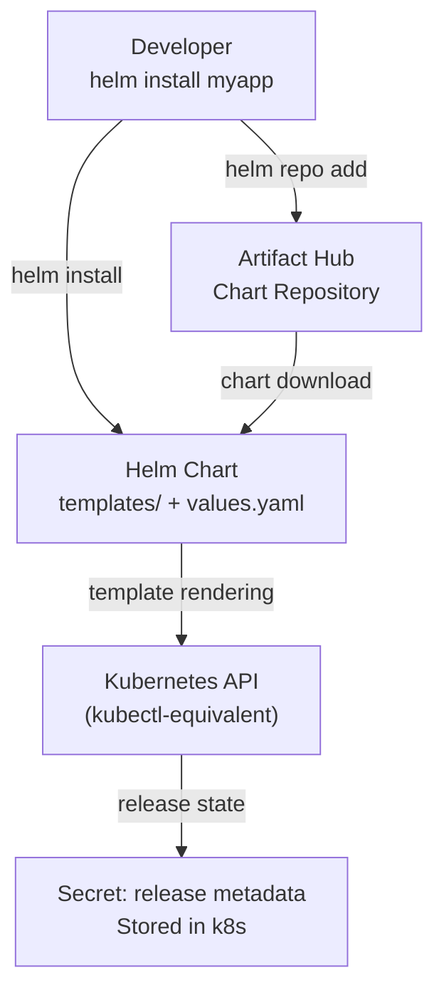
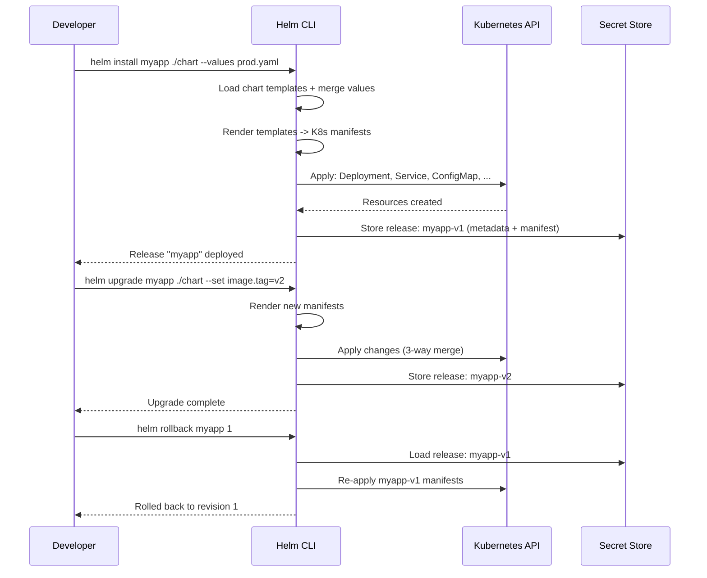

# Helm Charts

## Problem Statement

Understand Helm — the Kubernetes package manager — for templating, versioning, and managing complex multi-resource application deployments.

## Scenario

Helm Charts is a critical component in modern distributed systems. In real-world applications, handling complex business logic at scale with high reliability. For example, major tech companies like Netflix, Uber, and Airbnb rely on similar solutions to handle millions of concurrent users and requests. The challenge is achieving this while maintaining sub-100ms latency, 99.99% availability, and gracefully handling 10x traffic spikes during peak demand. This component provides the foundational capability to solve these challenges reliably and efficiently at global scale.

## Users

- **Backend Engineers**: Responsible for implementing and maintaining this system component in production environments. They need to understand the architecture, trade-offs, failure modes, and operational considerations.
- **DevOps/SRE Teams**: Monitor system health, manage scaling policies, handle incidents, and ensure reliability SLAs are met. They need insights into performance characteristics, bottlenecks, and failure recovery mechanisms.
- **Data Engineers**: Design data pipelines and analytics around this system, requiring deep understanding of data flow, consistency guarantees, and throughput characteristics.
- **System Architects**: Make high-level architectural decisions that impact company infrastructure, requiring comprehensive understanding of capabilities, limitations, and scalability boundaries.
- **Security Teams**: Understand security implications, potential vulnerabilities, and compliance requirements for this component.

## PRD

**Functional Requirements:**
- Correct behavior under all specified operating conditions
- Reliable operation with explicit failure modes
- Data consistency or eventual consistency guarantees as specified
- Clear mechanisms for error handling and recovery
- Monitoring and observability hooks

**Non-Functional Requirements:**
- **Performance**: Sub-100ms P99 latency for standard operations; measure and track tail latencies
- **Availability**: 99.99%+ uptime with automatic failover and graceful degradation
- **Scalability**: Support 10-100x current load with minimal architectural modifications
- **Consistency**: Specify whether strong, eventual, or causal consistency is required
- **Cost Efficiency**: Minimize operational cost per unit of throughput; consider compute, memory, and network costs
- **Operational Simplicity**: Reduce complexity to minimize human error and operational toil

**Constraints:**
- Resource limits (memory for caches, disk for databases, network bandwidth)
- Deployment constraints (cloud provider limits, regulatory requirements)
- Latency budgets (maximum acceptable delay for operations)

## Flow

The typical operational flow for this system involves these key phases:

1. **Request Arrival**: Client/upstream system sends request with required parameters and context
2. **Validation & Routing**: System validates request format, authentication, and routes to correct handler/shard/instance
3. **Core Processing**: Execute the main algorithm, database query, or business logic on the data/state
4. **State Management**: Update internal state (caches, indexes, counters, logs) with proper atomicity and locking
5. **Response Generation**: Format results and return to requester with relevant metadata (timing, version info)
6. **Observability**: Record metrics (latency, throughput, errors), logs (for debugging), and traces (for performance analysis)

This flow repeats thousands or millions of times per second in production. Each operation's efficiency compounds across the entire system, making careful optimization essential. Bottlenecks at any phase can cascade to impact overall system performance.

## Code Explanation

The provided implementations demonstrate key architectural concepts and design patterns:

**Python Implementation**: Uses built-in Python structures and standard library features to express the core logic clearly. Python emphasizes readability and conciseness—each operation's purpose should be obvious without extensive comments. You'll see different implementation approaches (e.g., using OrderedDict vs. manual linked lists) that represent trade-offs between convenience and fine-grained control.

**Java Implementation**: Shows how to implement the same logic with explicit memory management and type safety. Java's strong typing forces clear interface design; you'll see how generics, null safety, mutable state, and thread safety are handled. This implementation style is closer to production systems at scale.

**Key Implementation Patterns**:
- **Initialization**: Setting up core data structures, thread pools, or connection pools with specified capacity and configuration
- **Read Operations**: Fetching data while maintaining O(1) or O(log n) access, updating metadata (access times, hit counts, etc.)
- **Write Operations**: Inserting/updating data while handling eviction policies, balancing tree structures, or replicating state
- **Edge Cases**: Handling capacity limits, concurrent access, data consistency, and error conditions
- **Performance Optimization**: Using techniques like batch operations, lazy evaluation, or caching to reduce latency

Each line of code represents a deliberate choice about performance characteristics, memory usage, safety guarantees, and implementation complexity. Understanding these trade-offs is essential for using this component effectively in production systems.

## Architecture Diagram



## Flow Diagram



## Design

### Chart Structure

```
myapp/
  Chart.yaml          - metadata: name, version, appVersion
  values.yaml         - default configuration values
  templates/
    deployment.yaml   - {{ .Values.image.tag }}, {{ .Release.Name }}
    service.yaml
    ingress.yaml
    configmap.yaml
    _helpers.tpl      - named template partials
  charts/             - dependency sub-charts
  .helmignore         - exclude files from packaging
```

### Templating

```yaml
# templates/deployment.yaml
apiVersion: apps/v1
kind: Deployment
metadata:
  name: {{ include "myapp.fullname" . }}
  labels:
    {{- include "myapp.labels" . | nindent 4 }}
spec:
  replicas: {{ .Values.replicaCount }}
  template:
    spec:
      containers:
        - name: {{ .Chart.Name }}
          image: "{{ .Values.image.repository }}:{{ .Values.image.tag | default .Chart.AppVersion }}"
          {{- if .Values.resources }}
          resources: {{- toYaml .Values.resources | nindent 12 }}
          {{- end }}

# values.yaml
replicaCount: 3
image:
  repository: myapp
  tag: ""  # defaults to Chart.AppVersion
resources:
  requests: {cpu: 100m, memory: 128Mi}
  limits:   {cpu: 500m, memory: 512Mi}
```

### Helm Hooks

```
Hooks run at specific lifecycle points:
  pre-install:  Run before any resources are created
  post-install: Run after all resources are created
  pre-upgrade:  Run before upgrade (e.g., database migration)
  post-upgrade: Run after upgrade (e.g., smoke tests)
  pre-rollback: Run before rollback
  pre-delete:   Run before helm uninstall

Example hook (database migration Job):
  annotations:
    "helm.sh/hook": pre-upgrade
    "helm.sh/hook-weight": "0"
    "helm.sh/hook-delete-policy": hook-succeeded
```

## Common Questions & Answers

**Q: How does Helm track releases?** A: Helm stores release metadata as Kubernetes Secrets (since Helm 3) in the same namespace. Each revision is a separate Secret containing the manifest and metadata. `helm history` reads these Secrets.

**Q: What is the difference between helm upgrade and kubectl apply?** A: Helm uses 3-way strategic merge: current live state + old manifest + new manifest. This handles manual changes better. Helm also manages install vs upgrade lifecycle, hooks, and rollback.

**Q: How do you manage secrets in Helm?** A: Never put secrets in values.yaml (stored in git). Options: (1) helm-secrets plugin (encrypted with SOPS/age). (2) External Secrets Operator (pull from Vault/AWS Secrets Manager). (3) Pass via `--set` at deploy time (CI/CD).

**Q: What is a Helm dependency?** A: Sub-charts listed in `Chart.yaml` dependencies section. `helm dependency update` downloads them to charts/ directory. Example: bitnami/postgresql as a dependency for a web app chart.

**Q: Helm 2 vs Helm 3?** A: Helm 3 removed Tiller (server-side component that was a security risk). Helm 3 uses RBAC directly (client-side). Release state moved from Tiller to Kubernetes Secrets. Helm 3 is the current standard.

## Back-of-Envelope Calculations

```
Template rendering time:
  100 template files -> rendered manifests: <1s
  Large chart (500 templates): ~3s

Release history storage:
  1 release revision Secret: ~50KB (compressed)
  revisionHistoryLimit: 10 revisions x 50KB = 500KB per release
  1000 applications: 500MB in Secrets (trivial for etcd)

Repository update:
  helm repo update: downloads index.yaml (~1MB for large repos)
  At team of 50 developers: 50 x index.yaml downloads = trivial

Rollback speed:
  helm rollback: re-applies old manifests
  Same speed as helm upgrade
  Pod rollout: depends on deployment rolling update config

Helm chart packaging:
  chart directory -> .tgz artifact
  Typical size: 50-200KB (before rendering)
  Push to OCI registry (same as Docker): standard workflow
```

## Design Choices

| Approach | Pros | Cons |
|---|---|---|
| Helm | Templating, rollback, hooks | Templating complexity |
| Kustomize | Pure YAML overlays, no templating | Less powerful composition |
| Helm + Kustomize | Helm chart + kustomize patches | Complex toolchain |
| Plain kubectl | Simple, no abstraction | No rollback, no templating |
| ArgoCD + Helm | GitOps, auto-sync | Requires ArgoCD install |

## Follow-up Questions

1. How do you implement GitOps with Helm and ArgoCD?
2. How do you handle database schema migrations in Helm hooks?
3. What is the difference between `helm template` and `helm install --dry-run`?
4. How do you publish a Helm chart to an OCI registry?
5. How do you manage multiple environments (dev/staging/prod) with one chart?

## Python Implementation

```python
from dataclasses import dataclass, field
from typing import Any, Dict, List, Optional
import re
import json
import copy

@dataclass
class ChartMetadata:
    name: str
    version: str
    app_version: str = "1.0.0"
    description: str = ""

@dataclass
class Release:
    name: str
    namespace: str
    chart: str
    revision: int
    values: Dict[str, Any]
    manifest_summary: List[str]  # List of resource kinds/names
    status: str = "deployed"

class HelmTemplateEngine:
    def render(self, template: str, values: Dict[str, Any], release_name: str, chart: ChartMetadata) -> str:
        context = {
            ".Values": values,
            ".Release.Name": release_name,
            ".Chart.Name": chart.name,
            ".Chart.Version": chart.version,
            ".Chart.AppVersion": chart.app_version,
        }
        result = template
        for key, val in context.items():
            escaped_key = re.escape(key).replace(r"\.", r"\.")
            result = result.replace("{{ " + key + " }}", str(val))
        return result

    def merge_values(self, defaults: Dict, overrides: Dict) -> Dict:
        result = copy.deepcopy(defaults)
        for k, v in overrides.items():
            if isinstance(v, dict) and isinstance(result.get(k), dict):
                result[k] = self.merge_values(result[k], v)
            else:
                result[k] = v
        return result

class HelmReleaseStore:
    def __init__(self):
        self._releases: Dict[str, List[Release]] = {}  # release_name -> [rev1, rev2, ...]

    def store(self, release: Release):
        if release.name not in self._releases:
            self._releases[release.name] = []
        self._releases[release.name].append(release)

    def latest(self, name: str) -> Optional[Release]:
        revisions = self._releases.get(name)
        if not revisions:
            return None
        return max(revisions, key=lambda r: r.revision)

    def get_revision(self, name: str, revision: int) -> Optional[Release]:
        for r in self._releases.get(name, []):
            if r.revision == revision:
                return r
        return None

    def history(self, name: str) -> List[Release]:
        return sorted(self._releases.get(name, []), key=lambda r: r.revision)

class HelmCLI:
    def __init__(self):
        self._store = HelmReleaseStore()
        self._engine = HelmTemplateEngine()

    def install(self, release_name: str, chart: ChartMetadata, default_values: Dict,
                override_values: Dict = None, namespace: str = "default") -> Release:
        values = self._engine.merge_values(default_values, override_values or {})
        manifest_summary = self._render_manifest(release_name, chart, values)
        latest = self._store.latest(release_name)
        revision = (latest.revision + 1) if latest else 1

        release = Release(
            name=release_name, namespace=namespace,
            chart=f"{chart.name}-{chart.version}",
            revision=revision, values=values,
            manifest_summary=manifest_summary
        )
        self._store.store(release)
        action = "Upgraded" if latest else "Installed"
        print(f"[Helm] {action} release {release_name} (revision {revision})")
        for resource in manifest_summary:
            print(f"  -> {resource}")
        return release

    def _render_manifest(self, release_name: str, chart: ChartMetadata, values: Dict) -> List[str]:
        replicas = values.get("replicaCount", 1)
        image = f"{values.get('image', {}).get('repository', 'app')}:{values.get('image', {}).get('tag', chart.app_version)}"
        return [
            f"Deployment/{release_name} (replicas={replicas}, image={image})",
            f"Service/{release_name} (port={values.get('service', {}).get('port', 80)})",
            f"ConfigMap/{release_name}-config",
        ]

    def upgrade(self, release_name: str, chart: ChartMetadata, default_values: Dict,
                set_values: Dict = None) -> Release:
        return self.install(release_name, chart, default_values, set_values)

    def rollback(self, release_name: str, revision: int) -> Optional[Release]:
        target = self._store.get_revision(release_name, revision)
        if not target:
            print(f"[Helm] Revision {revision} not found for {release_name}")
            return None
        # Apply old values as new revision
        return self.install(release_name,
                            ChartMetadata(release_name, "rollback"),
                            target.values)

    def history(self, release_name: str):
        for r in self._store.history(release_name):
            print(f"  Rev {r.revision}: chart={r.chart}, status={r.status}")

# Usage
helm = HelmCLI()
chart = ChartMetadata("myapp", "1.2.0", app_version="v1")

default_values = {
    "replicaCount": 2,
    "image": {"repository": "myapp", "tag": ""},
    "service": {"port": 80},
}

print("=== Install ===")
helm.install("production", chart, default_values,
             override_values={"replicaCount": 3, "image": {"tag": "v1"}})

print("\n=== Upgrade ===")
chart_v2 = ChartMetadata("myapp", "1.3.0", app_version="v2")
helm.upgrade("production", chart_v2, default_values,
             set_values={"image": {"tag": "v2"}, "replicaCount": 5})

print("\n=== History ===")
helm.history("production")

print("\n=== Rollback ===")
helm.rollback("production", revision=1)
```

## Java Implementation

```java
import java.util.*;

public class HelmSimulator {
    record ChartMeta(String name, String version, String appVersion) {}
    record Release(String name, int revision, Map<String, Object> values, String status) {}

    static class HelmStore {
        Map<String, List<Release>> store = new HashMap<>();

        void save(Release r) { store.computeIfAbsent(r.name(), k -> new ArrayList<>()).add(r); }

        Optional<Release> latest(String name) {
            return store.getOrDefault(name, List.of()).stream()
                .max(Comparator.comparingInt(Release::revision));
        }

        List<Release> history(String name) { return store.getOrDefault(name, List.of()); }
    }

    private HelmStore helmStore = new HelmStore();

    void install(String relName, ChartMeta chart, Map<String, Object> values) {
        int rev = helmStore.latest(relName).map(r -> r.revision() + 1).orElse(1);
        Release r = new Release(relName, rev, values, "deployed");
        helmStore.save(r);
        System.out.printf("[Helm] %s deployed revision %d (%s)%n",
            relName, rev, values.get("image"));
    }

    void rollback(String relName, int toRevision) {
        Optional<Release> target = helmStore.history(relName).stream()
            .filter(r -> r.revision() == toRevision).findFirst();
        target.ifPresentOrElse(r -> install(relName, null, r.values()),
            () -> System.out.println("[Helm] Revision not found"));
    }

    void history(String relName) {
        helmStore.history(relName).forEach(r ->
            System.out.printf("  Rev %d: %s%n", r.revision(), r.values().get("image")));
    }

    public static void main(String[] args) {
        HelmSimulator helm = new HelmSimulator();
        helm.install("myapp", new ChartMeta("myapp", "1.0", "v1"), Map.of("image", "myapp:v1", "replicas", 3));
        helm.install("myapp", new ChartMeta("myapp", "1.1", "v2"), Map.of("image", "myapp:v2", "replicas", 5));
        System.out.println("History:"); helm.history("myapp");
        System.out.println("Rollback:"); helm.rollback("myapp", 1);
    }
}
```

## Complexity

| Operation | Time |
|---|---|
| Template rendering | O(templates x values) |
| Values merge | O(keys) |
| Install/upgrade | O(resources) |
| Rollback | O(resources) |
| History lookup | O(revisions) |
