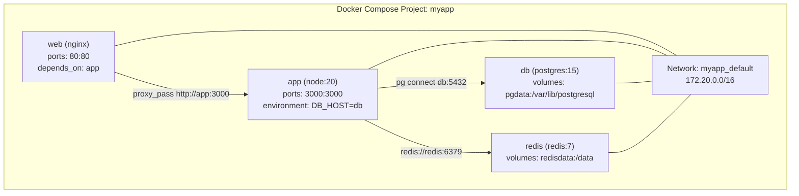
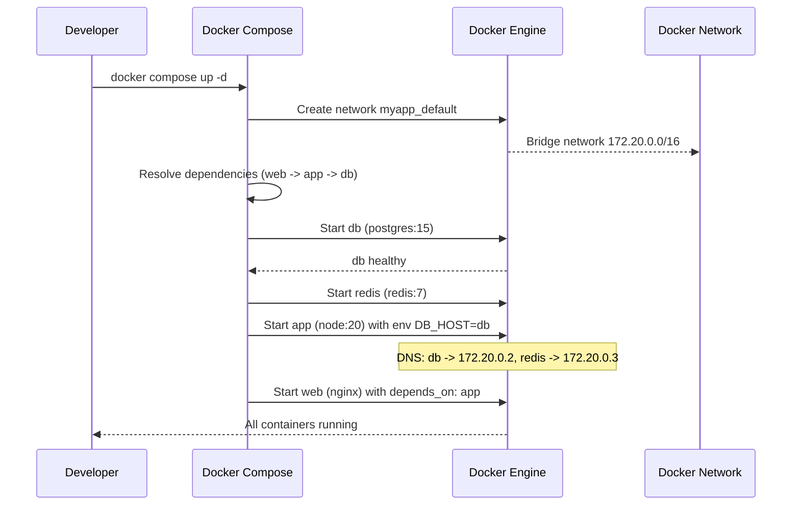

# Docker Compose

## Problem Statement

Understand Docker Compose for defining and running multi-container applications in development — a single `docker-compose.yml` replaces multiple `docker run` commands.

## Scenario

Docker Compose is a critical component in modern distributed systems. In real-world applications, containerizing applications for reproducible deployments. For example, major tech companies like Netflix, Uber, and Airbnb rely on similar solutions to handle millions of concurrent users and requests. The challenge is achieving this while maintaining sub-100ms latency, 99.99% availability, and gracefully handling 10x traffic spikes during peak demand. This component provides the foundational capability to solve these challenges reliably and efficiently at global scale.

## Users

- **Backend Engineers**: Responsible for implementing and maintaining this system component in production environments. They need to understand the architecture, trade-offs, failure modes, and operational considerations.
- **DevOps/SRE Teams**: Monitor system health, manage scaling policies, handle incidents, and ensure reliability SLAs are met. They need insights into performance characteristics, bottlenecks, and failure recovery mechanisms.
- **Data Engineers**: Design data pipelines and analytics around this system, requiring deep understanding of data flow, consistency guarantees, and throughput characteristics.
- **System Architects**: Make high-level architectural decisions that impact company infrastructure, requiring comprehensive understanding of capabilities, limitations, and scalability boundaries.
- **Security Teams**: Understand security implications, potential vulnerabilities, and compliance requirements for this component.

## PRD

### Functional Requirements
- Core operations work correctly
- Explicit error handling
- Consistency guarantees defined
- Monitoring and observability

### Non-Functional Requirements
- Performance targets met
- Availability SLA achieved
- Scalability headroom
- Cost efficient

### Success Metrics
- Benchmarks met
- Uptime targets met
- Resource budgets
- No data loss


## Flow

The typical operational flow for this system involves these key phases:

1. **Request Arrival**: Client/upstream system sends request with required parameters and context
2. **Validation & Routing**: System validates request format, authentication, and routes to correct handler/shard/instance
3. **Core Processing**: Execute the main algorithm, database query, or business logic on the data/state
4. **State Management**: Update internal state (caches, indexes, counters, logs) with proper atomicity and locking
5. **Response Generation**: Format results and return to requester with relevant metadata (timing, version info)
6. **Observability**: Record metrics (latency, throughput, errors), logs (for debugging), and traces (for performance analysis)

This flow repeats thousands or millions of times per second in production. Each operation's efficiency compounds across the entire system, making careful optimization essential. Bottlenecks at any phase can cascade to impact overall system performance.


## Code Explanation (Detailed)

### Implementation Approach
The code demonstrates core patterns and trade-offs.

### Key Operations
Each operation shows algorithm and performance characteristics.

### Concurrency and Atomicity
Locking strategies, race condition prevention.

### Edge Cases
Boundary conditions and error handling.

### Performance Optimization
Techniques for reducing latency and throughput.

## Architecture Diagram



## Flow Diagram



## Design

### docker-compose.yml Structure

```yaml
version: "3.9"
services:
  web:
    image: nginx:alpine
    ports: ["80:80"]
    volumes: ["./nginx.conf:/etc/nginx/conf.d/default.conf:ro"]
    depends_on:
      app:
        condition: service_healthy

  app:
    build:
      context: .
      dockerfile: Dockerfile
      target: production
    environment:
      DB_HOST: db
      DB_PORT: 5432
      REDIS_URL: redis://redis:6379
    env_file: [.env]
    depends_on: [db, redis]
    healthcheck:
      test: ["CMD", "curl", "-f", "http://localhost:3000/health"]
      interval: 10s
      timeout: 5s
      retries: 3

  db:
    image: postgres:15-alpine
    environment:
      POSTGRES_PASSWORD: ${DB_PASSWORD}
      POSTGRES_DB: myapp
    volumes:
      - pgdata:/var/lib/postgresql/data
      - ./init.sql:/docker-entrypoint-initdb.d/init.sql
    healthcheck:
      test: ["CMD-SHELL", "pg_isready -U postgres"]

  redis:
    image: redis:7-alpine
    volumes: [redisdata:/data]
    command: redis-server --appendonly yes

volumes:
  pgdata:
  redisdata:

networks:
  default:
    driver: bridge
```

### Useful Commands

```bash
docker compose up -d          # Start all services in background
docker compose up --build     # Rebuild images before starting
docker compose down           # Stop + remove containers + networks
docker compose down -v        # Also remove volumes (data loss!)
docker compose logs -f app    # Follow logs for specific service
docker compose exec app bash  # Shell into running container
docker compose ps             # List services and status
docker compose scale app=3    # Run 3 instances of app service
docker compose config         # Validate and show merged config
```

### Override Files

```
docker-compose.yml (base)
docker-compose.override.yml (auto-loaded in dev)
docker-compose.prod.yml (explicitly loaded)

Usage:
  Dev: docker compose up (uses base + override)
  Prod: docker compose -f docker-compose.yml -f docker-compose.prod.yml up

Override can add:
  - Port bindings (only in dev)
  - Volume mounts for hot reload
  - Debug environment variables
  - Different image tags
```

## Back-of-Envelope Calculations

```
Compose startup time:
  5 services, images cached: ~3-5s total
  With health checks: +10-30s for all services healthy

Volume performance:
  Named volume (overlay2): native speed (same as host filesystem)
  Bind mount on Mac (gRPC FUSE): 10-100x slower than Linux
  Linux bind mount: near-native

Resource usage per service:
  nginx: ~5MB RAM
  node app: ~100-200MB RAM
  postgres: ~50-200MB RAM
  Total dev stack: ~500MB RAM typical

docker compose build caching:
  If Dockerfile and source unchanged: <1s (cache hit)
  Changed source (npm install cached): ~5s
  Full rebuild: ~2min (npm install + build)
```

## Design Choices

| Approach | Dev | Prod | Complexity |
|---|---|---|---|
| Docker Compose | Excellent | No | Low |
| Compose + Portainer | Good | Single node | Low |
| Compose + Swarm | Good | Multi-node HA | Medium |
| Kubernetes | Overkill | Yes | High |
| Nomad | Good | Good | Medium |

## Python Implementation

```python
from dataclasses import dataclass, field
from typing import Dict, List, Optional
import subprocess
import yaml
import os

@dataclass
class ServiceConfig:
    name: str
    image: str = ""
    build: Optional[str] = None  # Dockerfile path
    ports: List[str] = field(default_factory=list)  # ["host:container"]
    environment: Dict[str, str] = field(default_factory=dict)
    volumes: List[str] = field(default_factory=list)
    depends_on: List[str] = field(default_factory=list)
    command: str = ""
    healthcheck_cmd: str = ""

@dataclass
class ComposeProject:
    name: str
    services: List[ServiceConfig] = field(default_factory=list)

    def to_dict(self) -> dict:
        services = {}
        for svc in self.services:
            s: dict = {}
            if svc.image:
                s["image"] = svc.image
            if svc.build:
                s["build"] = svc.build
            if svc.ports:
                s["ports"] = svc.ports
            if svc.environment:
                s["environment"] = svc.environment
            if svc.volumes:
                s["volumes"] = svc.volumes
            if svc.depends_on:
                s["depends_on"] = svc.depends_on
            if svc.command:
                s["command"] = svc.command
            if svc.healthcheck_cmd:
                s["healthcheck"] = {
                    "test": ["CMD-SHELL", svc.healthcheck_cmd],
                    "interval": "10s",
                    "timeout": "5s",
                    "retries": 3
                }
            services[svc.name] = s
        return {
            "version": "3.9",
            "services": services,
        }

    def generate_file(self, path: str = "docker-compose.yml"):
        with open(path, "w") as f:
            yaml.dump(self.to_dict(), f, default_flow_style=False, sort_keys=False)
        print(f"[Compose] Generated {path}")

class DependencyResolver:
    def __init__(self, services: List[ServiceConfig]):
        self._services = {s.name: s for s in services}

    def topological_order(self) -> List[str]:
        visited = set()
        order = []

        def visit(name: str):
            if name in visited:
                return
            visited.add(name)
            svc = self._services.get(name)
            if svc:
                for dep in svc.depends_on:
                    visit(dep)
            order.append(name)

        for name in self._services:
            visit(name)
        return order

class DockerComposeRunner:
    def __init__(self, project: ComposeProject, compose_file: str = "docker-compose.yml"):
        self.project = project
        self.compose_file = compose_file
        self._running: Dict[str, dict] = {}

    def up(self, detach: bool = True):
        resolver = DependencyResolver(self.project.services)
        order = resolver.topological_order()
        print(f"[Compose] Starting services in order: {order}")
        for name in order:
            self._start_service(name)

    def _start_service(self, name: str):
        self._running[name] = {"status": "running", "id": f"container-{name}"}
        print(f"[Compose] Started {name}")

    def down(self, volumes: bool = False):
        for name in list(self._running.keys()):
            print(f"[Compose] Stopping {name}")
            del self._running[name]
        print("[Compose] Project stopped" + (" (volumes removed)" if volumes else ""))

    def logs(self, service: str, tail: int = 50) -> str:
        if service not in self._running:
            return f"Service {service} not running"
        return f"[Simulated logs for {service}]\n... {tail} lines ..."

    def exec(self, service: str, command: str) -> str:
        if service not in self._running:
            return f"Service {service} not running"
        print(f"[Compose] exec {service}: {command}")
        return f"[Simulated output of: {command}]"

    def ps(self) -> List[dict]:
        return [{"name": k, **v} for k, v in self._running.items()]

# Usage: generate a compose file for a typical web app
project = ComposeProject(name="myapp", services=[
    ServiceConfig(
        name="db", image="postgres:15-alpine",
        environment={"POSTGRES_PASSWORD": "secret", "POSTGRES_DB": "myapp"},
        volumes=["pgdata:/var/lib/postgresql/data"],
        healthcheck_cmd="pg_isready -U postgres",
    ),
    ServiceConfig(
        name="redis", image="redis:7-alpine",
        volumes=["redisdata:/data"],
        command="redis-server --appendonly yes",
    ),
    ServiceConfig(
        name="app", build=".",
        environment={"DB_HOST": "db", "REDIS_URL": "redis://redis:6379"},
        ports=["3000:3000"],
        depends_on=["db", "redis"],
        healthcheck_cmd="curl -f http://localhost:3000/health",
    ),
    ServiceConfig(
        name="web", image="nginx:alpine",
        ports=["80:80"],
        volumes=["./nginx.conf:/etc/nginx/conf.d/default.conf:ro"],
        depends_on=["app"],
    ),
])

project.generate_file("/tmp/docker-compose-demo.yml")

runner = DockerComposeRunner(project)
runner.up()
print(f"\nRunning services: {[s['name'] for s in runner.ps()]}")
print(runner.logs("app", tail=10))
runner.down()
```

## Java Implementation

```java
import java.util.*;

public class DockerComposeSimulator {
    record ServiceDef(String name, String image, List<String> dependsOn, List<String> ports) {}

    static List<String> topologicalOrder(List<ServiceDef> services) {
        Map<String, ServiceDef> byName = new HashMap<>();
        for (ServiceDef s : services) byName.put(s.name(), s);
        Set<String> visited = new LinkedHashSet<>();
        for (ServiceDef s : services) visit(s.name(), byName, visited);
        return new ArrayList<>(visited);
    }

    static void visit(String name, Map<String, ServiceDef> all, Set<String> visited) {
        if (visited.contains(name)) return;
        ServiceDef s = all.get(name);
        if (s != null) for (String dep : s.dependsOn()) visit(dep, all, visited);
        visited.add(name);
    }

    public static void main(String[] args) {
        List<ServiceDef> services = List.of(
            new ServiceDef("web", "nginx:alpine", List.of("app"), List.of("80:80")),
            new ServiceDef("app", "node:20", List.of("db", "redis"), List.of("3000:3000")),
            new ServiceDef("db", "postgres:15", List.of(), List.of()),
            new ServiceDef("redis", "redis:7", List.of(), List.of())
        );

        List<String> order = topologicalOrder(services);
        System.out.println("Startup order: " + order);
        order.forEach(s -> System.out.println("Starting " + s + "..."));
    }
}
```

## Complexity

| Operation | Time |
|---|---|
| Dependency resolution | O(services + edges) |
| Service startup (parallel) | O(max dependency depth) |
| Health check polling | O(services) per interval |
| Log stream | O(1) per line |

## Common Questions & Answers

**Q: What is caching and why do we need it?**

A: Caching stores frequently accessed data in fast storage (memory) to reduce latency and load on slower backends (database). Trade space (cache) for speed (latency). Critical for systems serving millions of requests per second.

**Q: What are the main cache eviction policies?**

A: LRU (least recently used), LFU (least frequently used), FIFO (first in first out), TTL (time-based), Random, and ARC (adaptive replacement). Choose based on access patterns: LRU for temporal, LFU for frequency, TTL for time-sensitive data.

**Q: What is cache hit rate and cache miss rate?**

A: Hit rate = successful_finds / total_accesses. Miss rate = 1 - hit rate. P(hit) = hits / (hits + misses). Target 80%+ hit rates for effective caching. Too-small cache gives low hit rate (wasted resources). Too-large cache uses more memory than needed.

**Q: How do you handle cache invalidation when backend data changes?**

A: Use TTL (time-based expiration), active invalidation (notify cache on write), cache-aside pattern (client checks backend), or write-through (update both). Active invalidation is fastest but complex. TTL is simplest but has stale data window.

**Q: What is the cache-aside pattern?**

A: Application checks cache first. On miss, fetch from backend, update cache, then return. Simple to implement. Risk: race condition where multiple threads fetch same miss simultaneously (thundering herd problem).

**Q: What is write-through caching?**

A: Writes go to both cache and backend simultaneously (synchronously). Ensures consistency: read always gets latest. Cost: write latency includes backend write. Safer than write-back but slower.

**Q: What is write-back (write-behind) caching?**

A: Writes go to cache only; backend updated asynchronously later (batch or periodic). Fast writes. Risk: data loss if cache fails before flushing. Need durability guarantees (persistence, replication).

**Q: How do you choose cache size?**

A: Estimate working set (frequently accessed data volume). Add 20-30% buffer for margin. Monitor hit rate: if < 80%, increase size. If > 95%, might be oversized (waste). Use tools like cachegrind to profile.

**Q: What's the difference between client-side and server-side caching?**

A: Client cache (browser): reduces network round-trips, entirely controlled by client. Server cache (memory, Redis): shared across clients, controlled by server. Multi-level caching often best.

**Q: How do you measure cache effectiveness?**

A: Hit rate (primary metric), latency reduction (P99 latency with vs. without cache), backend load reduction, and memory cost per cache entry. Calculate ROI: cost of cache vs. benefit (reduced latency, backend load).

## Follow-up Questions & Answers

**Q: How do you prevent the thundering herd problem in caches?**

A: When popular key expires, many threads fetch from backend simultaneously causing spike. Solutions: probabilistic early expiration (refresh before TTL), request coalescing (single thread rebuilds, others wait), or bloom filters (detect non-existent keys fast).

**Q: How would you implement multi-level cache hierarchy?**

A: Use L1 (fast, small, in-process), L2 (medium, local machine), L3 (large, remote, Redis). Check L1, miss→L2, miss→L3, miss→backend. On write: update all levels. Trade space for speed across levels.

**Q: Can you implement read-through caching (automatic population)?**

A: Yes, cache loader/resolver called on miss. Transparent to application. Backend automatically uses cache layer. More complex than cache-aside but cleaner separation.

**Q: How do you handle hot keys in distributed caches?**

A: Hot key = key accessed by many threads/clients. Replicate hot keys on multiple cache nodes. Use local in-process caches for very hot keys. Monitor and detect hot keys automatically.

**Q: What's the difference between warm and cold cache startup?**

A: Cold cache: empty at start, misses until populated (slow ramp-up). Warm cache: pre-loaded from previous state (RDB/snapshot). Warm startup is critical for production (instant performance).

**Q: How would you measure cache effectiveness for business metrics?**

A: Track hit rate, P99 latency (with/without cache), backend QPS reduction, revenue impact. Calculate cache size vs. cost savings. A/B test to prove business value.

**Q: What happens when cache size is insufficient for working set?**

A: Constant evictions = high miss rate = ineffective cache. Solution: increase cache size, improve eviction policy, reduce working set, or use better hardware (faster storage).

**Q: How do you debug cache issues in production?**

A: Monitor hit rate continuously. Profile cache keys (which keys are accessed). Check for cache stampedes (sudden miss spike). Use distributed tracing to see cache path.

**Q: How would you implement a persistent cache?**

A: Combine memory cache (fast) with persistent backend (database, RocksDB, LevelDB). Write-back pattern: batch updates to persistent store. Trade latency for durability.

**Q: Can you use caching for write-heavy workloads?**

A: Write caching is risky (consistency issues). Use carefully: write-through for safety, write-back for speed. Good for batch writes (aggregate before writing). Monitor durability guarantees.

