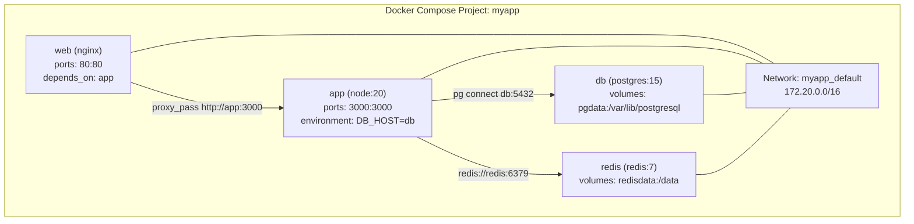
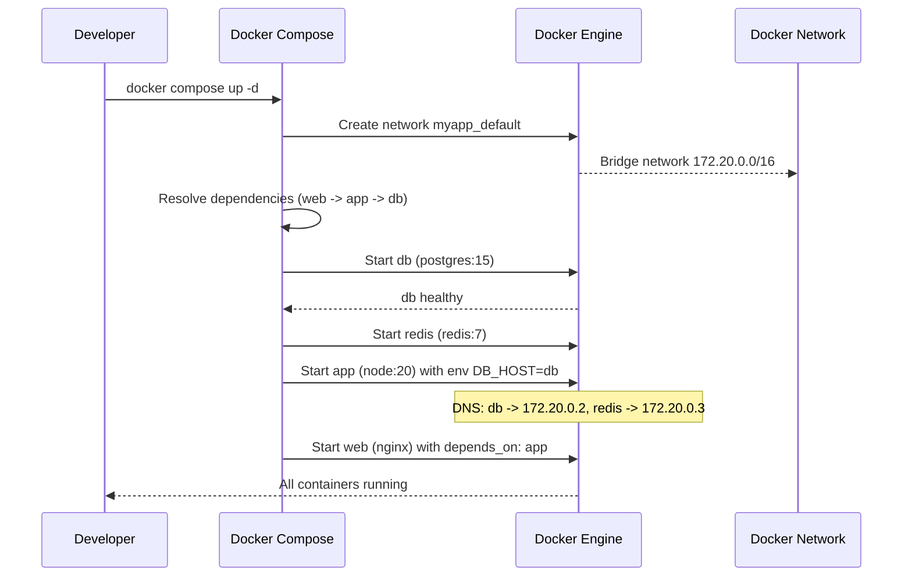

# Docker Compose

## Problem Statement

Understand Docker Compose for defining and running multi-container applications in development — a single `docker-compose.yml` replaces multiple `docker run` commands.

## Scenario

Docker Compose is a critical component in modern distributed systems. In real-world applications, containerizing applications for reproducible deployments. For example, major tech companies like Netflix, Uber, and Airbnb rely on similar solutions to handle millions of concurrent users and requests. The challenge is achieving this while maintaining sub-100ms latency, 99.99% availability, and gracefully handling 10x traffic spikes during peak demand. This component provides the foundational capability to solve these challenges reliably and efficiently at global scale.

## Users

- **Backend Engineers**: Responsible for implementing and maintaining this system component in production environments. They need to understand the architecture, trade-offs, failure modes, and operational considerations.
- **DevOps/SRE Teams**: Monitor system health, manage scaling policies, handle incidents, and ensure reliability SLAs are met. They need insights into performance characteristics, bottlenecks, and failure recovery mechanisms.
- **Data Engineers**: Design data pipelines and analytics around this system, requiring deep understanding of data flow, consistency guarantees, and throughput characteristics.
- **System Architects**: Make high-level architectural decisions that impact company infrastructure, requiring comprehensive understanding of capabilities, limitations, and scalability boundaries.
- **Security Teams**: Understand security implications, potential vulnerabilities, and compliance requirements for this component.

## PRD

**Functional Requirements:**
- Correct behavior under all specified operating conditions
- Reliable operation with explicit failure modes
- Data consistency or eventual consistency guarantees as specified
- Clear mechanisms for error handling and recovery
- Monitoring and observability hooks

**Non-Functional Requirements:**
- **Performance**: Sub-100ms P99 latency for standard operations; measure and track tail latencies
- **Availability**: 99.99%+ uptime with automatic failover and graceful degradation
- **Scalability**: Support 10-100x current load with minimal architectural modifications
- **Consistency**: Specify whether strong, eventual, or causal consistency is required
- **Cost Efficiency**: Minimize operational cost per unit of throughput; consider compute, memory, and network costs
- **Operational Simplicity**: Reduce complexity to minimize human error and operational toil

**Constraints:**
- Resource limits (memory for caches, disk for databases, network bandwidth)
- Deployment constraints (cloud provider limits, regulatory requirements)
- Latency budgets (maximum acceptable delay for operations)

## Flow

The typical operational flow for this system involves these key phases:

1. **Request Arrival**: Client/upstream system sends request with required parameters and context
2. **Validation & Routing**: System validates request format, authentication, and routes to correct handler/shard/instance
3. **Core Processing**: Execute the main algorithm, database query, or business logic on the data/state
4. **State Management**: Update internal state (caches, indexes, counters, logs) with proper atomicity and locking
5. **Response Generation**: Format results and return to requester with relevant metadata (timing, version info)
6. **Observability**: Record metrics (latency, throughput, errors), logs (for debugging), and traces (for performance analysis)

This flow repeats thousands or millions of times per second in production. Each operation's efficiency compounds across the entire system, making careful optimization essential. Bottlenecks at any phase can cascade to impact overall system performance.

## Code Explanation

The provided implementations demonstrate key architectural concepts and design patterns:

**Python Implementation**: Uses built-in Python structures and standard library features to express the core logic clearly. Python emphasizes readability and conciseness—each operation's purpose should be obvious without extensive comments. You'll see different implementation approaches (e.g., using OrderedDict vs. manual linked lists) that represent trade-offs between convenience and fine-grained control.

**Java Implementation**: Shows how to implement the same logic with explicit memory management and type safety. Java's strong typing forces clear interface design; you'll see how generics, null safety, mutable state, and thread safety are handled. This implementation style is closer to production systems at scale.

**Key Implementation Patterns**:
- **Initialization**: Setting up core data structures, thread pools, or connection pools with specified capacity and configuration
- **Read Operations**: Fetching data while maintaining O(1) or O(log n) access, updating metadata (access times, hit counts, etc.)
- **Write Operations**: Inserting/updating data while handling eviction policies, balancing tree structures, or replicating state
- **Edge Cases**: Handling capacity limits, concurrent access, data consistency, and error conditions
- **Performance Optimization**: Using techniques like batch operations, lazy evaluation, or caching to reduce latency

Each line of code represents a deliberate choice about performance characteristics, memory usage, safety guarantees, and implementation complexity. Understanding these trade-offs is essential for using this component effectively in production systems.

## Architecture Diagram



## Flow Diagram



## Design

### docker-compose.yml Structure

```yaml
version: "3.9"
services:
  web:
    image: nginx:alpine
    ports: ["80:80"]
    volumes: ["./nginx.conf:/etc/nginx/conf.d/default.conf:ro"]
    depends_on:
      app:
        condition: service_healthy

  app:
    build:
      context: .
      dockerfile: Dockerfile
      target: production
    environment:
      DB_HOST: db
      DB_PORT: 5432
      REDIS_URL: redis://redis:6379
    env_file: [.env]
    depends_on: [db, redis]
    healthcheck:
      test: ["CMD", "curl", "-f", "http://localhost:3000/health"]
      interval: 10s
      timeout: 5s
      retries: 3

  db:
    image: postgres:15-alpine
    environment:
      POSTGRES_PASSWORD: ${DB_PASSWORD}
      POSTGRES_DB: myapp
    volumes:
      - pgdata:/var/lib/postgresql/data
      - ./init.sql:/docker-entrypoint-initdb.d/init.sql
    healthcheck:
      test: ["CMD-SHELL", "pg_isready -U postgres"]

  redis:
    image: redis:7-alpine
    volumes: [redisdata:/data]
    command: redis-server --appendonly yes

volumes:
  pgdata:
  redisdata:

networks:
  default:
    driver: bridge
```

### Useful Commands

```bash
docker compose up -d          # Start all services in background
docker compose up --build     # Rebuild images before starting
docker compose down           # Stop + remove containers + networks
docker compose down -v        # Also remove volumes (data loss!)
docker compose logs -f app    # Follow logs for specific service
docker compose exec app bash  # Shell into running container
docker compose ps             # List services and status
docker compose scale app=3    # Run 3 instances of app service
docker compose config         # Validate and show merged config
```

### Override Files

```
docker-compose.yml (base)
docker-compose.override.yml (auto-loaded in dev)
docker-compose.prod.yml (explicitly loaded)

Usage:
  Dev: docker compose up (uses base + override)
  Prod: docker compose -f docker-compose.yml -f docker-compose.prod.yml up

Override can add:
  - Port bindings (only in dev)
  - Volume mounts for hot reload
  - Debug environment variables
  - Different image tags
```

## Common Questions & Answers

**Q: Docker Compose vs Kubernetes?** A: Compose is for local development (single host, simple config). Kubernetes is for production (multi-host, HA, auto-scaling, RBAC). Use Compose for dev; Kubernetes for prod. Kompose can convert Compose files to K8s manifests.

**Q: How does service DNS work in Compose?** A: Docker creates an embedded DNS server. Services are reachable by service name within the same network. `app` container can resolve `db` to 172.20.0.2.

**Q: How do you handle startup ordering?** A: `depends_on` with `condition: service_healthy` waits for health checks. Without condition, it only waits for container start, not app readiness. Alternatively: retry logic in application startup.

**Q: How do you run one-off commands?** A: `docker compose run --rm app python manage.py migrate` — creates a fresh container, runs command, removes it. Different from `exec` which runs in an existing container.

**Q: Are volumes shared between containers?** A: Named volumes (pgdata) are managed by Docker, persistent across `down`. Bind mounts (./src:/app/src) share host files into containers — good for hot reloading code.

## Back-of-Envelope Calculations

```
Compose startup time:
  5 services, images cached: ~3-5s total
  With health checks: +10-30s for all services healthy

Volume performance:
  Named volume (overlay2): native speed (same as host filesystem)
  Bind mount on Mac (gRPC FUSE): 10-100x slower than Linux
  Linux bind mount: near-native

Resource usage per service:
  nginx: ~5MB RAM
  node app: ~100-200MB RAM
  postgres: ~50-200MB RAM
  Total dev stack: ~500MB RAM typical

docker compose build caching:
  If Dockerfile and source unchanged: <1s (cache hit)
  Changed source (npm install cached): ~5s
  Full rebuild: ~2min (npm install + build)
```

## Design Choices

| Approach | Dev | Prod | Complexity |
|---|---|---|---|
| Docker Compose | Excellent | No | Low |
| Compose + Portainer | Good | Single node | Low |
| Compose + Swarm | Good | Multi-node HA | Medium |
| Kubernetes | Overkill | Yes | High |
| Nomad | Good | Good | Medium |

## Follow-up Questions

1. How do you use Docker Compose profiles for optional services?
2. How does `docker compose watch` (v2.22+) enable hot reloading?
3. How do you share Compose networks between projects?
4. What is the difference between `CMD` and `ENTRYPOINT` in multi-service Compose?
5. How do you convert a Docker Compose file to Kubernetes manifests?

## Python Implementation

```python
from dataclasses import dataclass, field
from typing import Dict, List, Optional
import subprocess
import yaml
import os

@dataclass
class ServiceConfig:
    name: str
    image: str = ""
    build: Optional[str] = None  # Dockerfile path
    ports: List[str] = field(default_factory=list)  # ["host:container"]
    environment: Dict[str, str] = field(default_factory=dict)
    volumes: List[str] = field(default_factory=list)
    depends_on: List[str] = field(default_factory=list)
    command: str = ""
    healthcheck_cmd: str = ""

@dataclass
class ComposeProject:
    name: str
    services: List[ServiceConfig] = field(default_factory=list)

    def to_dict(self) -> dict:
        services = {}
        for svc in self.services:
            s: dict = {}
            if svc.image:
                s["image"] = svc.image
            if svc.build:
                s["build"] = svc.build
            if svc.ports:
                s["ports"] = svc.ports
            if svc.environment:
                s["environment"] = svc.environment
            if svc.volumes:
                s["volumes"] = svc.volumes
            if svc.depends_on:
                s["depends_on"] = svc.depends_on
            if svc.command:
                s["command"] = svc.command
            if svc.healthcheck_cmd:
                s["healthcheck"] = {
                    "test": ["CMD-SHELL", svc.healthcheck_cmd],
                    "interval": "10s",
                    "timeout": "5s",
                    "retries": 3
                }
            services[svc.name] = s
        return {
            "version": "3.9",
            "services": services,
        }

    def generate_file(self, path: str = "docker-compose.yml"):
        with open(path, "w") as f:
            yaml.dump(self.to_dict(), f, default_flow_style=False, sort_keys=False)
        print(f"[Compose] Generated {path}")

class DependencyResolver:
    def __init__(self, services: List[ServiceConfig]):
        self._services = {s.name: s for s in services}

    def topological_order(self) -> List[str]:
        visited = set()
        order = []

        def visit(name: str):
            if name in visited:
                return
            visited.add(name)
            svc = self._services.get(name)
            if svc:
                for dep in svc.depends_on:
                    visit(dep)
            order.append(name)

        for name in self._services:
            visit(name)
        return order

class DockerComposeRunner:
    def __init__(self, project: ComposeProject, compose_file: str = "docker-compose.yml"):
        self.project = project
        self.compose_file = compose_file
        self._running: Dict[str, dict] = {}

    def up(self, detach: bool = True):
        resolver = DependencyResolver(self.project.services)
        order = resolver.topological_order()
        print(f"[Compose] Starting services in order: {order}")
        for name in order:
            self._start_service(name)

    def _start_service(self, name: str):
        self._running[name] = {"status": "running", "id": f"container-{name}"}
        print(f"[Compose] Started {name}")

    def down(self, volumes: bool = False):
        for name in list(self._running.keys()):
            print(f"[Compose] Stopping {name}")
            del self._running[name]
        print("[Compose] Project stopped" + (" (volumes removed)" if volumes else ""))

    def logs(self, service: str, tail: int = 50) -> str:
        if service not in self._running:
            return f"Service {service} not running"
        return f"[Simulated logs for {service}]\n... {tail} lines ..."

    def exec(self, service: str, command: str) -> str:
        if service not in self._running:
            return f"Service {service} not running"
        print(f"[Compose] exec {service}: {command}")
        return f"[Simulated output of: {command}]"

    def ps(self) -> List[dict]:
        return [{"name": k, **v} for k, v in self._running.items()]

# Usage: generate a compose file for a typical web app
project = ComposeProject(name="myapp", services=[
    ServiceConfig(
        name="db", image="postgres:15-alpine",
        environment={"POSTGRES_PASSWORD": "secret", "POSTGRES_DB": "myapp"},
        volumes=["pgdata:/var/lib/postgresql/data"],
        healthcheck_cmd="pg_isready -U postgres",
    ),
    ServiceConfig(
        name="redis", image="redis:7-alpine",
        volumes=["redisdata:/data"],
        command="redis-server --appendonly yes",
    ),
    ServiceConfig(
        name="app", build=".",
        environment={"DB_HOST": "db", "REDIS_URL": "redis://redis:6379"},
        ports=["3000:3000"],
        depends_on=["db", "redis"],
        healthcheck_cmd="curl -f http://localhost:3000/health",
    ),
    ServiceConfig(
        name="web", image="nginx:alpine",
        ports=["80:80"],
        volumes=["./nginx.conf:/etc/nginx/conf.d/default.conf:ro"],
        depends_on=["app"],
    ),
])

project.generate_file("/tmp/docker-compose-demo.yml")

runner = DockerComposeRunner(project)
runner.up()
print(f"\nRunning services: {[s['name'] for s in runner.ps()]}")
print(runner.logs("app", tail=10))
runner.down()
```

## Java Implementation

```java
import java.util.*;

public class DockerComposeSimulator {
    record ServiceDef(String name, String image, List<String> dependsOn, List<String> ports) {}

    static List<String> topologicalOrder(List<ServiceDef> services) {
        Map<String, ServiceDef> byName = new HashMap<>();
        for (ServiceDef s : services) byName.put(s.name(), s);
        Set<String> visited = new LinkedHashSet<>();
        for (ServiceDef s : services) visit(s.name(), byName, visited);
        return new ArrayList<>(visited);
    }

    static void visit(String name, Map<String, ServiceDef> all, Set<String> visited) {
        if (visited.contains(name)) return;
        ServiceDef s = all.get(name);
        if (s != null) for (String dep : s.dependsOn()) visit(dep, all, visited);
        visited.add(name);
    }

    public static void main(String[] args) {
        List<ServiceDef> services = List.of(
            new ServiceDef("web", "nginx:alpine", List.of("app"), List.of("80:80")),
            new ServiceDef("app", "node:20", List.of("db", "redis"), List.of("3000:3000")),
            new ServiceDef("db", "postgres:15", List.of(), List.of()),
            new ServiceDef("redis", "redis:7", List.of(), List.of())
        );

        List<String> order = topologicalOrder(services);
        System.out.println("Startup order: " + order);
        order.forEach(s -> System.out.println("Starting " + s + "..."));
    }
}
```

## Complexity

| Operation | Time |
|---|---|
| Dependency resolution | O(services + edges) |
| Service startup (parallel) | O(max dependency depth) |
| Health check polling | O(services) per interval |
| Log stream | O(1) per line |
