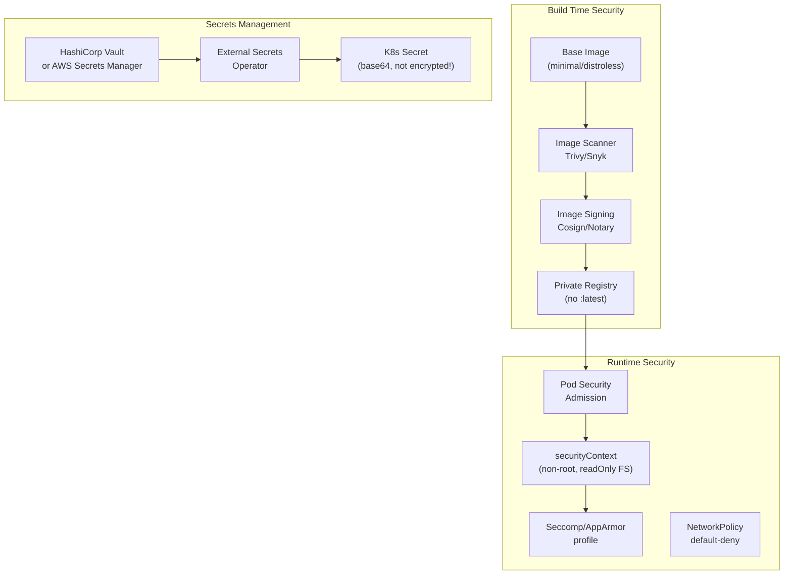
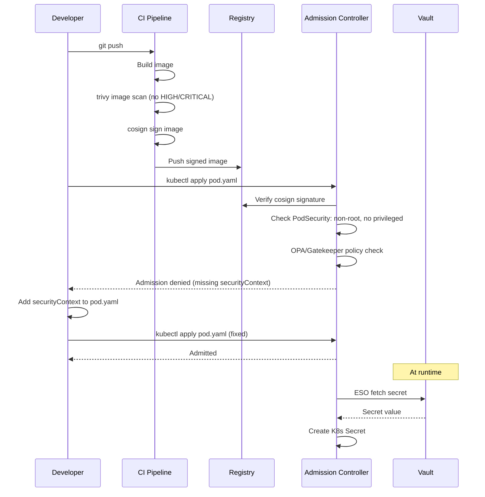

# Container Security

## Problem Statement

Design a secure container runtime environment covering image security, runtime hardening, secrets management, and Kubernetes RBAC to minimize attack surface and blast radius of compromised containers.

## Scenario

Container Security is a critical component in modern distributed systems. In real-world applications, handling complex business logic at scale with high reliability. For example, major tech companies like Netflix, Uber, and Airbnb rely on similar solutions to handle millions of concurrent users and requests. The challenge is achieving this while maintaining sub-100ms latency, 99.99% availability, and gracefully handling 10x traffic spikes during peak demand. This component provides the foundational capability to solve these challenges reliably and efficiently at global scale.

## Users

- **Backend Engineers**: Responsible for implementing and maintaining this system component in production environments. They need to understand the architecture, trade-offs, failure modes, and operational considerations.
- **DevOps/SRE Teams**: Monitor system health, manage scaling policies, handle incidents, and ensure reliability SLAs are met. They need insights into performance characteristics, bottlenecks, and failure recovery mechanisms.
- **Data Engineers**: Design data pipelines and analytics around this system, requiring deep understanding of data flow, consistency guarantees, and throughput characteristics.
- **System Architects**: Make high-level architectural decisions that impact company infrastructure, requiring comprehensive understanding of capabilities, limitations, and scalability boundaries.
- **Security Teams**: Understand security implications, potential vulnerabilities, and compliance requirements for this component.

## PRD

### Functional Requirements
- Core operations work correctly
- Explicit error handling
- Consistency guarantees defined
- Monitoring and observability

### Non-Functional Requirements
- Performance targets met
- Availability SLA achieved
- Scalability headroom
- Cost efficient

### Success Metrics
- Benchmarks met
- Uptime targets met
- Resource budgets
- No data loss


## Flow

The typical operational flow for this system involves these key phases:

1. **Request Arrival**: Client/upstream system sends request with required parameters and context
2. **Validation & Routing**: System validates request format, authentication, and routes to correct handler/shard/instance
3. **Core Processing**: Execute the main algorithm, database query, or business logic on the data/state
4. **State Management**: Update internal state (caches, indexes, counters, logs) with proper atomicity and locking
5. **Response Generation**: Format results and return to requester with relevant metadata (timing, version info)
6. **Observability**: Record metrics (latency, throughput, errors), logs (for debugging), and traces (for performance analysis)

This flow repeats thousands or millions of times per second in production. Each operation's efficiency compounds across the entire system, making careful optimization essential. Bottlenecks at any phase can cascade to impact overall system performance.


## Code Explanation (Detailed)

### Implementation Approach
The code demonstrates core patterns and trade-offs.

### Key Operations
Each operation shows algorithm and performance characteristics.

### Concurrency and Atomicity
Locking strategies, race condition prevention.

### Edge Cases
Boundary conditions and error handling.

### Performance Optimization
Techniques for reducing latency and throughput.

## Architecture Diagram



## Flow Diagram



## Design

### Container Hardening

```yaml
# Secure pod security context
spec:
  securityContext:
    runAsNonRoot: true
    runAsUser: 1000
    runAsGroup: 3000
    fsGroup: 2000
    seccompProfile:
      type: RuntimeDefault  # Restrict syscalls

  containers:
    - name: app
      securityContext:
        allowPrivilegeEscalation: false
        readOnlyRootFilesystem: true
        capabilities:
          drop: ["ALL"]
          add: []  # Add only what's needed (NET_BIND_SERVICE for port 80)
      volumeMounts:
        - name: tmp
          mountPath: /tmp  # Writable temp dir
  
  volumes:
    - name: tmp
      emptyDir: {}
```

### Pod Security Admission (replaces PodSecurityPolicy)

```
Three profiles:
  Privileged: No restrictions (system components only)
  Baseline:   Prevents known privilege escalations
  Restricted: Strongly hardened (non-root, no capabilities)

Enforce per namespace:
  kubectl label namespace production \
    pod-security.kubernetes.io/enforce=restricted \
    pod-security.kubernetes.io/enforce-version=v1.28
```

### Secrets Best Practices

```
NEVER:
  - Secrets in environment variables (visible in ps, logs, crash dumps)
  - Secrets in ConfigMaps (unencrypted)
  - Secrets in Docker image layers (docker history exposes them)
  - secrets in git

USE:
  External Secrets Operator + Vault/AWS Secrets Manager:
    - Secret values never stored in git
    - Automatic rotation
    - Audit trail

  Secret as volume mount (preferred over env vars):
    - File permissions controllable
    - Harder to leak in logs
    - Volume: secretName: db-credentials
```

### RBAC Least Privilege

```yaml
# Service account for application
apiVersion: v1
kind: ServiceAccount
metadata:
  name: myapp
  namespace: production
automountServiceAccountToken: false  # Disable unless needed

---
# Role: only what this app needs
kind: Role
rules:
  - apiGroups: [""]
    resources: ["configmaps"]
    verbs: ["get", "list"]  # Read only, not create/delete/update

---
# Bind role to service account
kind: RoleBinding
subjects:
  - kind: ServiceAccount
    name: myapp
```

## Back-of-Envelope Calculations

```
Image scan time:
  Trivy scan 100MB image: ~5-10s
  Daily scans of 100 images: 500-1000s = ~15min scan job
  At 10 pipelines parallel: ~1.5min

RBAC rule count at scale:
  100 microservices x 3 roles each = 300 Roles
  Each with 5 rules: 1500 policy rules in etcd
  Admission check: O(1) (cached by API server)

Secret rotation:
  Vault TTL: 1 hour
  1000 pods refreshing hourly: ~17 req/min to Vault
  Vault handles 10K+ req/sec: trivial

Container escape blast radius:
  Privileged container: full node compromise (dangerous)
  Non-root container: limited to pod namespace
  readOnlyFS: no persistence after restart
  Seccomp: 0-day exploit harder to execute

Image scanning CVEs:
  Alpine base: ~10-20 CVEs (mostly low)
  Ubuntu base: ~100-200 CVEs
  Distroless: ~0-5 CVEs (no shell, no package manager)
```

## Design Choices

| Security Layer | Approach | Protection | Cost |
|---|---|---|---|
| Base image | Distroless | No shell/package manager | Harder to debug |
| Image scanning | Trivy in CI | Block vulnerable images | +10s per build |
| Secrets | External Secrets + Vault | No secrets in etcd | Vault infra needed |
| Runtime | seccomp + caps drop | Syscall restriction | Near zero overhead |
| Network | NetworkPolicy default-deny | Lateral movement | Policy maintenance |
| RBAC | Per-service SA, no automount | Token theft protection | Config overhead |

## Python Implementation

```python
import os
import base64
import hmac
import hashlib
import json
from dataclasses import dataclass, field
from typing import Dict, List, Optional, Set

@dataclass
class Capability:
    name: str

DANGEROUS_CAPS = {"SYS_ADMIN", "NET_ADMIN", "SYS_PTRACE", "DAC_OVERRIDE", "SETUID"}

@dataclass
class SecurityContext:
    run_as_user: int = 1000
    run_as_non_root: bool = True
    read_only_root_filesystem: bool = True
    allow_privilege_escalation: bool = False
    capabilities_drop: List[str] = field(default_factory=lambda: ["ALL"])
    capabilities_add: List[str] = field(default_factory=list)
    seccomp_type: str = "RuntimeDefault"

    def validate(self) -> List[str]:
        violations = []
        if self.run_as_user == 0 and self.run_as_non_root:
            violations.append("runAsUser=0 conflicts with runAsNonRoot=true")
        if not self.run_as_non_root and self.run_as_user == 0:
            violations.append("Container running as root")
        if self.allow_privilege_escalation:
            violations.append("allowPrivilegeEscalation=true is risky")
        for cap in self.capabilities_add:
            if cap in DANGEROUS_CAPS:
                violations.append(f"Dangerous capability: {cap}")
        if not self.read_only_root_filesystem:
            violations.append("Writable root filesystem")
        return violations

class AdmissionController:
    def __init__(self, policy: str = "restricted"):
        self.policy = policy

    def admit(self, pod_spec: dict) -> tuple[bool, List[str]]:
        violations = []
        containers = pod_spec.get("containers", [])
        pod_security_ctx = pod_spec.get("securityContext", {})

        if pod_spec.get("hostNetwork"):
            violations.append("hostNetwork=true violates isolation")
        if pod_spec.get("hostPID"):
            violations.append("hostPID=true allows host process visibility")

        for container in containers:
            name = container.get("name", "?")
            ctx_dict = container.get("securityContext", {})

            if container.get("privileged"):
                violations.append(f"{name}: privileged=true (full host access)")

            sc = SecurityContext(
                run_as_user=ctx_dict.get("runAsUser", 0),
                run_as_non_root=ctx_dict.get("runAsNonRoot", False),
                read_only_root_filesystem=ctx_dict.get("readOnlyRootFilesystem", False),
                allow_privilege_escalation=ctx_dict.get("allowPrivilegeEscalation", True),
                capabilities_drop=ctx_dict.get("capabilities", {}).get("drop", []),
                capabilities_add=ctx_dict.get("capabilities", {}).get("add", []),
            )
            violations.extend([f"{name}: {v}" for v in sc.validate()])

            image = container.get("image", "")
            if ":latest" in image or (":" not in image):
                violations.append(f"{name}: unpinned image tag '{image}'")

        return len(violations) == 0, violations

class VaultSecretsManager:
    def __init__(self):
        self._vault: Dict[str, Dict[str, str]] = {}

    def write_secret(self, path: str, data: Dict[str, str]):
        self._vault[path] = data
        print(f"[Vault] Stored secret at {path}")

    def read_secret(self, path: str) -> Optional[Dict[str, str]]:
        return self._vault.get(path)

    def rotate_secret(self, path: str, new_data: Dict[str, str]):
        self._vault[path] = new_data
        print(f"[Vault] Rotated secret at {path}")

class KubernetesRBAC:
    def __init__(self):
        self._role_bindings: Dict[str, Set[str]] = {}  # (sa, resource) -> verbs
        self._roles: Dict[str, List[dict]] = {}

    def create_role(self, name: str, rules: List[dict]):
        self._roles[name] = rules
        print(f"[RBAC] Role '{name}' created")

    def bind_role(self, sa: str, role: str):
        rules = self._roles.get(role, [])
        for rule in rules:
            for resource in rule.get("resources", []):
                key = f"{sa}/{resource}"
                self._role_bindings[key] = set(rule.get("verbs", []))
        print(f"[RBAC] Bound role '{role}' to SA '{sa}'")

    def check(self, sa: str, resource: str, verb: str) -> bool:
        key = f"{sa}/{resource}"
        allowed_verbs = self._role_bindings.get(key, set())
        return verb in allowed_verbs

# --- Admission control demo ---
print("=== Admission Control ===")
admission = AdmissionController(policy="restricted")

bad_pod = {
    "containers": [{
        "name": "app",
        "image": "myapp:latest",
        "privileged": True,
        "securityContext": {"runAsUser": 0}
    }],
    "hostNetwork": True
}

good_pod = {
    "containers": [{
        "name": "app",
        "image": "myapp:1.2.3",
        "securityContext": {
            "runAsUser": 1000,
            "runAsNonRoot": True,
            "readOnlyRootFilesystem": True,
            "allowPrivilegeEscalation": False,
            "capabilities": {"drop": ["ALL"]}
        }
    }]
}

for name, pod in [("bad", bad_pod), ("good", good_pod)]:
    allowed, violations = admission.admit(pod)
    status = "ALLOWED" if allowed else "DENIED"
    print(f"\n{name} pod: {status}")
    for v in violations:
        print(f"  - {v}")

# --- Secrets management ---
print("\n=== Secrets Management ===")
vault = VaultSecretsManager()
vault.write_secret("secret/myapp/db", {"password": "s3cr3t", "host": "db.internal"})
secret = vault.read_secret("secret/myapp/db")
print(f"[ESO] Synced to K8s Secret: {list(secret.keys())}")

# --- RBAC ---
print("\n=== RBAC Check ===")
rbac = KubernetesRBAC()
rbac.create_role("app-reader", [{"resources": ["configmaps", "secrets"], "verbs": ["get", "list"]}])
rbac.bind_role("sa/myapp", "app-reader")
print(f"myapp can GET configmaps: {rbac.check('sa/myapp', 'configmaps', 'get')}")
print(f"myapp can DELETE secrets: {rbac.check('sa/myapp', 'secrets', 'delete')}")
```

## Java Implementation

```java
import java.util.*;

public class ContainerSecurity {
    record SecurityCtx(int runAsUser, boolean runAsNonRoot, boolean readOnlyFs, boolean allowPrivEsc) {}

    static List<String> validateSecurityCtx(String container, SecurityCtx ctx, String image) {
        List<String> violations = new ArrayList<>();
        if (!ctx.runAsNonRoot() && ctx.runAsUser() == 0)
            violations.add(container + ": running as root");
        if (!ctx.readOnlyFs())
            violations.add(container + ": writable root filesystem");
        if (ctx.allowPrivEsc())
            violations.add(container + ": allowPrivilegeEscalation=true");
        if (image.endsWith(":latest") || !image.contains(":"))
            violations.add(container + ": unpinned image " + image);
        return violations;
    }

    static class VaultSimulator {
        private Map<String, Map<String, String>> store = new HashMap<>();
        void write(String path, Map<String, String> data) { store.put(path, data); }
        Map<String, String> read(String path) { return store.getOrDefault(path, Map.of()); }
    }

    public static void main(String[] args) {
        // Security context validation
        SecurityCtx bad = new SecurityCtx(0, false, false, true);
        SecurityCtx good = new SecurityCtx(1000, true, true, false);
        System.out.println("Bad violations: " + validateSecurityCtx("app", bad, "myapp:latest"));
        System.out.println("Good violations: " + validateSecurityCtx("app", good, "myapp:v1.2.3"));

        // Vault secrets
        VaultSimulator vault = new VaultSimulator();
        vault.write("secret/myapp", Map.of("db_pass", "s3cr3t"));
        System.out.println("Secret keys: " + vault.read("secret/myapp").keySet());
    }
}
```

## Complexity

| Operation | Time |
|---|---|
| Admission webhook validation | O(containers x rules) |
| RBAC check | O(1) (cached) |
| Image signature verify | O(1) network round-trip |
| Seccomp rule evaluation | O(1) per syscall |
| Secret rotation | O(pods) for ESO sync |

## Common Questions & Answers

**Q: What is caching and why do we need it?**

A: Caching stores frequently accessed data in fast storage (memory) to reduce latency and load on slower backends (database). Trade space (cache) for speed (latency). Critical for systems serving millions of requests per second.

**Q: What are the main cache eviction policies?**

A: LRU (least recently used), LFU (least frequently used), FIFO (first in first out), TTL (time-based), Random, and ARC (adaptive replacement). Choose based on access patterns: LRU for temporal, LFU for frequency, TTL for time-sensitive data.

**Q: What is cache hit rate and cache miss rate?**

A: Hit rate = successful_finds / total_accesses. Miss rate = 1 - hit rate. P(hit) = hits / (hits + misses). Target 80%+ hit rates for effective caching. Too-small cache gives low hit rate (wasted resources). Too-large cache uses more memory than needed.

**Q: How do you handle cache invalidation when backend data changes?**

A: Use TTL (time-based expiration), active invalidation (notify cache on write), cache-aside pattern (client checks backend), or write-through (update both). Active invalidation is fastest but complex. TTL is simplest but has stale data window.

**Q: What is the cache-aside pattern?**

A: Application checks cache first. On miss, fetch from backend, update cache, then return. Simple to implement. Risk: race condition where multiple threads fetch same miss simultaneously (thundering herd problem).

**Q: What is write-through caching?**

A: Writes go to both cache and backend simultaneously (synchronously). Ensures consistency: read always gets latest. Cost: write latency includes backend write. Safer than write-back but slower.

**Q: What is write-back (write-behind) caching?**

A: Writes go to cache only; backend updated asynchronously later (batch or periodic). Fast writes. Risk: data loss if cache fails before flushing. Need durability guarantees (persistence, replication).

**Q: How do you choose cache size?**

A: Estimate working set (frequently accessed data volume). Add 20-30% buffer for margin. Monitor hit rate: if < 80%, increase size. If > 95%, might be oversized (waste). Use tools like cachegrind to profile.

**Q: What's the difference between client-side and server-side caching?**

A: Client cache (browser): reduces network round-trips, entirely controlled by client. Server cache (memory, Redis): shared across clients, controlled by server. Multi-level caching often best.

**Q: How do you measure cache effectiveness?**

A: Hit rate (primary metric), latency reduction (P99 latency with vs. without cache), backend load reduction, and memory cost per cache entry. Calculate ROI: cost of cache vs. benefit (reduced latency, backend load).

## Follow-up Questions & Answers

**Q: How do you prevent the thundering herd problem in caches?**

A: When popular key expires, many threads fetch from backend simultaneously causing spike. Solutions: probabilistic early expiration (refresh before TTL), request coalescing (single thread rebuilds, others wait), or bloom filters (detect non-existent keys fast).

**Q: How would you implement multi-level cache hierarchy?**

A: Use L1 (fast, small, in-process), L2 (medium, local machine), L3 (large, remote, Redis). Check L1, miss→L2, miss→L3, miss→backend. On write: update all levels. Trade space for speed across levels.

**Q: Can you implement read-through caching (automatic population)?**

A: Yes, cache loader/resolver called on miss. Transparent to application. Backend automatically uses cache layer. More complex than cache-aside but cleaner separation.

**Q: How do you handle hot keys in distributed caches?**

A: Hot key = key accessed by many threads/clients. Replicate hot keys on multiple cache nodes. Use local in-process caches for very hot keys. Monitor and detect hot keys automatically.

**Q: What's the difference between warm and cold cache startup?**

A: Cold cache: empty at start, misses until populated (slow ramp-up). Warm cache: pre-loaded from previous state (RDB/snapshot). Warm startup is critical for production (instant performance).

**Q: How would you measure cache effectiveness for business metrics?**

A: Track hit rate, P99 latency (with/without cache), backend QPS reduction, revenue impact. Calculate cache size vs. cost savings. A/B test to prove business value.

**Q: What happens when cache size is insufficient for working set?**

A: Constant evictions = high miss rate = ineffective cache. Solution: increase cache size, improve eviction policy, reduce working set, or use better hardware (faster storage).

**Q: How do you debug cache issues in production?**

A: Monitor hit rate continuously. Profile cache keys (which keys are accessed). Check for cache stampedes (sudden miss spike). Use distributed tracing to see cache path.

**Q: How would you implement a persistent cache?**

A: Combine memory cache (fast) with persistent backend (database, RocksDB, LevelDB). Write-back pattern: batch updates to persistent store. Trade latency for durability.

**Q: Can you use caching for write-heavy workloads?**

A: Write caching is risky (consistency issues). Use carefully: write-through for safety, write-back for speed. Good for batch writes (aggregate before writing). Monitor durability guarantees.

