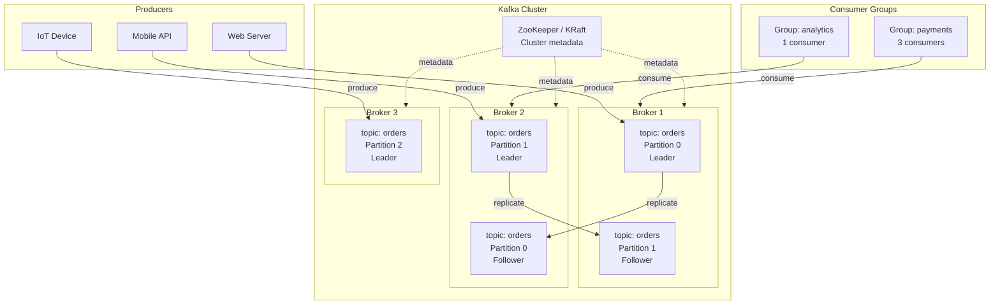
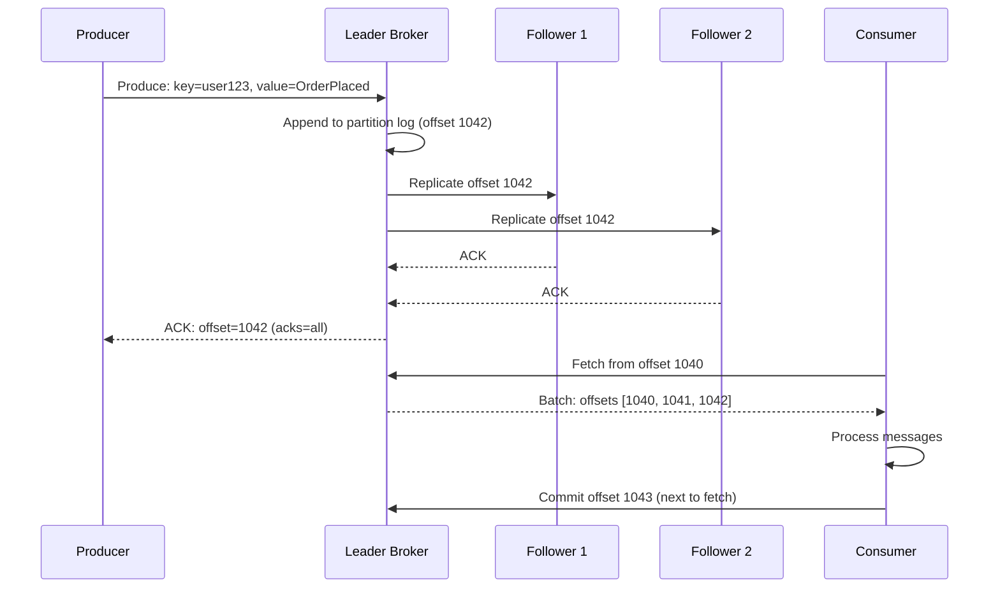

# Apache Kafka Architecture

## Problem Statement

Design a high-throughput distributed event streaming platform (Apache Kafka) capable of handling millions of messages per second with durability, fault tolerance, and consumer replay.

## Scenario

Apache Kafka Architecture is a critical component in modern distributed systems. In real-world applications, streaming billions of events with strong durability guarantees. For example, major tech companies like Netflix, Uber, and Airbnb rely on similar solutions to handle millions of concurrent users and requests. The challenge is achieving this while maintaining sub-100ms latency, 99.99% availability, and gracefully handling 10x traffic spikes during peak demand. This component provides the foundational capability to solve these challenges reliably and efficiently at global scale.

## Users

- **Backend Engineers**: Responsible for implementing and maintaining this system component in production environments. They need to understand the architecture, trade-offs, failure modes, and operational considerations.
- **DevOps/SRE Teams**: Monitor system health, manage scaling policies, handle incidents, and ensure reliability SLAs are met. They need insights into performance characteristics, bottlenecks, and failure recovery mechanisms.
- **Data Engineers**: Design data pipelines and analytics around this system, requiring deep understanding of data flow, consistency guarantees, and throughput characteristics.
- **System Architects**: Make high-level architectural decisions that impact company infrastructure, requiring comprehensive understanding of capabilities, limitations, and scalability boundaries.
- **Security Teams**: Understand security implications, potential vulnerabilities, and compliance requirements for this component.

## PRD

**Functional Requirements:**
- Correct behavior under all specified operating conditions
- Reliable operation with explicit failure modes
- Data consistency or eventual consistency guarantees as specified
- Clear mechanisms for error handling and recovery
- Monitoring and observability hooks

**Non-Functional Requirements:**
- **Performance**: Sub-100ms P99 latency for standard operations; measure and track tail latencies
- **Availability**: 99.99%+ uptime with automatic failover and graceful degradation
- **Scalability**: Support 10-100x current load with minimal architectural modifications
- **Consistency**: Specify whether strong, eventual, or causal consistency is required
- **Cost Efficiency**: Minimize operational cost per unit of throughput; consider compute, memory, and network costs
- **Operational Simplicity**: Reduce complexity to minimize human error and operational toil

**Constraints:**
- Resource limits (memory for caches, disk for databases, network bandwidth)
- Deployment constraints (cloud provider limits, regulatory requirements)
- Latency budgets (maximum acceptable delay for operations)

## Flow

The typical operational flow for this system involves these key phases:

1. **Request Arrival**: Client/upstream system sends request with required parameters and context
2. **Validation & Routing**: System validates request format, authentication, and routes to correct handler/shard/instance
3. **Core Processing**: Execute the main algorithm, database query, or business logic on the data/state
4. **State Management**: Update internal state (caches, indexes, counters, logs) with proper atomicity and locking
5. **Response Generation**: Format results and return to requester with relevant metadata (timing, version info)
6. **Observability**: Record metrics (latency, throughput, errors), logs (for debugging), and traces (for performance analysis)

This flow repeats thousands or millions of times per second in production. Each operation's efficiency compounds across the entire system, making careful optimization essential. Bottlenecks at any phase can cascade to impact overall system performance.

## Code Explanation

The provided implementations demonstrate key architectural concepts and design patterns:

**Python Implementation**: Uses built-in Python structures and standard library features to express the core logic clearly. Python emphasizes readability and conciseness—each operation's purpose should be obvious without extensive comments. You'll see different implementation approaches (e.g., using OrderedDict vs. manual linked lists) that represent trade-offs between convenience and fine-grained control.

**Java Implementation**: Shows how to implement the same logic with explicit memory management and type safety. Java's strong typing forces clear interface design; you'll see how generics, null safety, mutable state, and thread safety are handled. This implementation style is closer to production systems at scale.

**Key Implementation Patterns**:
- **Initialization**: Setting up core data structures, thread pools, or connection pools with specified capacity and configuration
- **Read Operations**: Fetching data while maintaining O(1) or O(log n) access, updating metadata (access times, hit counts, etc.)
- **Write Operations**: Inserting/updating data while handling eviction policies, balancing tree structures, or replicating state
- **Edge Cases**: Handling capacity limits, concurrent access, data consistency, and error conditions
- **Performance Optimization**: Using techniques like batch operations, lazy evaluation, or caching to reduce latency

Each line of code represents a deliberate choice about performance characteristics, memory usage, safety guarantees, and implementation complexity. Understanding these trade-offs is essential for using this component effectively in production systems.

## Architecture Diagram



## Flow Diagram



## Design

### Core Concepts

```
Topic: Named category for events
  - Append-only log, immutable records
  - Configurable retention: time (7 days) or size (100GB)

Partition: Ordered, immutable log within a topic
  - Unit of parallelism: N partitions = N consumers max
  - Messages within a partition are ordered
  - Cross-partition: no ordering guarantee
  - Key-based routing: hash(key) % partitions -> same partition for same key

Offset: Position in partition log
  - Each message gets unique, monotonically increasing offset
  - Consumer tracks offset independently per partition
  - Replay: consumer can reset offset to re-read old messages

Replication:
  - replication.factor: 3 = 1 leader + 2 followers
  - ISR (In-Sync Replicas): followers caught up within replica.lag.time.max.ms
  - min.insync.replicas: 2 = producer ACK requires 2 replicas written
  - Guarantees: survive 2 broker failures (RF=3, min.ISR=2)
```

### Producer Configuration

```
acks=0:   Fire-and-forget (max throughput, data loss possible)
acks=1:   Leader written (low latency, loss on leader failure)
acks=all: All ISR replicas written (safest, higher latency)

Batching:
  linger.ms: 5 (wait up to 5ms to fill batch)
  batch.size: 16384 (16KB batch)
  compression.type: snappy/lz4/zstd

Retries:
  retries: INT_MAX (retry forever)
  delivery.timeout.ms: 120000 (2min total)
  enable.idempotence: true (exactly-once per partition)
```

### Consumer Groups

```
Consumer group = logical subscriber
  - Each partition assigned to exactly one consumer in group
  - N consumers in group -> N partitions at max utilization
  - If consumers > partitions: idle consumers (wasteful)

Offset management:
  enable.auto.commit: false (manual commit recommended)
  Commit after processing: at-least-once semantics
  Commit before processing: at-most-once semantics

Rebalancing:
  Triggered on: consumer join, leave, crash, partition change
  Eager rebalance: stop-the-world (all consumers pause)
  Cooperative/incremental rebalance: only moved partitions pause
```

## Common Questions & Answers

**Q: Why is Kafka faster than traditional message queues?** A: Sequential disk writes (OS page cache). Zero-copy (`sendfile` syscall). Batch compression. No per-message routing overhead. Consumers maintain offset (broker is stateless per consumer).

**Q: What is the difference between a queue and a log (Kafka)?** A: Queue: message consumed once, then deleted. Log: messages retained, multiple consumer groups read independently at their own offset. Kafka allows replay; queues don't.

**Q: How does Kafka guarantee ordering?** A: Within a partition: strict ordering. Across partitions: no guarantee. Use a consistent key (e.g., `user_id`) to route related messages to the same partition.

**Q: What happens when a broker fails?** A: ZooKeeper/KRaft detects failure. Controller elects a new leader from ISR. Consumers reconnect to new leader. Producer retries. Typical failover: 5-30 seconds.

**Q: How does KRaft replace ZooKeeper?** A: KRaft (Kafka Raft Metadata mode) moves metadata management into Kafka itself. Controller uses Raft consensus. Eliminates ZooKeeper dependency. Available as default since Kafka 3.3.

## Back-of-Envelope Calculations

```
Throughput:
  Single partition: ~100MB/s write (sequential I/O)
  100 partitions: ~10 GB/s cluster write
  Typical: LinkedIn processes 10T messages/day = 115M/s
  
  Message 1KB: 100MB/s / 1KB = 100K messages/sec per partition

Storage:
  100K msg/sec x 1KB = 100MB/sec
  Retention 7 days = 7 x 86400 x 100MB = 60TB per topic
  With replication=3: 180TB
  
  With compression (3:1 ratio): 60TB

Consumer lag:
  Healthy: consumer offset close to producer offset
  Alert: lag > 10000 messages or > 1 minute behind
  
Partition count:
  Target throughput: 1 GB/s
  Per-partition throughput: 100 MB/s
  Required partitions: 1GB / 100MB = 10 partitions minimum
  Add headroom: 20-30 partitions
```

## Design Choices

| Decision | Option A | Option B |
|---|---|---|
| acks | acks=all (safe) | acks=1 (fast) |
| Retention | Time-based (7 days) | Size-based (100GB/partition) |
| Partitions | Fewer (simpler) | More (higher throughput) |
| Replication factor | 3 (survive 2 failures) | 2 (cheaper) |
| Metadata store | KRaft (modern) | ZooKeeper (legacy) |
| Compression | zstd (best ratio) | lz4 (fastest) |

## Follow-up Questions

1. How does Kafka achieve exactly-once semantics end-to-end?
2. What is the role of the Kafka Controller and how does leader election work?
3. How do you choose the right number of partitions for a topic?
4. How does Kafka handle backpressure when consumers are slow?
5. What is tiered storage in Kafka and how does it reduce broker disk costs?

## Python Implementation

```python
from dataclasses import dataclass, field
from typing import Dict, List, Optional, Any, Callable
import hashlib
import threading
import time

@dataclass
class KafkaMessage:
    key: Optional[bytes]
    value: bytes
    topic: str
    partition: int = 0
    offset: int = -1
    timestamp: float = field(default_factory=time.time)

@dataclass
class Partition:
    topic: str
    partition_id: int
    _log: List[KafkaMessage] = field(default_factory=list)
    _leader: int = 0

    def append(self, msg: KafkaMessage) -> int:
        msg.offset = len(self._log)
        msg.partition = self.partition_id
        self._log.append(msg)
        return msg.offset

    def read(self, offset: int, max_records: int = 100) -> List[KafkaMessage]:
        return self._log[offset:offset + max_records]

    def latest_offset(self) -> int:
        return len(self._log)

class KafkaTopic:
    def __init__(self, name: str, num_partitions: int = 3, replication_factor: int = 1):
        self.name = name
        self.num_partitions = num_partitions
        self.replication_factor = replication_factor
        self._partitions = [Partition(name, i) for i in range(num_partitions)]

    def _get_partition(self, key: Optional[bytes]) -> int:
        if key is None:
            # Round-robin (simplified)
            return 0
        return int(hashlib.md5(key).hexdigest(), 16) % self.num_partitions

    def produce(self, key: Optional[bytes], value: bytes) -> tuple[int, int]:
        partition_id = self._get_partition(key)
        msg = KafkaMessage(key=key, value=value, topic=self.name)
        offset = self._partitions[partition_id].append(msg)
        return partition_id, offset

    def fetch(self, partition_id: int, offset: int, max_records: int = 100) -> List[KafkaMessage]:
        if partition_id >= self.num_partitions:
            return []
        return self._partitions[partition_id].read(offset, max_records)

    def latest_offsets(self) -> Dict[int, int]:
        return {i: p.latest_offset() for i, p in enumerate(self._partitions)}

class ConsumerGroup:
    def __init__(self, group_id: str, topic: KafkaTopic):
        self.group_id = group_id
        self.topic = topic
        self._offsets: Dict[int, int] = {i: 0 for i in range(topic.num_partitions)}
        self._lock = threading.Lock()

    def poll(self, max_records: int = 10) -> List[KafkaMessage]:
        messages = []
        with self._lock:
            for partition_id, offset in self._offsets.items():
                batch = self.topic.fetch(partition_id, offset, max_records)
                messages.extend(batch)
        return messages

    def commit(self, partition_id: int, offset: int):
        with self._lock:
            self._offsets[partition_id] = offset
            print(f"[Consumer {self.group_id}] Committed partition={partition_id} offset={offset}")

    def commit_all(self, messages: List[KafkaMessage]):
        by_partition: Dict[int, int] = {}
        for msg in messages:
            by_partition[msg.partition] = max(by_partition.get(msg.partition, 0), msg.offset + 1)
        for p, o in by_partition.items():
            self.commit(p, o)

    def lag(self) -> Dict[int, int]:
        latest = self.topic.latest_offsets()
        return {p: latest[p] - self._offsets[p] for p in range(self.topic.num_partitions)}

class KafkaCluster:
    def __init__(self):
        self._topics: Dict[str, KafkaTopic] = {}

    def create_topic(self, name: str, partitions: int = 3) -> KafkaTopic:
        self._topics[name] = KafkaTopic(name, partitions)
        print(f"[Kafka] Topic '{name}' created with {partitions} partitions")
        return self._topics[name]

    def get_topic(self, name: str) -> Optional[KafkaTopic]:
        return self._topics.get(name)

# Usage
kafka = KafkaCluster()
orders = kafka.create_topic("orders", partitions=3)

# Produce messages
print("\n=== Producing ===")
for user_id, action in [("u1", "OrderPlaced"), ("u2", "OrderPlaced"), ("u1", "OrderShipped")]:
    partition, offset = orders.produce(key=user_id.encode(), value=action.encode())
    print(f"  Produced '{action}' for {user_id} -> partition={partition}, offset={offset}")

# Consumer group 1: payments processor
print("\n=== Consumer Group: payments ===")
payments_cg = ConsumerGroup("payments", orders)
messages = payments_cg.poll(max_records=5)
for msg in messages:
    print(f"  Processing: {msg.value.decode()} (partition={msg.partition}, offset={msg.offset})")
payments_cg.commit_all(messages)

print(f"\nConsumer lag after commit: {payments_cg.lag()}")

# Consumer group 2: analytics (reads from beginning independently)
print("\n=== Consumer Group: analytics ===")
analytics_cg = ConsumerGroup("analytics", orders)
messages = analytics_cg.poll(max_records=10)
print(f"  Analytics sees {len(messages)} messages (full history)")
```

## Java Implementation

```java
import java.util.*;
import java.util.concurrent.*;
import java.util.stream.*;

public class KafkaSimulator {
    record Message(String key, String value, int partition, int offset) {}

    static class Partition {
        final int id;
        final List<Message> log = new ArrayList<>();
        Partition(int id) { this.id = id; }

        int append(String key, String value) {
            int offset = log.size();
            log.add(new Message(key, value, id, offset));
            return offset;
        }

        List<Message> fetch(int fromOffset, int maxRecords) {
            return log.subList(Math.min(fromOffset, log.size()),
                               Math.min(fromOffset + maxRecords, log.size()));
        }
    }

    static class Topic {
        final String name; final Partition[] partitions;
        Topic(String name, int numPartitions) {
            this.name = name;
            this.partitions = IntStream.range(0, numPartitions)
                .mapToObj(Partition::new).toArray(Partition[]::new);
        }

        int[] produce(String key, String value) {
            int p = (key == null ? 0 : Math.abs(key.hashCode()) % partitions.length);
            return new int[]{p, partitions[p].append(key, value)};
        }

        List<Message> fetch(int partition, int offset) { return partitions[partition].fetch(offset, 10); }
    }

    static class ConsumerGroup {
        final String id; final Topic topic;
        final int[] offsets;
        ConsumerGroup(String id, Topic t) { this.id = id; topic = t; offsets = new int[t.partitions.length]; }

        List<Message> poll() {
            List<Message> result = new ArrayList<>();
            for (int i = 0; i < offsets.length; i++) result.addAll(topic.fetch(i, offsets[i]));
            return result;
        }

        void commit(List<Message> msgs) {
            msgs.forEach(m -> offsets[m.partition()] = m.offset() + 1);
        }
    }

    public static void main(String[] args) {
        Topic orders = new Topic("orders", 3);
        int[] r1 = orders.produce("user-1", "OrderPlaced");
        int[] r2 = orders.produce("user-2", "OrderPlaced");
        int[] r3 = orders.produce("user-1", "OrderShipped");
        System.out.printf("Produced: p=%d o=%d, p=%d o=%d, p=%d o=%d%n",
            r1[0], r1[1], r2[0], r2[1], r3[0], r3[1]);

        ConsumerGroup payments = new ConsumerGroup("payments", orders);
        List<Message> msgs = payments.poll();
        msgs.forEach(m -> System.out.printf("Consuming: %s from p=%d o=%d%n", m.value(), m.partition(), m.offset()));
        payments.commit(msgs);
    }
}
```

## Complexity

| Operation | Time |
|---|---|
| Produce (append to log) | O(1) amortized |
| Fetch by offset | O(1) (direct seek) |
| Key-based partition routing | O(1) |
| Consumer group rebalance | O(consumers x partitions) |
| Offset commit | O(1) |
