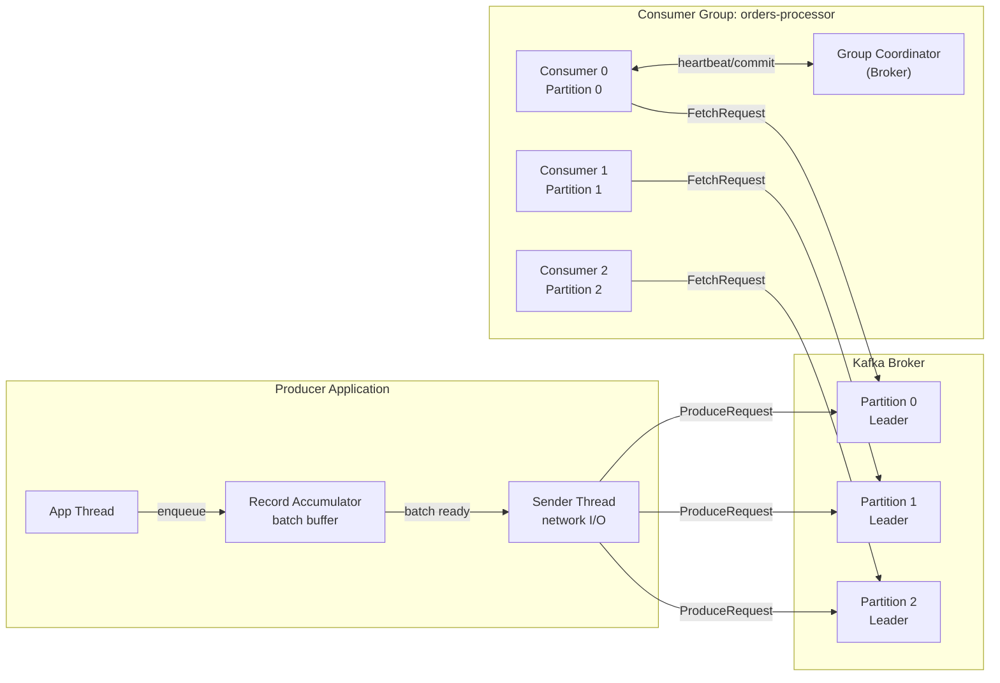
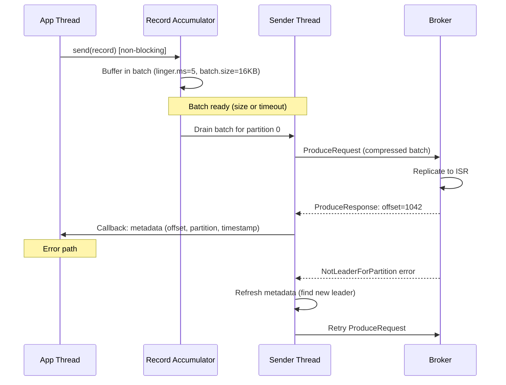

# Kafka Producers and Consumers

## Problem Statement

Deep dive into Kafka producer delivery semantics (at-most-once, at-least-once, exactly-once) and consumer group mechanics including partition assignment, offset management, and rebalancing.

## Architecture Diagram



## Flow Diagram



## Design

### Delivery Semantics

```
At-Most-Once:
  acks=0 (no confirmation)
  retries=0
  Result: messages may be lost, never duplicated
  Use: metrics, high-frequency sampling

At-Least-Once (default):
  acks=all
  retries=INT_MAX
  enable.idempotence=false
  Result: no loss, possible duplicates (on retry)
  Use: most applications with idempotent consumers

Exactly-Once (E2E):
  enable.idempotence=true (per-partition dedup by producer ID + sequence)
  transactional.id=unique-app-id
  isolation.level=read_committed (consumer skips aborted txns)
  Result: exactly-once within Kafka
  Use: financial transactions, stream processing
```

### Consumer Group Rebalancing

```
Eager Protocol (original):
  1. All consumers STOP consuming
  2. All consumers rejoin group
  3. Coordinator assigns partitions
  4. Consumers resume
  Stop-the-world: seconds of pause

Cooperative/Incremental (Kafka 2.4+):
  1. Coordinator sends new assignment
  2. Only consumers losing partitions stop
  3. New assignments taken after release
  4. Minimal disruption
  Default in KafkaConsumer since 3.x

Static membership (consumer.group.instance.id):
  Consumer identified by stable ID, not session
  Restart doesn't trigger rebalance for up to session.timeout.ms
  Use: stateful stream processing, avoids rebalance on restart
```

### Consumer Offset Lifecycle

```
Offsets stored in: __consumer_offsets topic (compacted)

Commit modes:
  Auto-commit: enable.auto.commit=true, auto.commit.interval.ms=5000
    Risk: commits before processing = at-most-once if crash
  
  Manual sync: consumer.commitSync()
    Blocks until committed; safe, slower
  
  Manual async: consumer.commitAsync(callback)
    Non-blocking; OK for steady-state, use sync on close
  
  Per-partition: consumer.commitSync(offsets)
    Fine-grained control; good for batch processors

Offset reset policy (no committed offset found):
  auto.offset.reset=latest: Start from newest (skip historical)
  auto.offset.reset=earliest: Start from beginning (full replay)
  auto.offset.reset=none: Throw exception (no default)
```

## Common Questions & Answers

**Q: How does idempotent producer work?** A: Broker assigns each producer a PID (Producer ID). Producer sends monotonically increasing sequence numbers per partition. Broker deduplicates: if sequence already seen, ack without double-writing. Survives producer restarts with transactional.id.

**Q: What is the consumer heartbeat timeout?** A: `session.timeout.ms` (default 45s) — if no heartbeat from consumer, coordinator triggers rebalance. `heartbeat.interval.ms` (default 3s) — how often consumer sends heartbeat. Set heartbeat to 1/3 of session timeout.

**Q: How do you handle consumer crash mid-processing?** A: Manual commit after processing (at-least-once). Consumer crashes → no commit → messages re-delivered from last committed offset. Make consumer processing idempotent to handle duplicates safely.

**Q: Why does Kafka use pull-based consumers (not push)?** A: Consumer controls fetch rate (pull). Can batch at consumer's pace. No backpressure complexity. Consumer can replay by resetting offset. Simpler broker design (no per-consumer state).

**Q: What is consumer group coordinator?** A: A broker elected to manage a specific consumer group. Handles JoinGroup/SyncGroup/Heartbeat/LeaveGroup requests. Assigns partitions using partition assignment strategy (RangeAssignor, RoundRobinAssignor, StickyAssignor).

## Back-of-Envelope Calculations

```
Producer throughput:
  batch.size=16KB, linger.ms=5ms
  At 1000 req/s: 1000 * 1KB = 1MB/s (fits in 1 batch easily)
  At 100K req/s: 100K * 1KB = 100MB/s (multiple batches)
  lz4 compression 3:1: 33MB/s on wire

Consumer throughput:
  Single consumer, 1KB messages: ~100K msg/s (100MB/s)
  With 100ms processing time per message: 10 msg/s
  Parallel partitions: scale horizontally

Offset commit overhead:
  commitSync() = 1 RTT to broker (~5ms local)
  commitAsync() = non-blocking
  At 1000 commits/s: 5 seconds blocked if all sync
  Recommendation: commit every 1000 messages or 1 second

Rebalance duration:
  Eager: max.poll.interval.ms before consumer considered dead
  Default: 5 minutes (too long for production)
  Recommended: 30-60s for most consumers
  During rebalance: zero throughput for affected partitions
```

## Design Choices

| Delivery | Loss | Duplicates | Throughput | Complexity |
|---|---|---|---|---|
| At-most-once | Yes | No | Highest | Low |
| At-least-once | No | Yes | High | Medium |
| Exactly-once | No | No | Lower | High |

| Commit Mode | Risk | Use Case |
|---|---|---|
| Auto-commit | At-most-once | Simple reads |
| Manual sync | Slower | Reliability |
| Manual async | Ordering risk | High throughput |
| Transactional | Complex | Exactly-once |

## Follow-up Questions

1. How do you implement a transactional producer for exactly-once cross-topic writes?
2. How does StickyAssignor minimize partition movements during rebalance?
3. How do you tune max.poll.records and max.poll.interval.ms?
4. How do you implement dead letter queue pattern in Kafka consumers?
5. How do you monitor consumer lag and trigger alerts?

## Python Implementation

```python
from dataclasses import dataclass, field
from typing import Dict, List, Optional, Callable, Any
from enum import Enum
import time
import random

class DeliverySemantics(Enum):
    AT_MOST_ONCE = "at_most_once"
    AT_LEAST_ONCE = "at_least_once"
    EXACTLY_ONCE = "exactly_once"

@dataclass
class ProducerConfig:
    acks: str = "all"          # "0", "1", "all"
    retries: int = 3
    batch_size_bytes: int = 16384
    linger_ms: int = 5
    compression: str = "snappy"
    enable_idempotence: bool = True
    transactional_id: Optional[str] = None

@dataclass
class ConsumerConfig:
    group_id: str
    auto_offset_reset: str = "earliest"
    enable_auto_commit: bool = False
    max_poll_records: int = 500
    session_timeout_ms: int = 45000
    heartbeat_interval_ms: int = 3000

@dataclass
class RecordMetadata:
    topic: str
    partition: int
    offset: int
    timestamp: float

class RecordAccumulator:
    def __init__(self, batch_size: int = 16384, linger_ms: int = 5):
        self.batch_size = batch_size
        self.linger_ms = linger_ms
        self._batches: Dict[int, List[tuple]] = {}  # partition -> [(key, value)]
        self._sizes: Dict[int, int] = {}

    def append(self, partition: int, key: Optional[bytes], value: bytes) -> bool:
        if partition not in self._batches:
            self._batches[partition] = []
            self._sizes[partition] = 0

        self._batches[partition].append((key, value))
        self._sizes[partition] += len(value) + (len(key) if key else 0)

        # Batch full
        return self._sizes[partition] >= self.batch_size

    def drain(self, partition: int) -> List[tuple]:
        batch = self._batches.pop(partition, [])
        self._sizes.pop(partition, None)
        return batch

    def pending_partitions(self) -> List[int]:
        return list(self._batches.keys())

class KafkaProducer:
    def __init__(self, config: ProducerConfig, topic_store: Dict):
        self.config = config
        self._topic_store = topic_store
        self._accumulator = RecordAccumulator(config.batch_size_bytes, config.linger_ms)
        self._producer_id = random.randint(1000, 9999)
        self._seq: Dict[int, int] = {}  # partition -> sequence
        self._sent = 0
        self._errors = 0

    def send(self, topic: str, key: Optional[bytes], value: bytes,
             on_success: Optional[Callable] = None) -> RecordMetadata:
        partitions = self._topic_store.get(topic, {})
        num_partitions = len(partitions) or 3
        partition = int.from_bytes(
            bytes([sum(key) % 256]) if key else b'\x00', 'big'
        ) % num_partitions

        # Simulate idempotent sequence check
        if self.config.enable_idempotence:
            seq = self._seq.get(partition, 0)
            self._seq[partition] = seq + 1

        # Simulate network send with retry
        for attempt in range(self.config.retries + 1):
            try:
                if topic not in self._topic_store:
                    self._topic_store[topic] = {}
                if partition not in self._topic_store[topic]:
                    self._topic_store[topic][partition] = []

                offset = len(self._topic_store[topic][partition])
                self._topic_store[topic][partition].append((key, value))
                self._sent += 1

                meta = RecordMetadata(topic=topic, partition=partition,
                                      offset=offset, timestamp=time.time())
                if on_success:
                    on_success(meta)
                return meta
            except Exception as e:
                if attempt == self.config.retries:
                    self._errors += 1
                    raise

    def stats(self) -> dict:
        return {"sent": self._sent, "errors": self._errors, "producer_id": self._producer_id}

class OffsetManager:
    def __init__(self, group_id: str):
        self.group_id = group_id
        self._committed: Dict[str, Dict[int, int]] = {}

    def commit(self, topic: str, partition: int, offset: int):
        if topic not in self._committed:
            self._committed[topic] = {}
        self._committed[topic][partition] = offset

    def get_offset(self, topic: str, partition: int, default: int = 0) -> int:
        return self._committed.get(topic, {}).get(partition, default)

    def get_lag(self, topic: str, topic_store: Dict) -> Dict[int, int]:
        partitions = topic_store.get(topic, {})
        lag = {}
        for p, msgs in partitions.items():
            committed = self.get_offset(topic, p)
            lag[p] = len(msgs) - committed
        return lag

class KafkaConsumer:
    def __init__(self, config: ConsumerConfig, topic_store: Dict):
        self.config = config
        self._topic_store = topic_store
        self._offset_mgr = OffsetManager(config.group_id)
        self._assigned_partitions: List[tuple] = []  # (topic, partition)

    def subscribe(self, topic: str, partitions: List[int]):
        self._assigned_partitions = [(topic, p) for p in partitions]
        print(f"[Consumer {self.config.group_id}] Assigned partitions: {partitions}")

    def poll(self, max_records: int = None) -> List[tuple]:
        max_records = max_records or self.config.max_poll_records
        records = []
        for topic, partition in self._assigned_partitions:
            offset = self._offset_mgr.get_offset(topic, partition,
                                                   0 if self.config.auto_offset_reset == "earliest" else -1)
            msgs = self._topic_store.get(topic, {}).get(partition, [])
            if offset < 0:
                offset = len(msgs)  # Start from latest

            batch = msgs[offset:offset + max_records]
            for i, (key, value) in enumerate(batch):
                records.append({
                    "topic": topic, "partition": partition,
                    "offset": offset + i, "key": key, "value": value
                })
        return records

    def commit(self, records: List[dict]):
        by_partition: Dict[tuple, int] = {}
        for r in records:
            key = (r["topic"], r["partition"])
            by_partition[key] = max(by_partition.get(key, 0), r["offset"] + 1)
        for (topic, partition), next_offset in by_partition.items():
            self._offset_mgr.commit(topic, partition, next_offset)

    def lag(self, topic: str) -> Dict[int, int]:
        return self._offset_mgr.get_lag(topic, self._topic_store)

# Demo
store: Dict = {}
producer = KafkaProducer(ProducerConfig(enable_idempotence=True), store)

print("=== Producing messages ===")
for uid, event in [("u1", "Login"), ("u2", "Purchase"), ("u1", "Logout"), ("u3", "Login")]:
    meta = producer.send("events", key=uid.encode(), value=event.encode())
    print(f"  {uid}:{event} -> p={meta.partition}, offset={meta.offset}")

print(f"\nProducer stats: {producer.stats()}")

print("\n=== Consumer Group A (partitions 0, 1) ===")
cfg = ConsumerConfig(group_id="processor-a", auto_offset_reset="earliest")
consumer_a = KafkaConsumer(cfg, store)
consumer_a.subscribe("events", [0, 1])

records = consumer_a.poll()
for r in records:
    print(f"  Processing: {r['value'].decode()} (p={r['partition']}, o={r['offset']})")
consumer_a.commit(records)

print(f"\nConsumer lag: {consumer_a.lag('events')}")
```

## Java Implementation

```java
import java.util.*;
import java.util.concurrent.atomic.*;

public class KafkaProducerConsumer {
    record Record(String key, String value, int partition, int offset) {}

    static class SimpleStore {
        Map<String, Map<Integer, List<Record>>> topics = new HashMap<>();

        int append(String topic, int partition, String key, String value) {
            topics.computeIfAbsent(topic, k -> new HashMap<>())
                  .computeIfAbsent(partition, k -> new ArrayList<>());
            List<Record> log = topics.get(topic).get(partition);
            log.add(new Record(key, value, partition, log.size()));
            return log.size() - 1;
        }

        List<Record> fetch(String topic, int partition, int offset, int max) {
            List<Record> log = topics.getOrDefault(topic, Map.of())
                                     .getOrDefault(partition, List.of());
            int end = Math.min(offset + max, log.size());
            return offset >= log.size() ? List.of() : log.subList(offset, end);
        }
    }

    static class Producer {
        final SimpleStore store;
        final int partitions;
        AtomicInteger sent = new AtomicInteger();

        Producer(SimpleStore store, int partitions) { this.store = store; this.partitions = partitions; }

        int[] send(String topic, String key, String value) {
            int p = key == null ? 0 : Math.abs(key.hashCode()) % partitions;
            int offset = store.append(topic, p, key, value);
            sent.incrementAndGet();
            return new int[]{p, offset};
        }
    }

    static class Consumer {
        final String groupId; final SimpleStore store;
        Map<Integer, Integer> offsets = new HashMap<>();
        List<Integer> partitions;

        Consumer(String groupId, SimpleStore store, List<Integer> partitions) {
            this.groupId = groupId; this.store = store; this.partitions = partitions;
            partitions.forEach(p -> offsets.put(p, 0));
        }

        List<Record> poll(String topic) {
            List<Record> result = new ArrayList<>();
            for (int p : partitions) {
                result.addAll(store.fetch(topic, p, offsets.get(p), 10));
            }
            return result;
        }

        void commit(List<Record> records) {
            records.forEach(r -> offsets.merge(r.partition(), r.offset() + 1, Math::max));
        }
    }

    public static void main(String[] args) {
        SimpleStore store = new SimpleStore();
        Producer producer = new Producer(store, 3);

        producer.send("events", "u1", "Login");
        producer.send("events", "u2", "Purchase");
        producer.send("events", "u1", "Logout");

        Consumer c = new Consumer("processor", store, List.of(0, 1, 2));
        List<Record> records = c.poll("events");
        records.forEach(r -> System.out.printf("Consumed: %s (p=%d, o=%d)%n",
            r.value(), r.partition(), r.offset()));
        c.commit(records);
        System.out.println("Committed offsets: " + c.offsets);
    }
}
```

## Complexity

| Operation | Time |
|---|---|
| Record accumulate | O(1) |
| Batch drain + send | O(batch size) |
| Consumer fetch | O(1) seek + O(records) read |
| Offset commit | O(1) |
| Partition assignment | O(consumers x partitions) |
