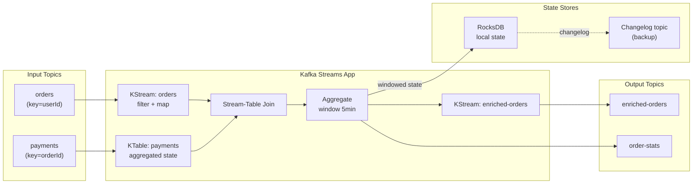
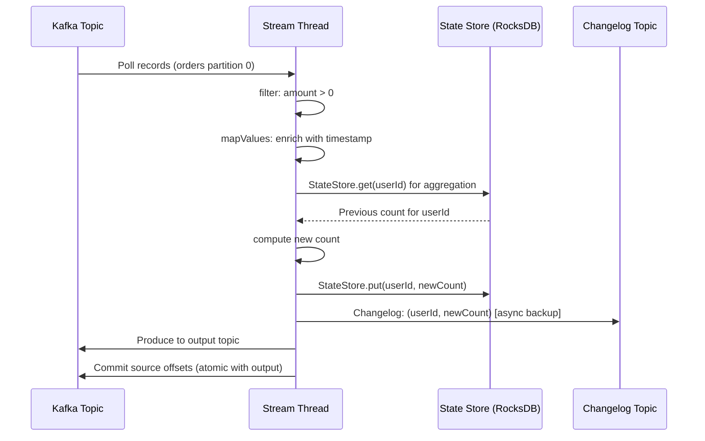

# Kafka Streams

## Problem Statement

Design stateful stream processing applications using Kafka Streams — a client library for building real-time data processing pipelines that read from and write to Kafka topics.

## Architecture Diagram



## Flow Diagram



## Design

### Processing Topologies

```
KStream: Unbounded stream of records
  - Each record processed independently
  - Stateless: filter, map, flatMap
  - Stateful: aggregate, count, join

KTable: Changelog stream (latest value per key)
  - Represents current state (like a table)
  - Backed by RocksDB state store
  - Compacted topic as source

GlobalKTable: Full copy on every instance
  - Used for joins with broadcast data (lookup tables)
  - All instances hold all data
  - Use for small reference data (<100MB)

Operations:
  filter(predicate)           - drop records
  map(keyValueMapper)         - transform key + value
  flatMap(keyValueMapper)     - 1 -> N records
  groupByKey().count()        - stateful count per key
  groupByKey().aggregate()    - stateful custom aggregation
  join(otherStream, ...)      - stream-stream join (windowed)
  join(ktable, ...)           - stream-table join (no window)
```

### State Management

```
Local state (RocksDB):
  Fast local reads/writes
  Survives process restarts via changelog topic

Changelog topic:
  Kafka topic mirroring state store changes
  On app restart: replay changelog to restore state
  Rebalance: new task owner rebuilds from changelog

Standby replicas (num.standby.replicas=1):
  Another instance maintains hot standby
  Failover in seconds (no full rebuild needed)
  Cost: 2x state storage

State store types:
  Persistent (RocksDB): survives restart
  In-memory: faster, lost on restart
  Versioned: point-in-time queries
```

### Windowing

```
Tumbling window (fixed, non-overlapping):
  5-minute windows: [0-5), [5-10), [10-15)
  Count orders per user per 5-minute window

Hopping window (fixed, overlapping):
  Size=10min, advance=5min
  [0-10), [5-15), [10-20)

Session window (activity-based):
  Gap=5min: events < 5min apart in same session
  User session tracking

Window grace period:
  Late-arriving records accepted up to grace period
  After grace: records dropped (or forwarded to late stream)
```

## Common Questions & Answers

**Q: How does Kafka Streams differ from Apache Flink/Spark Streaming?** A: Kafka Streams is a library (runs in your JVM, no cluster to manage). Flink/Spark are cluster frameworks. Kafka Streams: simpler ops, Kafka-native, good for microservices. Flink: complex CEP, exact watermarks, cross-source joins.

**Q: How does exactly-once work in Kafka Streams?** A: processing.guarantee=exactly_once_v2. Combines: (1) consumer offset commit (2) state store changelog write (3) output topic produce — all in one atomic transaction. Broker must support transactions.

**Q: What is a task in Kafka Streams?** A: One task = one source partition. Tasks are unit of parallelism. Each task owns a state store shard. Tasks distribute across stream threads and across instances.

**Q: How does state store restoration work after a crash?** A: App restarts, consumes changelog topic from beginning (or from standby). RocksDB rebuilt. Then continues processing from committed source offset. Time = O(state store size / network bandwidth).

**Q: What is interactive queries?** A: Query local state stores directly via RPC (without Kafka round-trip). Kafka Streams RPC layer: query the app that owns a key's partition. Use case: exposing real-time aggregations via REST API.

## Back-of-Envelope Calculations

```
Processing throughput:
  Single stream thread: ~500K records/sec (simple stateless)
  With RocksDB lookup: ~100-200K records/sec
  With windowed aggregation: ~50-100K records/sec

State store restoration time:
  State size: 1GB, changelog throughput: 100MB/s
  Restoration: 1GB / 100MB/s = 10 seconds
  With standby replica: near-instant (< 1s switchover)

Memory requirements:
  RocksDB block cache: 512MB per instance (tuneable)
  JVM heap: 512MB-2GB (for streams + state)
  Total: ~2-3GB per instance

Windowed state cleanup:
  5-min window + 1-day retention: 1 day / 5 min = 288 windows
  Per-key: 288 * 8 bytes = 2.3KB
  100K keys: 230MB window state

Commit interval:
  commit.interval.ms: 100ms (default)
  At 100ms: 10 commits/s per partition
  Adds 100ms latency (records not visible until committed)
```

## Design Choices

| Approach | Pros | Cons |
|---|---|---|
| Kafka Streams | Library, no cluster | JVM only, Kafka-only source |
| Apache Flink | Exact time, any source | Cluster ops, complex |
| Spark Streaming | Micro-batch, batch+stream | High latency (micro-batch) |
| Faust (Python) | Python-native | Less performant than Streams |
| KSQL/ksqlDB | SQL interface | Limited to Kafka, another service |

## Follow-up Questions

1. How does Kafka Streams handle out-of-order records with watermarks?
2. How do you join two KStreams with different partitioning schemes?
3. How does ksqlDB differ from Kafka Streams for stream processing?
4. How do you scale a Kafka Streams application horizontally?
5. What is punctuation in Kafka Streams and when do you use it?

## Python Implementation

```python
from dataclasses import dataclass, field
from typing import Any, Callable, Dict, Iterable, List, Optional, Tuple
from collections import defaultdict
import time

@dataclass
class StreamRecord:
    key: str
    value: Any
    topic: str
    partition: int = 0
    offset: int = 0
    timestamp: float = field(default_factory=time.time)

class StateStore:
    def __init__(self, name: str):
        self.name = name
        self._data: Dict[str, Any] = {}
        self._changelog: List[Tuple[str, Any]] = []

    def get(self, key: str, default: Any = None) -> Any:
        return self._data.get(key, default)

    def put(self, key: str, value: Any):
        self._data[key] = value
        self._changelog.append((key, value))

    def all(self) -> Iterable[Tuple[str, Any]]:
        return self._data.items()

    def restore(self, changelog: List[Tuple[str, Any]]):
        for key, value in changelog:
            self._data[key] = value
        print(f"[StateStore {self.name}] Restored {len(changelog)} entries")

class KStream:
    def __init__(self, topic: str, records: List[StreamRecord] = None):
        self.topic = topic
        self._records = records or []
        self._state_stores: Dict[str, StateStore] = {}

    def filter(self, predicate: Callable[[StreamRecord], bool]) -> "KStream":
        filtered = [r for r in self._records if predicate(r)]
        return KStream(self.topic, filtered)

    def map_values(self, mapper: Callable[[Any], Any]) -> "KStream":
        mapped = [StreamRecord(r.key, mapper(r.value), r.topic, r.timestamp) for r in self._records]
        return KStream(self.topic, mapped)

    def group_by_key(self) -> "KGroupedStream":
        return KGroupedStream(self._records)

    def join_table(self, ktable: "KTable", value_joiner: Callable) -> "KStream":
        result = []
        for r in self._records:
            table_val = ktable.get(r.key)
            if table_val is not None:
                joined = value_joiner(r.value, table_val)
                result.append(StreamRecord(r.key, joined, r.topic, r.timestamp))
        return KStream(self.topic, result)

    def to(self, output_topic: str) -> List[StreamRecord]:
        for r in self._records:
            r.topic = output_topic
        return self._records

class KTable:
    def __init__(self, topic: str, records: List[StreamRecord]):
        self._store: Dict[str, Any] = {}
        for r in records:
            self._store[r.key] = r.value  # Latest value per key

    def get(self, key: str) -> Optional[Any]:
        return self._store.get(key)

    def all(self) -> Dict[str, Any]:
        return dict(self._store)

class KGroupedStream:
    def __init__(self, records: List[StreamRecord]):
        self._records = records

    def count(self) -> Dict[str, int]:
        counts: Dict[str, int] = defaultdict(int)
        for r in self._records:
            counts[r.key] += 1
        return dict(counts)

    def aggregate(self, initializer: Callable, aggregator: Callable,
                  store: Optional[StateStore] = None) -> Dict[str, Any]:
        result: Dict[str, Any] = {}
        if store:
            result = {k: v for k, v in store.all()}

        for r in self._records:
            current = result.get(r.key, initializer())
            result[r.key] = aggregator(r.key, r.value, current)
            if store:
                store.put(r.key, result[r.key])
        return result

class TumblingWindow:
    def __init__(self, size_ms: int):
        self.size_ms = size_ms

    def window_for(self, timestamp_ms: float) -> Tuple[float, float]:
        window_start = int(timestamp_ms / self.size_ms) * self.size_ms
        return window_start, window_start + self.size_ms

class WindowedStream:
    def __init__(self, records: List[StreamRecord], window: TumblingWindow):
        self._records = records
        self._window = window

    def count(self) -> Dict[Tuple[str, Tuple], int]:
        counts: Dict[Tuple, int] = defaultdict(int)
        for r in self._records:
            w = self._window.window_for(r.timestamp * 1000)
            counts[(r.key, w)] += 1
        return dict(counts)

# Demo: order processing topology
base_time = time.time()
order_records = [
    StreamRecord("user1", {"amount": 99.99, "item": "laptop"}, "orders", timestamp=base_time),
    StreamRecord("user2", {"amount": 0, "item": "free"},        "orders", timestamp=base_time),
    StreamRecord("user1", {"amount": 49.99, "item": "mouse"},   "orders", timestamp=base_time + 60),
    StreamRecord("user3", {"amount": 199.99, "item": "phone"},  "orders", timestamp=base_time + 90),
]

payment_records = [
    StreamRecord("user1", {"status": "paid"}, "payments"),
    StreamRecord("user3", {"status": "paid"}, "payments"),
]

print("=== Kafka Streams Topology ===")

# Build KTable from payments
payment_table = KTable("payments", payment_records)
print(f"Payment table: {payment_table.all()}")

# Build KStream from orders
orders_stream = KStream("orders", order_records)

# Filter: only positive amounts
orders_stream = orders_stream.filter(lambda r: r.value["amount"] > 0)

# Enrich with payment status
enriched = orders_stream.join_table(
    payment_table,
    lambda order, payment: {**order, "payment_status": payment["status"]}
)

print("\nEnriched orders (joined with payments):")
for r in enriched._records:
    print(f"  {r.key}: {r.value}")

# Count orders per user
order_counts = orders_stream.group_by_key().count()
print(f"\nOrder counts per user: {order_counts}")

# Windowed count (1-minute windows)
window = TumblingWindow(size_ms=60_000)
windowed = WindowedStream(orders_stream._records, window)
windowed_counts = windowed.count()
print(f"\nWindowed counts:")
for (key, (start, end)), count in windowed_counts.items():
    print(f"  {key} [{start:.0f}-{end:.0f}]: {count} orders")
```

## Java Implementation

```java
import java.util.*;
import java.util.function.*;
import java.util.stream.*;

public class KafkaStreamsSimulator {
    record SR(String key, Object value) {}

    static class KS {
        List<SR> records;
        KS(List<SR> r) { records = r; }

        KS filter(Predicate<SR> p) { return new KS(records.stream().filter(p).collect(Collectors.toList())); }
        KS mapValues(Function<Object, Object> f) {
            return new KS(records.stream().map(r -> new SR(r.key(), f.apply(r.value()))).collect(Collectors.toList()));
        }
        Map<String, Long> groupAndCount() {
            return records.stream().collect(Collectors.groupingBy(SR::key, Collectors.counting()));
        }
    }

    static class KT {
        Map<String, Object> store;
        KT(List<SR> records) { store = records.stream().collect(Collectors.toMap(SR::key, SR::value, (a,b) -> b)); }
        Optional<Object> get(String key) { return Optional.ofNullable(store.get(key)); }
    }

    public static void main(String[] args) {
        var orders = new KS(List.of(
            new SR("u1", Map.of("amount", 100)),
            new SR("u2", Map.of("amount", 0)),
            new SR("u1", Map.of("amount", 50))
        ));
        var payments = new KT(List.of(new SR("u1", "paid"), new SR("u3", "paid")));

        var filtered = orders.filter(r -> ((Map<?,?>)r.value()).get("amount").equals(0) == false);
        System.out.println("Counts: " + filtered.groupAndCount());

        // Join
        filtered.records.stream()
            .filter(r -> payments.get(r.key()).isPresent())
            .forEach(r -> System.out.printf("%s: order=%s payment=%s%n",
                r.key(), r.value(), payments.get(r.key()).get()));
    }
}
```

## Complexity

| Operation | Time |
|---|---|
| Stateless transform (filter/map) | O(records) |
| State store get/put | O(log n) RocksDB |
| Windowed aggregation | O(records) amortized |
| Stream-table join | O(records) |
| State restoration | O(changelog size) |
