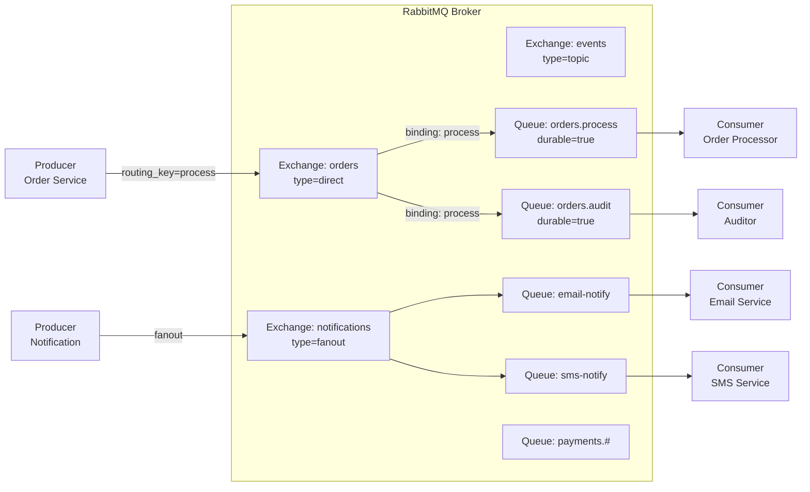
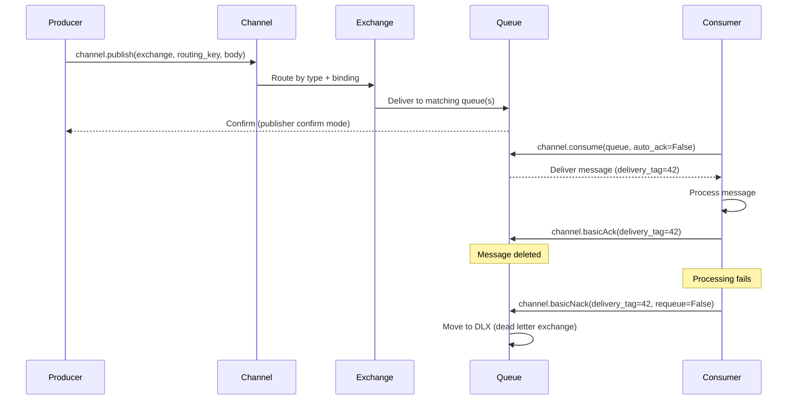

# RabbitMQ

## Problem Statement

Design a message broker using RabbitMQ's AMQP protocol for task queues, pub/sub routing, and RPC patterns with acknowledgments and dead letter handling.

## Scenario

RabbitMQ is a critical component in modern distributed systems. In real-world applications, handling complex business logic at scale with high reliability. For example, major tech companies like Netflix, Uber, and Airbnb rely on similar solutions to handle millions of concurrent users and requests. The challenge is achieving this while maintaining sub-100ms latency, 99.99% availability, and gracefully handling 10x traffic spikes during peak demand. This component provides the foundational capability to solve these challenges reliably and efficiently at global scale.

## Users

- **Backend Engineers**: Responsible for implementing and maintaining this system component in production environments. They need to understand the architecture, trade-offs, failure modes, and operational considerations.
- **DevOps/SRE Teams**: Monitor system health, manage scaling policies, handle incidents, and ensure reliability SLAs are met. They need insights into performance characteristics, bottlenecks, and failure recovery mechanisms.
- **Data Engineers**: Design data pipelines and analytics around this system, requiring deep understanding of data flow, consistency guarantees, and throughput characteristics.
- **System Architects**: Make high-level architectural decisions that impact company infrastructure, requiring comprehensive understanding of capabilities, limitations, and scalability boundaries.
- **Security Teams**: Understand security implications, potential vulnerabilities, and compliance requirements for this component.

## PRD

**Functional Requirements:**
- Correct behavior under all specified operating conditions
- Reliable operation with explicit failure modes
- Data consistency or eventual consistency guarantees as specified
- Clear mechanisms for error handling and recovery
- Monitoring and observability hooks

**Non-Functional Requirements:**
- **Performance**: Sub-100ms P99 latency for standard operations; measure and track tail latencies
- **Availability**: 99.99%+ uptime with automatic failover and graceful degradation
- **Scalability**: Support 10-100x current load with minimal architectural modifications
- **Consistency**: Specify whether strong, eventual, or causal consistency is required
- **Cost Efficiency**: Minimize operational cost per unit of throughput; consider compute, memory, and network costs
- **Operational Simplicity**: Reduce complexity to minimize human error and operational toil

**Constraints:**
- Resource limits (memory for caches, disk for databases, network bandwidth)
- Deployment constraints (cloud provider limits, regulatory requirements)
- Latency budgets (maximum acceptable delay for operations)

## Flow

The typical operational flow for this system involves these key phases:

1. **Request Arrival**: Client/upstream system sends request with required parameters and context
2. **Validation & Routing**: System validates request format, authentication, and routes to correct handler/shard/instance
3. **Core Processing**: Execute the main algorithm, database query, or business logic on the data/state
4. **State Management**: Update internal state (caches, indexes, counters, logs) with proper atomicity and locking
5. **Response Generation**: Format results and return to requester with relevant metadata (timing, version info)
6. **Observability**: Record metrics (latency, throughput, errors), logs (for debugging), and traces (for performance analysis)

This flow repeats thousands or millions of times per second in production. Each operation's efficiency compounds across the entire system, making careful optimization essential. Bottlenecks at any phase can cascade to impact overall system performance.

## Code Explanation

The provided implementations demonstrate key architectural concepts and design patterns:

**Python Implementation**: Uses built-in Python structures and standard library features to express the core logic clearly. Python emphasizes readability and conciseness—each operation's purpose should be obvious without extensive comments. You'll see different implementation approaches (e.g., using OrderedDict vs. manual linked lists) that represent trade-offs between convenience and fine-grained control.

**Java Implementation**: Shows how to implement the same logic with explicit memory management and type safety. Java's strong typing forces clear interface design; you'll see how generics, null safety, mutable state, and thread safety are handled. This implementation style is closer to production systems at scale.

**Key Implementation Patterns**:
- **Initialization**: Setting up core data structures, thread pools, or connection pools with specified capacity and configuration
- **Read Operations**: Fetching data while maintaining O(1) or O(log n) access, updating metadata (access times, hit counts, etc.)
- **Write Operations**: Inserting/updating data while handling eviction policies, balancing tree structures, or replicating state
- **Edge Cases**: Handling capacity limits, concurrent access, data consistency, and error conditions
- **Performance Optimization**: Using techniques like batch operations, lazy evaluation, or caching to reduce latency

Each line of code represents a deliberate choice about performance characteristics, memory usage, safety guarantees, and implementation complexity. Understanding these trade-offs is essential for using this component effectively in production systems.

## Architecture Diagram



## Flow Diagram



## Design

### Exchange Types

```
Direct:
  Routing key must exactly match queue binding key
  Use: task dispatch (work queues)
  Example: key="high-priority" -> high-priority queue only

Fanout:
  Routes to ALL bound queues (ignores routing key)
  Use: pub/sub, broadcast notifications
  Example: new-user event -> email + SMS + analytics queues

Topic:
  Routing key pattern matching with wildcards
  * = exactly one word, # = zero or more words
  Example: "payments.us.*" matches "payments.us.credit"
           "payments.#" matches "payments.us.credit.visa"

Headers:
  Route by message header attributes (not routing key)
  More flexible but slower than topic
  Use: content-based routing
```

### Message Acknowledgments

```
Auto-ack (ack=true): Message deleted on delivery
  Risk: message lost if consumer crashes before processing
  Use: non-critical, high-throughput logging

Manual ack: Consumer explicitly acks after processing
  basicAck: success, delete from queue
  basicNack(requeue=true): put back at front of queue
  basicNack(requeue=false): move to DLX or discard
  basicReject: same as nack but for single message

Prefetch (QoS):
  channel.basicQos(prefetchCount=10)
  Consumer receives max 10 unacked messages at once
  Prevents consumer overload
  Server pushes more only when consumer acks
```

### Dead Letter Exchange (DLX)

```
Messages are dead-lettered when:
  - basicNack/basicReject with requeue=false
  - Message TTL expires in queue
  - Queue length limit exceeded

DLX setup:
  Queue argument: x-dead-letter-exchange=orders.dlx
  Routing key: x-dead-letter-routing-key=failed

DLX queue:
  orders.dlx.queue -> manual inspection or retry logic
  Common: exponential backoff with TTL + republish
```

## Back-of-Envelope Calculations

```
Throughput:
  RabbitMQ: ~50K msg/s (single queue, persistent, acks)
  Without persistence (transient): ~200K msg/s
  With multiple queues in parallel: linear scaling

Message size impact:
  1KB messages at 50K/s: 50 MB/s I/O
  10KB messages at 50K/s: 500 MB/s (disk bottleneck)
  Larger messages: use external store (S3), put reference in queue

Queue depth:
  10M messages in queue: ~1GB RAM
  RabbitMQ uses ~100 bytes overhead per message
  Set queue max-length or max-bytes to prevent OOM

Consumer sizing:
  Processing time: 100ms per message
  1 consumer: 10 msg/s
  Target: 1000 msg/s -> need 100 consumers
  With prefetch=10: 100 consumers x 10 = 1000 in-flight

DLQ accumulation:
  Error rate: 1%, throughput: 10K msg/s
  DLQ rate: 100 msg/s
  After 1 hour: 360K failed messages
  Alert on DLQ depth > N
```

## Design Choices

| Pattern | Exchange Type | Use Case |
|---|---|---|
| Work queue | Direct | Task distribution to workers |
| Pub/Sub | Fanout | Broadcast to all subscribers |
| Routing | Direct/Topic | Selective delivery |
| Priority queue | Classic queue + priority arg | High-priority task jump queue |
| RPC | Direct + reply-to header | Request/response over queue |

| Feature | RabbitMQ | Kafka |
|---|---|---|
| Message TTL | Yes | Via retention |
| Priority | Yes | No |
| Replay | No | Yes |
| Routing | Rich (exchanges) | Simple (topics) |
| Throughput | ~50K/s | ~1M/s |

## Python Implementation

```python
from dataclasses import dataclass, field
from typing import Any, Callable, Dict, List, Optional
from enum import Enum
from collections import deque
import time
import random

class ExchangeType(Enum):
    DIRECT = "direct"
    FANOUT = "fanout"
    TOPIC = "topic"

@dataclass
class Message:
    body: Any
    routing_key: str = ""
    persistent: bool = True
    delivery_tag: int = 0
    headers: Dict[str, str] = field(default_factory=dict)
    ttl_ms: Optional[int] = None
    enqueued_at: float = field(default_factory=time.time)
    retry_count: int = 0

@dataclass
class Queue:
    name: str
    durable: bool = True
    max_length: Optional[int] = None
    dlx_exchange: Optional[str] = None
    dlx_routing_key: Optional[str] = None
    _messages: deque = field(default_factory=deque)
    _unacked: Dict[int, Message] = field(default_factory=dict)
    _delivery_tag_seq: int = 0

    def enqueue(self, msg: Message):
        if self.max_length and len(self._messages) >= self.max_length:
            # Overflow -> dead-letter
            return False
        msg.delivery_tag = self._delivery_tag_seq
        self._delivery_tag_seq += 1
        self._messages.append(msg)
        return True

    def dequeue(self, prefetch: int = 1) -> List[Message]:
        result = []
        for _ in range(min(prefetch, len(self._messages))):
            if len(self._unacked) >= prefetch:
                break
            msg = self._messages.popleft()
            # Check TTL
            if msg.ttl_ms and (time.time() - msg.enqueued_at) * 1000 > msg.ttl_ms:
                print(f"  [Queue {self.name}] Message TTL expired -> DLX")
                continue
            self._unacked[msg.delivery_tag] = msg
            result.append(msg)
        return result

    def ack(self, delivery_tag: int):
        self._unacked.pop(delivery_tag, None)

    def nack(self, delivery_tag: int, requeue: bool = False):
        msg = self._unacked.pop(delivery_tag, None)
        if msg is None:
            return
        if requeue:
            self._messages.appendleft(msg)
        else:
            # Dead letter
            return msg  # Caller handles DLX routing

    def depth(self) -> int:
        return len(self._messages)

    def unacked_count(self) -> int:
        return len(self._unacked)

class Exchange:
    def __init__(self, name: str, exchange_type: ExchangeType):
        self.name = name
        self.type = exchange_type
        self._bindings: Dict[str, List[Queue]] = {}

    def bind(self, queue: Queue, routing_key: str = ""):
        if routing_key not in self._bindings:
            self._bindings[routing_key] = []
        self._bindings[routing_key].append(queue)
        print(f"[Exchange {self.name}] Queue '{queue.name}' bound with key='{routing_key}'")

    def _topic_match(self, pattern: str, routing_key: str) -> bool:
        pattern_parts = pattern.split(".")
        key_parts = routing_key.split(".")
        def match(pp, kp):
            if not pp and not kp:
                return True
            if pp and pp[0] == "#":
                return match(pp[1:], kp) or (kp and match(pp, kp[1:]))
            if not pp or not kp:
                return False
            if pp[0] == "*" or pp[0] == kp[0]:
                return match(pp[1:], kp[1:])
            return False
        return match(pattern_parts, key_parts)

    def route(self, msg: Message) -> List[Queue]:
        if self.type == ExchangeType.FANOUT:
            queues = []
            for q_list in self._bindings.values():
                queues.extend(q_list)
            return queues
        elif self.type == ExchangeType.DIRECT:
            return self._bindings.get(msg.routing_key, [])
        elif self.type == ExchangeType.TOPIC:
            result = []
            for pattern, q_list in self._bindings.items():
                if self._topic_match(pattern, msg.routing_key):
                    result.extend(q_list)
            return result
        return []

class RabbitMQBroker:
    def __init__(self):
        self._exchanges: Dict[str, Exchange] = {}
        self._queues: Dict[str, Queue] = {}
        self._tag_seq = 0

    def declare_exchange(self, name: str, exchange_type: ExchangeType) -> Exchange:
        ex = Exchange(name, exchange_type)
        self._exchanges[name] = ex
        return ex

    def declare_queue(self, name: str, durable: bool = True,
                      dlx_exchange: Optional[str] = None) -> Queue:
        q = Queue(name=name, durable=durable, dlx_exchange=dlx_exchange)
        self._queues[name] = q
        return q

    def publish(self, exchange_name: str, routing_key: str, body: Any,
                persistent: bool = True) -> bool:
        ex = self._exchanges.get(exchange_name)
        if not ex:
            return False
        msg = Message(body=body, routing_key=routing_key, persistent=persistent)
        target_queues = ex.route(msg)
        for q in target_queues:
            q.enqueue(Message(body=body, routing_key=routing_key, persistent=persistent))
        print(f"[Broker] Published to {exchange_name}/{routing_key} -> {len(target_queues)} queues")
        return True

    def stats(self) -> dict:
        return {q: {"depth": self._queues[q].depth(), "unacked": self._queues[q].unacked_count()}
                for q in self._queues}

# Setup
broker = RabbitMQBroker()

# Create exchanges
orders_ex = broker.declare_exchange("orders", ExchangeType.DIRECT)
events_ex = broker.declare_exchange("events", ExchangeType.TOPIC)
notify_ex = broker.declare_exchange("notifications", ExchangeType.FANOUT)

# Create queues
process_q = broker.declare_queue("orders.process", dlx_exchange="orders.dlx")
audit_q = broker.declare_queue("orders.audit")
email_q = broker.declare_queue("email-notifications")
sms_q = broker.declare_queue("sms-notifications")
payment_q = broker.declare_queue("payment-events")

# Bind
orders_ex.bind(process_q, "process")
orders_ex.bind(audit_q, "process")
notify_ex.bind(email_q)
notify_ex.bind(sms_q)
events_ex.bind(payment_q, "payments.#")

# Publish
print("\n=== Publishing ===")
broker.publish("orders", "process", {"order_id": 42, "amount": 99.99})
broker.publish("notifications", "", {"user": "alice", "message": "Welcome!"})
broker.publish("events", "payments.us.credit", {"txn_id": "T001"})
broker.publish("events", "shipments.us", {"order": 42})  # No match for payment_q

print(f"\nQueue depths: {broker.stats()}")

# Consume
print("\n=== Consuming ===")
msgs = process_q.dequeue(prefetch=2)
for msg in msgs:
    print(f"  Processing: {msg.body}")
    process_q.ack(msg.delivery_tag)  # Simulate success

msgs = email_q.dequeue(prefetch=1)
for msg in msgs:
    print(f"  Email: {msg.body}")
    email_q.ack(msg.delivery_tag)
```

## Java Implementation

```java
import java.util.*;
import java.util.function.*;

public class RabbitMQSimulator {
    enum ExType { DIRECT, FANOUT, TOPIC }
    record Msg(String key, Object body) {}

    static class Queue { 
        String name; Deque<Msg> q = new ArrayDeque<>();
        Queue(String n) { name = n; }
        void enqueue(Msg m) { q.addLast(m); }
        Optional<Msg> dequeue() { return Optional.ofNullable(q.pollFirst()); }
        int size() { return q.size(); }
    }

    static class Exchange {
        String name; ExType type; Map<String, List<Queue>> bindings = new HashMap<>();
        Exchange(String n, ExType t) { name = n; type = t; }

        void bind(Queue q, String key) { bindings.computeIfAbsent(key, k -> new ArrayList<>()).add(q); }

        List<Queue> route(Msg m) {
            if (type == ExType.FANOUT) return bindings.values().stream().flatMap(List::stream).toList();
            if (type == ExType.DIRECT) return bindings.getOrDefault(m.key(), List.of());
            // TOPIC: simplified (exact match for demo)
            return bindings.getOrDefault(m.key(), List.of());
        }
    }

    static class Broker {
        Map<String, Exchange> exchanges = new HashMap<>();
        Map<String, Queue> queues = new HashMap<>();

        Exchange exchange(String name, ExType t) { Exchange e = new Exchange(name, t); exchanges.put(name, e); return e; }
        Queue queue(String name) { Queue q = new Queue(name); queues.put(name, q); return q; }

        void publish(String ex, String key, Object body) {
            Exchange e = exchanges.get(ex);
            if (e == null) return;
            List<Queue> targets = e.route(new Msg(key, body));
            targets.forEach(q -> q.enqueue(new Msg(key, body)));
            System.out.printf("[Broker] %s/%s -> %d queues%n", ex, key, targets.size());
        }
    }

    public static void main(String[] args) {
        Broker broker = new Broker();
        Exchange notifyEx = broker.exchange("notifications", ExType.FANOUT);
        Queue emailQ = broker.queue("email"); Queue smsQ = broker.queue("sms");
        notifyEx.bind(emailQ, ""); notifyEx.bind(smsQ, "");

        broker.publish("notifications", "", Map.of("msg", "Welcome!"));
        System.out.printf("email=%d, sms=%d%n", emailQ.size(), smsQ.size());

        emailQ.dequeue().ifPresent(m -> System.out.println("Email: " + m.body()));
    }
}
```

## Complexity

| Operation | Time |
|---|---|
| Publish to exchange | O(bindings) |
| Direct routing | O(1) |
| Topic routing | O(bindings x pattern match) |
| Fanout routing | O(bound queues) |
| Consume + ack | O(1) |

## Common Questions & Answers

**Q: What is caching and why do we need it?**

A: Caching stores frequently accessed data in fast storage (memory) to reduce latency and load on slower backends (database). Trade space (cache) for speed (latency). Critical for systems serving millions of requests per second.

**Q: What are the main cache eviction policies?**

A: LRU (least recently used), LFU (least frequently used), FIFO (first in first out), TTL (time-based), Random, and ARC (adaptive replacement). Choose based on access patterns: LRU for temporal, LFU for frequency, TTL for time-sensitive data.

**Q: What is cache hit rate and cache miss rate?**

A: Hit rate = successful_finds / total_accesses. Miss rate = 1 - hit rate. P(hit) = hits / (hits + misses). Target 80%+ hit rates for effective caching. Too-small cache gives low hit rate (wasted resources). Too-large cache uses more memory than needed.

**Q: How do you handle cache invalidation when backend data changes?**

A: Use TTL (time-based expiration), active invalidation (notify cache on write), cache-aside pattern (client checks backend), or write-through (update both). Active invalidation is fastest but complex. TTL is simplest but has stale data window.

**Q: What is the cache-aside pattern?**

A: Application checks cache first. On miss, fetch from backend, update cache, then return. Simple to implement. Risk: race condition where multiple threads fetch same miss simultaneously (thundering herd problem).

**Q: What is write-through caching?**

A: Writes go to both cache and backend simultaneously (synchronously). Ensures consistency: read always gets latest. Cost: write latency includes backend write. Safer than write-back but slower.

**Q: What is write-back (write-behind) caching?**

A: Writes go to cache only; backend updated asynchronously later (batch or periodic). Fast writes. Risk: data loss if cache fails before flushing. Need durability guarantees (persistence, replication).

**Q: How do you choose cache size?**

A: Estimate working set (frequently accessed data volume). Add 20-30% buffer for margin. Monitor hit rate: if < 80%, increase size. If > 95%, might be oversized (waste). Use tools like cachegrind to profile.

**Q: What's the difference between client-side and server-side caching?**

A: Client cache (browser): reduces network round-trips, entirely controlled by client. Server cache (memory, Redis): shared across clients, controlled by server. Multi-level caching often best.

**Q: How do you measure cache effectiveness?**

A: Hit rate (primary metric), latency reduction (P99 latency with vs. without cache), backend load reduction, and memory cost per cache entry. Calculate ROI: cost of cache vs. benefit (reduced latency, backend load).

## Follow-up Questions & Answers

**Q: How do you prevent the thundering herd problem in caches?**

A: When popular key expires, many threads fetch from backend simultaneously causing spike. Solutions: probabilistic early expiration (refresh before TTL), request coalescing (single thread rebuilds, others wait), or bloom filters (detect non-existent keys fast).

**Q: How would you implement multi-level cache hierarchy?**

A: Use L1 (fast, small, in-process), L2 (medium, local machine), L3 (large, remote, Redis). Check L1, miss→L2, miss→L3, miss→backend. On write: update all levels. Trade space for speed across levels.

**Q: Can you implement read-through caching (automatic population)?**

A: Yes, cache loader/resolver called on miss. Transparent to application. Backend automatically uses cache layer. More complex than cache-aside but cleaner separation.

**Q: How do you handle hot keys in distributed caches?**

A: Hot key = key accessed by many threads/clients. Replicate hot keys on multiple cache nodes. Use local in-process caches for very hot keys. Monitor and detect hot keys automatically.

**Q: What's the difference between warm and cold cache startup?**

A: Cold cache: empty at start, misses until populated (slow ramp-up). Warm cache: pre-loaded from previous state (RDB/snapshot). Warm startup is critical for production (instant performance).

**Q: How would you measure cache effectiveness for business metrics?**

A: Track hit rate, P99 latency (with/without cache), backend QPS reduction, revenue impact. Calculate cache size vs. cost savings. A/B test to prove business value.

**Q: What happens when cache size is insufficient for working set?**

A: Constant evictions = high miss rate = ineffective cache. Solution: increase cache size, improve eviction policy, reduce working set, or use better hardware (faster storage).

**Q: How do you debug cache issues in production?**

A: Monitor hit rate continuously. Profile cache keys (which keys are accessed). Check for cache stampedes (sudden miss spike). Use distributed tracing to see cache path.

**Q: How would you implement a persistent cache?**

A: Combine memory cache (fast) with persistent backend (database, RocksDB, LevelDB). Write-back pattern: batch updates to persistent store. Trade latency for durability.

**Q: Can you use caching for write-heavy workloads?**

A: Write caching is risky (consistency issues). Use carefully: write-through for safety, write-back for speed. Good for batch writes (aggregate before writing). Monitor durability guarantees.

