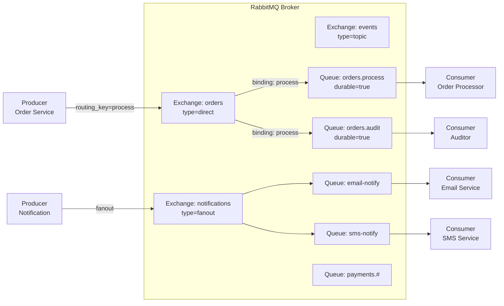
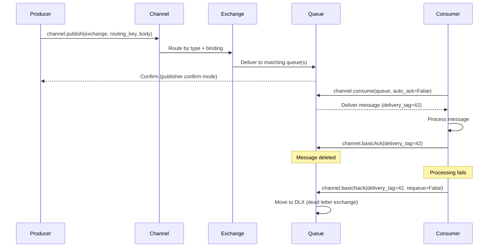

# RabbitMQ

## Problem Statement

Design a message broker using RabbitMQ's AMQP protocol for task queues, pub/sub routing, and RPC patterns with acknowledgments and dead letter handling.

## Architecture Diagram



## Flow Diagram



## Design

### Exchange Types

```
Direct:
  Routing key must exactly match queue binding key
  Use: task dispatch (work queues)
  Example: key="high-priority" -> high-priority queue only

Fanout:
  Routes to ALL bound queues (ignores routing key)
  Use: pub/sub, broadcast notifications
  Example: new-user event -> email + SMS + analytics queues

Topic:
  Routing key pattern matching with wildcards
  * = exactly one word, # = zero or more words
  Example: "payments.us.*" matches "payments.us.credit"
           "payments.#" matches "payments.us.credit.visa"

Headers:
  Route by message header attributes (not routing key)
  More flexible but slower than topic
  Use: content-based routing
```

### Message Acknowledgments

```
Auto-ack (ack=true): Message deleted on delivery
  Risk: message lost if consumer crashes before processing
  Use: non-critical, high-throughput logging

Manual ack: Consumer explicitly acks after processing
  basicAck: success, delete from queue
  basicNack(requeue=true): put back at front of queue
  basicNack(requeue=false): move to DLX or discard
  basicReject: same as nack but for single message

Prefetch (QoS):
  channel.basicQos(prefetchCount=10)
  Consumer receives max 10 unacked messages at once
  Prevents consumer overload
  Server pushes more only when consumer acks
```

### Dead Letter Exchange (DLX)

```
Messages are dead-lettered when:
  - basicNack/basicReject with requeue=false
  - Message TTL expires in queue
  - Queue length limit exceeded

DLX setup:
  Queue argument: x-dead-letter-exchange=orders.dlx
  Routing key: x-dead-letter-routing-key=failed

DLX queue:
  orders.dlx.queue -> manual inspection or retry logic
  Common: exponential backoff with TTL + republish
```

## Common Questions & Answers

**Q: RabbitMQ vs Kafka for task queues?** A: RabbitMQ: push-based, per-message routing, acknowledgments, DLX, priority queues. Better for task queues, RPC patterns. Kafka: pull-based, ordered log, high throughput, replay. Better for event streaming, analytics. Don't use Kafka as a task queue.

**Q: How does RabbitMQ guarantee message durability?** A: Exchange + queue must be durable (survive broker restart). Messages must be persistent (delivery_mode=2). Publisher confirms: broker ACKs after write to disk. All three required for no data loss.

**Q: What is a vhost in RabbitMQ?** A: Virtual host — logical isolation within one broker. Separate exchanges, queues, users, permissions. Like a namespace. Use vhosts to isolate environments (dev/staging/prod) on one broker.

**Q: How do you scale RabbitMQ consumers?** A: Add more consumer processes to the same queue. RabbitMQ distributes messages round-robin. Set prefetch=1 for fair dispatch (slow consumers don't accumulate). Use competing consumers pattern.

**Q: What is the shovel plugin?** A: Moves messages between queues/exchanges, potentially across brokers. Use: federate messages between data centers, forward DLQ messages for retry, migrate between brokers.

## Back-of-Envelope Calculations

```
Throughput:
  RabbitMQ: ~50K msg/s (single queue, persistent, acks)
  Without persistence (transient): ~200K msg/s
  With multiple queues in parallel: linear scaling

Message size impact:
  1KB messages at 50K/s: 50 MB/s I/O
  10KB messages at 50K/s: 500 MB/s (disk bottleneck)
  Larger messages: use external store (S3), put reference in queue

Queue depth:
  10M messages in queue: ~1GB RAM
  RabbitMQ uses ~100 bytes overhead per message
  Set queue max-length or max-bytes to prevent OOM

Consumer sizing:
  Processing time: 100ms per message
  1 consumer: 10 msg/s
  Target: 1000 msg/s -> need 100 consumers
  With prefetch=10: 100 consumers x 10 = 1000 in-flight

DLQ accumulation:
  Error rate: 1%, throughput: 10K msg/s
  DLQ rate: 100 msg/s
  After 1 hour: 360K failed messages
  Alert on DLQ depth > N
```

## Design Choices

| Pattern | Exchange Type | Use Case |
|---|---|---|
| Work queue | Direct | Task distribution to workers |
| Pub/Sub | Fanout | Broadcast to all subscribers |
| Routing | Direct/Topic | Selective delivery |
| Priority queue | Classic queue + priority arg | High-priority task jump queue |
| RPC | Direct + reply-to header | Request/response over queue |

| Feature | RabbitMQ | Kafka |
|---|---|---|
| Message TTL | Yes | Via retention |
| Priority | Yes | No |
| Replay | No | Yes |
| Routing | Rich (exchanges) | Simple (topics) |
| Throughput | ~50K/s | ~1M/s |

## Follow-up Questions

1. How does RabbitMQ clustering and mirrored queues work for HA?
2. How do you implement exponential backoff retry with DLX?
3. What is the Quorum Queue and how does it replace classic mirrored queues?
4. How does RabbitMQ implement the RPC pattern over AMQP?
5. How do you monitor queue depth and consumer lag in RabbitMQ?

## Python Implementation

```python
from dataclasses import dataclass, field
from typing import Any, Callable, Dict, List, Optional
from enum import Enum
from collections import deque
import time
import random

class ExchangeType(Enum):
    DIRECT = "direct"
    FANOUT = "fanout"
    TOPIC = "topic"

@dataclass
class Message:
    body: Any
    routing_key: str = ""
    persistent: bool = True
    delivery_tag: int = 0
    headers: Dict[str, str] = field(default_factory=dict)
    ttl_ms: Optional[int] = None
    enqueued_at: float = field(default_factory=time.time)
    retry_count: int = 0

@dataclass
class Queue:
    name: str
    durable: bool = True
    max_length: Optional[int] = None
    dlx_exchange: Optional[str] = None
    dlx_routing_key: Optional[str] = None
    _messages: deque = field(default_factory=deque)
    _unacked: Dict[int, Message] = field(default_factory=dict)
    _delivery_tag_seq: int = 0

    def enqueue(self, msg: Message):
        if self.max_length and len(self._messages) >= self.max_length:
            # Overflow -> dead-letter
            return False
        msg.delivery_tag = self._delivery_tag_seq
        self._delivery_tag_seq += 1
        self._messages.append(msg)
        return True

    def dequeue(self, prefetch: int = 1) -> List[Message]:
        result = []
        for _ in range(min(prefetch, len(self._messages))):
            if len(self._unacked) >= prefetch:
                break
            msg = self._messages.popleft()
            # Check TTL
            if msg.ttl_ms and (time.time() - msg.enqueued_at) * 1000 > msg.ttl_ms:
                print(f"  [Queue {self.name}] Message TTL expired -> DLX")
                continue
            self._unacked[msg.delivery_tag] = msg
            result.append(msg)
        return result

    def ack(self, delivery_tag: int):
        self._unacked.pop(delivery_tag, None)

    def nack(self, delivery_tag: int, requeue: bool = False):
        msg = self._unacked.pop(delivery_tag, None)
        if msg is None:
            return
        if requeue:
            self._messages.appendleft(msg)
        else:
            # Dead letter
            return msg  # Caller handles DLX routing

    def depth(self) -> int:
        return len(self._messages)

    def unacked_count(self) -> int:
        return len(self._unacked)

class Exchange:
    def __init__(self, name: str, exchange_type: ExchangeType):
        self.name = name
        self.type = exchange_type
        self._bindings: Dict[str, List[Queue]] = {}

    def bind(self, queue: Queue, routing_key: str = ""):
        if routing_key not in self._bindings:
            self._bindings[routing_key] = []
        self._bindings[routing_key].append(queue)
        print(f"[Exchange {self.name}] Queue '{queue.name}' bound with key='{routing_key}'")

    def _topic_match(self, pattern: str, routing_key: str) -> bool:
        pattern_parts = pattern.split(".")
        key_parts = routing_key.split(".")
        def match(pp, kp):
            if not pp and not kp:
                return True
            if pp and pp[0] == "#":
                return match(pp[1:], kp) or (kp and match(pp, kp[1:]))
            if not pp or not kp:
                return False
            if pp[0] == "*" or pp[0] == kp[0]:
                return match(pp[1:], kp[1:])
            return False
        return match(pattern_parts, key_parts)

    def route(self, msg: Message) -> List[Queue]:
        if self.type == ExchangeType.FANOUT:
            queues = []
            for q_list in self._bindings.values():
                queues.extend(q_list)
            return queues
        elif self.type == ExchangeType.DIRECT:
            return self._bindings.get(msg.routing_key, [])
        elif self.type == ExchangeType.TOPIC:
            result = []
            for pattern, q_list in self._bindings.items():
                if self._topic_match(pattern, msg.routing_key):
                    result.extend(q_list)
            return result
        return []

class RabbitMQBroker:
    def __init__(self):
        self._exchanges: Dict[str, Exchange] = {}
        self._queues: Dict[str, Queue] = {}
        self._tag_seq = 0

    def declare_exchange(self, name: str, exchange_type: ExchangeType) -> Exchange:
        ex = Exchange(name, exchange_type)
        self._exchanges[name] = ex
        return ex

    def declare_queue(self, name: str, durable: bool = True,
                      dlx_exchange: Optional[str] = None) -> Queue:
        q = Queue(name=name, durable=durable, dlx_exchange=dlx_exchange)
        self._queues[name] = q
        return q

    def publish(self, exchange_name: str, routing_key: str, body: Any,
                persistent: bool = True) -> bool:
        ex = self._exchanges.get(exchange_name)
        if not ex:
            return False
        msg = Message(body=body, routing_key=routing_key, persistent=persistent)
        target_queues = ex.route(msg)
        for q in target_queues:
            q.enqueue(Message(body=body, routing_key=routing_key, persistent=persistent))
        print(f"[Broker] Published to {exchange_name}/{routing_key} -> {len(target_queues)} queues")
        return True

    def stats(self) -> dict:
        return {q: {"depth": self._queues[q].depth(), "unacked": self._queues[q].unacked_count()}
                for q in self._queues}

# Setup
broker = RabbitMQBroker()

# Create exchanges
orders_ex = broker.declare_exchange("orders", ExchangeType.DIRECT)
events_ex = broker.declare_exchange("events", ExchangeType.TOPIC)
notify_ex = broker.declare_exchange("notifications", ExchangeType.FANOUT)

# Create queues
process_q = broker.declare_queue("orders.process", dlx_exchange="orders.dlx")
audit_q = broker.declare_queue("orders.audit")
email_q = broker.declare_queue("email-notifications")
sms_q = broker.declare_queue("sms-notifications")
payment_q = broker.declare_queue("payment-events")

# Bind
orders_ex.bind(process_q, "process")
orders_ex.bind(audit_q, "process")
notify_ex.bind(email_q)
notify_ex.bind(sms_q)
events_ex.bind(payment_q, "payments.#")

# Publish
print("\n=== Publishing ===")
broker.publish("orders", "process", {"order_id": 42, "amount": 99.99})
broker.publish("notifications", "", {"user": "alice", "message": "Welcome!"})
broker.publish("events", "payments.us.credit", {"txn_id": "T001"})
broker.publish("events", "shipments.us", {"order": 42})  # No match for payment_q

print(f"\nQueue depths: {broker.stats()}")

# Consume
print("\n=== Consuming ===")
msgs = process_q.dequeue(prefetch=2)
for msg in msgs:
    print(f"  Processing: {msg.body}")
    process_q.ack(msg.delivery_tag)  # Simulate success

msgs = email_q.dequeue(prefetch=1)
for msg in msgs:
    print(f"  Email: {msg.body}")
    email_q.ack(msg.delivery_tag)
```

## Java Implementation

```java
import java.util.*;
import java.util.function.*;

public class RabbitMQSimulator {
    enum ExType { DIRECT, FANOUT, TOPIC }
    record Msg(String key, Object body) {}

    static class Queue { 
        String name; Deque<Msg> q = new ArrayDeque<>();
        Queue(String n) { name = n; }
        void enqueue(Msg m) { q.addLast(m); }
        Optional<Msg> dequeue() { return Optional.ofNullable(q.pollFirst()); }
        int size() { return q.size(); }
    }

    static class Exchange {
        String name; ExType type; Map<String, List<Queue>> bindings = new HashMap<>();
        Exchange(String n, ExType t) { name = n; type = t; }

        void bind(Queue q, String key) { bindings.computeIfAbsent(key, k -> new ArrayList<>()).add(q); }

        List<Queue> route(Msg m) {
            if (type == ExType.FANOUT) return bindings.values().stream().flatMap(List::stream).toList();
            if (type == ExType.DIRECT) return bindings.getOrDefault(m.key(), List.of());
            // TOPIC: simplified (exact match for demo)
            return bindings.getOrDefault(m.key(), List.of());
        }
    }

    static class Broker {
        Map<String, Exchange> exchanges = new HashMap<>();
        Map<String, Queue> queues = new HashMap<>();

        Exchange exchange(String name, ExType t) { Exchange e = new Exchange(name, t); exchanges.put(name, e); return e; }
        Queue queue(String name) { Queue q = new Queue(name); queues.put(name, q); return q; }

        void publish(String ex, String key, Object body) {
            Exchange e = exchanges.get(ex);
            if (e == null) return;
            List<Queue> targets = e.route(new Msg(key, body));
            targets.forEach(q -> q.enqueue(new Msg(key, body)));
            System.out.printf("[Broker] %s/%s -> %d queues%n", ex, key, targets.size());
        }
    }

    public static void main(String[] args) {
        Broker broker = new Broker();
        Exchange notifyEx = broker.exchange("notifications", ExType.FANOUT);
        Queue emailQ = broker.queue("email"); Queue smsQ = broker.queue("sms");
        notifyEx.bind(emailQ, ""); notifyEx.bind(smsQ, "");

        broker.publish("notifications", "", Map.of("msg", "Welcome!"));
        System.out.printf("email=%d, sms=%d%n", emailQ.size(), smsQ.size());

        emailQ.dequeue().ifPresent(m -> System.out.println("Email: " + m.body()));
    }
}
```

## Complexity

| Operation | Time |
|---|---|
| Publish to exchange | O(bindings) |
| Direct routing | O(1) |
| Topic routing | O(bindings x pattern match) |
| Fanout routing | O(bound queues) |
| Consume + ack | O(1) |
