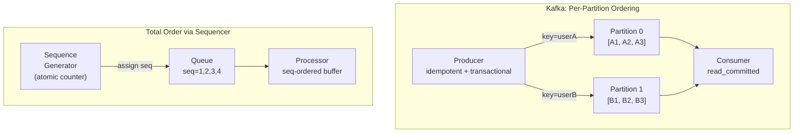
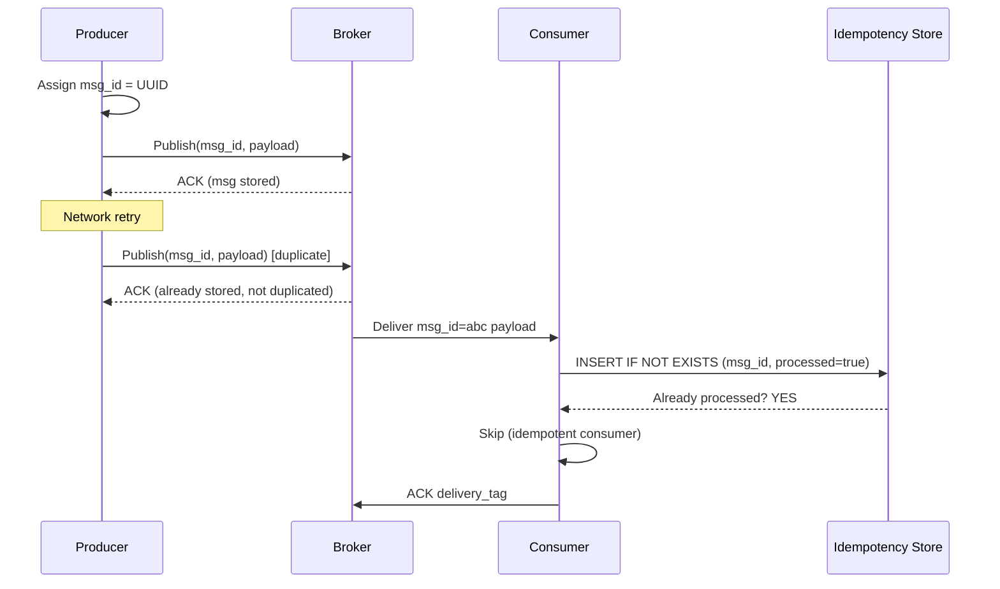

# Message Ordering and Exactly-Once Delivery

## Problem Statement

Design messaging systems that guarantee message ordering and exactly-once processing — addressing the fundamental trade-offs between consistency, throughput, and fault tolerance.

## Scenario

Message Ordering and Exactly-Once Delivery is a critical component in modern distributed systems. In real-world applications, handling complex business logic at scale with high reliability. For example, major tech companies like Netflix, Uber, and Airbnb rely on similar solutions to handle millions of concurrent users and requests. The challenge is achieving this while maintaining sub-100ms latency, 99.99% availability, and gracefully handling 10x traffic spikes during peak demand. This component provides the foundational capability to solve these challenges reliably and efficiently at global scale.

## Users

- **Backend Engineers**: Responsible for implementing and maintaining this system component in production environments. They need to understand the architecture, trade-offs, failure modes, and operational considerations.
- **DevOps/SRE Teams**: Monitor system health, manage scaling policies, handle incidents, and ensure reliability SLAs are met. They need insights into performance characteristics, bottlenecks, and failure recovery mechanisms.
- **Data Engineers**: Design data pipelines and analytics around this system, requiring deep understanding of data flow, consistency guarantees, and throughput characteristics.
- **System Architects**: Make high-level architectural decisions that impact company infrastructure, requiring comprehensive understanding of capabilities, limitations, and scalability boundaries.
- **Security Teams**: Understand security implications, potential vulnerabilities, and compliance requirements for this component.

## PRD

**Functional Requirements:**
- Correct behavior under all specified operating conditions
- Reliable operation with explicit failure modes
- Data consistency or eventual consistency guarantees as specified
- Clear mechanisms for error handling and recovery
- Monitoring and observability hooks

**Non-Functional Requirements:**
- **Performance**: Sub-100ms P99 latency for standard operations; measure and track tail latencies
- **Availability**: 99.99%+ uptime with automatic failover and graceful degradation
- **Scalability**: Support 10-100x current load with minimal architectural modifications
- **Consistency**: Specify whether strong, eventual, or causal consistency is required
- **Cost Efficiency**: Minimize operational cost per unit of throughput; consider compute, memory, and network costs
- **Operational Simplicity**: Reduce complexity to minimize human error and operational toil

**Constraints:**
- Resource limits (memory for caches, disk for databases, network bandwidth)
- Deployment constraints (cloud provider limits, regulatory requirements)
- Latency budgets (maximum acceptable delay for operations)

## Flow

The typical operational flow for this system involves these key phases:

1. **Request Arrival**: Client/upstream system sends request with required parameters and context
2. **Validation & Routing**: System validates request format, authentication, and routes to correct handler/shard/instance
3. **Core Processing**: Execute the main algorithm, database query, or business logic on the data/state
4. **State Management**: Update internal state (caches, indexes, counters, logs) with proper atomicity and locking
5. **Response Generation**: Format results and return to requester with relevant metadata (timing, version info)
6. **Observability**: Record metrics (latency, throughput, errors), logs (for debugging), and traces (for performance analysis)

This flow repeats thousands or millions of times per second in production. Each operation's efficiency compounds across the entire system, making careful optimization essential. Bottlenecks at any phase can cascade to impact overall system performance.

## Code Explanation

The provided implementations demonstrate key architectural concepts and design patterns:

**Python Implementation**: Uses built-in Python structures and standard library features to express the core logic clearly. Python emphasizes readability and conciseness—each operation's purpose should be obvious without extensive comments. You'll see different implementation approaches (e.g., using OrderedDict vs. manual linked lists) that represent trade-offs between convenience and fine-grained control.

**Java Implementation**: Shows how to implement the same logic with explicit memory management and type safety. Java's strong typing forces clear interface design; you'll see how generics, null safety, mutable state, and thread safety are handled. This implementation style is closer to production systems at scale.

**Key Implementation Patterns**:
- **Initialization**: Setting up core data structures, thread pools, or connection pools with specified capacity and configuration
- **Read Operations**: Fetching data while maintaining O(1) or O(log n) access, updating metadata (access times, hit counts, etc.)
- **Write Operations**: Inserting/updating data while handling eviction policies, balancing tree structures, or replicating state
- **Edge Cases**: Handling capacity limits, concurrent access, data consistency, and error conditions
- **Performance Optimization**: Using techniques like batch operations, lazy evaluation, or caching to reduce latency

Each line of code represents a deliberate choice about performance characteristics, memory usage, safety guarantees, and implementation complexity. Understanding these trade-offs is essential for using this component effectively in production systems.

## Architecture Diagram



## Flow Diagram



## Design

### Ordering Guarantees

```
Kafka per-partition order:
  - All messages with same key go to same partition
  - Within partition: strict FIFO
  - Across partitions: no global order
  - Pattern: userId as key -> all user events ordered

  Limitation: parallelism limited by partition count
  Adding partitions changes key->partition mapping (breaking!)

Total global order (single partition):
  - All messages in one partition
  - Throughput: limited to single broker (~100MB/s)
  - Use when global order required (ledger, audit log)

Sequence number approach:
  - Producer stamps monotonic sequence number
  - Consumer reorders with buffer
  - Handles: out-of-order delivery, network reordering

Causal order:
  - Vector clocks or logical timestamps
  - Message carries dependencies (happens-after)
  - Consumer waits for dependencies before processing
```

### Exactly-Once Patterns

```
Idempotent Producer (Kafka):
  - enable.idempotence=true
  - Broker deduplicates by (ProducerID, PartitionID, SequenceNum)
  - Per-session only (new PID on restart)
  - For across restarts: transactional.id

Transactional Producer (Kafka):
  - transactional.id="my-app-0"  (stable across restarts)
  - Atomic: read -> process -> write (in one transaction)
  - Consumer: isolation.level=read_committed
  - Overhead: ~20% latency increase

Idempotent Consumer (application-level):
  Pattern 1: Dedup table
    DB: INSERT INTO processed_msgs (msg_id) VALUES (?) ON CONFLICT DO NOTHING
    Check rows_affected = 1 before processing
  
  Pattern 2: Check-and-set
    State update includes msg_id in WHERE clause
    UPDATE account SET balance=? WHERE last_msg_id != ?
  
  Pattern 3: Idempotent operations
    Design operations to be safe to repeat:
    PUT (not POST), SET (not increment), UPSERT
```

### Out-of-Order Handling

```
Sequence buffer (reorder buffer):
  - Consumer maintains buffer per sender
  - Expected next seq number per partition
  - Buffer messages that arrive out of order
  - Flush in-order to downstream processor
  - Timeout: if gap persists > 30s, skip + alert

Vector clock (causal order):
  - Each message: {clock: {A: 3, B: 1}, payload: ...}
  - Consumer: deliver when all prerequisites seen
  - Use: distributed event sourcing, CRDT

Compensating transactions:
  - Accept out-of-order, apply, then compensate if needed
  - Example: debit before credit -> temporary negative balance, reconcile later
  - Use: high-throughput financial systems
```

## Common Questions & Answers

**Q: Why can't Kafka guarantee global order across partitions?** A: Different partitions live on different brokers. Network and disk latency vary. No global clock. Enforcing global order would require a single-threaded bottleneck or coordination overhead that defeats the purpose of partitioning.

**Q: What is the overhead of exactly-once in Kafka?** A: Idempotent producer: ~5% overhead. Transactional producer: ~20-30% latency increase (transaction markers, coordinator round-trips). At 1M msg/s: EOS reduces to ~700K-800K msg/s.

**Q: How do you handle duplicate messages in a consumer?** A: (1) Idempotent operations (PUT, SET, UPSERT). (2) Deduplication table with message ID check. (3) Version/etag on resources (optimistic locking). Best: design operations to be naturally idempotent.

**Q: What is the two-generals problem and why does it matter?** A: Impossible to guarantee exactly-once over unreliable networks without consensus. Solutions trade off: at-most-once (drop duplicates, may lose), at-least-once (retry, may duplicate), or exactly-once (complex, costly consensus).

**Q: How does SQS handle ordering?** A: Standard SQS: no ordering, at-least-once. FIFO SQS: per-message-group-ID ordering, exactly-once dedup within 5-minute window. Throughput: 3K msg/s (standard) vs 300 msg/s (FIFO, can be increased).

## Back-of-Envelope Calculations

```
Idempotency table overhead:
  msg_id (UUID 36 chars) + processed (bool) + timestamp = ~60 bytes
  At 1M msg/s: 1M * 60B = 60MB/s writes to dedup table
  After 24h: 86.4B messages -> 5.18TB table (need TTL!)
  TTL = max retry window (5 min): 300M rows = 18GB (manageable)

Sequence buffer memory:
  Batch of 10K messages, avg 1KB = 10MB buffer
  Out-of-order window: 1000 messages = 1MB buffer
  Per consumer: 1-10MB, trivial

Transaction coordinator latency:
  Add per-message: +5ms (coordinator round-trip)
  At 10K msg/s: 50 seconds blocked if serial
  Solution: batch transactions (1 txn per 100ms)
  With batching: +5ms / 100ms = 5% overhead

Kafka EOS throughput:
  Standard: 1M msg/s (1KB messages)
  With idempotence: 950K msg/s (-5%)
  With transactions + batch: 800K msg/s (-20%)
  Acceptable for most workloads
```

## Design Choices

| Guarantee | Pattern | Throughput | Complexity |
|---|---|---|---|
| At-most-once | Fire-and-forget | Highest | Lowest |
| At-least-once | Retry + idempotent consumer | High | Low |
| Exactly-once | Kafka transactions | Medium | High |
| Total order | Single partition | Low | Low |
| Causal order | Vector clocks | Medium | High |

## Follow-up Questions

1. How do vector clocks enable causal consistency in distributed systems?
2. How does the Outbox Pattern guarantee exactly-once with a database?
3. How does AWS SQS FIFO differ from Kafka for ordered messaging?
4. How do you implement the Saga pattern with ordered, compensating transactions?
5. How does Kafka's idempotent producer detect and deduplicate retries?

## Python Implementation

```python
from dataclasses import dataclass, field
from typing import Any, Dict, List, Optional, Set
from collections import defaultdict
import uuid
import time

@dataclass
class Message:
    msg_id: str
    payload: Any
    sequence: int = 0
    producer_id: str = ""
    timestamp: float = field(default_factory=time.time)

class IdempotencyStore:
    def __init__(self, ttl_seconds: float = 300.0):
        self._seen: Dict[str, float] = {}
        self.ttl = ttl_seconds
        self._duplicates = 0
        self._processed = 0

    def check_and_mark(self, msg_id: str) -> bool:
        now = time.time()
        # Cleanup expired entries
        expired = [k for k, t in self._seen.items() if now - t > self.ttl]
        for k in expired:
            del self._seen[k]

        if msg_id in self._seen:
            self._duplicates += 1
            return False  # Already processed
        self._seen[msg_id] = now
        self._processed += 1
        return True  # New message

    def stats(self) -> dict:
        return {"processed": self._processed, "duplicates": self._duplicates,
                "duplicate_rate": f"{self._duplicates/max(1,self._processed+self._duplicates)*100:.1f}%"}

class IdempotentProducer:
    def __init__(self, producer_id: str):
        self.producer_id = producer_id
        self._seq: Dict[str, int] = defaultdict(int)  # partition -> seq
        self._sent: Set[str] = set()

    def produce(self, topic: str, partition: int, payload: Any) -> Message:
        msg_id = f"{self.producer_id}-{topic}-{partition}-{self._seq[(topic, partition)]}"
        self._seq[(topic, partition)] += 1
        return Message(
            msg_id=msg_id,
            payload=payload,
            sequence=self._seq[(topic, partition)] - 1,
            producer_id=self.producer_id,
        )

class ReorderBuffer:
    def __init__(self, partition_id: int, window_size: int = 100):
        self._partition = partition_id
        self._window = window_size
        self._next_expected: int = 0
        self._buffer: Dict[int, Message] = {}
        self._processed: List[Message] = []

    def receive(self, msg: Message) -> List[Message]:
        seq = msg.sequence
        if seq < self._next_expected:
            print(f"  [Reorder p{self._partition}] Old duplicate seq={seq}, dropping")
            return []

        self._buffer[seq] = msg

        # Flush consecutive messages
        result = []
        while self._next_expected in self._buffer:
            ready = self._buffer.pop(self._next_expected)
            result.append(ready)
            self._next_expected += 1

        # Check for gap timeout (simplified: flush if buffer too large)
        if len(self._buffer) > self._window:
            min_buffered = min(self._buffer.keys())
            print(f"  [Reorder p{self._partition}] Gap detected, skipping to seq={min_buffered}")
            self._next_expected = min_buffered

        return result

class ExactlyOnceProcessor:
    def __init__(self):
        self._dedup = IdempotencyStore(ttl_seconds=300)
        self._processed_results: List[Any] = []

    def process(self, msg: Message) -> bool:
        if not self._dedup.check_and_mark(msg.msg_id):
            print(f"  [EOS] Duplicate {msg.msg_id}, skipping")
            return False
        # Process
        result = f"Processed({msg.payload})"
        self._processed_results.append(result)
        return True

    def stats(self) -> dict:
        return {**self._dedup.stats(), "results": len(self._processed_results)}

# Demo
print("=== Idempotent Producer ===")
producer = IdempotentProducer("app-instance-1")
msgs = [producer.produce("orders", 0, f"order-{i}") for i in range(5)]
print(f"Produced: {[m.msg_id for m in msgs]}")

print("\n=== Exactly-Once Consumer ===")
processor = ExactlyOnceProcessor()
for msg in msgs:
    processor.process(msg)
# Simulate retry (duplicate delivery)
print("\n--- Simulating duplicate delivery ---")
for msg in msgs[:2]:
    processor.process(msg)

print(f"\nProcessor stats: {processor.stats()}")

print("\n=== Reorder Buffer ===")
reorder = ReorderBuffer(partition_id=0)
# Deliver out of order: seq 2, 0, 1
out_of_order = [
    Message("id-2", "payload-2", sequence=2),
    Message("id-0", "payload-0", sequence=0),
    Message("id-1", "payload-1", sequence=1),
]
for msg in out_of_order:
    delivered = reorder.receive(msg)
    for d in delivered:
        print(f"  Delivered in order: seq={d.sequence} {d.payload}")
```

## Java Implementation

```java
import java.util.*;
import java.util.concurrent.*;

public class MessageOrdering {
    record Msg(String id, Object payload, int seq) {}

    static class IdempotencyStore {
        private final Set<String> seen = ConcurrentHashMap.newKeySet();
        private int duplicates = 0;

        synchronized boolean checkAndMark(String id) {
            if (seen.contains(id)) { duplicates++; return false; }
            seen.add(id);
            return true;
        }

        int getDuplicates() { return duplicates; }
    }

    static class ReorderBuffer {
        private int nextExpected = 0;
        private TreeMap<Integer, Msg> buffer = new TreeMap<>();

        List<Msg> receive(Msg msg) {
            if (msg.seq() < nextExpected) return List.of();
            buffer.put(msg.seq(), msg);
            List<Msg> result = new ArrayList<>();
            while (buffer.containsKey(nextExpected)) {
                result.add(buffer.remove(nextExpected++));
            }
            return result;
        }
    }

    public static void main(String[] args) {
        IdempotencyStore store = new IdempotencyStore();
        List<Msg> msgs = List.of(new Msg("id-0", "data-0", 0), new Msg("id-1", "data-1", 1));
        msgs.forEach(m -> System.out.println("Process " + m.id() + ": " + store.checkAndMark(m.id())));
        msgs.forEach(m -> System.out.println("Retry " + m.id() + ": " + store.checkAndMark(m.id())));
        System.out.println("Duplicates: " + store.getDuplicates());

        ReorderBuffer rb = new ReorderBuffer();
        List.of(new Msg("2", "p2", 2), new Msg("0", "p0", 0), new Msg("1", "p1", 1))
            .forEach(m -> rb.receive(m).forEach(d -> System.out.println("Ordered: " + d.payload())));
    }
}
```

## Complexity

| Operation | Time |
|---|---|
| Idempotency check (hash set) | O(1) average |
| Reorder buffer receive | O(log n) insert + O(k) flush |
| Sequence gap detection | O(1) |
| Vector clock compare | O(processes) |
| Transaction commit (Kafka) | O(1) + 2 RTT coordinator |
