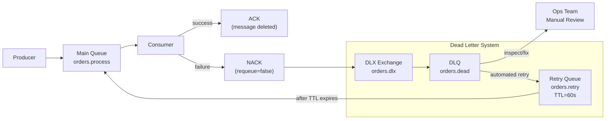
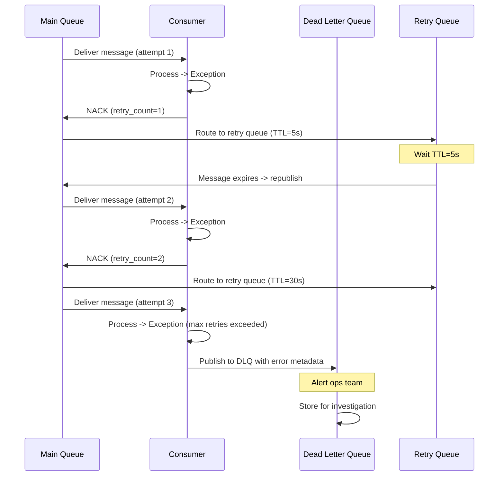

# Dead Letter Queues (DLQ)

## Problem Statement

Design a dead letter queue system for capturing, retrying, and handling messages that fail processing — ensuring no messages are permanently lost while preventing poison pills from blocking the queue.

## Scenario

Dead Letter Queues (DLQ) is a critical component in modern distributed systems. In real-world applications, handling complex business logic at scale with high reliability. For example, major tech companies like Netflix, Uber, and Airbnb rely on similar solutions to handle millions of concurrent users and requests. The challenge is achieving this while maintaining sub-100ms latency, 99.99% availability, and gracefully handling 10x traffic spikes during peak demand. This component provides the foundational capability to solve these challenges reliably and efficiently at global scale.

## Users

- **Backend Engineers**: Responsible for implementing and maintaining this system component in production environments. They need to understand the architecture, trade-offs, failure modes, and operational considerations.
- **DevOps/SRE Teams**: Monitor system health, manage scaling policies, handle incidents, and ensure reliability SLAs are met. They need insights into performance characteristics, bottlenecks, and failure recovery mechanisms.
- **Data Engineers**: Design data pipelines and analytics around this system, requiring deep understanding of data flow, consistency guarantees, and throughput characteristics.
- **System Architects**: Make high-level architectural decisions that impact company infrastructure, requiring comprehensive understanding of capabilities, limitations, and scalability boundaries.
- **Security Teams**: Understand security implications, potential vulnerabilities, and compliance requirements for this component.

## PRD

**Functional Requirements:**
- Correct behavior under all specified operating conditions
- Reliable operation with explicit failure modes
- Data consistency or eventual consistency guarantees as specified
- Clear mechanisms for error handling and recovery
- Monitoring and observability hooks

**Non-Functional Requirements:**
- **Performance**: Sub-100ms P99 latency for standard operations; measure and track tail latencies
- **Availability**: 99.99%+ uptime with automatic failover and graceful degradation
- **Scalability**: Support 10-100x current load with minimal architectural modifications
- **Consistency**: Specify whether strong, eventual, or causal consistency is required
- **Cost Efficiency**: Minimize operational cost per unit of throughput; consider compute, memory, and network costs
- **Operational Simplicity**: Reduce complexity to minimize human error and operational toil

**Constraints:**
- Resource limits (memory for caches, disk for databases, network bandwidth)
- Deployment constraints (cloud provider limits, regulatory requirements)
- Latency budgets (maximum acceptable delay for operations)

## Flow

The typical operational flow for this system involves these key phases:

1. **Request Arrival**: Client/upstream system sends request with required parameters and context
2. **Validation & Routing**: System validates request format, authentication, and routes to correct handler/shard/instance
3. **Core Processing**: Execute the main algorithm, database query, or business logic on the data/state
4. **State Management**: Update internal state (caches, indexes, counters, logs) with proper atomicity and locking
5. **Response Generation**: Format results and return to requester with relevant metadata (timing, version info)
6. **Observability**: Record metrics (latency, throughput, errors), logs (for debugging), and traces (for performance analysis)

This flow repeats thousands or millions of times per second in production. Each operation's efficiency compounds across the entire system, making careful optimization essential. Bottlenecks at any phase can cascade to impact overall system performance.

## Code Explanation

The provided implementations demonstrate key architectural concepts and design patterns:

**Python Implementation**: Uses built-in Python structures and standard library features to express the core logic clearly. Python emphasizes readability and conciseness—each operation's purpose should be obvious without extensive comments. You'll see different implementation approaches (e.g., using OrderedDict vs. manual linked lists) that represent trade-offs between convenience and fine-grained control.

**Java Implementation**: Shows how to implement the same logic with explicit memory management and type safety. Java's strong typing forces clear interface design; you'll see how generics, null safety, mutable state, and thread safety are handled. This implementation style is closer to production systems at scale.

**Key Implementation Patterns**:
- **Initialization**: Setting up core data structures, thread pools, or connection pools with specified capacity and configuration
- **Read Operations**: Fetching data while maintaining O(1) or O(log n) access, updating metadata (access times, hit counts, etc.)
- **Write Operations**: Inserting/updating data while handling eviction policies, balancing tree structures, or replicating state
- **Edge Cases**: Handling capacity limits, concurrent access, data consistency, and error conditions
- **Performance Optimization**: Using techniques like batch operations, lazy evaluation, or caching to reduce latency

Each line of code represents a deliberate choice about performance characteristics, memory usage, safety guarantees, and implementation complexity. Understanding these trade-offs is essential for using this component effectively in production systems.

## Architecture Diagram



## Flow Diagram



## Design

### Retry Strategies

```
Immediate retry (bad):
  Message fails -> immediately requeue
  Risk: tight retry loop, overwhelms downstream
  Bad pattern: while True: try process() except: requeue()

Exponential backoff (good):
  Attempt 1: delay 1s
  Attempt 2: delay 2s
  Attempt 3: delay 4s
  Attempt 4: delay 8s (max_retries=3 -> DLQ)
  
  Implementation in RabbitMQ:
    Retry queue with x-message-ttl = delay
    TTL expires -> message republished to main queue

Fixed delay via Kafka:
  Dedicated retry topics: retry.5s, retry.30s, retry.5m
  Consumer reads retry topics, checks publish_time + delay
  If ready: process; else: re-enqueue to same retry topic

Circuit breaker + DLQ:
  After N consecutive failures: open circuit
  All new messages -> DLQ immediately (no retry flood)
  Reset after cool-down period
```

### DLQ Design

```
DLQ metadata enrichment (before DLQ):
  {
    "original_queue": "orders.process",
    "original_exchange": "orders",
    "routing_key": "process",
    "failure_reason": "NullPointerException: line 42",
    "failure_timestamp": "2024-01-15T10:30:00Z",
    "retry_count": 3,
    "original_payload": {...}
  }

DLQ handling strategies:
  1. Alert + manual review (critical systems)
  2. Automated replay after fix (most common)
  3. Discard with audit log (non-critical)
  4. Route to fallback processor

DLQ replay:
  Fix the code/configuration
  Consume DLQ and re-publish to main queue
  Monitor DLQ drain rate vs main queue
  Use rate limiter to avoid replay storm
```

### Poison Pill Detection

```
A poison pill = message that will always fail (bad data, bug)
  Without DLQ: blocks queue forever (or infinite retry loop)
  With DLQ: isolated after max_retries, queue unblocked

Detection:
  max_retries: 3-5 (not too few, not infinite)
  Different errors: retry transient (network), DLQ immediately for data errors
  Error categorization:
    Retryable: TimeoutError, ConnectionRefused, HTTP 503
    Non-retryable: ValidationError, ParseError, HTTP 400

Per-error DLQ:
  parsing-errors.dlq  -> data issues
  timeout-errors.dlq  -> infrastructure issues
  business-errors.dlq -> business logic failures
```

## Common Questions & Answers

**Q: Why not just retry infinitely?** A: Poison pills (bad data) would retry forever, consuming CPU. Downstream outages cause message pile-up. Infinite retry hides bugs. DLQ surfaces failures for investigation, unblocks the queue.

**Q: What is the visibility timeout in SQS?** A: After consumer receives a message, it becomes invisible for N seconds. If consumer doesn't delete it within timeout (crash), it becomes visible again for retry. `VisibilityTimeout` = max processing time. If processing takes longer: heartbeat extends it.

**Q: How do you implement retry with exponential backoff in Kafka?** A: Separate retry topics (e.g., `retry-5s`, `retry-30s`). Consumer reads retry topic, checks if `scheduled_at` has passed. If not: re-produce to same retry topic. If yes: produce to main topic. After max retries: produce to DLQ topic.

**Q: How do you replay a DLQ at safe rate after a fix?** A: Consume DLQ with a rate-limited worker (e.g., 100 msg/s). Re-publish to main topic. Monitor main queue depth and consumer lag during replay. Use separate consumer group for replay to not affect normal consumers.

**Q: What metadata should you always put in DLQ?** A: (1) Original message headers. (2) Exception message + stack trace. (3) Timestamp of each failure. (4) Retry count. (5) Original topic/queue/routing key. This is critical for debugging root cause.

## Back-of-Envelope Calculations

```
DLQ accumulation rate:
  Main queue: 10K msg/s
  Error rate: 0.1% -> 10 msg/s to DLQ
  After 1 hour: 36K messages in DLQ
  Alert threshold: 1000 messages in DLQ

Retry delay impact:
  max_retries=3, delays=[1s, 5s, 30s]
  Total time before DLQ: 36 seconds
  During outage: messages delayed 36s, acceptable

Replay throughput:
  DLQ has 100K messages after outage fix
  Replay rate: 1000 msg/s (10% of normal)
  Drain time: 100K / 1000 = 100 seconds
  Monitor consumer lag returns to 0

Storage:
  DLQ with full metadata: 2KB per message
  100K messages: 200MB
  Retention 7 days: 200MB (trivial, DLQ should be small)

Retry storm prevention:
  10K services, each retries 3x on startup
  Without jitter: 30K simultaneous retries -> thundering herd
  With jitter: distributed over 0-30s -> 1K/s (manageable)
```

## Design Choices

| Retry Strategy | Latency | Throughput Impact | Complexity |
|---|---|---|---|
| Immediate requeue | Low | High (retry storm) | Low |
| Fixed delay (TTL) | Medium | Low | Low |
| Exponential backoff | High (first fail) | None | Medium |
| Dedicated retry topics (Kafka) | Configurable | None | Medium |
| Circuit breaker + DLQ | None (fail fast) | None | High |

## Follow-up Questions

1. How do you implement retry with jitter to avoid thundering herd?
2. How does AWS SQS redrive policy configure max receives before DLQ?
3. How do you detect and alert on abnormal DLQ growth rates?
4. How do you safely replay a DLQ without overwhelming downstream services?
5. What is the difference between a retry queue and a parking lot queue?

## Python Implementation

```python
from dataclasses import dataclass, field
from typing import Any, Callable, Dict, List, Optional
from collections import deque
import time
import math
import random

@dataclass
class DeadMessage:
    msg_id: str
    payload: Any
    original_queue: str
    error: str
    retry_count: int
    failed_at: float = field(default_factory=time.time)
    headers: Dict[str, str] = field(default_factory=dict)

@dataclass
class RetryableMessage:
    msg_id: str
    payload: Any
    retry_count: int = 0
    scheduled_at: float = field(default_factory=time.time)
    max_retries: int = 3

class BackoffStrategy:
    def __init__(self, base_delay_s: float = 1.0, max_delay_s: float = 60.0,
                 jitter: bool = True):
        self.base = base_delay_s
        self.max_delay = max_delay_s
        self.jitter = jitter

    def delay_for(self, retry_count: int) -> float:
        delay = min(self.base * (2 ** retry_count), self.max_delay)
        if self.jitter:
            delay *= (0.5 + random.random() * 0.5)  # 50-100% of calculated delay
        return delay

class DeadLetterQueue:
    def __init__(self, name: str):
        self.name = name
        self._messages: List[DeadMessage] = []
        self._alerts: List[str] = []

    def receive(self, msg: DeadMessage):
        self._messages.append(msg)
        if len(self._messages) % 10 == 0:
            self._alerts.append(f"DLQ {self.name}: {len(self._messages)} messages")
        print(f"  [DLQ {self.name}] Received {msg.msg_id}: {msg.error} (retry#{msg.retry_count})")

    def replay(self, target_queue: "Queue", rate_per_second: int = 100) -> int:
        replayed = 0
        interval = 1.0 / rate_per_second
        while self._messages and replayed < rate_per_second:
            msg = self._messages.pop(0)
            dm = RetryableMessage(msg.msg_id, msg.payload, retry_count=0)
            target_queue.enqueue(dm)
            replayed += 1
            time.sleep(interval * 0.001)  # Scale for demo
        print(f"  [DLQ {self.name}] Replayed {replayed} messages to {target_queue.name}")
        return replayed

    def depth(self) -> int:
        return len(self._messages)

class Queue:
    def __init__(self, name: str, dlq: Optional[DeadLetterQueue] = None,
                 max_retries: int = 3):
        self.name = name
        self.dlq = dlq
        self.max_retries = max_retries
        self._messages: deque = deque()
        self._retry_queue: deque = deque()  # (scheduled_at, message)
        self._backoff = BackoffStrategy()

    def enqueue(self, msg: RetryableMessage):
        self._messages.append(msg)

    def _flush_retry_queue(self):
        now = time.time()
        while self._retry_queue:
            scheduled_at, msg = self._retry_queue[0]
            if scheduled_at <= now:
                self._retry_queue.popleft()
                self._messages.append(msg)
            else:
                break

    def consume_one(self, processor: Callable[[Any], bool]) -> Optional[bool]:
        self._flush_retry_queue()
        if not self._messages:
            return None
        msg = self._messages.popleft()

        try:
            success = processor(msg.payload)
            if success:
                print(f"  [Queue {self.name}] Processed {msg.msg_id} successfully")
                return True
            else:
                raise RuntimeError("Processing returned False")
        except Exception as e:
            msg.retry_count += 1
            if msg.retry_count >= self.max_retries:
                if self.dlq:
                    self.dlq.receive(DeadMessage(
                        msg_id=msg.msg_id,
                        payload=msg.payload,
                        original_queue=self.name,
                        error=str(e),
                        retry_count=msg.retry_count,
                    ))
                else:
                    print(f"  [Queue {self.name}] DROPPED {msg.msg_id} (no DLQ configured)")
                return False
            else:
                delay = self._backoff.delay_for(msg.retry_count)
                scheduled = time.time() + delay
                msg.scheduled_at = scheduled
                # Insert in sorted order
                inserted = False
                for i, (t, _) in enumerate(self._retry_queue):
                    if scheduled < t:
                        self._retry_queue.insert(i, (scheduled, msg))
                        inserted = True
                        break
                if not inserted:
                    self._retry_queue.append((scheduled, msg))
                print(f"  [Queue {self.name}] Retry #{msg.retry_count} for {msg.msg_id} in {delay:.2f}s")
                return None

# Setup
dlq = DeadLetterQueue("orders.dlq")
main_queue = Queue("orders.process", dlq=dlq, max_retries=3)

# Produce messages
for i in range(5):
    main_queue.enqueue(RetryableMessage(f"msg-{i}", {"order_id": i, "amount": 10 * (i+1)}))

# Processor that fails on certain messages
fail_ids = {"msg-2", "msg-3"}
def processor(payload: dict) -> bool:
    if f"msg-{payload['order_id']}" in fail_ids:
        raise ValueError(f"Invalid order data for order {payload['order_id']}")
    return True

print("=== Processing messages ===")
for _ in range(5):
    main_queue.consume_one(processor)

# Simulate time passing and retry
print("\n=== Processing retries (simulated time) ===")
# Flush retry queue manually by draining it with delay=0
for item in list(main_queue._retry_queue):
    main_queue._messages.append(item[1])
main_queue._retry_queue.clear()

for _ in range(10):
    result = main_queue.consume_one(processor)
    if result is None and not main_queue._messages:
        break

print(f"\nDLQ depth: {dlq.depth()}")

print("\n=== DLQ Replay ===")
dlq.replay(main_queue, rate_per_second=10)
```

## Java Implementation

```java
import java.util.*;
import java.util.function.*;

public class DeadLetterSystem {
    record Msg(String id, Object payload, int retries) {}
    record DeadMsg(String id, Object payload, String error, int retries) {}

    static class DLQ {
        List<DeadMsg> messages = new ArrayList<>();
        void receive(DeadMsg m) {
            messages.add(m);
            System.out.printf("[DLQ] %s failed after %d retries: %s%n", m.id(), m.retries(), m.error());
        }
        int size() { return messages.size(); }
    }

    static class Queue {
        String name; DLQ dlq; int maxRetries;
        Deque<Msg> q = new ArrayDeque<>();

        Queue(String n, DLQ d, int max) { name = n; dlq = d; maxRetries = max; }

        void enqueue(Msg m) { q.addLast(m); }

        void processAll(Predicate<Object> processor) {
            while (!q.isEmpty()) {
                Msg msg = q.pollFirst();
                try {
                    if (!processor.test(msg.payload())) throw new RuntimeException("Failed");
                    System.out.printf("[Queue] Processed %s%n", msg.id());
                } catch (Exception e) {
                    int retries = msg.retries() + 1;
                    if (retries >= maxRetries) {
                        dlq.receive(new DeadMsg(msg.id(), msg.payload(), e.getMessage(), retries));
                    } else {
                        q.addLast(new Msg(msg.id(), msg.payload(), retries));
                        System.out.printf("[Queue] Retry %d for %s%n", retries, msg.id());
                    }
                }
            }
        }
    }

    public static void main(String[] args) {
        DLQ dlq = new DLQ();
        Queue q = new Queue("orders", dlq, 2);
        Set<String> failSet = Set.of("msg-1", "msg-2");

        for (int i = 0; i < 4; i++) q.enqueue(new Msg("msg-" + i, "order-" + i, 0));
        q.processAll(p -> !failSet.contains(((String)p).replace("order", "msg")));
        System.out.println("DLQ size: " + dlq.size());
    }
}
```

## Complexity

| Operation | Time |
|---|---|
| Enqueue to DLQ | O(1) |
| Retry queue insert (sorted) | O(log n) |
| Retry queue flush | O(k) ready messages |
| DLQ replay | O(n) |
| Backoff calculation | O(1) |
