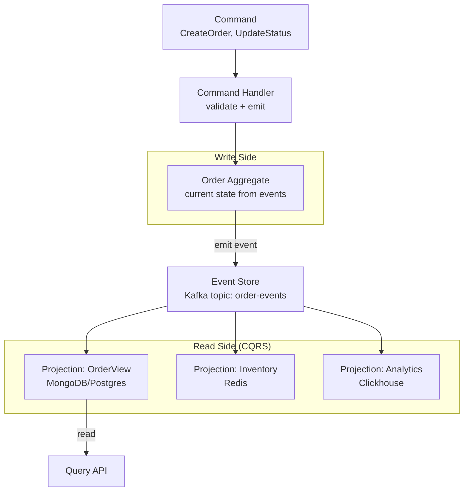
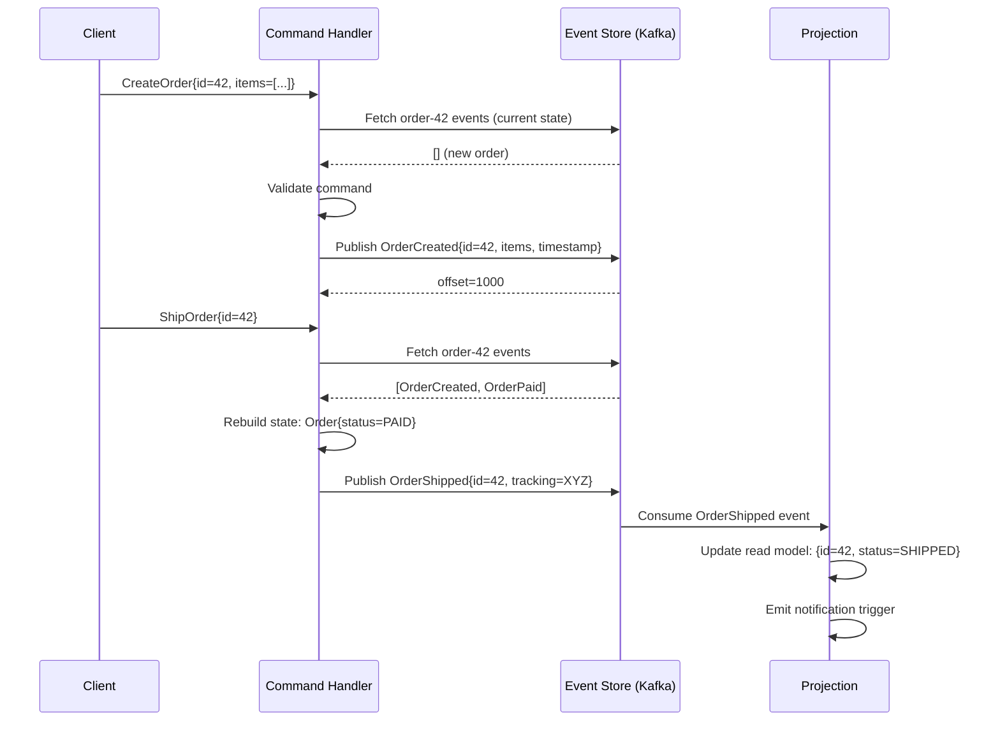

# Event Sourcing with Kafka

## Problem Statement

Design an event sourcing system where application state is derived by replaying a sequence of immutable events stored in Kafka — enabling audit trails, time travel, and CQRS.

## Architecture Diagram



## Flow Diagram



## Design

### Core Concepts

```
Event:
  - Immutable fact: "OrderCreated", "ItemAdded", "OrderShipped"
  - Contains: event_type, aggregate_id, payload, timestamp, version
  - Never deleted or modified (append-only log)

Aggregate:
  - Domain object (Order, Account, User)
  - State = fold(initial_state, events)
  - Current state rebuilt by replaying all its events

Command:
  - Intent to change state (not guaranteed to succeed)
  - Validated against current state
  - Emits zero or more events if valid

Event Store:
  - Kafka topic, partitioned by aggregate_id (key)
  - All events for one aggregate in same partition (ordered)
  - Infinite retention (or compacted + snapshot)

Projection (Read Model):
  - Consumer group reading events
  - Builds specialized read views (CQRS)
  - Can be rebuilt by replaying from beginning
```

### Snapshotting

```
Problem: Replaying 10K events per request is slow

Snapshot:
  - Periodically capture aggregate state + current event version
  - Store snapshot separately (Redis, S3, database)
  - On load: fetch latest snapshot, then replay only new events

Snapshot trigger:
  - Every N events (e.g., every 100)
  - Time-based (daily snapshots)

Load algorithm:
  1. Load latest snapshot (version=500)
  2. Fetch events after version 500
  3. Apply delta events to snapshot state
  4. Use as current state
```

### Eventual Consistency

```
Write side: synchronous (command -> event)
Read side: eventually consistent (event -> projection)

Projection lag:
  Kafka consumer lag before projection updated
  Typical: 10-100ms
  
For "read your own writes":
  Return event version in write response
  Projection: wait for version N before returning
  Or: client-side caching of own mutations
```

## Common Questions & Answers

**Q: Why use event sourcing?** A: (1) Complete audit trail. (2) Time travel (replay to any point). (3) Multiple independent projections (CQRS). (4) Event-driven integration (events are the API). (5) Bug recovery (fix projection, replay to correct state).

**Q: What is the downside of event sourcing?** A: Complexity overhead (CQRS, eventual consistency). Query complexity (no direct SQL). Schema evolution of events is hard (immutable!). Performance for heavily-updated aggregates (many events). Not suitable for all domains.

**Q: How do you handle event schema evolution?** A: Version events (`OrderCreated_v1`, `OrderCreated_v2`). Upcasters: transform old events to new schema when reading. Avro/Protobuf with schema registry for forwards/backwards compatibility. Never modify an event type, create a new version.

**Q: What is the Outbox Pattern?** A: Atomically write event to database outbox table AND update domain state (same DB transaction). Separate process reads outbox and publishes to Kafka. Guarantees: event published if-and-only-if state updated.

**Q: How does CQRS help with event sourcing?** A: Command side: optimized for writes (append-only events). Query side: optimized read models (denormalized, indexed). Queries don't need to replay events — they read the projection. Different scaling strategies for reads vs writes.

## Back-of-Envelope Calculations

```
Event store size:
  1K aggregates, 100 events each, 1KB/event = 100MB total
  1M aggregates, 1000 events each, 1KB = 1TB (needs snapshots)

Rebuild time (projection from scratch):
  1M events at 100K events/sec = 10 seconds
  1B events: 100K events/sec = 10000 seconds = ~2.8 hours
  Use parallel consumers + partitioned topic for parallel rebuild

Snapshot frequency:
  100 events per aggregate -> snapshot at 100 events
  At 10K events/s per aggregate: snapshot every 10ms (too frequent)
  Better: every 1000 events or every 5 minutes

Command handler latency:
  Load snapshot + N events + validate + emit = 5-20ms typical
  Cold load (no snapshot, 1000 events): 100ms+
  With in-memory aggregate cache: ~1ms
  
Write throughput:
  Event store = Kafka: 1M events/s easy
  With aggregate locking (one writer per aggregate): limited by parallelism
  Optimistic concurrency: compare version on write, retry on conflict
```

## Design Choices

| Approach | Consistency | Query | Complexity |
|---|---|---|---|
| Event sourcing + CQRS | Strong write, eventual read | Fast (projection) | High |
| Traditional DB | Strong | Flexible SQL | Low |
| Event sourcing + same DB | Strong | Same DB | Medium |
| Event-driven (no sourcing) | Eventual | Flexible | Medium |

## Follow-up Questions

1. How do you handle concurrent commands on the same aggregate?
2. How do you implement saga pattern across multiple aggregates using events?
3. How do you migrate from traditional CRUD to event sourcing?
4. How do you implement a projection that reads from multiple event streams?
5. How does the Outbox Pattern guarantee exactly-once event publishing?

## Python Implementation

```python
from dataclasses import dataclass, field
from typing import Any, Dict, List, Optional, Type
from enum import Enum
import time
import uuid
import json
from collections import defaultdict

@dataclass
class DomainEvent:
    event_id: str = field(default_factory=lambda: str(uuid.uuid4()))
    aggregate_id: str = ""
    event_type: str = ""
    payload: Dict[str, Any] = field(default_factory=dict)
    version: int = 0
    timestamp: float = field(default_factory=time.time)

    def to_dict(self) -> dict:
        return {
            "event_id": self.event_id,
            "aggregate_id": self.aggregate_id,
            "event_type": self.event_type,
            "payload": self.payload,
            "version": self.version,
            "timestamp": self.timestamp,
        }

class OrderStatus(Enum):
    CREATED = "created"
    PAID = "paid"
    SHIPPED = "shipped"
    CANCELLED = "cancelled"

@dataclass
class Order:
    order_id: str = ""
    status: OrderStatus = OrderStatus.CREATED
    items: List[dict] = field(default_factory=list)
    total: float = 0.0
    version: int = 0

    def apply(self, event: DomainEvent) -> "Order":
        handlers = {
            "OrderCreated": self._apply_created,
            "OrderPaid": self._apply_paid,
            "OrderShipped": self._apply_shipped,
            "OrderCancelled": self._apply_cancelled,
        }
        handler = handlers.get(event.event_type)
        if handler:
            handler(event.payload)
        self.version = event.version
        return self

    def _apply_created(self, p: dict):
        self.order_id = p["order_id"]
        self.items = p["items"]
        self.total = p["total"]

    def _apply_paid(self, p: dict):
        self.status = OrderStatus.PAID

    def _apply_shipped(self, p: dict):
        self.status = OrderStatus.SHIPPED

    def _apply_cancelled(self, p: dict):
        self.status = OrderStatus.CANCELLED

class EventStore:
    def __init__(self):
        self._streams: Dict[str, List[DomainEvent]] = defaultdict(list)
        self._snapshots: Dict[str, tuple] = {}  # agg_id -> (snapshot, version)

    def append(self, aggregate_id: str, events: List[DomainEvent],
               expected_version: int = -1) -> int:
        stream = self._streams[aggregate_id]
        current_version = len(stream)
        if expected_version >= 0 and current_version != expected_version:
            raise ConcurrencyError(
                f"Expected version {expected_version}, current={current_version}")
        for i, event in enumerate(events):
            event.aggregate_id = aggregate_id
            event.version = current_version + i + 1
            stream.append(event)
        return len(stream)

    def load(self, aggregate_id: str, from_version: int = 0) -> List[DomainEvent]:
        return self._streams[aggregate_id][from_version:]

    def save_snapshot(self, aggregate_id: str, state: Any, version: int):
        self._snapshots[aggregate_id] = (state, version)
        print(f"[EventStore] Snapshot saved for {aggregate_id} at v{version}")

    def load_snapshot(self, aggregate_id: str) -> Optional[tuple]:
        return self._snapshots.get(aggregate_id)

class ConcurrencyError(Exception):
    pass

class OrderRepository:
    def __init__(self, store: EventStore):
        self._store = store
        self._snapshot_every = 50

    def load(self, order_id: str) -> tuple[Order, int]:
        snapshot = self._store.load_snapshot(order_id)
        order = Order()
        from_version = 0

        if snapshot:
            order, from_version = snapshot
            print(f"  [Repo] Loaded snapshot at v{from_version}")

        events = self._store.load(order_id, from_version)
        for event in events:
            order.apply(event)

        return order, order.version

    def save(self, order: Order, new_events: List[DomainEvent], expected_version: int):
        new_version = self._store.append(order.order_id, new_events, expected_version)
        if new_version % self._snapshot_every == 0:
            self._store.save_snapshot(order.order_id, order, new_version)
        return new_version

class Projection:
    def __init__(self, name: str):
        self.name = name
        self._data: Dict[str, Any] = {}
        self._processed = 0

    def handle(self, event: DomainEvent):
        self._processed += 1
        self._project(event)

    def _project(self, event: DomainEvent):
        raise NotImplementedError

    def query(self, key: str) -> Optional[Any]:
        return self._data.get(key)

class OrderReadModel(Projection):
    def _project(self, event: DomainEvent):
        order_id = event.aggregate_id
        if order_id not in self._data:
            self._data[order_id] = {}
        if event.event_type == "OrderCreated":
            self._data[order_id] = {
                "id": order_id,
                "status": "created",
                "total": event.payload.get("total"),
                "items": event.payload.get("items"),
            }
        elif event.event_type in ("OrderPaid", "OrderShipped", "OrderCancelled"):
            self._data[order_id]["status"] = event.event_type.replace("Order", "").lower()

class CommandHandler:
    def __init__(self, store: EventStore, projections: List[Projection]):
        self._store = store
        self._repo = OrderRepository(store)
        self._projections = projections

    def handle_create(self, order_id: str, items: List[dict], total: float):
        event = DomainEvent(
            aggregate_id=order_id,
            event_type="OrderCreated",
            payload={"order_id": order_id, "items": items, "total": total}
        )
        self._store.append(order_id, [event], expected_version=0)
        self._publish_to_projections([event])
        print(f"[Command] OrderCreated: {order_id}")

    def handle_pay(self, order_id: str):
        order, version = self._repo.load(order_id)
        if order.status != OrderStatus.CREATED:
            raise ValueError(f"Cannot pay order in status {order.status}")
        event = DomainEvent(event_type="OrderPaid", payload={"order_id": order_id})
        self._store.append(order_id, [event], expected_version=version)
        self._publish_to_projections([event])
        print(f"[Command] OrderPaid: {order_id}")

    def handle_ship(self, order_id: str, tracking: str):
        order, version = self._repo.load(order_id)
        if order.status != OrderStatus.PAID:
            raise ValueError(f"Cannot ship order in status {order.status}")
        event = DomainEvent(event_type="OrderShipped", payload={"tracking": tracking})
        self._store.append(order_id, [event], expected_version=version)
        self._publish_to_projections([event])
        print(f"[Command] OrderShipped: {order_id}")

    def _publish_to_projections(self, events: List[DomainEvent]):
        for event in events:
            for proj in self._projections:
                proj.handle(event)

# Demo
store = EventStore()
read_model = OrderReadModel("order-view")
handler = CommandHandler(store, [read_model])

print("=== Event Sourcing Demo ===\n")
handler.handle_create("order-42", [{"item": "laptop", "qty": 1}], total=999.99)
handler.handle_pay("order-42")
handler.handle_ship("order-42", tracking="TRACK123")

print(f"\nRead model: {read_model.query('order-42')}")

print("\n=== Time Travel (replay events) ===")
events = store.load("order-42")
order = Order()
for i, event in enumerate(events):
    order.apply(event)
    print(f"  After event {i+1} ({event.event_type}): status={order.status.value}")
```

## Java Implementation

```java
import java.util.*;

public class EventSourcing {
    record Event(String id, String aggId, String type, Map<String, Object> payload, int version) {}

    enum OrderStatus { CREATED, PAID, SHIPPED }

    static class Order {
        String id; OrderStatus status = OrderStatus.CREATED; int version = 0;

        void apply(Event e) {
            version = e.version();
            switch (e.type()) {
                case "OrderCreated" -> id = (String) e.payload().get("id");
                case "OrderPaid" -> status = OrderStatus.PAID;
                case "OrderShipped" -> status = OrderStatus.SHIPPED;
            }
        }
    }

    static class EventStore {
        Map<String, List<Event>> streams = new HashMap<>();

        void append(String aggId, Event e) {
            streams.computeIfAbsent(aggId, k -> new ArrayList<>()).add(e);
        }
        List<Event> load(String aggId) { return streams.getOrDefault(aggId, List.of()); }
    }

    public static void main(String[] args) {
        EventStore store = new EventStore();
        String orderId = "order-42";

        store.append(orderId, new Event(UUID.randomUUID().toString(), orderId, "OrderCreated",
            Map.of("id", orderId, "total", 99.99), 1));
        store.append(orderId, new Event(UUID.randomUUID().toString(), orderId, "OrderPaid", Map.of(), 2));
        store.append(orderId, new Event(UUID.randomUUID().toString(), orderId, "OrderShipped", Map.of(), 3));

        // Replay from scratch
        Order order = new Order();
        store.load(orderId).forEach(e -> {
            order.apply(e);
            System.out.printf("After %s: status=%s%n", e.type(), order.status);
        });
    }
}
```

## Complexity

| Operation | Time |
|---|---|
| Append event | O(1) |
| Load aggregate (no snapshot) | O(events in stream) |
| Load aggregate (with snapshot) | O(events since snapshot) |
| Rebuild projection | O(total events) |
| Concurrent write check | O(1) with version compare |
