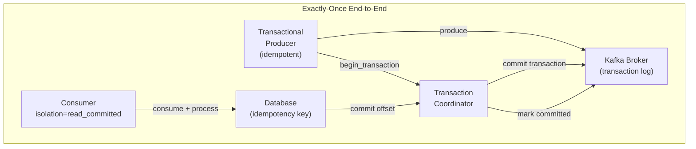

# Exactly-Once Semantics in Distributed Systems

## Problem Statement

Design systems that process each message exactly once despite network failures, crashes, and retries — understanding the fundamental CAP-theorem trade-offs and practical implementation patterns.

## Scenario

Exactly-Once Semantics in Distributed Systems is a critical component in modern distributed systems. In real-world applications, coordinating systems across multiple machines and networks. For example, major tech companies like Netflix, Uber, and Airbnb rely on similar solutions to handle millions of concurrent users and requests. The challenge is achieving this while maintaining sub-100ms latency, 99.99% availability, and gracefully handling 10x traffic spikes during peak demand. This component provides the foundational capability to solve these challenges reliably and efficiently at global scale.

## Users

- **Backend Engineers**: Responsible for implementing and maintaining this system component in production environments. They need to understand the architecture, trade-offs, failure modes, and operational considerations.
- **DevOps/SRE Teams**: Monitor system health, manage scaling policies, handle incidents, and ensure reliability SLAs are met. They need insights into performance characteristics, bottlenecks, and failure recovery mechanisms.
- **Data Engineers**: Design data pipelines and analytics around this system, requiring deep understanding of data flow, consistency guarantees, and throughput characteristics.
- **System Architects**: Make high-level architectural decisions that impact company infrastructure, requiring comprehensive understanding of capabilities, limitations, and scalability boundaries.
- **Security Teams**: Understand security implications, potential vulnerabilities, and compliance requirements for this component.

## PRD

### Functional Requirements
- Core operations work correctly
- Explicit error handling
- Consistency guarantees defined
- Monitoring and observability

### Non-Functional Requirements
- Performance targets met
- Availability SLA achieved
- Scalability headroom
- Cost efficient

### Success Metrics
- Benchmarks met
- Uptime targets met
- Resource budgets
- No data loss


## Flow

The typical operational flow for this system involves these key phases:

1. **Request Arrival**: Client/upstream system sends request with required parameters and context
2. **Validation & Routing**: System validates request format, authentication, and routes to correct handler/shard/instance
3. **Core Processing**: Execute the main algorithm, database query, or business logic on the data/state
4. **State Management**: Update internal state (caches, indexes, counters, logs) with proper atomicity and locking
5. **Response Generation**: Format results and return to requester with relevant metadata (timing, version info)
6. **Observability**: Record metrics (latency, throughput, errors), logs (for debugging), and traces (for performance analysis)

This flow repeats thousands or millions of times per second in production. Each operation's efficiency compounds across the entire system, making careful optimization essential. Bottlenecks at any phase can cascade to impact overall system performance.


## Code Explanation (Detailed)

### Implementation Approach
The code demonstrates core patterns and trade-offs.

### Key Operations
Each operation shows algorithm and performance characteristics.

### Concurrency and Atomicity
Locking strategies, race condition prevention.

### Edge Cases
Boundary conditions and error handling.

### Performance Optimization
Techniques for reducing latency and throughput.

## Architecture Diagram



## Flow Diagram

```mermaid
sequenceDiagram
    participant P as Producer
    participant TC as Transaction Coordinator
    participant K as Kafka Partition
    participant C as Consumer
    participant DB as Database

    P->>TC: initTransactions(transactional.id="app-0")
    TC-->>P: ProducerID=42, epoch=1

    P->>TC: beginTransaction()
    P->>K: Produce record (PID=42, seq=0)
    P->>K: Produce record (PID=42, seq=1)
    P->>TC: commitTransaction()
    TC->>K: Write COMMIT marker
    K-->>TC: ACK
    TC-->>P: Transaction committed

    C->>K: Fetch (isolation=read_committed)
    K-->>C: Records (filtered: only committed)
    C->>DB: BEGIN; INSERT ...; UPDATE offset ...; COMMIT;
    Note over C,DB: Atomic: process + offset in same DB txn
```

## Design

### Kafka EOS Stack

```
Layer 1: Idempotent producer
  - Prevents duplicate writes within a session
  - ProducerID + sequence number per partition
  - Broker deduplicates: same (PID, partition, seq) = noop
  - Survives: producer retry, leader failover

Layer 2: Transactional producer
  - Survives producer restart (stable transactional.id)
  - Atomic multi-partition writes
  - Atomic: read(source) + write(sink) in one transaction

Layer 3: Read_committed consumers
  - Skip messages in open/aborted transactions
  - Only see committed data
  - Isolation: no dirty reads

End-to-end with database:
  1. BEGIN TRANSACTION (DB)
  2. Process message
  3. Write result to DB
  4. Commit consumer offset to DB (not Kafka)
  5. COMMIT (DB)
  = Atomic: process + offset in same DB txn
  = On crash: reprocess same message, idempotent writes prevent duplication
```

### Outbox Pattern

```
Problem: Write to DB and publish to Kafka atomically

Solution:
  1. BEGIN DB TRANSACTION
  2. UPDATE domain state
  3. INSERT INTO outbox (event_type, payload, created_at)
  4. COMMIT DB TRANSACTION

  Outbox relay (separate process):
  5. SELECT * FROM outbox WHERE published=false ORDER BY id
  6. Publish to Kafka
  7. UPDATE outbox SET published=true WHERE id=?

Guarantees:
  - Event published iff DB change committed
  - At-least-once (relay may retry)
  - Consumer idempotency handles duplicates

Tools: Debezium (CDC), Transactional Outbox libraries
```

### Saga Pattern

```
Long-running distributed transaction across services:
  Step 1: CreateOrder (OrderService) -> emit OrderCreated
  Step 2: ReserveInventory (InventoryService) -> emit InventoryReserved
  Step 3: ChargePayment (PaymentService) -> emit PaymentProcessed
  Step 4: ShipOrder (ShippingService) -> emit OrderShipped

On failure (compensation):
  PaymentFailed -> emit: CancelInventoryReservation, CancelOrder

Choreography: services react to events (no central coordinator)
Orchestration: central saga orchestrator sends commands
```

## Back-of-Envelope Calculations

```
Kafka EOS overhead:
  Non-transactional: 1M msg/s baseline
  Idempotent only: 950K msg/s (-5%)
  Transactional: 800K msg/s (-20%)
  
  Additional latency: +5-20ms per transaction (coordinator RTT)

Outbox table throughput:
  10K events/s -> 10K inserts/s to outbox table
  Postgres IOPS: ~50K/s -> margin comfortable
  Relay polling: SELECT ... LIMIT 1000 every 10ms = 100K events/s
  
Idempotency table TTL:
  At 10K msg/s, 5-minute window: 3M dedup entries
  At 100 bytes/entry: 300MB RAM (use Redis for this)

Saga compensation rate:
  1% failure rate, 1K tx/s = 10 compensations/s
  Each compensation = 2-3 additional events
  Negligible extra load
```

## Design Choices

| Pattern | Guarantee | Complexity | Cross-System |
|---|---|---|---|
| Kafka EOS (transactions) | Exactly-once | Medium | No |
| Outbox Pattern | Exactly-once | Medium | Yes |
| Idempotent consumer | At-least-once + dedup | Low | Yes |
| 2PC | Exactly-once | High | Yes (but fragile) |
| Saga | Eventually consistent | High | Yes |
| TCC (Try-Confirm-Cancel) | Exactly-once | High | Yes |

## Python Implementation

```python
from dataclasses import dataclass, field
from typing import Any, Callable, Dict, List, Optional, Set
import uuid
import time
import random

@dataclass
class TransactionRecord:
    txn_id: str
    producer_id: int
    epoch: int
    state: str  # "ongoing", "committed", "aborted"
    records: List[dict] = field(default_factory=list)
    committed_at: Optional[float] = None

class TransactionCoordinator:
    def __init__(self):
        self._transactions: Dict[str, TransactionRecord] = {}
        self._producer_epochs: Dict[str, tuple] = {}  # transactional_id -> (pid, epoch)

    def init_transactions(self, transactional_id: str) -> tuple[int, int]:
        if transactional_id in self._producer_epochs:
            old_pid, old_epoch = self._producer_epochs[transactional_id]
            epoch = old_epoch + 1
            pid = old_pid
            print(f"  [TxnCoord] Fencing old epoch {old_epoch} for {transactional_id}")
        else:
            pid = random.randint(1000, 9999)
            epoch = 0
        self._producer_epochs[transactional_id] = (pid, epoch)
        return pid, epoch

    def begin(self, producer_id: int, epoch: int) -> str:
        txn_id = str(uuid.uuid4())
        self._transactions[txn_id] = TransactionRecord(txn_id, producer_id, epoch, "ongoing")
        return txn_id

    def add_record(self, txn_id: str, record: dict):
        if txn_id in self._transactions:
            self._transactions[txn_id].records.append(record)

    def commit(self, txn_id: str) -> bool:
        txn = self._transactions.get(txn_id)
        if not txn or txn.state != "ongoing":
            return False
        txn.state = "committed"
        txn.committed_at = time.time()
        return True

    def abort(self, txn_id: str):
        txn = self._transactions.get(txn_id)
        if txn:
            txn.state = "aborted"

    def get_committed_records(self, up_to_txn: Optional[str] = None) -> List[dict]:
        committed = []
        for txn in self._transactions.values():
            if txn.state == "committed":
                committed.extend(txn.records)
        return committed

class TransactionalProducer:
    def __init__(self, transactional_id: str, coordinator: TransactionCoordinator):
        self.transactional_id = transactional_id
        self._coordinator = coordinator
        self._pid, self._epoch = coordinator.init_transactions(transactional_id)
        self._current_txn: Optional[str] = None
        self._seq: Dict[str, int] = {}
        print(f"[Producer] Initialized: pid={self._pid}, epoch={self._epoch}")

    def begin_transaction(self):
        if self._current_txn:
            raise RuntimeError("Transaction already active")
        self._current_txn = self._coordinator.begin(self._pid, self._epoch)

    def send(self, topic: str, key: str, value: Any) -> dict:
        if not self._current_txn:
            raise RuntimeError("No active transaction")
        partition_key = f"{topic}-0"
        seq = self._seq.get(partition_key, 0)
        self._seq[partition_key] = seq + 1
        record = {
            "topic": topic, "key": key, "value": value,
            "pid": self._pid, "epoch": self._epoch, "seq": seq,
        }
        self._coordinator.add_record(self._current_txn, record)
        return record

    def commit_transaction(self):
        if not self._current_txn:
            raise RuntimeError("No active transaction")
        success = self._coordinator.commit(self._current_txn)
        if success:
            print(f"[Producer] Transaction {self._current_txn[:8]}... committed")
        self._current_txn = None
        return success

    def abort_transaction(self):
        if self._current_txn:
            self._coordinator.abort(self._current_txn)
            print(f"[Producer] Transaction {self._current_txn[:8]}... aborted")
            self._current_txn = None

class OutboxProcessor:
    def __init__(self):
        self._outbox: List[dict] = []
        self._published: Set[str] = set()
        self._domain_state: Dict[str, Any] = {}

    def write_with_outbox(self, entity_id: str, new_state: Any, event_type: str, event_payload: dict):
        event_id = str(uuid.uuid4())
        # Simulate atomic DB transaction
        self._domain_state[entity_id] = new_state
        self._outbox.append({
            "id": event_id,
            "event_type": event_type,
            "payload": event_payload,
            "published": False,
            "created_at": time.time(),
        })
        print(f"[Outbox] Wrote {event_type} for {entity_id} (event_id={event_id[:8]}...)")

    def relay(self, publish_fn: Callable[[dict], None]):
        for item in self._outbox:
            if not item["published"]:
                publish_fn(item)
                item["published"] = True
                self._published.add(item["id"])
                print(f"[Relay] Published {item['event_type']} (id={item['id'][:8]}...)")

class IdempotentConsumer:
    def __init__(self):
        self._processed_ids: Set[str] = set()
        self._results: List[Any] = []

    def process(self, event: dict, handler: Callable[[dict], Any]) -> bool:
        event_id = event.get("id")
        if event_id in self._processed_ids:
            print(f"  [Consumer] Duplicate event {event_id[:8]}..., skipping")
            return False
        result = handler(event)
        self._processed_ids.add(event_id)
        self._results.append(result)
        return True

# Demo
coordinator = TransactionCoordinator()

print("=== Transactional Producer ===")
producer = TransactionalProducer("order-service-0", coordinator)
producer.begin_transaction()
producer.send("orders", "order-1", {"amount": 100})
producer.send("inventory", "item-A", {"delta": -1})
producer.commit_transaction()

print("\n=== Simulate producer restart (epoch bump) ===")
producer2 = TransactionalProducer("order-service-0", coordinator)  # Same transactional_id
producer2.begin_transaction()
producer2.send("orders", "order-2", {"amount": 200})
producer2.commit_transaction()

print("\n=== Committed records (read_committed) ===")
for r in coordinator.get_committed_records():
    print(f"  {r['topic']}/{r['key']}: {r['value']}")

print("\n=== Outbox Pattern ===")
outbox = OutboxProcessor()
outbox.write_with_outbox("user-1", {"email": "alice@ex.com", "verified": True},
                          "UserCreated", {"user_id": "user-1"})

published = []
outbox.relay(lambda e: published.append(e))

print("\n=== Idempotent Consumer ===")
consumer = IdempotentConsumer()
for event in published:
    consumer.process(event, lambda e: f"Handled {e['event_type']}")
# Simulate retry
for event in published:
    consumer.process(event, lambda e: f"Handled {e['event_type']}")
```

## Java Implementation

```java
import java.util.*;

public class ExactlyOnceDemo {
    record Event(String id, String type, Map<String, Object> payload) {}

    static class IdempotentProcessor {
        private final Set<String> processed = new HashSet<>();
        private int duplicates = 0;

        boolean process(Event e, Runnable handler) {
            if (processed.contains(e.id())) { duplicates++; return false; }
            handler.run();
            processed.add(e.id());
            return true;
        }

        int getDuplicates() { return duplicates; }
    }

    static class OutboxSimulator {
        Map<String, Object> state = new HashMap<>();
        List<Event> outbox = new ArrayList<>();

        void writeWithOutbox(String id, Object newState, String eventType) {
            state.put(id, newState);
            outbox.add(new Event(UUID.randomUUID().toString(), eventType, Map.of("id", id)));
        }

        List<Event> relay() {
            List<Event> published = new ArrayList<>(outbox);
            outbox.clear();
            return published;
        }
    }

    public static void main(String[] args) {
        OutboxSimulator outbox = new OutboxSimulator();
        outbox.writeWithOutbox("order-1", Map.of("status", "created"), "OrderCreated");
        List<Event> events = outbox.relay();

        IdempotentProcessor processor = new IdempotentProcessor();
        // First delivery
        events.forEach(e -> processor.process(e, () -> System.out.println("Processed: " + e.type())));
        // Retry (duplicate)
        events.forEach(e -> processor.process(e, () -> System.out.println("Should not print")));
        System.out.println("Duplicates: " + processor.getDuplicates());
    }
}
```

## Complexity

| Operation | Time |
|---|---|
| Idempotency check (hash set) | O(1) |
| Transaction commit (Kafka) | O(1) + 2 RTT |
| Outbox relay poll | O(unpublished events) |
| Saga compensation | O(steps) |
| Producer epoch fence | O(1) |

## Common Questions & Answers

**Q: What is caching and why do we need it?**

A: Caching stores frequently accessed data in fast storage (memory) to reduce latency and load on slower backends (database). Trade space (cache) for speed (latency). Critical for systems serving millions of requests per second.

**Q: What are the main cache eviction policies?**

A: LRU (least recently used), LFU (least frequently used), FIFO (first in first out), TTL (time-based), Random, and ARC (adaptive replacement). Choose based on access patterns: LRU for temporal, LFU for frequency, TTL for time-sensitive data.

**Q: What is cache hit rate and cache miss rate?**

A: Hit rate = successful_finds / total_accesses. Miss rate = 1 - hit rate. P(hit) = hits / (hits + misses). Target 80%+ hit rates for effective caching. Too-small cache gives low hit rate (wasted resources). Too-large cache uses more memory than needed.

**Q: How do you handle cache invalidation when backend data changes?**

A: Use TTL (time-based expiration), active invalidation (notify cache on write), cache-aside pattern (client checks backend), or write-through (update both). Active invalidation is fastest but complex. TTL is simplest but has stale data window.

**Q: What is the cache-aside pattern?**

A: Application checks cache first. On miss, fetch from backend, update cache, then return. Simple to implement. Risk: race condition where multiple threads fetch same miss simultaneously (thundering herd problem).

**Q: What is write-through caching?**

A: Writes go to both cache and backend simultaneously (synchronously). Ensures consistency: read always gets latest. Cost: write latency includes backend write. Safer than write-back but slower.

**Q: What is write-back (write-behind) caching?**

A: Writes go to cache only; backend updated asynchronously later (batch or periodic). Fast writes. Risk: data loss if cache fails before flushing. Need durability guarantees (persistence, replication).

**Q: How do you choose cache size?**

A: Estimate working set (frequently accessed data volume). Add 20-30% buffer for margin. Monitor hit rate: if < 80%, increase size. If > 95%, might be oversized (waste). Use tools like cachegrind to profile.

**Q: What's the difference between client-side and server-side caching?**

A: Client cache (browser): reduces network round-trips, entirely controlled by client. Server cache (memory, Redis): shared across clients, controlled by server. Multi-level caching often best.

**Q: How do you measure cache effectiveness?**

A: Hit rate (primary metric), latency reduction (P99 latency with vs. without cache), backend load reduction, and memory cost per cache entry. Calculate ROI: cost of cache vs. benefit (reduced latency, backend load).

## Follow-up Questions & Answers

**Q: How do you prevent the thundering herd problem in caches?**

A: When popular key expires, many threads fetch from backend simultaneously causing spike. Solutions: probabilistic early expiration (refresh before TTL), request coalescing (single thread rebuilds, others wait), or bloom filters (detect non-existent keys fast).

**Q: How would you implement multi-level cache hierarchy?**

A: Use L1 (fast, small, in-process), L2 (medium, local machine), L3 (large, remote, Redis). Check L1, miss→L2, miss→L3, miss→backend. On write: update all levels. Trade space for speed across levels.

**Q: Can you implement read-through caching (automatic population)?**

A: Yes, cache loader/resolver called on miss. Transparent to application. Backend automatically uses cache layer. More complex than cache-aside but cleaner separation.

**Q: How do you handle hot keys in distributed caches?**

A: Hot key = key accessed by many threads/clients. Replicate hot keys on multiple cache nodes. Use local in-process caches for very hot keys. Monitor and detect hot keys automatically.

**Q: What's the difference between warm and cold cache startup?**

A: Cold cache: empty at start, misses until populated (slow ramp-up). Warm cache: pre-loaded from previous state (RDB/snapshot). Warm startup is critical for production (instant performance).

**Q: How would you measure cache effectiveness for business metrics?**

A: Track hit rate, P99 latency (with/without cache), backend QPS reduction, revenue impact. Calculate cache size vs. cost savings. A/B test to prove business value.

**Q: What happens when cache size is insufficient for working set?**

A: Constant evictions = high miss rate = ineffective cache. Solution: increase cache size, improve eviction policy, reduce working set, or use better hardware (faster storage).

**Q: How do you debug cache issues in production?**

A: Monitor hit rate continuously. Profile cache keys (which keys are accessed). Check for cache stampedes (sudden miss spike). Use distributed tracing to see cache path.

**Q: How would you implement a persistent cache?**

A: Combine memory cache (fast) with persistent backend (database, RocksDB, LevelDB). Write-back pattern: batch updates to persistent store. Trade latency for durability.

**Q: Can you use caching for write-heavy workloads?**

A: Write caching is risky (consistency issues). Use carefully: write-through for safety, write-back for speed. Good for batch writes (aggregate before writing). Monitor durability guarantees.

