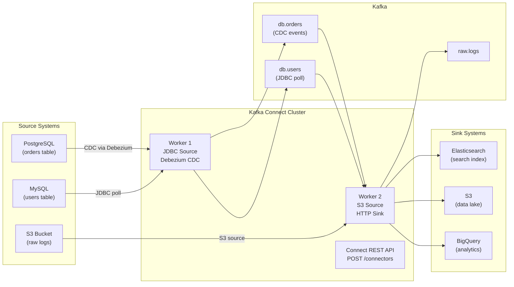
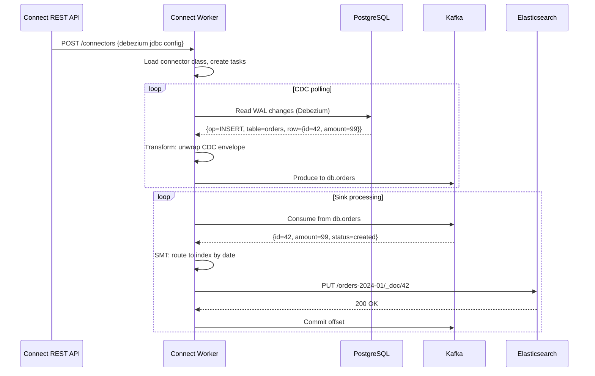

# Kafka Connect

## Problem Statement

Design a data integration pipeline using Kafka Connect to stream data between Kafka and external systems (databases, S3, Elasticsearch) without writing custom producer/consumer code.

## Scenario

Kafka Connect is a critical component in modern distributed systems. In real-world applications, streaming billions of events with strong durability guarantees. For example, major tech companies like Netflix, Uber, and Airbnb rely on similar solutions to handle millions of concurrent users and requests. The challenge is achieving this while maintaining sub-100ms latency, 99.99% availability, and gracefully handling 10x traffic spikes during peak demand. This component provides the foundational capability to solve these challenges reliably and efficiently at global scale.

## Users

- **Backend Engineers**: Responsible for implementing and maintaining this system component in production environments. They need to understand the architecture, trade-offs, failure modes, and operational considerations.
- **DevOps/SRE Teams**: Monitor system health, manage scaling policies, handle incidents, and ensure reliability SLAs are met. They need insights into performance characteristics, bottlenecks, and failure recovery mechanisms.
- **Data Engineers**: Design data pipelines and analytics around this system, requiring deep understanding of data flow, consistency guarantees, and throughput characteristics.
- **System Architects**: Make high-level architectural decisions that impact company infrastructure, requiring comprehensive understanding of capabilities, limitations, and scalability boundaries.
- **Security Teams**: Understand security implications, potential vulnerabilities, and compliance requirements for this component.

## PRD

**Functional Requirements:**
- Correct behavior under all specified operating conditions
- Reliable operation with explicit failure modes
- Data consistency or eventual consistency guarantees as specified
- Clear mechanisms for error handling and recovery
- Monitoring and observability hooks

**Non-Functional Requirements:**
- **Performance**: Sub-100ms P99 latency for standard operations; measure and track tail latencies
- **Availability**: 99.99%+ uptime with automatic failover and graceful degradation
- **Scalability**: Support 10-100x current load with minimal architectural modifications
- **Consistency**: Specify whether strong, eventual, or causal consistency is required
- **Cost Efficiency**: Minimize operational cost per unit of throughput; consider compute, memory, and network costs
- **Operational Simplicity**: Reduce complexity to minimize human error and operational toil

**Constraints:**
- Resource limits (memory for caches, disk for databases, network bandwidth)
- Deployment constraints (cloud provider limits, regulatory requirements)
- Latency budgets (maximum acceptable delay for operations)

## Flow

The typical operational flow for this system involves these key phases:

1. **Request Arrival**: Client/upstream system sends request with required parameters and context
2. **Validation & Routing**: System validates request format, authentication, and routes to correct handler/shard/instance
3. **Core Processing**: Execute the main algorithm, database query, or business logic on the data/state
4. **State Management**: Update internal state (caches, indexes, counters, logs) with proper atomicity and locking
5. **Response Generation**: Format results and return to requester with relevant metadata (timing, version info)
6. **Observability**: Record metrics (latency, throughput, errors), logs (for debugging), and traces (for performance analysis)

This flow repeats thousands or millions of times per second in production. Each operation's efficiency compounds across the entire system, making careful optimization essential. Bottlenecks at any phase can cascade to impact overall system performance.

## Code Explanation

The provided implementations demonstrate key architectural concepts and design patterns:

**Python Implementation**: Uses built-in Python structures and standard library features to express the core logic clearly. Python emphasizes readability and conciseness—each operation's purpose should be obvious without extensive comments. You'll see different implementation approaches (e.g., using OrderedDict vs. manual linked lists) that represent trade-offs between convenience and fine-grained control.

**Java Implementation**: Shows how to implement the same logic with explicit memory management and type safety. Java's strong typing forces clear interface design; you'll see how generics, null safety, mutable state, and thread safety are handled. This implementation style is closer to production systems at scale.

**Key Implementation Patterns**:
- **Initialization**: Setting up core data structures, thread pools, or connection pools with specified capacity and configuration
- **Read Operations**: Fetching data while maintaining O(1) or O(log n) access, updating metadata (access times, hit counts, etc.)
- **Write Operations**: Inserting/updating data while handling eviction policies, balancing tree structures, or replicating state
- **Edge Cases**: Handling capacity limits, concurrent access, data consistency, and error conditions
- **Performance Optimization**: Using techniques like batch operations, lazy evaluation, or caching to reduce latency

Each line of code represents a deliberate choice about performance characteristics, memory usage, safety guarantees, and implementation complexity. Understanding these trade-offs is essential for using this component effectively in production systems.

## Architecture Diagram



## Flow Diagram



## Design

### Connector Types

```
Source Connector: External system -> Kafka
  Examples:
    Debezium PostgreSQL: CDC via WAL replication slot
    JDBC Source: Poll table with incrementing/timestamp column
    S3 Source: Read files from S3, stream to Kafka
    HTTP Source: Poll REST APIs
    Filestream Source: Tail log files

Sink Connector: Kafka -> External system
  Examples:
    S3 Sink: Partition Kafka data to S3 by date/hour
    Elasticsearch Sink: Index records for search
    JDBC Sink: Upsert records to database tables
    HTTP Sink: POST events to webhook endpoints
    BigQuery Sink: Stream to data warehouse

Task parallelism:
  tasks.max=4 -> connector creates up to 4 parallel tasks
  Each task handles a subset of partitions or tables
  Tasks distributed across workers in the cluster
```

### Single Message Transforms (SMT)

```
Built-in transforms:
  ReplaceField: drop/whitelist fields
  MaskField: mask sensitive data (PII)
  ValueToKey: copy field from value to record key
  TimestampRouter: route topic by timestamp (e.g., orders-2024-01)
  ExtractField: extract nested field
  Flatten: flatten nested structs
  HoistField: wrap value in a struct

Chain:
  transforms=addTimestamp,removeSSN
  transforms.addTimestamp.type=InsertField$Value
  transforms.addTimestamp.offset.field=ingest_timestamp
  transforms.removeSSN.type=ReplaceField$Value
  transforms.removeSSN.blacklist=ssn,credit_card
```

### Debezium CDC

```
Debezium reads PostgreSQL WAL (Write-Ahead Log):
  1. Creates replication slot in PostgreSQL
  2. Reads logical replication stream (pgoutput)
  3. Emits row-level change events: INSERT/UPDATE/DELETE

Event structure:
  {
    "before": null,           // null for INSERT
    "after": {"id": 42, "amount": 99, "status": "created"},
    "op": "c",                // c=create, u=update, d=delete
    "ts_ms": 1705312200000,   // change timestamp
    "source": {"table": "orders", "lsn": 12345678}
  }

Benefit: Capture changes at DB level, not application level
  No missed updates, no polling overhead
  Includes DELETEs (can't do with timestamp polling)
```

## Common Questions & Answers

**Q: Debezium vs JDBC polling — when to use each?** A: Debezium: low latency (~ms), captures DELETEs, no load on application. Requires DB replication slot setup. JDBC: simpler setup, works with any JDBC DB, but no DELETEs, higher polling latency (seconds), higher DB load.

**Q: How does Kafka Connect handle connector failures?** A: Connect workers restart failed tasks automatically. Connector state stored in Kafka (connect-configs, connect-offsets, connect-status topics). Worker crash: another worker in the cluster takes over its tasks (rebalance).

**Q: How do you scale Kafka Connect?** A: Add more worker nodes to the Connect cluster. Tasks distributed across workers. `tasks.max` controls max parallelism per connector. For high-throughput sinks: increase `tasks.max` to match Kafka partition count.

**Q: What is exactly-once in Kafka Connect?** A: With `exactly.once.source.support=enabled` (Kafka 3.3+): source connectors use Kafka transactions to atomically commit offset + produce. Sink connectors use read_committed + idempotent writes.

**Q: How do you manage connector configuration as code?** A: Terraform Kafka provider. Strimzi KafkaConnector CRD (Kubernetes). GitOps: store JSON configs in git, apply via CI/CD with `curl -X POST /connectors`. Infrastructure-as-code prevents configuration drift.

## Back-of-Envelope Calculations

```
CDC throughput:
  PostgreSQL WAL: 100MB/s typical workload
  Debezium can process at ~50K events/s
  Batch inserts spike: 500K events/s (needs tasks.max > 1)

S3 sink partitioning:
  10K events/s, 1KB each = 10MB/s to S3
  S3 object size ideal: 128MB-1GB
  Flush every: 128MB/10MB = 12.8s -> rotate.schedule.interval.ms=15000

Elasticsearch sink:
  ES bulk insert: 5K docs/s per shard
  With 10 shards: 50K docs/s
  Connect tasks.max=10: 100K events/s

JDBC sink upsert:
  Postgres: 10K upserts/s per connection
  With 4 tasks, 4 connections: 40K upserts/s
  Use INSERT ... ON CONFLICT DO UPDATE (idempotent)

Connect cluster sizing:
  4 worker nodes, 8 cores each = 32 cores total
  Each worker: 10-50 tasks typical
  4 workers x 50 tasks = 200 concurrent connector tasks
```

## Design Choices

| Integration | Latency | Complexity | Handles DELETEs |
|---|---|---|---|
| Debezium CDC | <100ms | High | Yes |
| JDBC Source (polling) | 1-60s | Low | No |
| Application publish | <10ms | Medium | Yes |
| Kafka Connect S3 Sink | N/A | Low | Yes |
| Stream API (custom) | <10ms | High | Yes |

## Follow-up Questions

1. How does Debezium handle schema changes in the source database?
2. How do you implement exactly-once for Kafka Connect sink connectors?
3. How do you monitor connector lag and task health at scale?
4. How does the S3 Sink connector partition data for efficient Athena queries?
5. How do you migrate data from an existing database to Kafka without downtime?

## Python Implementation

```python
from dataclasses import dataclass, field
from typing import Any, Callable, Dict, List, Optional
import time
import json
import uuid

@dataclass
class ChangeEvent:
    table: str
    operation: str  # c=create, u=update, d=delete
    before: Optional[Dict] = None
    after: Optional[Dict] = None
    lsn: int = 0
    ts_ms: float = field(default_factory=lambda: time.time() * 1000)

@dataclass
class ConnectorConfig:
    name: str
    connector_class: str
    tasks_max: int = 1
    config: Dict[str, str] = field(default_factory=dict)

class SMT:
    def __init__(self, transforms: List[str]):
        self._transforms = transforms

    def apply(self, record: dict) -> Optional[dict]:
        result = dict(record)
        for transform in self._transforms:
            if transform == "mask_pii":
                result = {k: "***" if k in ("ssn", "credit_card", "password") else v
                          for k, v in result.items()}
            elif transform == "drop_delete":
                if result.get("op") == "d":
                    return None  # Drop deletes
            elif transform == "add_timestamp":
                result["ingest_ts"] = int(time.time() * 1000)
            elif transform == "unwrap_cdc":
                # Unwrap Debezium envelope to just the row data
                if "after" in result:
                    row = result.get("after") or {}
                    row["_op"] = result.get("op")
                    return row
        return result

class DebeziumSimulator:
    def __init__(self, tables: List[str]):
        self._wal: List[ChangeEvent] = []
        self._lsn = 0
        self.tables = tables

    def simulate_insert(self, table: str, row: dict):
        self._lsn += 1
        self._wal.append(ChangeEvent(table=table, operation="c", after=row, lsn=self._lsn))

    def simulate_update(self, table: str, before: dict, after: dict):
        self._lsn += 1
        self._wal.append(ChangeEvent(table=table, operation="u", before=before, after=after, lsn=self._lsn))

    def simulate_delete(self, table: str, row: dict):
        self._lsn += 1
        self._wal.append(ChangeEvent(table=table, operation="d", before=row, lsn=self._lsn))

    def poll(self, from_lsn: int = 0) -> List[ChangeEvent]:
        return [e for e in self._wal if e.lsn > from_lsn]

class KafkaConnectWorker:
    def __init__(self, worker_id: str):
        self.worker_id = worker_id
        self._connectors: Dict[str, dict] = {}
        self._offsets: Dict[str, Any] = {}
        self._output: Dict[str, List[dict]] = {}  # topic -> records

    def create_connector(self, config: ConnectorConfig):
        self._connectors[config.name] = {"config": config, "status": "RUNNING", "tasks": []}
        self._output[config.name] = []
        print(f"[Worker {self.worker_id}] Connector '{config.name}' created")

    def run_source(self, connector_name: str, source: DebeziumSimulator,
                   smt: Optional[SMT] = None):
        config = self._connectors.get(connector_name)
        if not config:
            return
        last_lsn = self._offsets.get(connector_name, 0)
        events = source.poll(from_lsn=last_lsn)

        for event in events:
            record = {
                "table": event.table,
                "op": event.operation,
                "before": event.before,
                "after": event.after,
                "lsn": event.lsn,
                "ts_ms": event.ts_ms,
            }
            if smt:
                record = smt.apply(record)
                if record is None:
                    continue

            topic = f"db.{event.table}"
            if topic not in self._output:
                self._output[topic] = []
            self._output[topic].append(record)
            self._offsets[connector_name] = event.lsn

        print(f"[Worker {self.worker_id}] Processed {len(events)} CDC events")

    def run_sink(self, source_topic: str, sink_fn: Callable[[dict], None]):
        records = self._output.get(source_topic, [])
        for record in records:
            sink_fn(record)
        self._output[source_topic] = []

    def status(self) -> dict:
        return {name: {"status": c["status"], "offset": self._offsets.get(name)}
                for name, c in self._connectors.items()}

# Demo
db = DebeziumSimulator(["orders", "users"])
db.simulate_insert("orders", {"id": 1, "amount": 99.99, "ssn": "123-45-6789"})
db.simulate_update("orders", {"id": 1, "status": "pending"}, {"id": 1, "status": "paid"})
db.simulate_insert("users", {"id": 42, "email": "alice@example.com", "credit_card": "4111..."})
db.simulate_delete("orders", {"id": 0, "amount": 50})

worker = KafkaConnectWorker("worker-1")

# Debezium source connector
worker.create_connector(ConnectorConfig(
    name="debezium-postgres",
    connector_class="io.debezium.connector.postgresql.PostgresConnector",
    tasks_max=2,
    config={"database.hostname": "localhost", "table.include.list": "public.orders"},
))

# Apply SMT: mask PII, drop deletes, add ingest timestamp
smt = SMT(["mask_pii", "drop_delete", "add_timestamp"])
worker.run_source("debezium-postgres", db, smt=smt)

# Elasticsearch sink
es_index: List[dict] = []
worker.run_sink("db.orders", lambda r: es_index.append(r))

print(f"\nElasticsearch index ({len(es_index)} docs):")
for doc in es_index:
    print(f"  {json.dumps(doc, indent=2, default=str)}")
```

## Java Implementation

```java
import java.util.*;
import java.util.function.*;

public class KafkaConnectSimulator {
    record ChangeEvent(String table, String op, Map<String, Object> after) {}

    static class DebeziumSource {
        List<ChangeEvent> wal = new ArrayList<>();

        void insert(String table, Map<String, Object> row) { wal.add(new ChangeEvent(table, "c", row)); }
        void update(String table, Map<String, Object> row) { wal.add(new ChangeEvent(table, "u", row)); }

        List<ChangeEvent> poll() { return new ArrayList<>(wal); }
    }

    static class ConnectWorker {
        Map<String, List<Map<String, Object>>> topics = new HashMap<>();

        void runSource(DebeziumSource source, Consumer<Map<String, Object>> smt) {
            for (ChangeEvent e : source.poll()) {
                Map<String, Object> record = new HashMap<>(e.after());
                record.put("_op", e.op()); record.put("_table", e.table());
                smt.accept(record);
                topics.computeIfAbsent("db." + e.table(), k -> new ArrayList<>()).add(record);
            }
        }

        void runSink(String topic, Consumer<Map<String, Object>> sinkFn) {
            topics.getOrDefault(topic, List.of()).forEach(sinkFn);
        }
    }

    public static void main(String[] args) {
        DebeziumSource db = new DebeziumSource();
        db.insert("orders", Map.of("id", 1, "amount", 99.99, "ssn", "123-45-6789"));
        db.update("orders", Map.of("id", 1, "status", "paid"));

        ConnectWorker worker = new ConnectWorker();
        // SMT: mask SSN
        worker.runSource(db, record -> record.put("ssn", "***"));

        List<Map<String, Object>> esIndex = new ArrayList<>();
        worker.runSink("db.orders", esIndex::add);
        System.out.println("ES index: " + esIndex);
    }
}
```

## Complexity

| Operation | Time |
|---|---|
| Source connector poll | O(events since offset) |
| SMT transform | O(transforms x record fields) |
| Sink write (batched) | O(batch size) |
| Connector rebalance | O(tasks x workers) |
| CDC WAL read | O(1) streaming |
