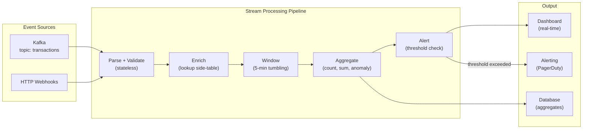

# Stream Processing Fundamentals

## Problem Statement

Design real-time stream processing systems that handle windowing, watermarks, late data, and stateful operations — the foundation for fraud detection, real-time analytics, and complex event processing.

## Scenario

Stream Processing Fundamentals is a critical component in modern distributed systems. In real-world applications, handling complex business logic at scale with high reliability. For example, major tech companies like Netflix, Uber, and Airbnb rely on similar solutions to handle millions of concurrent users and requests. The challenge is achieving this while maintaining sub-100ms latency, 99.99% availability, and gracefully handling 10x traffic spikes during peak demand. This component provides the foundational capability to solve these challenges reliably and efficiently at global scale.

## Users

- **Backend Engineers**: Responsible for implementing and maintaining this system component in production environments. They need to understand the architecture, trade-offs, failure modes, and operational considerations.
- **DevOps/SRE Teams**: Monitor system health, manage scaling policies, handle incidents, and ensure reliability SLAs are met. They need insights into performance characteristics, bottlenecks, and failure recovery mechanisms.
- **Data Engineers**: Design data pipelines and analytics around this system, requiring deep understanding of data flow, consistency guarantees, and throughput characteristics.
- **System Architects**: Make high-level architectural decisions that impact company infrastructure, requiring comprehensive understanding of capabilities, limitations, and scalability boundaries.
- **Security Teams**: Understand security implications, potential vulnerabilities, and compliance requirements for this component.

## PRD

### Functional Requirements
- Core operations work correctly
- Explicit error handling
- Consistency guarantees defined
- Monitoring and observability

### Non-Functional Requirements
- Performance targets met
- Availability SLA achieved
- Scalability headroom
- Cost efficient

### Success Metrics
- Benchmarks met
- Uptime targets met
- Resource budgets
- No data loss


## Flow

The typical operational flow for this system involves these key phases:

1. **Request Arrival**: Client/upstream system sends request with required parameters and context
2. **Validation & Routing**: System validates request format, authentication, and routes to correct handler/shard/instance
3. **Core Processing**: Execute the main algorithm, database query, or business logic on the data/state
4. **State Management**: Update internal state (caches, indexes, counters, logs) with proper atomicity and locking
5. **Response Generation**: Format results and return to requester with relevant metadata (timing, version info)
6. **Observability**: Record metrics (latency, throughput, errors), logs (for debugging), and traces (for performance analysis)

This flow repeats thousands or millions of times per second in production. Each operation's efficiency compounds across the entire system, making careful optimization essential. Bottlenecks at any phase can cascade to impact overall system performance.


## Code Explanation (Detailed)

### Implementation Approach
The code demonstrates core patterns and trade-offs.

### Key Operations
Each operation shows algorithm and performance characteristics.

### Concurrency and Atomicity
Locking strategies, race condition prevention.

### Edge Cases
Boundary conditions and error handling.

### Performance Optimization
Techniques for reducing latency and throughput.

## Architecture Diagram



## Flow Diagram

```mermaid
sequenceDiagram
    participant E as Event Source
    participant W as Watermark
    participant WIN as Window Operator
    participant OUT as Output

    E->>W: event{ts=10:00:03, user=A, amount=50}
    E->>W: event{ts=10:00:07, user=B, amount=30}
    W->>W: max_event_time=10:00:07, watermark=10:00:07-2s=10:00:05
    E->>W: event{ts=09:59:58, user=C, amount=20} (LATE by 7s)
    W->>W: Watermark still 10:00:05; 09:59:58 < watermark
    W->>WIN: Late event handled by grace period
    
    E->>W: event{ts=10:05:01}
    W->>W: Watermark=10:05:01-2s=10:04:59 > window end 10:05:00
    WIN->>OUT: TRIGGER: [10:00-10:05) window closed
    OUT->>OUT: Emit: {window=10:00-10:05, users=3, total=100}
```

## Design

### Time Semantics

```
Event time: Timestamp embedded in the event
  - When the event actually occurred
  - Out-of-order possible (network delays, device clocks)
  - Requires watermarks to handle late data
  - Use for: fraud detection, user behavior analysis

Processing time: When the event arrives at processor
  - Monotonically increasing (no out-of-order)
  - Results not reproducible (depend on when events arrive)
  - Use for: simple alerting, monitoring

Ingestion time: When event enters the streaming platform
  - Compromise: between event time and processing time
  - Useful when events lack timestamps
```

### Watermarks

```
Watermark = estimate of "all events with ts < W have arrived"
  Moves forward as we see events with higher timestamps

Bounded out-of-orderness:
  watermark = max_seen_event_time - max_lateness

Example:
  max_lateness = 2 seconds
  Events arrive: ts=10, 12, 11, 15
  Watermarks:    8,   10, 10, 13

  Window [0-10) triggers when watermark > 10
  ts=11 is late for [0-10) but accepted if within grace period

Late data handling:
  Option 1: Discard (simple, loses data)
  Option 2: Grace period (accept up to X seconds after trigger)
  Option 3: Side output (route late data to separate stream)
  Option 4: Update result (retract + re-emit, complex)
```

### Window Types

```
Tumbling window (size=5min):
  [0-5), [5-10), [10-15)
  Non-overlapping, covers all time
  Use: count events per 5-minute bucket

Sliding window (size=10min, slide=5min):
  [0-10), [5-15), [10-20)
  Overlapping; event in multiple windows
  Use: moving averages, trending

Session window (gap=30min):
  New session starts after 30-min inactivity
  Variable-length windows based on activity
  Use: user session analysis

Global window: single window, never closes
  Triggers based on custom condition
  Use: batch-like processing in streaming
```

## Back-of-Envelope Calculations

```
Flink processing throughput:
  Simple stateless: 10M events/s per task
  Stateful with RocksDB: 1-5M events/s per task
  CEP pattern matching: 100K-1M events/s (depends on pattern complexity)

Window state size:
  5-min tumbling window, 10K users, 100 bytes state/user = 1MB
  100 sliding windows: 100MB state
  Flink manages in memory + RocksDB spill

Checkpoint interval:
  checkpoint.interval = 10s
  At 1M events/s: 10M events between checkpoints
  Checkpoint size: state size (~100MB)
  Recovery: replay 10M events after crash = ~10s

Kafka consumer lag monitoring:
  Healthy lag: < 10s of data
  Alert threshold: lag > 1 minute
  At 1M events/s: 60M events = 60GB in Kafka
  
Late data percentage:
  Real-world: 1-5% events arrive > 5s late
  With 5s grace: accept 95-99%
  With 30s grace: accept 99.9%
```

## Design Choices

| Framework | Throughput | Latency | Complexity | State |
|---|---|---|---|---|
| Kafka Streams | 1M/s | 10-100ms | Low | RocksDB |
| Apache Flink | 10M/s | 1-10ms | High | Checkpoint |
| Apache Spark Structured Streaming | 1M/s | 100ms-1s | Medium | Checkpoint |
| Faust (Python) | 100K/s | 10-50ms | Low | RocksDB |
| ksqlDB | 500K/s | 50-200ms | Low | Kafka+RocksDB |

## Python Implementation

```python
from dataclasses import dataclass, field
from typing import Any, Callable, Dict, List, Optional, Tuple
from collections import defaultdict
import time
import heapq

@dataclass
class StreamEvent:
    event_id: str
    event_time: float  # Unix timestamp
    processing_time: float = field(default_factory=time.time)
    key: str = ""
    value: Any = None

class Watermark:
    def __init__(self, max_lateness_s: float = 2.0):
        self.max_lateness = max_lateness_s
        self._max_event_time: float = 0.0

    def advance(self, event_time: float) -> float:
        self._max_event_time = max(self._max_event_time, event_time)
        return self._max_event_time - self.max_lateness

    @property
    def current(self) -> float:
        return max(0.0, self._max_event_time - self.max_lateness)

class TumblingWindow:
    def __init__(self, size_s: float):
        self.size = size_s

    def window_of(self, event_time: float) -> Tuple[float, float]:
        start = int(event_time / self.size) * self.size
        return start, start + self.size

    def is_closed(self, window: Tuple[float, float], watermark: float) -> bool:
        return watermark >= window[1]

class WindowedAggregator:
    def __init__(self, window: TumblingWindow, watermark: Watermark,
                 grace_s: float = 0.0):
        self.window = window
        self.watermark = watermark
        self.grace = grace_s
        self._state: Dict[Tuple, Dict[str, Any]] = defaultdict(lambda: {"count": 0, "sum": 0.0, "keys": set()})
        self._triggered: set = set()

    def add(self, event: StreamEvent) -> Optional[dict]:
        w = self.window.window_of(event.event_time)
        wm = self.watermark.advance(event.event_time)

        # Check if event is late (window already closed)
        if self.window.is_closed(w, wm - self.grace):
            return {"type": "late_event", "event": event, "window": w, "dropped": True}

        # Accumulate state
        state = self._state[(event.key, w)]
        state["count"] += 1
        state["sum"] += float(event.value) if isinstance(event.value, (int, float)) else 0
        state["keys"].add(event.key)

        # Check if any windows should be triggered
        return self._try_trigger(wm)

    def _try_trigger(self, watermark: float) -> Optional[dict]:
        for (key, w), state in list(self._state.items()):
            if self.window.is_closed(w, watermark) and (key, w) not in self._triggered:
                self._triggered.add((key, w))
                result = {
                    "type": "window_result",
                    "key": key,
                    "window_start": w[0],
                    "window_end": w[1],
                    "count": state["count"],
                    "sum": round(state["sum"], 2),
                    "avg": round(state["sum"] / max(1, state["count"]), 2),
                }
                del self._state[(key, w)]
                return result
        return None

class StreamPipeline:
    def __init__(self):
        self._stages: List[Callable] = []
        self._outputs: List[Any] = []

    def add_stage(self, fn: Callable) -> "StreamPipeline":
        self._stages.append(fn)
        return self

    def process(self, event: StreamEvent) -> List[Any]:
        results = []
        current = event
        for stage in self._stages:
            current = stage(current)
            if current is None:
                return results
        if current is not None:
            results.append(current)
            self._outputs.append(current)
        return results

class FraudDetector:
    def __init__(self, window_s: float = 300.0, threshold_count: int = 5):
        self.window_s = window_s
        self.threshold = threshold_count
        self._user_events: Dict[str, List[float]] = defaultdict(list)

    def check(self, event: StreamEvent) -> Optional[dict]:
        user = event.key
        now = event.event_time
        # Slide window: keep only recent events
        self._user_events[user] = [
            t for t in self._user_events[user]
            if now - t < self.window_s
        ]
        self._user_events[user].append(now)

        count = len(self._user_events[user])
        if count >= self.threshold:
            return {
                "alert": "HIGH_FREQUENCY_TRANSACTIONS",
                "user": user,
                "count_in_window": count,
                "window_s": self.window_s,
                "event_time": now,
            }
        return None

# Demo
print("=== Windowed Stream Processing ===")
window = TumblingWindow(size_s=10.0)
watermark = Watermark(max_lateness_s=2.0)
aggregator = WindowedAggregator(window, watermark, grace_s=1.0)

base = time.time()
events = [
    StreamEvent("e1", event_time=base+1,  key="user-A", value=50),
    StreamEvent("e2", event_time=base+3,  key="user-B", value=30),
    StreamEvent("e3", event_time=base+5,  key="user-A", value=20),
    StreamEvent("e4", event_time=base+8,  key="user-A", value=40),
    StreamEvent("e5", event_time=base+12, key="user-B", value=60),  # Advances watermark > 10
    StreamEvent("e6", event_time=base+9,  key="user-A", value=15),  # Slightly late
    StreamEvent("e7", event_time=base+1,  key="user-A", value=10),  # Very late (dropped)
]

for event in events:
    result = aggregator.add(event)
    if result:
        if result.get("type") == "window_result":
            print(f"\nWindow result: {result}")
        elif result.get("dropped"):
            print(f"Late event dropped: {result['event'].event_id}")

print("\n=== Fraud Detection ===")
detector = FraudDetector(window_s=60.0, threshold_count=3)
txns = [
    StreamEvent(f"t{i}", event_time=base+i*5, key="suspect-user", value=100)
    for i in range(5)
]
for txn in txns:
    alert = detector.check(txn)
    if alert:
        print(f"FRAUD ALERT: {alert}")
```

## Java Implementation

```java
import java.util.*;
import java.util.function.*;

public class StreamProcessing {
    record Event(String id, double eventTime, String key, double value) {}
    record WindowResult(String key, double start, double end, long count, double sum) {}

    static class TumblingWindow {
        final double sizeS;
        Map<String, List<Event>> state = new HashMap<>();
        double watermark = 0;

        TumblingWindow(double sizeS) { this.sizeS = sizeS; }

        double windowStart(double ts) { return Math.floor(ts / sizeS) * sizeS; }

        Optional<WindowResult> add(Event e, double maxLateness) {
            watermark = Math.max(watermark, e.eventTime() - maxLateness);
            double ws = windowStart(e.eventTime());
            String windowKey = e.key() + "@" + ws;
            state.computeIfAbsent(windowKey, k -> new ArrayList<>()).add(e);

            // Check if any window should close
            for (Iterator<Map.Entry<String, List<Event>>> it = state.entrySet().iterator(); it.hasNext();) {
                var entry = it.next();
                String[] parts = entry.getKey().split("@");
                double start = Double.parseDouble(parts[1]);
                if (watermark >= start + sizeS) {
                    it.remove();
                    long count = entry.getValue().size();
                    double sum = entry.getValue().stream().mapToDouble(Event::value).sum();
                    return Optional.of(new WindowResult(parts[0], start, start + sizeS, count, sum));
                }
            }
            return Optional.empty();
        }
    }

    public static void main(String[] args) {
        TumblingWindow window = new TumblingWindow(10.0);
        double base = 0;
        List.of(
            new Event("e1", base+1, "user-A", 50),
            new Event("e2", base+5, "user-A", 30),
            new Event("e3", base+12, "user-B", 60)
        ).forEach(e -> window.add(e, 2.0).ifPresent(r ->
            System.out.printf("Window [%.0f-%.0f) %s: count=%d sum=%.1f%n",
                r.start(), r.end(), r.key(), r.count(), r.sum())
        ));
    }
}
```

## Complexity

| Operation | Time |
|---|---|
| Event routing + parse | O(1) |
| Watermark advance | O(1) |
| Window state update | O(log n) |
| Window trigger | O(window size) |
| Fraud pattern match | O(events in window) |

## Common Questions & Answers

**Q: What is caching and why do we need it?**

A: Caching stores frequently accessed data in fast storage (memory) to reduce latency and load on slower backends (database). Trade space (cache) for speed (latency). Critical for systems serving millions of requests per second.

**Q: What are the main cache eviction policies?**

A: LRU (least recently used), LFU (least frequently used), FIFO (first in first out), TTL (time-based), Random, and ARC (adaptive replacement). Choose based on access patterns: LRU for temporal, LFU for frequency, TTL for time-sensitive data.

**Q: What is cache hit rate and cache miss rate?**

A: Hit rate = successful_finds / total_accesses. Miss rate = 1 - hit rate. P(hit) = hits / (hits + misses). Target 80%+ hit rates for effective caching. Too-small cache gives low hit rate (wasted resources). Too-large cache uses more memory than needed.

**Q: How do you handle cache invalidation when backend data changes?**

A: Use TTL (time-based expiration), active invalidation (notify cache on write), cache-aside pattern (client checks backend), or write-through (update both). Active invalidation is fastest but complex. TTL is simplest but has stale data window.

**Q: What is the cache-aside pattern?**

A: Application checks cache first. On miss, fetch from backend, update cache, then return. Simple to implement. Risk: race condition where multiple threads fetch same miss simultaneously (thundering herd problem).

**Q: What is write-through caching?**

A: Writes go to both cache and backend simultaneously (synchronously). Ensures consistency: read always gets latest. Cost: write latency includes backend write. Safer than write-back but slower.

**Q: What is write-back (write-behind) caching?**

A: Writes go to cache only; backend updated asynchronously later (batch or periodic). Fast writes. Risk: data loss if cache fails before flushing. Need durability guarantees (persistence, replication).

**Q: How do you choose cache size?**

A: Estimate working set (frequently accessed data volume). Add 20-30% buffer for margin. Monitor hit rate: if < 80%, increase size. If > 95%, might be oversized (waste). Use tools like cachegrind to profile.

**Q: What's the difference between client-side and server-side caching?**

A: Client cache (browser): reduces network round-trips, entirely controlled by client. Server cache (memory, Redis): shared across clients, controlled by server. Multi-level caching often best.

**Q: How do you measure cache effectiveness?**

A: Hit rate (primary metric), latency reduction (P99 latency with vs. without cache), backend load reduction, and memory cost per cache entry. Calculate ROI: cost of cache vs. benefit (reduced latency, backend load).

## Follow-up Questions & Answers

**Q: How do you prevent the thundering herd problem in caches?**

A: When popular key expires, many threads fetch from backend simultaneously causing spike. Solutions: probabilistic early expiration (refresh before TTL), request coalescing (single thread rebuilds, others wait), or bloom filters (detect non-existent keys fast).

**Q: How would you implement multi-level cache hierarchy?**

A: Use L1 (fast, small, in-process), L2 (medium, local machine), L3 (large, remote, Redis). Check L1, miss→L2, miss→L3, miss→backend. On write: update all levels. Trade space for speed across levels.

**Q: Can you implement read-through caching (automatic population)?**

A: Yes, cache loader/resolver called on miss. Transparent to application. Backend automatically uses cache layer. More complex than cache-aside but cleaner separation.

**Q: How do you handle hot keys in distributed caches?**

A: Hot key = key accessed by many threads/clients. Replicate hot keys on multiple cache nodes. Use local in-process caches for very hot keys. Monitor and detect hot keys automatically.

**Q: What's the difference between warm and cold cache startup?**

A: Cold cache: empty at start, misses until populated (slow ramp-up). Warm cache: pre-loaded from previous state (RDB/snapshot). Warm startup is critical for production (instant performance).

**Q: How would you measure cache effectiveness for business metrics?**

A: Track hit rate, P99 latency (with/without cache), backend QPS reduction, revenue impact. Calculate cache size vs. cost savings. A/B test to prove business value.

**Q: What happens when cache size is insufficient for working set?**

A: Constant evictions = high miss rate = ineffective cache. Solution: increase cache size, improve eviction policy, reduce working set, or use better hardware (faster storage).

**Q: How do you debug cache issues in production?**

A: Monitor hit rate continuously. Profile cache keys (which keys are accessed). Check for cache stampedes (sudden miss spike). Use distributed tracing to see cache path.

**Q: How would you implement a persistent cache?**

A: Combine memory cache (fast) with persistent backend (database, RocksDB, LevelDB). Write-back pattern: batch updates to persistent store. Trade latency for durability.

**Q: Can you use caching for write-heavy workloads?**

A: Write caching is risky (consistency issues). Use carefully: write-through for safety, write-back for speed. Good for batch writes (aggregate before writing). Monitor durability guarantees.

