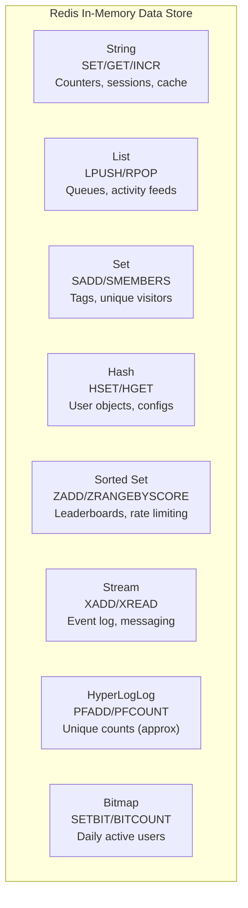
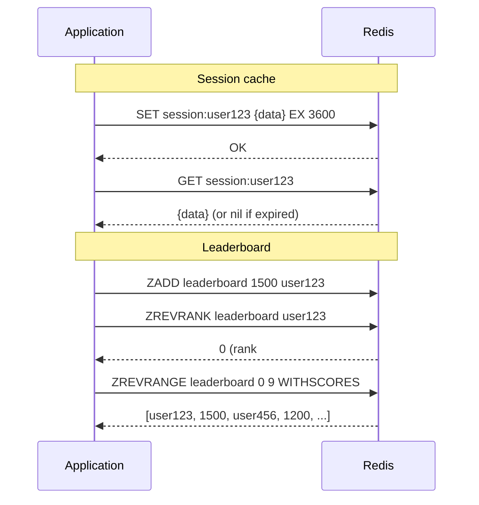

# Redis Data Structures

## Problem Statement

Master Redis's core data structures — Strings, Lists, Sets, Hashes, Sorted Sets, and modern additions like Streams and HyperLogLog — choosing the right one for each use case.

## Architecture Diagram



## Flow Diagram



## Design

### Data Structure Selection

```
String:
  - Max: 512MB value
  - Use: counters (INCR/DECR), simple cache, session tokens
  - Atomic: INCR, SETNX (SET if not exists, for locks)
  - Commands: GET, SET, MGET, MSET, INCR, INCRBY, APPEND

List:
  - Doubly-linked list (lpush: O(1), lindex: O(n))
  - Use: task queues (RPUSH + BLPOP), activity feed, recent items
  - Max: 2^32-1 elements
  - BLPOP: blocking pop (wait until element available) = simple queue

Hash:
  - Flat map within a key (field -> value)
  - Use: user profiles, object attributes
  - More memory-efficient than separate keys for related data
  - Commands: HSET, HGET, HGETALL, HMSET, HDEL

Set:
  - Unordered collection of unique strings
  - O(1) add/remove/lookup
  - Set operations: SUNION, SINTER, SDIFF
  - Use: tags, "following" list, unique visitors

Sorted Set (ZSet):
  - Unique members + float score
  - Sorted by score
  - O(log n) for all operations (skip list + hash table)
  - Use: leaderboards, priority queues, range queries by score
  - ZADD, ZRANGEBYSCORE, ZREVRANK, ZINCRBY

Stream:
  - Append-only log with consumer groups (like Kafka, but in Redis)
  - XADD: append event; XREAD: consume
  - Consumer groups: distributed processing of stream
  - Use: event sourcing, activity logs, lightweight messaging

HyperLogLog:
  - Probabilistic unique count (0.81% error rate)
  - Fixed 12KB regardless of cardinality
  - Use: unique visitors, distinct queries (when exact count not needed)
  - PFADD, PFCOUNT, PFMERGE

Bitmap:
  - String treated as array of bits
  - SETBIT key offset 1; GETBIT; BITCOUNT
  - 1 byte = 8 users; 1M users = 128KB
  - Use: daily active users, feature flags per user, bloom filter
```

### Memory Optimization

```
Hash encoding:
  Small hashes (< 128 fields, values < 64 bytes): ziplist = compact
  Large hashes: hashtable = fast

ZSet encoding:
  Small (< 128 elements): ziplist
  Large: skiplist + hashtable

Key naming:
  Namespace: "session:user:1234" (colon-separated)
  Hash tags: "{user}.profile", "{user}.scores" -> same slot in cluster
  Avoid: large keyspaces without expiry (memory leak)
```

## Common Questions & Answers

**Q: Why use Redis Hash instead of JSON String?** A: Hash allows partial updates (HSET user:1 email new@ex.com) without fetching/parsing/re-serializing the entire object. Also memory-efficient for small objects (ziplist encoding).

**Q: When would you use HyperLogLog?** A: Counting unique visitors at scale where exact count isn't needed. 1B unique visitors = still 12KB in HyperLogLog. Exact set would be gigabytes. Error rate 0.81% is acceptable for analytics.

**Q: What is the time complexity of Sorted Set operations?** A: ZADD: O(log n). ZRANGEBYSCORE: O(log n + k) where k = returned elements. ZREVRANK: O(log n). ZCARD: O(1). Use for leaderboards, rate limiting windows, time-range queries.

**Q: How do Redis Lists compare to Streams for queuing?** A: Lists: simple RPUSH + BLPOP pattern. No consumer groups, no acknowledgment, no replay. Streams: like Kafka — consumer groups, persistent, replay. Lists = simple task queue; Streams = reliable message log.

**Q: What is SETNX and how is it used for distributed locks?** A: SETNX (SET if Not eXists) atomically sets a key only if it doesn't exist. Combined with expiry: `SET lock:resource uniqueid NX EX 30` — only one holder, auto-expires to prevent deadlock. Better with Redlock for multi-node safety.

## Back-of-Envelope Calculations

```
Memory overhead:
  String: key overhead ~60 bytes + value
  Hash (ziplist): ~100 bytes overhead + fields
  Sorted Set: ~300 bytes per element (skiplist pointers)

  User session (Hash): 20 fields x 50 bytes = 1KB/user
  1M users: 1GB (fits in 16GB Redis)

HyperLogLog:
  Any cardinality: 12KB fixed
  vs Set: 1M unique IPs x 4 bytes = 4MB
  HyperLogLog: 99.1%+ accuracy, 333x less memory

Bitmap for DAU:
  1M users: 1M bits = 128KB per day
  365 days: 365 * 128KB = 46MB per year
  BITCOUNT: count active users in O(n) where n = 128KB

Sorted Set rate limiting:
  Sliding window: add event with score=timestamp, ZREMRANGEBYSCORE by old window
  1K users, 100 events each: 100K sorted set entries = ~30MB
```

## Design Choices

| Use Case | Data Structure | Alternative |
|---|---|---|
| Simple cache | String + TTL | Hash if multiple fields |
| Session | Hash | String (JSON) |
| Task queue | List (BLPOP) | Stream (with ack) |
| Unique count exact | Set | - |
| Unique count approx | HyperLogLog | - |
| Leaderboard | Sorted Set | SQL ORDER BY |
| Rate limiting | Sorted Set (sliding window) | String (counter, fixed window) |
| Feature flags | Bitmap | Set |
| Activity log | Stream | List |

## Follow-up Questions

1. How do you implement a distributed rate limiter using Sorted Sets?
2. How does Redis OBJECT ENCODING decide which encoding to use?
3. How would you build a "friends of friends" feature using Set operations?
4. How does Redis Stream consumer group differ from Pub/Sub?
5. How do you use Redis Bitmap to implement a bloom filter?

## Python Implementation

```python
import time
import math
from typing import Any, Dict, List, Optional, Set, Tuple
from dataclasses import dataclass, field
from collections import defaultdict
import heapq

class RedisString:
    def __init__(self):
        self._store: Dict[str, Tuple[str, Optional[float]]] = {}

    def set(self, key: str, value: str, ex: Optional[int] = None, nx: bool = False) -> bool:
        if nx and key in self._store and self._store[key][1] is None or (
            nx and key in self._store and self._store[key][1] is not None and time.time() < self._store[key][1]
        ):
            return False
        expiry = time.time() + ex if ex else None
        self._store[key] = (value, expiry)
        return True

    def get(self, key: str) -> Optional[str]:
        if key not in self._store:
            return None
        val, expiry = self._store[key]
        if expiry and time.time() > expiry:
            del self._store[key]
            return None
        return val

    def incr(self, key: str, amount: int = 1) -> int:
        val = int(self.get(key) or 0) + amount
        self._store[key] = (str(val), None)
        return val

    def mget(self, keys: List[str]) -> List[Optional[str]]:
        return [self.get(k) for k in keys]

class RedisHash:
    def __init__(self):
        self._store: Dict[str, Dict[str, str]] = {}

    def hset(self, key: str, field: str, value: str) -> int:
        if key not in self._store:
            self._store[key] = {}
        is_new = field not in self._store[key]
        self._store[key][field] = value
        return 1 if is_new else 0

    def hget(self, key: str, field: str) -> Optional[str]:
        return self._store.get(key, {}).get(field)

    def hgetall(self, key: str) -> Dict[str, str]:
        return dict(self._store.get(key, {}))

    def hdel(self, key: str, *fields: str) -> int:
        h = self._store.get(key, {})
        deleted = sum(1 for f in fields if h.pop(f, None) is not None)
        return deleted

    def hmset(self, key: str, mapping: Dict[str, str]):
        for field, value in mapping.items():
            self.hset(key, field, value)

class RedisSortedSet:
    def __init__(self):
        self._scores: Dict[str, Dict[str, float]] = {}
        self._sorted: Dict[str, List[Tuple[float, str]]] = {}
        self._dirty: Dict[str, bool] = {}

    def zadd(self, key: str, member: str, score: float) -> int:
        if key not in self._scores:
            self._scores[key] = {}
            self._sorted[key] = []
        is_new = member not in self._scores[key]
        self._scores[key][member] = score
        self._dirty[key] = True
        return 1 if is_new else 0

    def _ensure_sorted(self, key: str):
        if self._dirty.get(key):
            self._sorted[key] = sorted(
                [(score, member) for member, score in self._scores.get(key, {}).items()]
            )
            self._dirty[key] = False

    def zrevrank(self, key: str, member: str) -> Optional[int]:
        self._ensure_sorted(key)
        lst = list(reversed(self._sorted.get(key, [])))
        for i, (_, m) in enumerate(lst):
            if m == member:
                return i
        return None

    def zrangebyscore(self, key: str, min_score: float, max_score: float) -> List[Tuple[str, float]]:
        self._ensure_sorted(key)
        return [(m, s) for s, m in self._sorted.get(key, []) if min_score <= s <= max_score]

    def zrevrange(self, key: str, start: int, stop: int) -> List[Tuple[str, float]]:
        self._ensure_sorted(key)
        lst = list(reversed(self._sorted.get(key, [])))
        return [(m, s) for s, m in lst[start:stop+1]]

    def zincrby(self, key: str, member: str, amount: float) -> float:
        current = self._scores.get(key, {}).get(member, 0.0)
        self.zadd(key, member, current + amount)
        return current + amount

    def zremrangebyscore(self, key: str, min_score: float, max_score: float) -> int:
        self._ensure_sorted(key)
        to_remove = [m for s, m in self._sorted.get(key, []) if min_score <= s <= max_score]
        for m in to_remove:
            del self._scores[key][m]
        self._dirty[key] = True
        return len(to_remove)

class SlidingWindowRateLimiter:
    def __init__(self, zset: RedisSortedSet, window_s: float = 60.0, max_requests: int = 100):
        self.zset = zset
        self.window = window_s
        self.max_requests = max_requests

    def is_allowed(self, user_id: str) -> bool:
        now = time.time()
        key = f"rate:{user_id}"
        # Remove events outside window
        self.zset.zremrangebyscore(key, 0, now - self.window)
        # Count current events
        current = len(self.zset.zrangebyscore(key, now - self.window, now))
        if current >= self.max_requests:
            return False
        # Add this request
        self.zset.zadd(key, f"req-{now}", now)
        return True

class HyperLogLogSimulator:
    def __init__(self, error_rate: float = 0.0081):
        self._sketches: Dict[str, Set[str]] = {}
        self.error_rate = error_rate

    def pfadd(self, key: str, *elements: str) -> int:
        if key not in self._sketches:
            self._sketches[key] = set()
        before = len(self._sketches[key])
        self._sketches[key].update(elements)
        return 1 if len(self._sketches[key]) != before else 0

    def pfcount(self, *keys: str) -> int:
        combined = set()
        for k in keys:
            combined |= self._sketches.get(k, set())
        return len(combined)  # Simplified: real HLL uses hash-based estimation

# Demo
print("=== Redis String (Counter) ===")
r_str = RedisString()
r_str.set("page_views", "0")
for _ in range(5):
    count = r_str.incr("page_views")
print(f"Page views: {count}")

print("\n=== Redis Hash (User Profile) ===")
r_hash = RedisHash()
r_hash.hmset("user:1", {"name": "Alice", "email": "alice@ex.com", "score": "1500"})
r_hash.hset("user:1", "score", "1750")
print(f"User profile: {r_hash.hgetall('user:1')}")

print("\n=== Redis Sorted Set (Leaderboard) ===")
r_zset = RedisSortedSet()
for user, score in [("alice", 1500), ("bob", 1200), ("carol", 1800), ("dave", 1100)]:
    r_zset.zadd("leaderboard", user, score)

print("Top 3 players:")
for i, (member, score) in enumerate(r_zset.zrevrange("leaderboard", 0, 2)):
    print(f"  #{i+1} {member}: {score:.0f}")

r_zset.zincrby("leaderboard", "bob", 700)
print(f"\nBob's new rank: #{r_zset.zrevrank('leaderboard', 'bob') + 1}")

print("\n=== Sliding Window Rate Limiter ===")
limiter = SlidingWindowRateLimiter(r_zset, window_s=1.0, max_requests=3)
for i in range(5):
    allowed = limiter.is_allowed("user-A")
    print(f"  Request {i+1}: {'ALLOWED' if allowed else 'RATE LIMITED'}")

print("\n=== HyperLogLog (Unique Visitors) ===")
hll = HyperLogLogSimulator()
for day, users in [("day1", ["A", "B", "C", "D"]), ("day2", ["C", "D", "E", "F"])]:
    hll.pfadd(day, *users)
    print(f"  {day} unique: {hll.pfcount(day)}")
print(f"  Total unique (2 days): {hll.pfcount('day1', 'day2')}")
```

## Java Implementation

```java
import java.util.*;
import java.util.stream.*;

public class RedisDataStructures {
    static class RedisSortedSet {
        Map<String, TreeMap<Double, String>> sorted = new HashMap<>();
        Map<String, Map<String, Double>> scores = new HashMap<>();

        void zadd(String key, String member, double score) {
            scores.computeIfAbsent(key, k -> new HashMap<>()).put(member, score);
            sorted.computeIfAbsent(key, k -> new TreeMap<>()).put(score, member);
        }

        List<String> zrevrange(String key, int start, int stop) {
            var vals = new ArrayList<>(sorted.getOrDefault(key, new TreeMap<>()).descendingMap().values());
            return vals.subList(Math.min(start, vals.size()), Math.min(stop + 1, vals.size()));
        }

        int zrevrank(String key, String member) {
            Double score = scores.getOrDefault(key, Map.of()).get(member);
            if (score == null) return -1;
            return (int) sorted.getOrDefault(key, new TreeMap<>()).descendingMap()
                .values().stream().takeWhile(m -> !m.equals(member)).count();
        }
    }

    public static void main(String[] args) {
        RedisSortedSet leaderboard = new RedisSortedSet();
        Map.of("alice", 1500.0, "bob", 1200.0, "carol", 1800.0)
            .forEach(leaderboard::zadd);
        System.out.println("Top 3: " + leaderboard.zrevrange("", 0, 2));
        System.out.println("Alice rank: " + leaderboard.zrevrank("", "alice"));
    }
}
```

## Complexity

| Data Structure | Add | Get | Delete | Sorted Range |
|---|---|---|---|---|
| String | O(1) | O(1) | O(1) | N/A |
| Hash | O(1) | O(1) | O(1) | N/A |
| List | O(1) head/tail | O(n) | O(1) | O(n) |
| Set | O(1) | O(1) | O(1) | O(n) |
| Sorted Set | O(log n) | O(1) | O(log n) | O(log n + k) |
| HyperLogLog | O(1) | O(1) | N/A | N/A |
