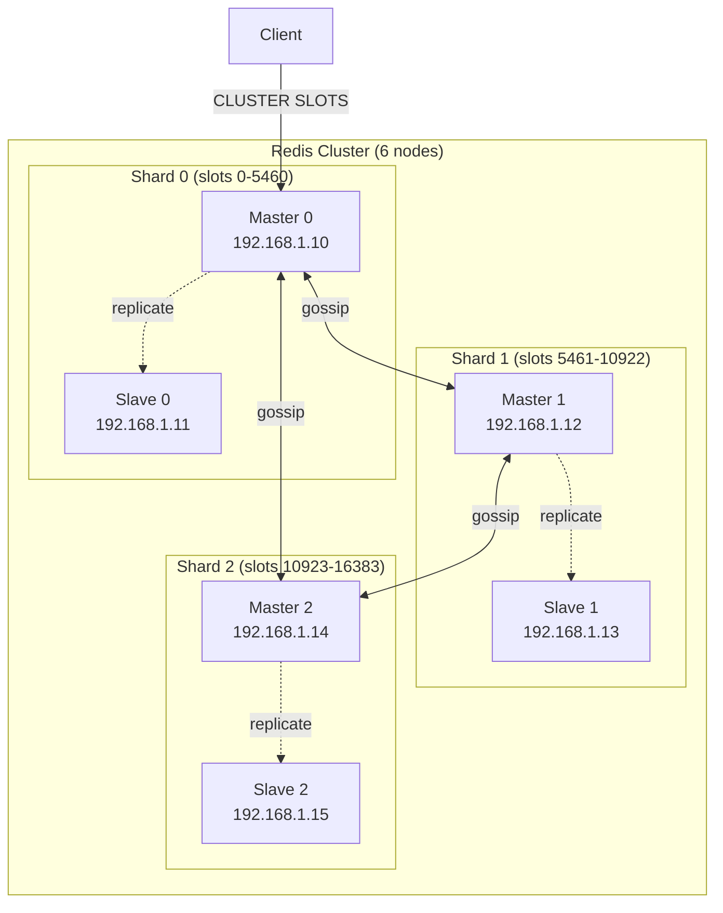
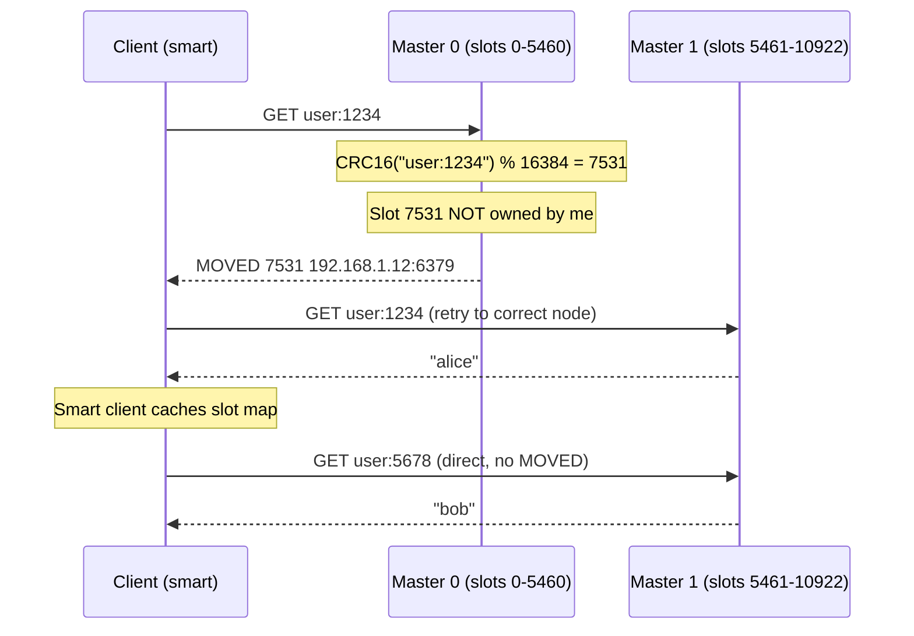
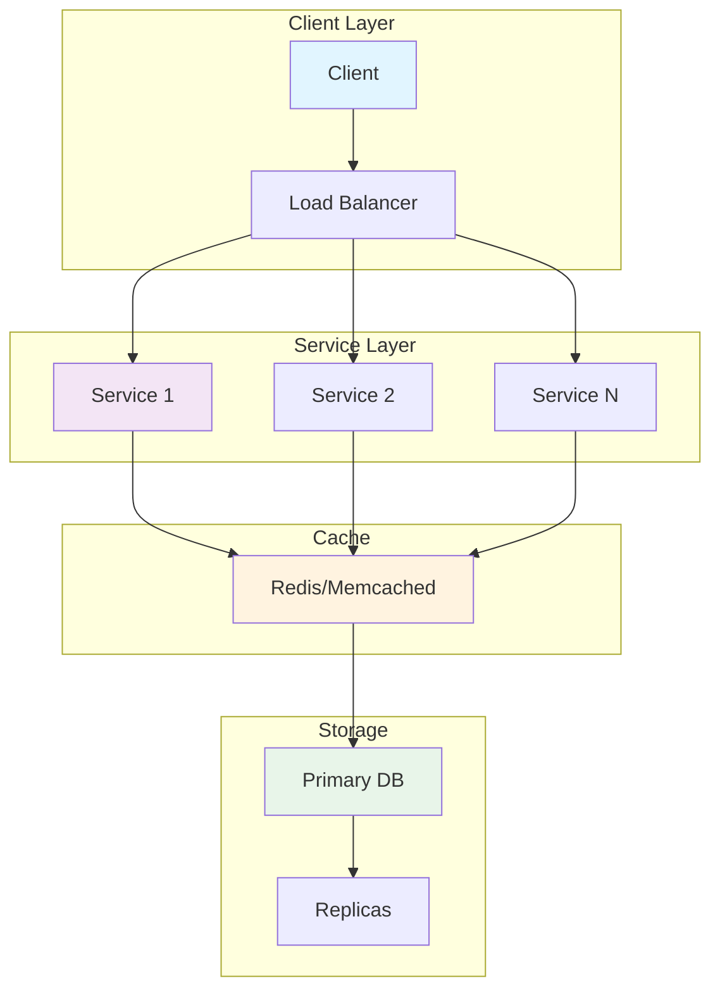
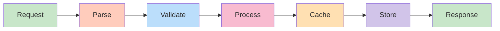
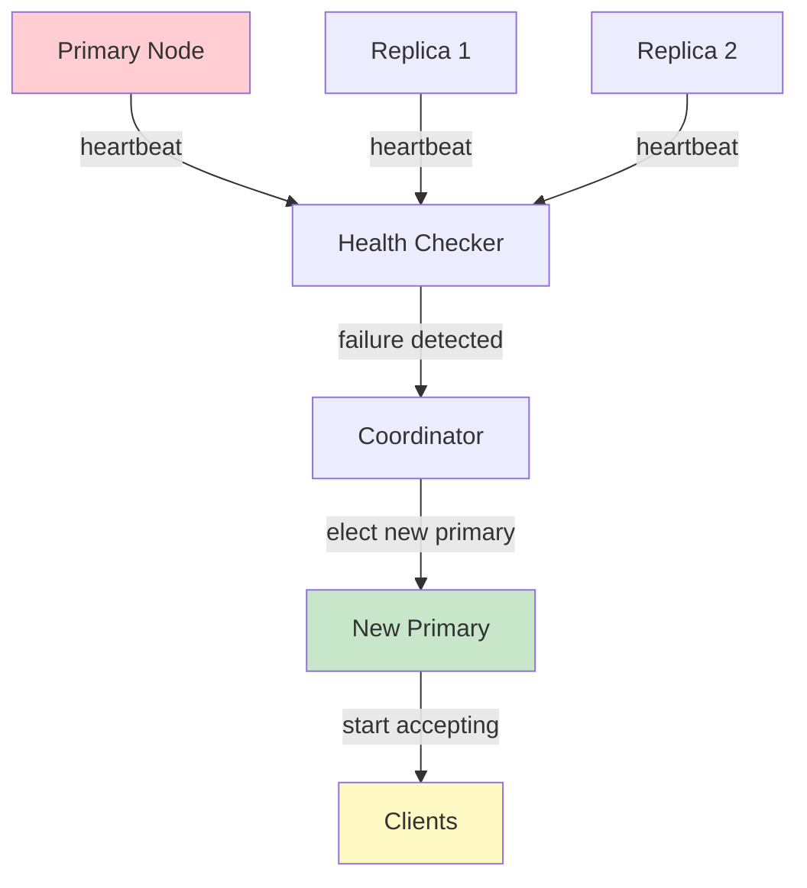
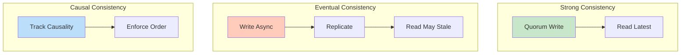
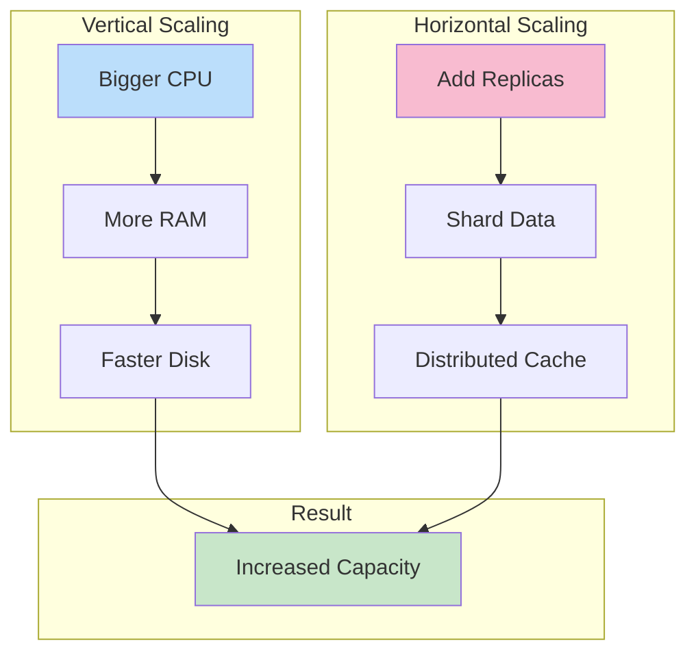

# Redis Clustering

## Problem Statement

Design a horizontally scalable Redis cluster that distributes data across multiple nodes using consistent hashing, handles node failures automatically, and enables transparent client routing.

## Scenario

Redis Clustering is a critical component in modern distributed systems. In real-world applications, providing fast in-memory data access with persistence options. For example, major tech companies like Netflix, Uber, and Airbnb rely on similar solutions to handle millions of concurrent users and requests. The challenge is achieving this while maintaining sub-100ms latency, 99.99% availability, and gracefully handling 10x traffic spikes during peak demand. This component provides the foundational capability to solve these challenges reliably and efficiently at global scale.

## Users

- **Backend Engineers**: Responsible for implementing and maintaining this system component in production environments. They need to understand the architecture, trade-offs, failure modes, and operational considerations.
- **DevOps/SRE Teams**: Monitor system health, manage scaling policies, handle incidents, and ensure reliability SLAs are met. They need insights into performance characteristics, bottlenecks, and failure recovery mechanisms.
- **Data Engineers**: Design data pipelines and analytics around this system, requiring deep understanding of data flow, consistency guarantees, and throughput characteristics.
- **System Architects**: Make high-level architectural decisions that impact company infrastructure, requiring comprehensive understanding of capabilities, limitations, and scalability boundaries.
- **Security Teams**: Understand security implications, potential vulnerabilities, and compliance requirements for this component.

## PRD

### Functional Requirements
- Store key-value with optional TTL
- Support strings, lists, sets, hashes, sorted sets
- Atomic INCR, APPEND, ZADD operations
- Optional persistence (RDB, AOF)
- Master-slave replication

### Non-Functional Requirements
- Latency: < 1ms for get/set
- Throughput: 100K-1M ops/sec
- Memory: all in-memory (set maxmemory policy)
- Availability: sentinel or cluster HA
- Durability: optional (can lose data without persistence)

### Success Metrics
- Hit rate > 95% for caching
- Latency p99 < 10ms
- Memory utilization < 80%
- Replication lag < 1s


## Flow

The typical operational flow for this system involves these key phases:

1. **Request Arrival**: Client/upstream system sends request with required parameters and context
2. **Validation & Routing**: System validates request format, authentication, and routes to correct handler/shard/instance
3. **Core Processing**: Execute the main algorithm, database query, or business logic on the data/state
4. **State Management**: Update internal state (caches, indexes, counters, logs) with proper atomicity and locking
5. **Response Generation**: Format results and return to requester with relevant metadata (timing, version info)
6. **Observability**: Record metrics (latency, throughput, errors), logs (for debugging), and traces (for performance analysis)

This flow repeats thousands or millions of times per second in production. Each operation's efficiency compounds across the entire system, making careful optimization essential. Bottlenecks at any phase can cascade to impact overall system performance.


## Code Explanation (Detailed)

### Data Structures
- String: Atomic increment, append (cache values, counters)
- List: FIFO queue (rpush/lpop)
- Hash: Object-like (hset/hget)
- Set: Unique values, fast membership (sadd/smembers)
- Sorted Set: Ranked data (zadd/zrevrange for leaderboards)

### Caching Pattern (Cache-Aside)
1. Check cache (fast path, O(1))
2. If miss: fetch from DB (slow)
3. Update cache with TTL (setex)
4. Risk: thundering herd on popular key

### Atomic Operations
- Lua scripts: Complex operations, server-side atomicity
- WATCH/MULTI/EXEC: Optimistic locking
- INCR/ZADD: Inherently atomic

## Architecture Diagram



## Flow Diagram



## Design

### Hash Slots

```
Redis Cluster divides key space into 16384 slots:
  slot = CRC16(key) % 16384

3 masters -> each owns ~5461 slots:
  Master 0: slots 0-5460
  Master 1: slots 5461-10922
  Master 2: slots 10923-16383

Hash tags:
  {user}.profile, {user}.sessions -> same slot
  CRC16 only hashes the content in {}
  Use for multi-key operations on same node

MGET across nodes: NOT supported
  Use pipelining with hash tags, or single-node operations
  Or: Lua scripts (EVAL) run on single node

Key -> slot calculation:
  "user:1234" -> CRC16 = 7531 -> Master 1
  "{user:1234}.profile" -> same as "{user:1234}" -> same slot
```

### Cluster Topology & Gossip

```
Gossip protocol:
  Each node knows about all other nodes
  Periodically exchange cluster state (PING/PONG)
  Failure detection: node marks peer as PFAIL (possible fail)
  Quorum: majority mark as PFAIL -> FAIL (confirmed)

Failover:
  Master fails -> slaves vote for promotion
  Replica with highest replication offset elected
  New master takes over all slots
  Cluster updates routing table
  
  Timeline:
    Detection: 30s (node_timeout default)
    Election: 1-2s
    Total: ~32s unavailability per shard

node_timeout: critical parameter
  Too low: false positives (network blip)
  Too high: long outage during real failure
  Recommended: 15-30s
```

### Resharding

```
Add new node:
  redis-cli --cluster add-node new_ip:6379 existing_ip:6379
  redis-cli --cluster rebalance existing_ip:6379

Slot migration:
  CLUSTER SETSLOT <slot> MIGRATING <dst>  (src)
  CLUSTER SETSLOT <slot> IMPORTING <src>  (dst)
  MIGRATE host port key db timeout
  CLUSTER SETSLOT <slot> NODE <dst-nodeid>

During migration:
  Keys being moved: client gets ASK redirect (temporary)
  ASK vs MOVED: MOVED = permanent new location, ASK = try here for this request
```

## Back-of-Envelope Calculations

```
Cluster capacity:
  3 masters x 32GB RAM each = 96GB total
  With 1 replica each: 96GB usable (replicas don't add capacity)
  Per key overhead ~60B: 96GB / 60B = ~1.6B keys

Write throughput:
  1 master: ~500K ops/s
  3 masters: ~1.5M ops/s (keys distributed evenly)

Replication lag:
  Async replication: < 1ms intra-DC
  Cross-AZ: 1-5ms lag
  Worst case data loss on failover: 1-5ms of writes

Gossip overhead:
  30 nodes cluster: each node talks to a few random nodes/sec
  Gossip message size: 2KB
  30 nodes x 1 gossip/s x 2KB = 60KB/s (trivial)

Resharding time:
  100GB shard -> add new master
  MIGRATE throughput: ~1GB/s
  Time: 100 seconds for full shard migration
  During migration: no downtime (ASK redirects)
```

## Design Choices

| Topology | Capacity | HA | Complexity |
|---|---|---|---|
| Single master | 1x | No | Low |
| Master + replica | 1x | Read HA | Low |
| Sentinel (3 nodes) | 1x | Write HA | Medium |
| Cluster (3+3 nodes) | 3x | Write HA | High |
| Cluster + replicas | Nx | Full HA | High |

## Python Implementation

```python
from dataclasses import dataclass, field
from typing import Any, Dict, List, Optional, Set, Tuple
import hashlib
import time
from collections import defaultdict

CLUSTER_SLOTS = 16384

def crc16(data: str) -> int:
    crc = 0
    for byte in data.encode():
        crc ^= byte << 8
        for _ in range(8):
            if crc & 0x8000:
                crc = (crc << 1) ^ 0x1021
            else:
                crc <<= 1
        crc &= 0xFFFF
    return crc

def key_to_slot(key: str) -> int:
    if "{" in key and "}" in key:
        start = key.index("{") + 1
        end = key.index("}")
        if start < end:
            key = key[start:end]
    return crc16(key) % CLUSTER_SLOTS

@dataclass
class RedisNode:
    node_id: str
    host: str
    port: int
    is_master: bool = True
    master_id: Optional[str] = None
    slots: List[range] = field(default_factory=list)
    store: Dict[str, Any] = field(default_factory=dict)
    replication_offset: int = 0
    alive: bool = True

    def owns_slot(self, slot: int) -> bool:
        return self.is_master and any(slot in r for r in self.slots)

class ClusterTopology:
    def __init__(self):
        self._nodes: Dict[str, RedisNode] = {}
        self._slot_to_master: Dict[int, str] = {}

    def add_node(self, node: RedisNode):
        self._nodes[node.node_id] = node
        if node.is_master:
            for slot_range in node.slots:
                for slot in slot_range:
                    self._slot_to_master[slot] = node.node_id

    def get_master_for_slot(self, slot: int) -> Optional[RedisNode]:
        node_id = self._slot_to_master.get(slot)
        if node_id:
            return self._nodes.get(node_id)
        return None

    def get_replicas_for_master(self, master_id: str) -> List[RedisNode]:
        return [n for n in self._nodes.values() if n.master_id == master_id and not n.is_master]

    def failover(self, failed_master_id: str) -> Optional[str]:
        replicas = self.get_replicas_for_master(failed_master_id)
        if not replicas:
            return None
        # Elect replica with highest offset
        best = max(replicas, key=lambda r: r.replication_offset)
        failed_master = self._nodes[failed_master_id]
        failed_master.alive = False

        # Promote replica
        best.is_master = True
        best.master_id = None
        best.slots = failed_master.slots
        for slot_range in best.slots:
            for slot in slot_range:
                self._slot_to_master[slot] = best.node_id

        print(f"[Cluster] Failover: {best.node_id} promoted to master (was replica of {failed_master_id})")
        return best.node_id

class RedisClusterClient:
    def __init__(self, topology: ClusterTopology):
        self._topology = topology
        self._slot_cache: Dict[int, str] = {}

    def _get_node(self, key: str) -> Optional[RedisNode]:
        slot = key_to_slot(key)
        master = self._topology.get_master_for_slot(slot)
        if master and master.alive:
            return master
        print(f"  [Client] Slot {slot}: no alive master -> CLUSTERDOWN")
        return None

    def set(self, key: str, value: Any, ex: Optional[int] = None) -> bool:
        node = self._get_node(key)
        if not node:
            return False
        node.store[key] = (value, time.time() + ex if ex else None)
        node.replication_offset += 1
        # Replicate to replicas (async)
        self._replicate(node, "SET", key, value)
        return True

    def get(self, key: str) -> Optional[Any]:
        node = self._get_node(key)
        if not node:
            return None
        entry = node.store.get(key)
        if entry is None:
            return None
        value, expiry = entry
        if expiry and time.time() > expiry:
            del node.store[key]
            return None
        return value

    def _replicate(self, master: RedisNode, cmd: str, *args):
        replicas = self._topology.get_replicas_for_master(master.node_id)
        for replica in replicas:
            if cmd == "SET":
                replica.store[args[0]] = master.store.get(args[0])
                replica.replication_offset = master.replication_offset

    def cluster_info(self) -> dict:
        topology = self._topology._nodes
        return {
            "total_nodes": len(topology),
            "masters": sum(1 for n in topology.values() if n.is_master and n.alive),
            "replicas": sum(1 for n in topology.values() if not n.is_master and n.alive),
        }

# Setup cluster
topology = ClusterTopology()
nodes = [
    RedisNode("m0", "10.0.0.1", 6379, is_master=True, slots=[range(0, 5461)]),
    RedisNode("m1", "10.0.0.2", 6379, is_master=True, slots=[range(5461, 10923)]),
    RedisNode("m2", "10.0.0.3", 6379, is_master=True, slots=[range(10923, 16384)]),
    RedisNode("s0", "10.0.0.4", 6379, is_master=False, master_id="m0"),
    RedisNode("s1", "10.0.0.5", 6379, is_master=False, master_id="m1"),
    RedisNode("s2", "10.0.0.6", 6379, is_master=False, master_id="m2"),
]
for n in nodes:
    topology.add_node(n)

client = RedisClusterClient(topology)

# Demonstrate key routing
print("=== Key Routing Demo ===")
keys = ["user:1234", "session:abc", "counter:page", "{user:1234}.profile"]
for key in keys:
    slot = key_to_slot(key)
    master = topology.get_master_for_slot(slot)
    print(f"  '{key}' -> slot {slot} -> {master.node_id} ({master.host})")

# Read/write
print("\n=== Read/Write ===")
client.set("user:1234", {"name": "Alice"})
print(f"GET user:1234 = {client.get('user:1234')}")

# Simulate failover
print("\n=== Failover ===")
new_master = topology.failover("m1")
print(f"Cluster info after failover: {client.cluster_info()}")
```

## Java Implementation

```java
import java.util.*;

public class RedisCluster {
    static int keyToSlot(String key) {
        if (key.contains("{") && key.contains("}")) {
            int s = key.indexOf('{') + 1, e = key.indexOf('}');
            if (s < e) key = key.substring(s, e);
        }
        int crc = 0;
        for (byte b : key.getBytes()) {
            crc ^= (b & 0xFF) << 8;
            for (int i = 0; i < 8; i++) crc = (crc & 0x8000) != 0 ? (crc << 1) ^ 0x1021 : crc << 1;
            crc &= 0xFFFF;
        }
        return crc % 16384;
    }

    record Node(String id, int slotStart, int slotEnd, Map<String, Object> store) {
        boolean owns(int slot) { return slot >= slotStart && slot <= slotEnd; }
    }

    static class Cluster {
        List<Node> nodes;
        Cluster(List<Node> nodes) { this.nodes = nodes; }

        Node nodeFor(String key) {
            int slot = keyToSlot(key);
            return nodes.stream().filter(n -> n.owns(slot)).findFirst().orElse(null);
        }

        void set(String key, Object value) {
            Node n = nodeFor(key);
            if (n != null) n.store().put(key, value);
        }

        Object get(String key) {
            Node n = nodeFor(key);
            return n != null ? n.store().get(key) : null;
        }
    }

    public static void main(String[] args) {
        var cluster = new Cluster(List.of(
            new Node("m0", 0, 5460, new HashMap<>()),
            new Node("m1", 5461, 10922, new HashMap<>()),
            new Node("m2", 10923, 16383, new HashMap<>())
        ));

        String[] keys = {"user:1234", "session:abc", "counter"};
        for (String k : keys) {
            System.out.printf("'%s' -> slot %d -> %s%n", k, keyToSlot(k), cluster.nodeFor(k).id());
        }

        cluster.set("user:1234", "Alice");
        System.out.println("GET user:1234 = " + cluster.get("user:1234"));
    }
}
```

## Complexity

| Operation | Time |
|---|---|
| Key slot calculation | O(key length) |
| Route to correct node | O(1) (slot map lookup) |
| MOVED redirect handling | O(1) |
| Cluster gossip | O(log n) per message |
| Failover election | O(replicas) |

## Common Questions & Answers

**Q: What is Redis and when do you use it?**

A: In-memory key-value data store with sub-millisecond latency. Used for caching (reduce DB load), sessions (user state), queues, real-time counters, leaderboards. Very fast but volatile (data loss on crash without persistence).

**Q: What data structures does Redis support?**

A: Strings (simple values), Lists (FIFO queues), Sets (unique values), Hashes (objects), Sorted Sets (leaderboards), Streams (Kafka-like), HyperLogLog (cardinality), Bitmaps (bitwise ops). Rich beyond simple cache.

**Q: How does Redis persistence work?**

A: RDB (snapshot): periodic point-in-time backup (fast, compact). AOF (append-only file): log all writes (durable, slower). BGSAVE/BGREWRITEAOF: background operations. Choose: speed vs. durability trade-off. Most use both.

**Q: What is Redis replication?**

A: Master-slave architecture: master accepts writes, slaves replicate. Read from master (strong consistency) or slaves (eventual, faster). Slaves can be read-only replicas or chain-replicate to others.

**Q: What is Redis Sentinel?**

A: High availability solution: monitors Redis instances, detects failures, promotes replica to master automatically. Requires 3+ Sentinel instances (majority quorum). Client connects via Sentinel instead of Redis directly.

**Q: What is Redis Cluster?**

A: Distributed Redis: data sharded across multiple nodes (hash slots). Auto-sharding, automatic failover, rebalancing. More complex than Sentinel. Required for massive scale (TB+ data).

**Q: How do you choose between Sentinel and Cluster?**

A: Sentinel: single master, high availability. Cluster: distributed, massive scale. Sentinel for most (simpler), Cluster only if need horizontal scaling. Data > memory = use Cluster.

**Q: How do you handle eviction when Redis runs out of memory?**

A: Set maxmemory policy: LRU, LFU, TTL, random, or no-eviction. LRU/LFU common for caching. TTL for session data. No-eviction blocks writes (safe but risky). Monitor memory usage constantly.

**Q: What is key expiration in Redis?**

A: Keys have optional TTL (time-to-live). After expiration, key automatically deleted. Lazy deletion (on access) + periodic cleanup. Use for session data, cache, or temporary counters. Check expiration policy for accuracy.

**Q: How do you secure Redis?**

A: Use password authentication (requirepass). ACLs (Redis 6+): per-user permissions. Run inside VPC (no internet access). Disable dangerous commands (FLUSHDB, CONFIG). TLS for remote connections.

## Follow-up Questions & Answers

**Q: How would you implement distributed locking with Redis?**

A: SET key value EX ttl NX (atomic: set if not exists with TTL). Acquire lock, execute critical section, delete key. Risk: crash loses lock (data consistency issue). Redlock solves this with multiple instances.

**Q: What is Redlock and what problem does it solve?**

A: Distributed lock across 5 Redis instances. Acquire lock on majority (quorum). Survives single instance failure. Overkill for most, but necessary for safety-critical sections. Trade: performance for correctness.

**Q: How would you implement rate limiting with Redis?**

A: Use sorted set with timestamps or hash with counters. Increment on each request, check against limit. Fast (O(log n)). Alternative: token bucket in Lua script. Faster than database.

**Q: How do you handle Redis memory limits and eviction policy?**

A: Set maxmemory (bytes), maxmemory-policy (LRU/LFU/TTL/random). Monitor hit rate (eviction = misses). Can also manually delete old keys or use cache-aside with database.

**Q: Can you use Redis for reliable message queues?**

A: Partially. Lists (basic) or Streams (better). Lists: FIFO, no persistence without RDB. Streams: replicas, consumer groups, reliable delivery (Kafka-like). For critical: use Kafka instead.

**Q: How would you implement Pub/Sub in Redis?**

A: Publisher sends to channel, subscribers receive. Fire-and-forget (no persistence). Good for notifications. Bad for reliable messaging (missed if subscriber offline). Better: Streams for reliable pub/sub.

**Q: How do you scale Redis beyond single node?**

A: Use Cluster (distributed), replicate read-heavy workload (slaves), or shard in application code. Cluster best for massive scale. Replication for read scaling. App sharding for distributed control.

**Q: Can you implement transactions in Redis?**

A: MULTI/EXEC: atomic batch of commands. Optimistic locking with WATCH. No rollback (all-or-nothing at command level). Use Lua scripts for complex atomic operations.

**Q: How would you debug Redis performance issues?**

A: SLOWLOG: find slow commands. MONITOR: see all commands in real-time. Memory analysis: MEMORY DOCTOR, key usage patterns. Network: latency between app and Redis. Profiling tools.

**Q: How do you backup and restore Redis?**

A: Backup: RDB snapshots, AOF files, or replication. Restore: copy files, or use Redis replication + replicaof. Backup strategy: periodic snapshots + AOF for durability. Test recovery regularly.


## System Overview

**Scale Metrics:**
- Throughput: Millions of operations per second
- Latency: Sub-millisecond to sub-second response times
- Data volume: Gigabytes to Petabytes
- Concurrent users: Millions to billions
- Availability: 99.99% to 99.999% uptime SLA

**Key Components:**
- Request handling and routing
- Data processing and storage
- Replication and consistency
- Failure detection and recovery
- Monitoring and alerting

## Architecture Diagrams

### System Architecture



### Data Flow



### Failover Mechanism



### Consistency Models



### Scaling Strategy



## Implementation Examples

### Python Implementation

```python
# Python Implementation

from typing import Any, Optional
from dataclasses import dataclass
from datetime import datetime
import json
import logging

logger = logging.getLogger(__name__)

@dataclass
class Config:
    """Configuration for the system."""
    timeout_ms: int = 5000
    retry_count: int = 3
    batch_size: int = 100
    max_connections: int = 1000

class Handler:
    """Main handler class for operations."""

    def __init__(self, config: Config):
        self.config = config
        self.metrics = {"success": 0, "failure": 0, "latency_ms": []}

    async def process(self, data: Any) -> Any:
        """Process request with error handling."""
        try:
            # Validate input
            self._validate(data)

            # Execute operation
            result = await self._execute(data)

            # Track metrics
            self.metrics["success"] += 1
            return result

        except Exception as e:
            logger.error(f"Processing failed: {e}")
            self.metrics["failure"] += 1
            raise

    def _validate(self, data: Any) -> None:
        """Validate input data."""
        if data is None:
            raise ValueError("Data cannot be None")

    async def _execute(self, data: Any) -> Any:
        """Execute core logic."""
        # Implement actual logic here
        return {"status": "success", "timestamp": datetime.now().isoformat()}

    def get_metrics(self) -> dict:
        """Return collected metrics."""
        return self.metrics

# Usage example
async def main():
    config = Config(timeout_ms=5000, batch_size=100)
    handler = Handler(config)
    result = await handler.process({"key": "value"})
    print(f"Result: {result}")
    print(f"Metrics: {handler.get_metrics()}")
```

### Java Implementation

```java
// Java Implementation

import java.util.*;
import java.util.concurrent.*;
import java.time.Instant;
import org.slf4j.Logger;
import org.slf4j.LoggerFactory;

public class SystemHandler {
    private static final Logger logger = LoggerFactory.getLogger(SystemHandler.class);

    private final Config config;
    private final Map<String, Long> metrics = new ConcurrentHashMap<>();
    private final ExecutorService executor;

    public static class Config {
        public int timeoutMs = 5000;
        public int retryCount = 3;
        public int batchSize = 100;
        public int maxConnections = 1000;

        public Config withTimeoutMs(int timeout) {
            this.timeoutMs = timeout;
            return this;
        }
    }

    public SystemHandler(Config config) {
        this.config = config;
        this.executor = Executors.newFixedThreadPool(
            Math.min(config.maxConnections, 10)
        );
        metrics.put("success", 0L);
        metrics.put("failure", 0L);
    }

    public <T> T process(Object data) throws Exception {
        try {
            // Validate input
            validate(data);

            // Execute operation
            Object result = execute(data);

            // Track metrics
            metrics.put("success", metrics.get("success") + 1);
            return (T) result;

        } catch (Exception e) {
            logger.error("Processing failed: {}", e.getMessage());
            metrics.put("failure", metrics.get("failure") + 1);
            throw e;
        }
    }

    private void validate(Object data) throws IllegalArgumentException {
        if (data == null) {
            throw new IllegalArgumentException("Data cannot be null");
        }
    }

    private Object execute(Object data) throws Exception {
        // Implement core logic
        return Map.of(
            "status", "success",
            "timestamp", Instant.now().toString()
        );
    }

    public Map<String, Long> getMetrics() {
        return new HashMap<>(metrics);
    }

    public void shutdown() {
        executor.shutdown();
    }

    public static void main(String[] args) throws Exception {
        Config config = new Config()
            .withTimeoutMs(5000);

        SystemHandler handler = new SystemHandler(config);
        Object result = handler.process(Map.of("key", "value"));
        System.out.println("Result: " + result);
        System.out.println("Metrics: " + handler.getMetrics());
        handler.shutdown();
    }
}
```

## Back-of-Envelope Calculations

### Traffic & Throughput
**Assumptions:**
- Daily active users: 100 million (100M)
- Requests per user per day: 50
- Peak hour traffic: 10% of daily (concentrated)
- Request distribution: 70% read, 30% write

**Calculations:**
```
Total daily requests = 100M users × 50 requests = 5 billion requests/day
Average RPS = 5B requests / 86400 seconds ≈ 57,870 RPS
Peak hour RPS = (5B / 86400) × (100 / 10) ≈ 578,700 RPS
Peak minute RPS = 578,700 / 60 ≈ 9,645 RPS

Read operations = 57,870 × 0.7 ≈ 40,509 RPS (average)
Write operations = 57,870 × 0.3 ≈ 17,361 RPS (average)
```

### Storage Requirements
**Assumptions:**
- Data per user: 1 KB (profile, settings)
- Data per transaction: 500 bytes
- Data retention: 3 years

**Calculations:**
```
User profile storage = 100M × 1 KB = 100 GB
Transaction data = 5B requests/day × 500 bytes × 365 × 3 = 2.74 PB
Total storage ≈ 2.75 PB
Replication factor: 3× → 8.25 PB raw storage

Backup storage (weekly snapshots): 8.25 PB × 52 weeks = 429 PB
```

### Network Bandwidth
**Assumptions:**
- Average request size: 2 KB
- Average response size: 5 KB
- Replication overhead: 2× (write to replicas)

**Calculations:**
```
Inbound bandwidth = 57,870 RPS × 2 KB = 115.74 MB/s
Outbound bandwidth = 57,870 RPS × 5 KB = 289.35 MB/s
Replication bandwidth = 17,361 RPS × 2 KB × 2 = 69.44 MB/s
Total peak bandwidth ≈ 474 MB/s ≈ 3.8 Tbps (peak hour)
```

### Compute Requirements
**Assumptions:**
- Processing time per request: 10 ms
- CPU efficiency: 1 core handles 50 RPS

**Calculations:**
```
CPUs needed for average traffic = 57,870 RPS / 50 = 1,158 cores
CPUs needed for peak traffic = 578,700 RPS / 50 = 11,574 cores
Overprovisioning factor: 1.5× → 17,361 cores total

Using 16 cores per server = 17,361 / 16 ≈ 1,085 servers
With 3:1 replication = 3,255 servers needed
Regional redundancy (3 regions) = 9,765 servers
```

### Latency Analysis (p99)
**Components:**
- Network latency: 5 ms
- Processing: 10 ms
- Storage access: 50 ms (disk), 1 ms (cache)
- Replication write: 20 ms

**Path Analysis:**
```
Cache hit path: 5 + 1 + 5 = 11 ms
Database read path: 5 + 10 + 50 + 5 = 70 ms
Write path: 5 + 10 + 20 + 5 = 40 ms
```

### Cost Estimation
**Monthly costs (approximate):**
```
Compute: 9,765 servers × $1,000/month = $9.765M
Storage: 8.25 PB × $10/GB/month = $82.5M
Bandwidth: 3.8 Tbps × $0.12/GB = $456M
Personnel: 100 engineers × $200K = $20M
Total: ~$568M/month
Cost per user: $5.68/month
```


## Interview Questions & Answers

### Q1: Design the System from Scratch

**Question:** Design a system that can handle 1 billion requests per day with sub-100ms latency.

**Answer Structure:**
1. **Clarify requirements**: DAU, request types, geographic distribution, consistency needs
2. **Back-of-envelope**: Calculate RPS (11.5K avg, 115K peak), storage, bandwidth
3. **High-level design**: Load balancing → services → cache → storage
4. **Deep dive**:
   - Horizontal scaling with sharding
   - Multi-region active-active with eventual consistency
   - Caching strategy (write-through for critical data)
   - Monitoring: metrics, logging, tracing
5. **Bottlenecks**: Identify and address each
6. **Trade-offs**: Consistency vs. availability, latency vs. cost

### Q2: Scaling Challenges

**Question:** You're growing from 10M to 1B users (100x). What breaks and how do you fix it?

**Answer:**
- **Database bottleneck**: Sharding by user ID, consistent hashing, shard rebalancing
- **Cache hit rate drops**: Larger working set, tiered caching (L1: local, L2: distributed)
- **Replication lag**: Write-through for consistency-critical data, eventual consistency elsewhere
- **Operational complexity**: Infrastructure-as-code, auto-scaling, chaos engineering
- **Cost**: Optimize resource utilization, use reserved instances, spot instances for batch

### Q3: Failure Scenarios

**Question:** Your primary database goes down. What happens? How do you recover?

**Answer:**
- **Detection**: Health check timeout (3-5 seconds)
- **Failover**: Automatic promotion of replica using Raft consensus
- **Impact**: Write requests fail for ~10 seconds, reads use replicas
- **Recovery**: Background sync of failed node, re-add to cluster
- **Lessons**: Circuit breakers prevent cascade, bulkhead limits blast radius

### Q4: Consistency Requirements

**Question:** Do you need strong or eventual consistency? Why?

**Answer:**
- **Strong consistency**: Critical for financial transactions, inventory, user auth
  - Implementation: Quorum writes, read-after-write
  - Cost: Higher latency (p99 100ms+), lower throughput

- **Eventual consistency**: Fine for user feeds, recommendations, analytics
  - Implementation: Async replication, read-repair
  - Benefit: Lower latency (p99 <10ms), higher throughput

- **Hybrid approach**: Consistency per operation type, not global

### Q5: Performance Optimization

**Question:** How would you reduce p99 latency from 100ms to 20ms?

**Answer:**
1. **Profile** (measure first): Identify bottleneck (storage, network, compute)
2. **Caching**: Multi-tier (L1 local, L2 distributed), bloom filters for misses
3. **Batching**: Group operations, reduce RPC overhead
4. **Connection pooling**: Reuse TCP connections, reduce handshake latency
5. **Async I/O**: Non-blocking operations, increase parallelism
6. **Database optimization**: Indexing, query optimization, read replicas
7. **Code optimization**: Reduce allocations, use faster algorithms
8. **Hardware**: SSD for storage, faster network interconnects

### Q6: Operational Concerns

**Question:** How do you deploy a new version with zero downtime?

**Answer:**
1. **Canary deployment**: Roll out to 1% of servers, monitor metrics
2. **Gradual rollout**: 1% → 10% → 50% → 100% as confidence increases
3. **Health checks**: Automated rollback if error rate exceeds threshold
4. **Database migration**: Schema changes with backward compatibility
5. **Feature flags**: Toggle features independently of deployment
6. **Monitoring**: Enhanced alerting during rollout, easy incident response


## Technology Stack Recommendations

| Layer | Technology | Why |
|-------|-----------|-----|
| Load Balancing | Nginx, HAProxy, AWS ALB | Distribute traffic, health checks |
| Service Framework | FastAPI (Python), Spring Boot (Java) | Async, built-in monitoring |
| Caching | Redis, Memcached | Sub-millisecond latency, distributed |
| Primary Storage | PostgreSQL, MySQL | ACID, complex queries, reliability |
| Analytics | Elasticsearch, Data Warehouse | Full-text search, time-series analysis |
| Streaming | Kafka, AWS Kinesis | Event processing, real-time |
| Observability | Prometheus, ELK Stack, Jaeger | Metrics, logs, traces |

## Lessons Learned

1. **Premature optimization kills projects**: Start simple, measure, then optimize
2. **Consistency is hard**: Eventually consistent systems are tricky to reason about
3. **Monitoring is non-negotiable**: You can't fix what you can't see
4. **Failure is not rare**: Plan for it, test it, automate recovery
5. **Cost grows with complexity**: Each component adds operational overhead

## Related Topics

- Database design and optimization
- Distributed consensus algorithms
- Load balancing strategies
- Caching mechanisms and patterns
- Monitoring and alerting systems
- Security and compliance
