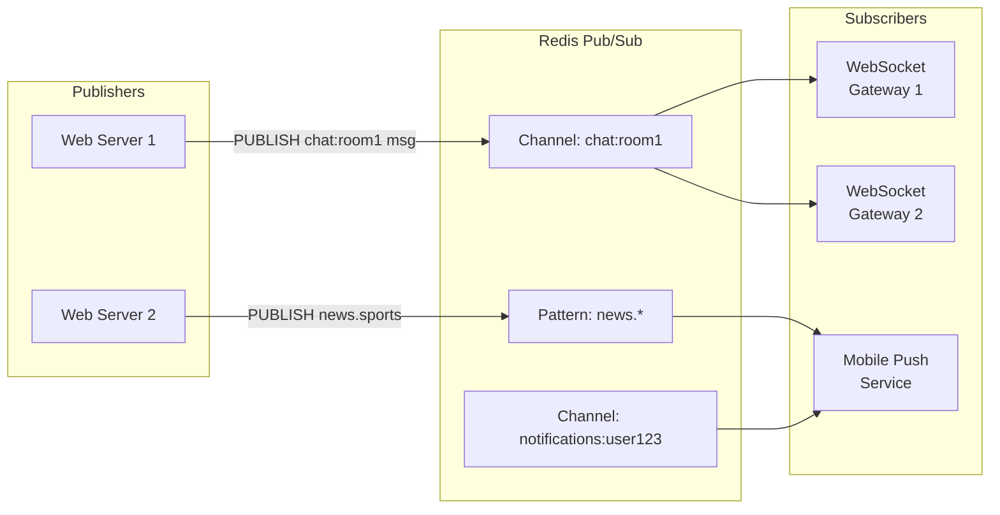
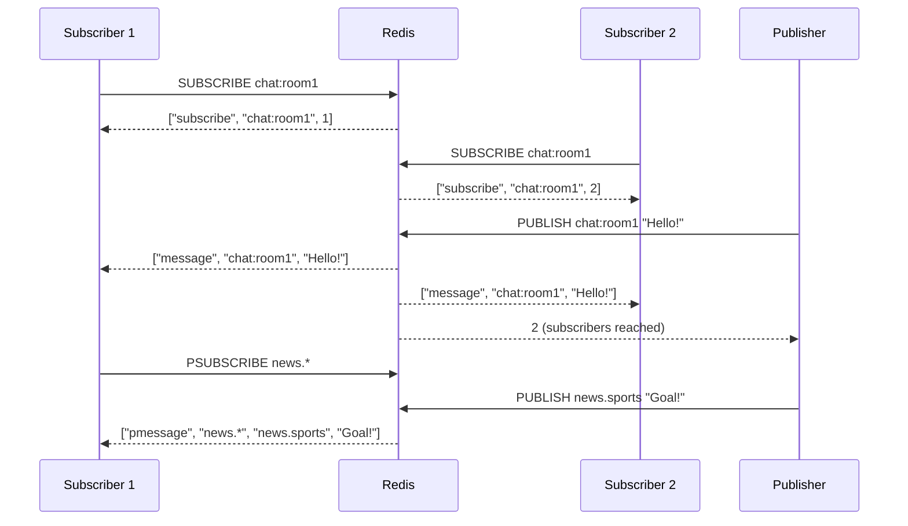

# Redis Pub/Sub and Keyspace Notifications

## Problem Statement

Design real-time messaging systems using Redis Pub/Sub for broadcast messaging and keyspace notifications — enabling chat systems, live dashboards, and event-driven cache invalidation.

## Architecture Diagram



## Flow Diagram



## Design

### Pub/Sub Commands

```
SUBSCRIBE channel [channel ...]: Subscribe to channels
UNSUBSCRIBE [channel ...]: Unsubscribe
PSUBSCRIBE pattern [pattern ...]: Pattern subscribe (glob)
PUNSUBSCRIBE [pattern ...]: Pattern unsubscribe
PUBLISH channel message: Publish to channel -> returns subscriber count

Patterns:
  news.*        matches: news.sports, news.weather
  chat:room:?   matches: chat:room:1 (single char wildcard)
  h?llo         matches: hello, hallo
  h*llo         matches: hllo, heeello

SUBSCRIBE puts connection into subscribe mode:
  Only SUBSCRIBE/UNSUBSCRIBE/PING allowed
  Cannot SET/GET while subscribed
  Use separate connection for pub/sub
```

### Keyspace Notifications

```
Redis can emit events when keys are modified:
  notify-keyspace-events "KEA"  (in redis.conf or CONFIG SET)
  K = Keyspace (key-based events)
  E = Keyevent (event-based subscriptions)
  A = All events (g$lzxedt)

Channels:
  __keyspace@0__:mykey -> events for specific key
  __keyevent@0__:expired -> all expired events

Use cases:
  Cache invalidation: subscribe to expired/del events
  Distributed locks: notify when lock key expires
  Job scheduling: set key with TTL, trigger on expiry

Example:
  PSUBSCRIBE __keyevent@0__:expired
  -> receive all key expiry events
  -> trigger cache refresh logic
```

### Scaling Pub/Sub

```
Problem: Pub/Sub doesn't work across Redis Cluster shards
  PUBLISH goes to one node; subscribers on other nodes miss it

Solutions:
  1. Dedicated Redis instance (not cluster) for pub/sub
  2. Redis Streams (preferred for reliability)
  3. Client-side fan-out: app layer publishes to all nodes
  4. Redis Cluster pub/sub (Redis 7.0+): shard pub/sub

Redis Streams vs Pub/Sub:
  Pub/Sub: fire-and-forget, no persistence, missed if offline
  Streams: persistent, consumer groups, replay, ACKs
  Use Streams for: reliable messaging, offline consumers
  Use Pub/Sub for: real-time broadcast, ephemeral events
```

## Common Questions & Answers

**Q: What happens when no subscribers are on a channel?** A: PUBLISH returns 0. Message is dropped. No buffering, no persistence. If subscriber reconnects, it misses all messages published while disconnected.

**Q: How do you scale Redis Pub/Sub for 1M subscribers?** A: Redis handles ~50K connections natively. For 1M subscribers: (1) WebSocket gateway layer: few WebSocket servers subscribe to Redis, then fan-out to connections. (2) Horizontal: multiple Redis Pub/Sub instances behind load balancer (but then split channels). (3) Redis Streams with consumer groups.

**Q: Can you use Redis Pub/Sub for guaranteed delivery?** A: No. Pub/Sub is fire-and-forget. Use Redis Streams for guaranteed delivery with consumer groups, ACKs, and replay. Or use Kafka/RabbitMQ for enterprise reliability.

**Q: How do keyspace notifications work for cache invalidation?** A: Subscribe to `__keyevent@0__:expired` and `__keyevent@0__:del`. When a cached key expires or is deleted, application receives the event and can remove it from application-level cache (e.g., local in-memory cache).

**Q: What is the overhead of Pub/Sub on Redis performance?** A: Each PUBLISH scans all subscription maps: O(N) where N = matching subscriptions. At 10K subscribers to same channel: PUBLISH adds ~10ms overhead. For millions of subscriptions: use pattern subscriptions carefully (each PSUBSCRIBE is O(patterns x subscriptions) to match).

## Back-of-Envelope Calculations

```
Pub/Sub throughput:
  Single channel, 1000 subscribers, 100 msg/s:
  100 * 1000 = 100K message deliveries/sec
  Each message ~100 bytes: 10MB/s network
  Redis can handle this easily

Message size limit:
  Max message: 512MB (same as String)
  Recommended: < 1KB for real-time use

Connection overhead:
  Each subscriber = 1 TCP connection
  Redis: ~50K connections default (maxclients)
  Memory: ~20KB per connection = 50K * 20KB = 1GB

Keyspace notification overhead:
  Enabled: adds ~5-10% CPU per Redis op (notify all subscribers)
  Disabled (default): zero overhead
  Only enable if needed; use targeted events (not "all")

Fan-out architecture:
  10 WebSocket servers x 100K connections each = 1M users
  Each WS server: 1 Redis connection for pub/sub
  Redis sees 10 subscribers per channel
  Efficient!
```

## Design Choices

| Approach | Reliability | Scalability | Complexity |
|---|---|---|---|
| Redis Pub/Sub | Fire-and-forget | 50K connections | Low |
| Redis Streams | Persistent + ACK | Consumer groups | Medium |
| Kafka + WS gateway | Durable | Millions | High |
| SSE + Pub/Sub | Browser-native | Stateless scaling | Medium |
| WebSocket + Redis | Real-time | Horizontal | Medium |

## Follow-up Questions

1. How would you build a real-time chat system using Redis Pub/Sub?
2. How do you handle subscriber reconnection and missed messages?
3. How does Redis Streams consumer groups differ from Pub/Sub?
4. How do you implement distributed cache invalidation using keyspace notifications?
5. What is Redis Shard Pub/Sub (Redis 7.0) and how does it scale in cluster mode?

## Python Implementation

```python
import asyncio
from dataclasses import dataclass, field
from typing import Any, Callable, Dict, List, Optional, Set
import time
import fnmatch
from collections import defaultdict

@dataclass
class PubSubMessage:
    msg_type: str  # "message", "pmessage", "subscribe", "unsubscribe"
    channel: str
    data: Any
    pattern: Optional[str] = None
    timestamp: float = field(default_factory=time.time)

class RedisPubSub:
    def __init__(self):
        self._channels: Dict[str, Set[str]] = defaultdict(set)  # channel -> subscriber_ids
        self._patterns: Dict[str, Set[str]] = defaultdict(set)  # pattern -> subscriber_ids
        self._subscriber_queues: Dict[str, List[PubSubMessage]] = defaultdict(list)

    def subscribe(self, subscriber_id: str, *channels: str) -> List[PubSubMessage]:
        responses = []
        for channel in channels:
            self._channels[channel].add(subscriber_id)
            count = len(self._channels[channel])
            responses.append(PubSubMessage("subscribe", channel, count))
            print(f"[PubSub] {subscriber_id} subscribed to '{channel}' (total={count})")
        return responses

    def unsubscribe(self, subscriber_id: str, *channels: str) -> List[PubSubMessage]:
        responses = []
        for channel in (channels or list(self._channels.keys())):
            self._channels[channel].discard(subscriber_id)
            if not self._channels[channel]:
                del self._channels[channel]
            count = len(self._channels.get(channel, set()))
            responses.append(PubSubMessage("unsubscribe", channel, count))
        return responses

    def psubscribe(self, subscriber_id: str, *patterns: str):
        for pattern in patterns:
            self._patterns[pattern].add(subscriber_id)
            print(f"[PubSub] {subscriber_id} psubscribed to pattern '{pattern}'")

    def publish(self, channel: str, message: Any) -> int:
        delivered = 0
        # Exact subscribers
        for sub_id in self._channels.get(channel, set()):
            msg = PubSubMessage("message", channel, message)
            self._subscriber_queues[sub_id].append(msg)
            delivered += 1
        # Pattern subscribers
        for pattern, sub_ids in self._patterns.items():
            if fnmatch.fnmatch(channel, pattern):
                for sub_id in sub_ids:
                    msg = PubSubMessage("pmessage", channel, message, pattern=pattern)
                    self._subscriber_queues[sub_id].append(msg)
                    delivered += 1
        print(f"[PubSub] Published to '{channel}': {delivered} subscribers")
        return delivered

    def receive(self, subscriber_id: str) -> List[PubSubMessage]:
        msgs = self._subscriber_queues.pop(subscriber_id, [])
        return msgs

class KeyspaceNotifications:
    def __init__(self, pubsub: RedisPubSub):
        self.pubsub = pubsub
        self.enabled_events = set()

    def enable(self, events: str = "KEA"):
        if "K" in events:
            self.enabled_events.add("keyspace")
        if "E" in events:
            self.enabled_events.add("keyevent")
        if "x" in events or "A" in events:
            self.enabled_events.add("expired")
        if "g" in events or "A" in events:
            self.enabled_events.add("generic")

    def emit(self, db: int, key: str, event: str):
        if "keyspace" in self.enabled_events:
            channel = f"__keyspace@{db}__:{key}"
            self.pubsub.publish(channel, event)
        if "keyevent" in self.enabled_events:
            channel = f"__keyevent@{db}__:{event}"
            self.pubsub.publish(channel, key)

class CacheInvalidator:
    def __init__(self, pubsub: RedisPubSub, local_cache: Dict[str, Any]):
        self.sub_id = "cache-invalidator"
        self._cache = local_cache
        pubsub.psubscribe(self.sub_id, "__keyevent@0__:expired", "__keyevent@0__:del")
        self._pubsub = pubsub

    def process_events(self):
        messages = self._pubsub.receive(self.sub_id)
        for msg in messages:
            key = msg.data  # keyevent: data = key name
            if key in self._cache:
                del self._cache[key]
                print(f"[CacheInvalidator] Invalidated local cache for '{key}'")

# Demo
pubsub = RedisPubSub()

# Chat room subscribers
pubsub.subscribe("gateway-1", "chat:room1")
pubsub.subscribe("gateway-2", "chat:room1")
pubsub.psubscribe("push-service", "notifications.*")

print("\n=== Publishing Messages ===")
pubsub.publish("chat:room1", "Hello, world!")
pubsub.publish("notifications.user123", "You have a new follower!")
pubsub.publish("news.sports", "Goal scored!")  # No subscribers

print("\n=== Receiving Messages ===")
for sub_id in ["gateway-1", "gateway-2", "push-service"]:
    msgs = pubsub.receive(sub_id)
    for msg in msgs:
        print(f"  [{sub_id}] {msg.msg_type} on '{msg.channel}': {msg.data}")

print("\n=== Keyspace Notifications ===")
kn = KeyspaceNotifications(pubsub)
kn.enable("KE")

local_cache = {"session:abc": "user-1", "session:xyz": "user-2"}
invalidator = CacheInvalidator(pubsub, local_cache)

kn.emit(0, "session:abc", "expired")
invalidator.process_events()
print(f"Local cache after expiry: {local_cache}")
```

## Java Implementation

```java
import java.util.*;
import java.util.function.*;

public class RedisPubSubSimulator {
    Map<String, List<Consumer<String>>> subs = new HashMap<>();
    Map<String, List<Consumer<String>>> patternSubs = new HashMap<>();

    void subscribe(String channel, Consumer<String> handler) {
        subs.computeIfAbsent(channel, k -> new ArrayList<>()).add(handler);
    }

    void psubscribe(String pattern, Consumer<String> handler) {
        patternSubs.computeIfAbsent(pattern, k -> new ArrayList<>()).add(handler);
    }

    int publish(String channel, String msg) {
        int count = 0;
        for (Consumer<String> h : subs.getOrDefault(channel, List.of())) { h.accept(msg); count++; }
        for (var entry : patternSubs.entrySet()) {
            if (channel.matches(entry.getKey().replace(".", "\\.").replace("*", ".*"))) {
                entry.getValue().forEach(h -> h.accept(msg)); count += entry.getValue().size();
            }
        }
        return count;
    }

    public static void main(String[] args) {
        RedisPubSubSimulator ps = new RedisPubSubSimulator();
        ps.subscribe("chat:room1", m -> System.out.println("Gateway1: " + m));
        ps.subscribe("chat:room1", m -> System.out.println("Gateway2: " + m));
        ps.psubscribe("notifications.*", m -> System.out.println("Push: " + m));
        System.out.println("Delivered: " + ps.publish("chat:room1", "Hello!"));
        ps.publish("notifications.user1", "New follower!");
    }
}
```

## Complexity

| Operation | Time |
|---|---|
| SUBSCRIBE | O(1) |
| PUBLISH (N subscribers) | O(N) |
| PSUBSCRIBE matching | O(patterns) |
| Keyspace notification | O(matching subscribers) |
