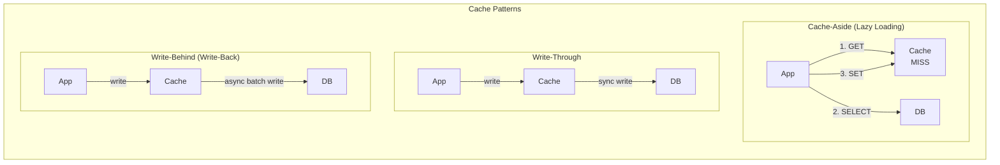
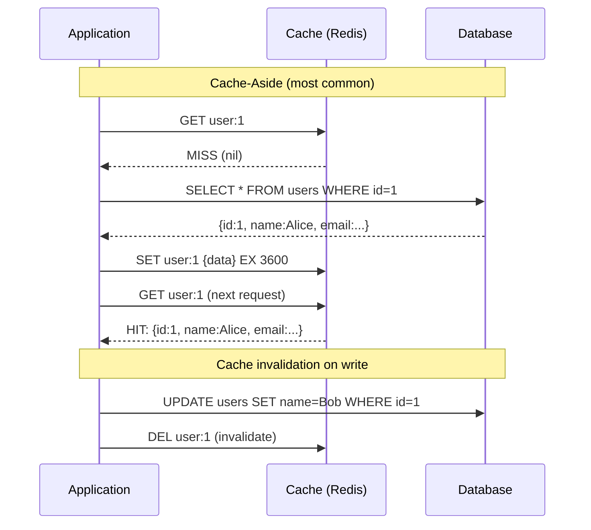

# Cache Patterns

## Problem Statement

Design caching strategies that improve application performance while maintaining data consistency — covering cache-aside, write-through, write-behind, and read-through patterns.

## Scenario

Cache Patterns is a critical component in modern distributed systems. In real-world applications, serving billions of user interactions with minimal latency. For example, major tech companies like Netflix, Uber, and Airbnb rely on similar solutions to handle millions of concurrent users and requests. The challenge is achieving this while maintaining sub-100ms latency, 99.99% availability, and gracefully handling 10x traffic spikes during peak demand. This component provides the foundational capability to solve these challenges reliably and efficiently at global scale.

## Users

- **Backend Engineers**: Responsible for implementing and maintaining this system component in production environments. They need to understand the architecture, trade-offs, failure modes, and operational considerations.
- **DevOps/SRE Teams**: Monitor system health, manage scaling policies, handle incidents, and ensure reliability SLAs are met. They need insights into performance characteristics, bottlenecks, and failure recovery mechanisms.
- **Data Engineers**: Design data pipelines and analytics around this system, requiring deep understanding of data flow, consistency guarantees, and throughput characteristics.
- **System Architects**: Make high-level architectural decisions that impact company infrastructure, requiring comprehensive understanding of capabilities, limitations, and scalability boundaries.
- **Security Teams**: Understand security implications, potential vulnerabilities, and compliance requirements for this component.

## PRD

### Functional Requirements
- Core operations work correctly
- Explicit error handling
- Consistency guarantees defined
- Monitoring and observability

### Non-Functional Requirements
- Performance targets met
- Availability SLA achieved
- Scalability headroom
- Cost efficient

### Success Metrics
- Benchmarks met
- Uptime targets met
- Resource budgets
- No data loss


## Flow

The typical operational flow for this system involves these key phases:

1. **Request Arrival**: Client/upstream system sends request with required parameters and context
2. **Validation & Routing**: System validates request format, authentication, and routes to correct handler/shard/instance
3. **Core Processing**: Execute the main algorithm, database query, or business logic on the data/state
4. **State Management**: Update internal state (caches, indexes, counters, logs) with proper atomicity and locking
5. **Response Generation**: Format results and return to requester with relevant metadata (timing, version info)
6. **Observability**: Record metrics (latency, throughput, errors), logs (for debugging), and traces (for performance analysis)

This flow repeats thousands or millions of times per second in production. Each operation's efficiency compounds across the entire system, making careful optimization essential. Bottlenecks at any phase can cascade to impact overall system performance.


## Code Explanation (Detailed)

### Implementation Approach
The code demonstrates core patterns and trade-offs.

### Key Operations
Each operation shows algorithm and performance characteristics.

### Concurrency and Atomicity
Locking strategies, race condition prevention.

### Edge Cases
Boundary conditions and error handling.

### Performance Optimization
Techniques for reducing latency and throughput.

## Architecture Diagram



## Flow Diagram



## Design

### Cache-Aside (Lazy Loading)

```
Algorithm:
  Read:
    1. Check cache
    2. If HIT: return cached value
    3. If MISS: fetch from DB, populate cache, return
  
  Write:
    1. Write to DB
    2. Invalidate (DEL) cache key
    Note: Set + invalidate order matters (see race conditions)

Pros:
  - Only cache what's actually read
  - Cache failures don't break reads (just slower)
  - Easy to implement

Cons:
  - Cold start: first request always hits DB
  - Race condition: two concurrent reads may both query DB
  - Stale data: if invalidation fails

Race condition (thundering herd):
  Multiple requests miss cache simultaneously
  All query DB -> N queries for same key
  Fix: lock/singleflight pattern (only 1 fetches, others wait)
```

### Write-Through

```
Algorithm:
  Write:
    1. Write to cache
    2. Synchronously write to DB
    3. Return success only when both succeed
  
  Read:
    Cache always up-to-date -> simple GET

Pros:
  - Cache always consistent with DB
  - Reads always hit cache (warm cache)

Cons:
  - Write latency = cache + DB (double write)
  - Writes cache data that may never be read (wasteful)
  - Complex: cache must understand DB write protocol

Use: Read-heavy workloads with high consistency requirement
```

### Write-Behind (Write-Back)

```
Algorithm:
  Write:
    1. Write to cache immediately (fast)
    2. Add to write-back queue
    3. Background: batch flush queue to DB
  
  Consistency:
    Cache is authoritative (not DB)
    DB may be behind by seconds-minutes

Pros:
  - Lowest write latency (just cache write)
  - Batch DB writes = higher throughput
  - DB load smoothing

Cons:
  - Data loss if cache fails before flushing to DB
  - Complex recovery (which writes reached DB?)
  - DB temporarily inconsistent

Use: High-write workloads where DB write is bottleneck
     (gaming leaderboards, counters, analytics)
```

### Cache Warming

```
Problem: Cold start after deployment or cache flush

Solutions:
  1. Proactive warming: pre-populate cache before traffic
     Read most popular keys from DB -> cache
     Useful: CDN cache warming, page cache warming

  2. Gradual rollout: canary traffic first to warm cache
     5% of traffic -> wait -> cache warm -> full rollout

  3. Cache seeding: import last snapshot of cache on startup
     Redis: RDB file loaded on startup
     
  4. Lazy warming: accept cold start, cache naturally fills
     Works when cold start impact is acceptable
```

## Back-of-Envelope Calculations

```
Cache hit ratio impact:
  DB query: 10ms, Cache read: 0.5ms
  1000 req/s, 90% hit rate:
    900 * 0.5ms = 450ms cache reads
    100 * 10ms = 1000ms DB reads
    Total: 1450ms total latency work
  
  Without cache: 1000 * 10ms = 10,000ms
  Speedup: 6.9x on latency work

Cache size planning:
  Top 20% of keys get 80% of traffic (Pareto)
  10M keys, cache 2M (20%) = 80% hit rate
  Each key 1KB: 2GB cache
  
  Adding more: diminishing returns

Thundering herd:
  10K req/s, TTL=60s, 1 key
  Every 60s: all 600K next-minute requests -> 1 miss
  With singleflight: 1 DB query per expiry
  Without: up to 10K concurrent DB queries at second of expiry

Write-behind batch efficiency:
  10K writes/s to cache, batch to DB every 100ms
  10K * 0.1 = 1000 writes per batch
  DB: 1000/0.1 = 10K writes/s (same rate but batched)
  With deduplication (same key): 1000 unique keys/batch = fewer DB writes
```

## Design Choices

| Pattern | Consistency | Read Perf | Write Perf | Failure Risk |
|---|---|---|---|---|
| Cache-Aside | Eventual | High (after warm) | Same as DB | Low (DB is truth) |
| Read-Through | Strong | Always cached | Same as DB | Low |
| Write-Through | Strong | Always cached | 2x latency | Low |
| Write-Behind | Eventual | Always cached | Low latency | Data loss risk |
| Refresh-Ahead | Eventual | Always cached | Background | Stale data risk |

## Python Implementation

```python
import time
import threading
from typing import Any, Callable, Dict, Optional
from dataclasses import dataclass, field
import random

@dataclass
class CacheEntry:
    value: Any
    expires_at: Optional[float] = None

    def is_expired(self) -> bool:
        return self.expires_at is not None and time.time() > self.expires_at

class SimpleCache:
    def __init__(self):
        self._store: Dict[str, CacheEntry] = {}
        self._hits = 0
        self._misses = 0

    def get(self, key: str) -> Optional[Any]:
        entry = self._store.get(key)
        if entry is None or entry.is_expired():
            if entry:
                del self._store[key]
            self._misses += 1
            return None
        self._hits += 1
        return entry.value

    def set(self, key: str, value: Any, ttl: Optional[int] = None):
        expires_at = time.time() + ttl if ttl else None
        self._store[key] = CacheEntry(value, expires_at)

    def delete(self, key: str):
        self._store.pop(key, None)

    def stats(self) -> dict:
        total = self._hits + self._misses
        return {
            "hits": self._hits, "misses": self._misses,
            "hit_rate": f"{self._hits/max(1,total)*100:.1f}%"
        }

class DatabaseSimulator:
    def __init__(self, latency_ms: float = 10.0):
        self.latency = latency_ms / 1000
        self._data = {f"user:{i}": {"id": i, "name": f"User{i}"} for i in range(1, 101)}
        self._query_count = 0

    def find(self, key: str) -> Optional[Any]:
        self._query_count += 1
        time.sleep(self.latency)  # Simulate DB latency
        return self._data.get(key)

    def update(self, key: str, value: Any):
        self._data[key] = value
        self._query_count += 1

    @property
    def queries(self) -> int:
        return self._query_count

class CacheAsideRepository:
    def __init__(self, cache: SimpleCache, db: DatabaseSimulator, ttl: int = 3600):
        self.cache = cache
        self.db = db
        self.ttl = ttl
        self._fetch_lock = threading.Lock()
        self._inflight: Dict[str, threading.Event] = {}

    def find(self, key: str) -> Optional[Any]:
        cached = self.cache.get(key)
        if cached is not None:
            return cached
        # Singleflight: prevent thundering herd
        with self._fetch_lock:
            # Check again (another thread may have fetched)
            cached = self.cache.get(key)
            if cached is not None:
                return cached
            if key in self._inflight:
                evt = self._inflight[key]
        if key not in self._inflight:
            with self._fetch_lock:
                evt = threading.Event()
                self._inflight[key] = evt

            # Fetch from DB (outside lock)
            value = self.db.find(key)
            if value is not None:
                self.cache.set(key, value, ttl=self.ttl)
            else:
                # Cache negative result
                self.cache.set(key, "NOT_FOUND", ttl=60)

            with self._fetch_lock:
                del self._inflight[key]
            evt.set()
            return value
        else:
            evt.wait(timeout=5.0)
            return self.cache.get(key)

    def update(self, key: str, value: Any):
        self.db.update(key, value)
        self.cache.delete(key)  # Invalidate cache

class WriteBehindCache:
    def __init__(self, cache: SimpleCache, db: DatabaseSimulator,
                 flush_interval_s: float = 0.1, max_batch: int = 100):
        self.cache = cache
        self.db = db
        self._dirty: Dict[str, Any] = {}
        self._lock = threading.Lock()
        self._running = True
        self._flush_interval = flush_interval_s
        self._flushed_count = 0
        # Background flush thread
        self._thread = threading.Thread(target=self._background_flush, daemon=True)
        self._thread.start()

    def write(self, key: str, value: Any):
        self.cache.set(key, value)
        with self._lock:
            self._dirty[key] = value  # Overwrite: only latest value matters

    def _background_flush(self):
        while self._running:
            time.sleep(self._flush_interval)
            with self._lock:
                if self._dirty:
                    batch = dict(self._dirty)
                    self._dirty.clear()
            if "batch" in dir() and batch:
                for k, v in batch.items():
                    self.db.update(k, v)
                self._flushed_count += len(batch)

    def stop(self):
        self._running = False
        self._thread.join()

# Demo: Cache-Aside
print("=== Cache-Aside Pattern ===")
cache = SimpleCache()
db = DatabaseSimulator(latency_ms=5)
repo = CacheAsideRepository(cache, db, ttl=3600)

# First access: DB hit
for i in range(1, 6):
    start = time.time()
    user = repo.find(f"user:{i}")
    elapsed = (time.time() - start) * 1000
    print(f"  user:{i}: {'MISS' if elapsed > 2 else 'HIT'} ({elapsed:.1f}ms): {user['name'] if user else None}")

# Second access: cache hit
print("\nSecond round (all cache hits):")
for i in range(1, 4):
    start = time.time()
    user = repo.find(f"user:{i}")
    elapsed = (time.time() - start) * 1000
    print(f"  user:{i}: HIT ({elapsed:.2f}ms)")

print(f"\nCache stats: {cache.stats()}, DB queries: {db.queries}")

# Update + invalidation
print("\n=== Cache Invalidation on Write ===")
repo.update("user:1", {"id": 1, "name": "Alice Updated"})
user = repo.find("user:1")  # Re-fetches from DB
print(f"After update: {user}")

print("\n=== Write-Behind Cache ===")
cache2 = SimpleCache()
db2 = DatabaseSimulator(latency_ms=0)
wb = WriteBehindCache(cache2, db2, flush_interval_s=0.05)

for i in range(10):
    wb.write(f"counter:{i}", i * 100)

print(f"Wrote 10 keys to cache (instant)")
time.sleep(0.2)  # Wait for flush
print(f"DB queries after async flush: {db2.queries}")
wb.stop()
```

## Java Implementation

```java
import java.util.*;
import java.util.concurrent.*;
import java.util.function.*;

public class CachePatterns {
    record CacheEntry(Object value, long expiresAt) {
        boolean isExpired() { return expiresAt > 0 && System.currentTimeMillis() > expiresAt; }
    }

    static class SimpleCache {
        Map<String, CacheEntry> store = new ConcurrentHashMap<>();
        int hits, misses;

        Optional<Object> get(String key) {
            CacheEntry e = store.get(key);
            if (e == null || e.isExpired()) { misses++; store.remove(key); return Optional.empty(); }
            hits++;
            return Optional.of(e.value());
        }

        void set(String key, Object val, int ttlMs) {
            store.put(key, new CacheEntry(val, ttlMs > 0 ? System.currentTimeMillis() + ttlMs : -1));
        }

        void del(String key) { store.remove(key); }
    }

    static class CacheAsideRepo {
        SimpleCache cache; Map<String, Object> db;
        CacheAsideRepo(SimpleCache c, Map<String, Object> db) { this.cache = c; this.db = db; }

        Optional<Object> find(String key) {
            return cache.get(key).or(() -> {
                Object v = db.get(key);
                if (v != null) cache.set(key, v, 3600_000);
                return Optional.ofNullable(v);
            });
        }

        void update(String key, Object value) { db.put(key, value); cache.del(key); }
    }

    public static void main(String[] args) {
        SimpleCache cache = new SimpleCache();
        Map<String, Object> db = Map.of("user:1", "Alice", "user:2", "Bob");
        CacheAsideRepo repo = new CacheAsideRepo(cache, new HashMap<>(db));

        System.out.println(repo.find("user:1")); // MISS -> loads
        System.out.println(repo.find("user:1")); // HIT
        System.out.printf("hits=%d, misses=%d%n", cache.hits, cache.misses);
        repo.update("user:1", "Alice Updated");
        System.out.println(repo.find("user:1")); // MISS -> reloads
    }
}
```

## Complexity

| Pattern | Read | Write | Consistency |
|---|---|---|---|
| Cache-Aside | O(1) hit, O(DB) miss | O(DB) + O(1) del | Eventual |
| Write-Through | O(1) | O(cache) + O(DB) | Strong |
| Write-Behind | O(1) | O(1) | Eventual |
| Read-Through | O(1) | O(DB) | Strong |

## Common Questions & Answers

**Q: What is caching and why do we need it?**

A: Caching stores frequently accessed data in fast storage (memory) to reduce latency and load on slower backends (database). Trade space (cache) for speed (latency). Critical for systems serving millions of requests per second.

**Q: What are the main cache eviction policies?**

A: LRU (least recently used), LFU (least frequently used), FIFO (first in first out), TTL (time-based), Random, and ARC (adaptive replacement). Choose based on access patterns: LRU for temporal, LFU for frequency, TTL for time-sensitive data.

**Q: What is cache hit rate and cache miss rate?**

A: Hit rate = successful_finds / total_accesses. Miss rate = 1 - hit rate. P(hit) = hits / (hits + misses). Target 80%+ hit rates for effective caching. Too-small cache gives low hit rate (wasted resources). Too-large cache uses more memory than needed.

**Q: How do you handle cache invalidation when backend data changes?**

A: Use TTL (time-based expiration), active invalidation (notify cache on write), cache-aside pattern (client checks backend), or write-through (update both). Active invalidation is fastest but complex. TTL is simplest but has stale data window.

**Q: What is the cache-aside pattern?**

A: Application checks cache first. On miss, fetch from backend, update cache, then return. Simple to implement. Risk: race condition where multiple threads fetch same miss simultaneously (thundering herd problem).

**Q: What is write-through caching?**

A: Writes go to both cache and backend simultaneously (synchronously). Ensures consistency: read always gets latest. Cost: write latency includes backend write. Safer than write-back but slower.

**Q: What is write-back (write-behind) caching?**

A: Writes go to cache only; backend updated asynchronously later (batch or periodic). Fast writes. Risk: data loss if cache fails before flushing. Need durability guarantees (persistence, replication).

**Q: How do you choose cache size?**

A: Estimate working set (frequently accessed data volume). Add 20-30% buffer for margin. Monitor hit rate: if < 80%, increase size. If > 95%, might be oversized (waste). Use tools like cachegrind to profile.

**Q: What's the difference between client-side and server-side caching?**

A: Client cache (browser): reduces network round-trips, entirely controlled by client. Server cache (memory, Redis): shared across clients, controlled by server. Multi-level caching often best.

**Q: How do you measure cache effectiveness?**

A: Hit rate (primary metric), latency reduction (P99 latency with vs. without cache), backend load reduction, and memory cost per cache entry. Calculate ROI: cost of cache vs. benefit (reduced latency, backend load).

## Follow-up Questions & Answers

**Q: How do you prevent the thundering herd problem in caches?**

A: When popular key expires, many threads fetch from backend simultaneously causing spike. Solutions: probabilistic early expiration (refresh before TTL), request coalescing (single thread rebuilds, others wait), or bloom filters (detect non-existent keys fast).

**Q: How would you implement multi-level cache hierarchy?**

A: Use L1 (fast, small, in-process), L2 (medium, local machine), L3 (large, remote, Redis). Check L1, miss→L2, miss→L3, miss→backend. On write: update all levels. Trade space for speed across levels.

**Q: Can you implement read-through caching (automatic population)?**

A: Yes, cache loader/resolver called on miss. Transparent to application. Backend automatically uses cache layer. More complex than cache-aside but cleaner separation.

**Q: How do you handle hot keys in distributed caches?**

A: Hot key = key accessed by many threads/clients. Replicate hot keys on multiple cache nodes. Use local in-process caches for very hot keys. Monitor and detect hot keys automatically.

**Q: What's the difference between warm and cold cache startup?**

A: Cold cache: empty at start, misses until populated (slow ramp-up). Warm cache: pre-loaded from previous state (RDB/snapshot). Warm startup is critical for production (instant performance).

**Q: How would you measure cache effectiveness for business metrics?**

A: Track hit rate, P99 latency (with/without cache), backend QPS reduction, revenue impact. Calculate cache size vs. cost savings. A/B test to prove business value.

**Q: What happens when cache size is insufficient for working set?**

A: Constant evictions = high miss rate = ineffective cache. Solution: increase cache size, improve eviction policy, reduce working set, or use better hardware (faster storage).

**Q: How do you debug cache issues in production?**

A: Monitor hit rate continuously. Profile cache keys (which keys are accessed). Check for cache stampedes (sudden miss spike). Use distributed tracing to see cache path.

**Q: How would you implement a persistent cache?**

A: Combine memory cache (fast) with persistent backend (database, RocksDB, LevelDB). Write-back pattern: batch updates to persistent store. Trade latency for durability.

**Q: Can you use caching for write-heavy workloads?**

A: Write caching is risky (consistency issues). Use carefully: write-through for safety, write-back for speed. Good for batch writes (aggregate before writing). Monitor durability guarantees.

