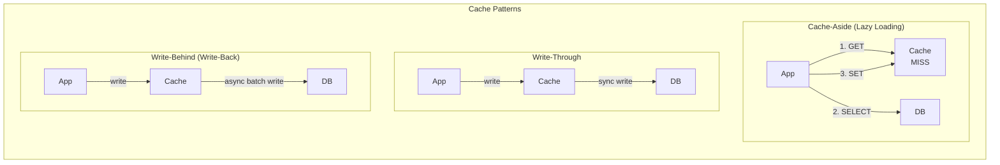
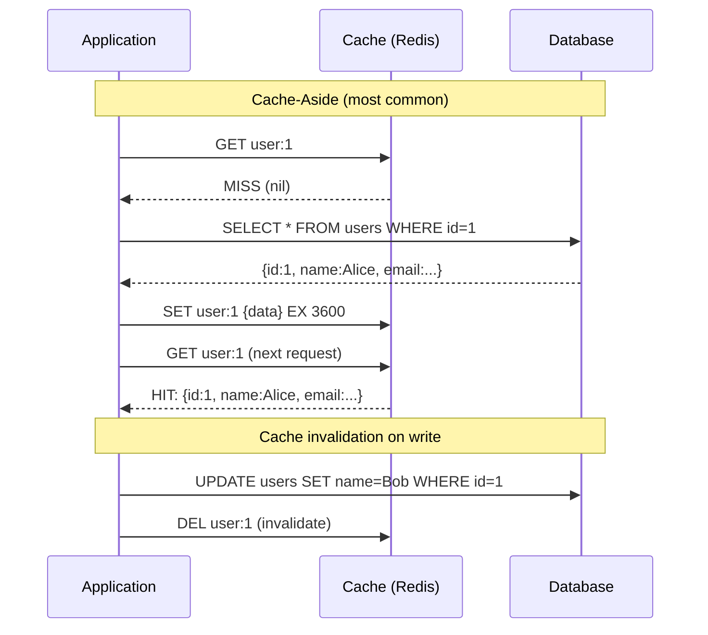

# Cache Patterns

## Problem Statement

Design caching strategies that improve application performance while maintaining data consistency — covering cache-aside, write-through, write-behind, and read-through patterns.

## Architecture Diagram



## Flow Diagram



## Design

### Cache-Aside (Lazy Loading)

```
Algorithm:
  Read:
    1. Check cache
    2. If HIT: return cached value
    3. If MISS: fetch from DB, populate cache, return
  
  Write:
    1. Write to DB
    2. Invalidate (DEL) cache key
    Note: Set + invalidate order matters (see race conditions)

Pros:
  - Only cache what's actually read
  - Cache failures don't break reads (just slower)
  - Easy to implement

Cons:
  - Cold start: first request always hits DB
  - Race condition: two concurrent reads may both query DB
  - Stale data: if invalidation fails

Race condition (thundering herd):
  Multiple requests miss cache simultaneously
  All query DB -> N queries for same key
  Fix: lock/singleflight pattern (only 1 fetches, others wait)
```

### Write-Through

```
Algorithm:
  Write:
    1. Write to cache
    2. Synchronously write to DB
    3. Return success only when both succeed
  
  Read:
    Cache always up-to-date -> simple GET

Pros:
  - Cache always consistent with DB
  - Reads always hit cache (warm cache)

Cons:
  - Write latency = cache + DB (double write)
  - Writes cache data that may never be read (wasteful)
  - Complex: cache must understand DB write protocol

Use: Read-heavy workloads with high consistency requirement
```

### Write-Behind (Write-Back)

```
Algorithm:
  Write:
    1. Write to cache immediately (fast)
    2. Add to write-back queue
    3. Background: batch flush queue to DB
  
  Consistency:
    Cache is authoritative (not DB)
    DB may be behind by seconds-minutes

Pros:
  - Lowest write latency (just cache write)
  - Batch DB writes = higher throughput
  - DB load smoothing

Cons:
  - Data loss if cache fails before flushing to DB
  - Complex recovery (which writes reached DB?)
  - DB temporarily inconsistent

Use: High-write workloads where DB write is bottleneck
     (gaming leaderboards, counters, analytics)
```

### Cache Warming

```
Problem: Cold start after deployment or cache flush

Solutions:
  1. Proactive warming: pre-populate cache before traffic
     Read most popular keys from DB -> cache
     Useful: CDN cache warming, page cache warming

  2. Gradual rollout: canary traffic first to warm cache
     5% of traffic -> wait -> cache warm -> full rollout

  3. Cache seeding: import last snapshot of cache on startup
     Redis: RDB file loaded on startup
     
  4. Lazy warming: accept cold start, cache naturally fills
     Works when cold start impact is acceptable
```

## Common Questions & Answers

**Q: What is the cache stampede (thundering herd) problem?** A: Many concurrent requests miss cache simultaneously (e.g., after expiry). All hit DB at once, overwhelming it. Solutions: (1) Mutex/lock: only one fetches, rest wait. (2) Probabilistic early expiration: some requests extend TTL randomly before expiry. (3) Background refresh: async refresh before expiry.

**Q: Should you delete cache on write or update cache?** A: Delete (invalidate) is safer. If you update cache on write, you risk stale data if two writes race. Invalidate + lazy re-read ensures freshness. Exception: write-through explicitly updates cache in the same transaction.

**Q: How do you handle cache miss on high-traffic key?** A: Single-flight / request coalescing: only one goroutine/thread fetches from DB; others wait and receive same result. Redis: use `SET key value NX EX 5` as a lock. Or: probabilistic early refresh (extend TTL randomly while still fresh).

**Q: When should TTL be short vs long?** A: Short TTL: user-specific, frequently changing data (session, stock prices). Long TTL: rarely changing data (product catalog, configuration). No TTL: static data (country list). Rule: TTL should be <= acceptable staleness.

**Q: How do you prevent cache penetration (missing key attacks)?** A: Cache negative results: `SET user:99999 "NOT_FOUND" EX 60`. Bloom filter: check bloom filter before DB query — if not in bloom filter, definitely not in DB. Rate limiting: limit cache miss rate per key.

## Back-of-Envelope Calculations

```
Cache hit ratio impact:
  DB query: 10ms, Cache read: 0.5ms
  1000 req/s, 90% hit rate:
    900 * 0.5ms = 450ms cache reads
    100 * 10ms = 1000ms DB reads
    Total: 1450ms total latency work
  
  Without cache: 1000 * 10ms = 10,000ms
  Speedup: 6.9x on latency work

Cache size planning:
  Top 20% of keys get 80% of traffic (Pareto)
  10M keys, cache 2M (20%) = 80% hit rate
  Each key 1KB: 2GB cache
  
  Adding more: diminishing returns

Thundering herd:
  10K req/s, TTL=60s, 1 key
  Every 60s: all 600K next-minute requests -> 1 miss
  With singleflight: 1 DB query per expiry
  Without: up to 10K concurrent DB queries at second of expiry

Write-behind batch efficiency:
  10K writes/s to cache, batch to DB every 100ms
  10K * 0.1 = 1000 writes per batch
  DB: 1000/0.1 = 10K writes/s (same rate but batched)
  With deduplication (same key): 1000 unique keys/batch = fewer DB writes
```

## Design Choices

| Pattern | Consistency | Read Perf | Write Perf | Failure Risk |
|---|---|---|---|---|
| Cache-Aside | Eventual | High (after warm) | Same as DB | Low (DB is truth) |
| Read-Through | Strong | Always cached | Same as DB | Low |
| Write-Through | Strong | Always cached | 2x latency | Low |
| Write-Behind | Eventual | Always cached | Low latency | Data loss risk |
| Refresh-Ahead | Eventual | Always cached | Background | Stale data risk |

## Follow-up Questions

1. How do you implement request coalescing (single-flight) in a distributed cache?
2. How does probabilistic early expiration prevent cache stampedes?
3. How do you maintain cache consistency across multiple data centers?
4. When does eventual consistency in caching cause real-world problems?
5. How do you design a multi-tier cache (L1 local + L2 Redis)?

## Python Implementation

```python
import time
import threading
from typing import Any, Callable, Dict, Optional
from dataclasses import dataclass, field
import random

@dataclass
class CacheEntry:
    value: Any
    expires_at: Optional[float] = None

    def is_expired(self) -> bool:
        return self.expires_at is not None and time.time() > self.expires_at

class SimpleCache:
    def __init__(self):
        self._store: Dict[str, CacheEntry] = {}
        self._hits = 0
        self._misses = 0

    def get(self, key: str) -> Optional[Any]:
        entry = self._store.get(key)
        if entry is None or entry.is_expired():
            if entry:
                del self._store[key]
            self._misses += 1
            return None
        self._hits += 1
        return entry.value

    def set(self, key: str, value: Any, ttl: Optional[int] = None):
        expires_at = time.time() + ttl if ttl else None
        self._store[key] = CacheEntry(value, expires_at)

    def delete(self, key: str):
        self._store.pop(key, None)

    def stats(self) -> dict:
        total = self._hits + self._misses
        return {
            "hits": self._hits, "misses": self._misses,
            "hit_rate": f"{self._hits/max(1,total)*100:.1f}%"
        }

class DatabaseSimulator:
    def __init__(self, latency_ms: float = 10.0):
        self.latency = latency_ms / 1000
        self._data = {f"user:{i}": {"id": i, "name": f"User{i}"} for i in range(1, 101)}
        self._query_count = 0

    def find(self, key: str) -> Optional[Any]:
        self._query_count += 1
        time.sleep(self.latency)  # Simulate DB latency
        return self._data.get(key)

    def update(self, key: str, value: Any):
        self._data[key] = value
        self._query_count += 1

    @property
    def queries(self) -> int:
        return self._query_count

class CacheAsideRepository:
    def __init__(self, cache: SimpleCache, db: DatabaseSimulator, ttl: int = 3600):
        self.cache = cache
        self.db = db
        self.ttl = ttl
        self._fetch_lock = threading.Lock()
        self._inflight: Dict[str, threading.Event] = {}

    def find(self, key: str) -> Optional[Any]:
        cached = self.cache.get(key)
        if cached is not None:
            return cached
        # Singleflight: prevent thundering herd
        with self._fetch_lock:
            # Check again (another thread may have fetched)
            cached = self.cache.get(key)
            if cached is not None:
                return cached
            if key in self._inflight:
                evt = self._inflight[key]
        if key not in self._inflight:
            with self._fetch_lock:
                evt = threading.Event()
                self._inflight[key] = evt

            # Fetch from DB (outside lock)
            value = self.db.find(key)
            if value is not None:
                self.cache.set(key, value, ttl=self.ttl)
            else:
                # Cache negative result
                self.cache.set(key, "NOT_FOUND", ttl=60)

            with self._fetch_lock:
                del self._inflight[key]
            evt.set()
            return value
        else:
            evt.wait(timeout=5.0)
            return self.cache.get(key)

    def update(self, key: str, value: Any):
        self.db.update(key, value)
        self.cache.delete(key)  # Invalidate cache

class WriteBehindCache:
    def __init__(self, cache: SimpleCache, db: DatabaseSimulator,
                 flush_interval_s: float = 0.1, max_batch: int = 100):
        self.cache = cache
        self.db = db
        self._dirty: Dict[str, Any] = {}
        self._lock = threading.Lock()
        self._running = True
        self._flush_interval = flush_interval_s
        self._flushed_count = 0
        # Background flush thread
        self._thread = threading.Thread(target=self._background_flush, daemon=True)
        self._thread.start()

    def write(self, key: str, value: Any):
        self.cache.set(key, value)
        with self._lock:
            self._dirty[key] = value  # Overwrite: only latest value matters

    def _background_flush(self):
        while self._running:
            time.sleep(self._flush_interval)
            with self._lock:
                if self._dirty:
                    batch = dict(self._dirty)
                    self._dirty.clear()
            if "batch" in dir() and batch:
                for k, v in batch.items():
                    self.db.update(k, v)
                self._flushed_count += len(batch)

    def stop(self):
        self._running = False
        self._thread.join()

# Demo: Cache-Aside
print("=== Cache-Aside Pattern ===")
cache = SimpleCache()
db = DatabaseSimulator(latency_ms=5)
repo = CacheAsideRepository(cache, db, ttl=3600)

# First access: DB hit
for i in range(1, 6):
    start = time.time()
    user = repo.find(f"user:{i}")
    elapsed = (time.time() - start) * 1000
    print(f"  user:{i}: {'MISS' if elapsed > 2 else 'HIT'} ({elapsed:.1f}ms): {user['name'] if user else None}")

# Second access: cache hit
print("\nSecond round (all cache hits):")
for i in range(1, 4):
    start = time.time()
    user = repo.find(f"user:{i}")
    elapsed = (time.time() - start) * 1000
    print(f"  user:{i}: HIT ({elapsed:.2f}ms)")

print(f"\nCache stats: {cache.stats()}, DB queries: {db.queries}")

# Update + invalidation
print("\n=== Cache Invalidation on Write ===")
repo.update("user:1", {"id": 1, "name": "Alice Updated"})
user = repo.find("user:1")  # Re-fetches from DB
print(f"After update: {user}")

print("\n=== Write-Behind Cache ===")
cache2 = SimpleCache()
db2 = DatabaseSimulator(latency_ms=0)
wb = WriteBehindCache(cache2, db2, flush_interval_s=0.05)

for i in range(10):
    wb.write(f"counter:{i}", i * 100)

print(f"Wrote 10 keys to cache (instant)")
time.sleep(0.2)  # Wait for flush
print(f"DB queries after async flush: {db2.queries}")
wb.stop()
```

## Java Implementation

```java
import java.util.*;
import java.util.concurrent.*;
import java.util.function.*;

public class CachePatterns {
    record CacheEntry(Object value, long expiresAt) {
        boolean isExpired() { return expiresAt > 0 && System.currentTimeMillis() > expiresAt; }
    }

    static class SimpleCache {
        Map<String, CacheEntry> store = new ConcurrentHashMap<>();
        int hits, misses;

        Optional<Object> get(String key) {
            CacheEntry e = store.get(key);
            if (e == null || e.isExpired()) { misses++; store.remove(key); return Optional.empty(); }
            hits++;
            return Optional.of(e.value());
        }

        void set(String key, Object val, int ttlMs) {
            store.put(key, new CacheEntry(val, ttlMs > 0 ? System.currentTimeMillis() + ttlMs : -1));
        }

        void del(String key) { store.remove(key); }
    }

    static class CacheAsideRepo {
        SimpleCache cache; Map<String, Object> db;
        CacheAsideRepo(SimpleCache c, Map<String, Object> db) { this.cache = c; this.db = db; }

        Optional<Object> find(String key) {
            return cache.get(key).or(() -> {
                Object v = db.get(key);
                if (v != null) cache.set(key, v, 3600_000);
                return Optional.ofNullable(v);
            });
        }

        void update(String key, Object value) { db.put(key, value); cache.del(key); }
    }

    public static void main(String[] args) {
        SimpleCache cache = new SimpleCache();
        Map<String, Object> db = Map.of("user:1", "Alice", "user:2", "Bob");
        CacheAsideRepo repo = new CacheAsideRepo(cache, new HashMap<>(db));

        System.out.println(repo.find("user:1")); // MISS -> loads
        System.out.println(repo.find("user:1")); // HIT
        System.out.printf("hits=%d, misses=%d%n", cache.hits, cache.misses);
        repo.update("user:1", "Alice Updated");
        System.out.println(repo.find("user:1")); // MISS -> reloads
    }
}
```

## Complexity

| Pattern | Read | Write | Consistency |
|---|---|---|---|
| Cache-Aside | O(1) hit, O(DB) miss | O(DB) + O(1) del | Eventual |
| Write-Through | O(1) | O(cache) + O(DB) | Strong |
| Write-Behind | O(1) | O(1) | Eventual |
| Read-Through | O(1) | O(DB) | Strong |
