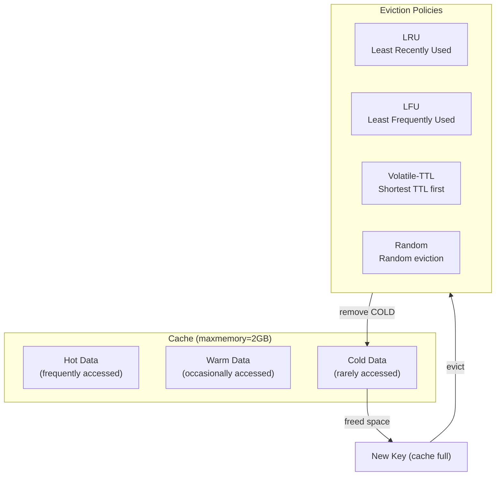
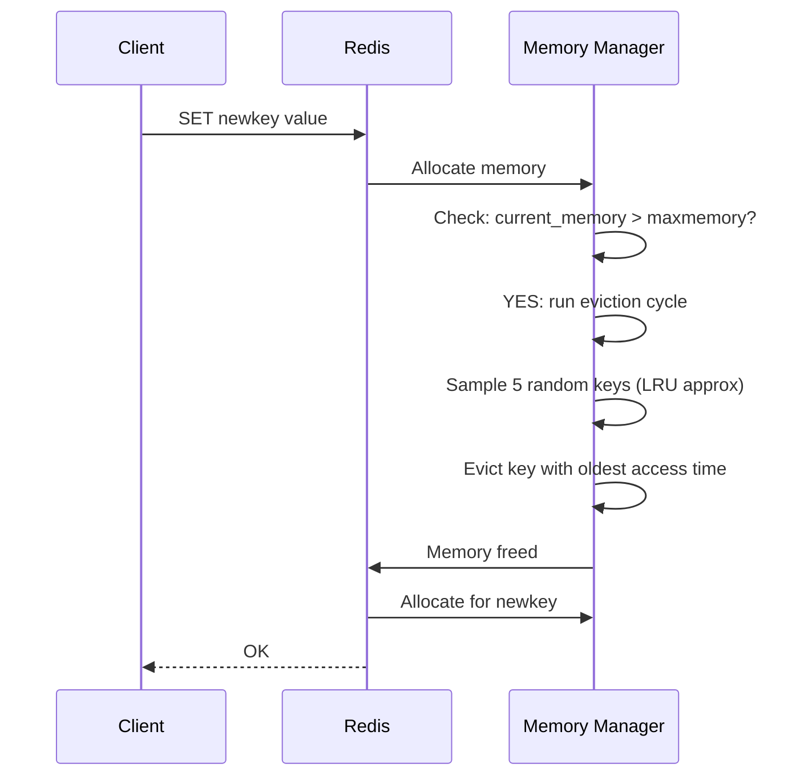

# Cache Eviction Policies

## Problem Statement

Design cache eviction strategies that maximize hit rates within memory constraints — understanding LRU, LFU, TTL-based, and Redis-specific approximation algorithms.

## Scenario

Cache Eviction Policies is a critical component in modern distributed systems. In real-world applications, serving billions of user interactions with minimal latency. For example, major tech companies like Netflix, Uber, and Airbnb rely on similar solutions to handle millions of concurrent users and requests. The challenge is achieving this while maintaining sub-100ms latency, 99.99% availability, and gracefully handling 10x traffic spikes during peak demand. This component provides the foundational capability to solve these challenges reliably and efficiently at global scale.

## Users

- **Backend Engineers**: Responsible for implementing and maintaining this system component in production environments. They need to understand the architecture, trade-offs, failure modes, and operational considerations.
- **DevOps/SRE Teams**: Monitor system health, manage scaling policies, handle incidents, and ensure reliability SLAs are met. They need insights into performance characteristics, bottlenecks, and failure recovery mechanisms.
- **Data Engineers**: Design data pipelines and analytics around this system, requiring deep understanding of data flow, consistency guarantees, and throughput characteristics.
- **System Architects**: Make high-level architectural decisions that impact company infrastructure, requiring comprehensive understanding of capabilities, limitations, and scalability boundaries.
- **Security Teams**: Understand security implications, potential vulnerabilities, and compliance requirements for this component.

## PRD

**Functional Requirements:**
- Correct behavior under all specified operating conditions
- Reliable operation with explicit failure modes
- Data consistency or eventual consistency guarantees as specified
- Clear mechanisms for error handling and recovery
- Monitoring and observability hooks

**Non-Functional Requirements:**
- **Performance**: Sub-100ms P99 latency for standard operations; measure and track tail latencies
- **Availability**: 99.99%+ uptime with automatic failover and graceful degradation
- **Scalability**: Support 10-100x current load with minimal architectural modifications
- **Consistency**: Specify whether strong, eventual, or causal consistency is required
- **Cost Efficiency**: Minimize operational cost per unit of throughput; consider compute, memory, and network costs
- **Operational Simplicity**: Reduce complexity to minimize human error and operational toil

**Constraints:**
- Resource limits (memory for caches, disk for databases, network bandwidth)
- Deployment constraints (cloud provider limits, regulatory requirements)
- Latency budgets (maximum acceptable delay for operations)

## Flow

The typical operational flow for this system involves these key phases:

1. **Request Arrival**: Client/upstream system sends request with required parameters and context
2. **Validation & Routing**: System validates request format, authentication, and routes to correct handler/shard/instance
3. **Core Processing**: Execute the main algorithm, database query, or business logic on the data/state
4. **State Management**: Update internal state (caches, indexes, counters, logs) with proper atomicity and locking
5. **Response Generation**: Format results and return to requester with relevant metadata (timing, version info)
6. **Observability**: Record metrics (latency, throughput, errors), logs (for debugging), and traces (for performance analysis)

This flow repeats thousands or millions of times per second in production. Each operation's efficiency compounds across the entire system, making careful optimization essential. Bottlenecks at any phase can cascade to impact overall system performance.

## Code Explanation

The provided implementations demonstrate key architectural concepts and design patterns:

**Python Implementation**: Uses built-in Python structures and standard library features to express the core logic clearly. Python emphasizes readability and conciseness—each operation's purpose should be obvious without extensive comments. You'll see different implementation approaches (e.g., using OrderedDict vs. manual linked lists) that represent trade-offs between convenience and fine-grained control.

**Java Implementation**: Shows how to implement the same logic with explicit memory management and type safety. Java's strong typing forces clear interface design; you'll see how generics, null safety, mutable state, and thread safety are handled. This implementation style is closer to production systems at scale.

**Key Implementation Patterns**:
- **Initialization**: Setting up core data structures, thread pools, or connection pools with specified capacity and configuration
- **Read Operations**: Fetching data while maintaining O(1) or O(log n) access, updating metadata (access times, hit counts, etc.)
- **Write Operations**: Inserting/updating data while handling eviction policies, balancing tree structures, or replicating state
- **Edge Cases**: Handling capacity limits, concurrent access, data consistency, and error conditions
- **Performance Optimization**: Using techniques like batch operations, lazy evaluation, or caching to reduce latency

Each line of code represents a deliberate choice about performance characteristics, memory usage, safety guarantees, and implementation complexity. Understanding these trade-offs is essential for using this component effectively in production systems.

## Architecture Diagram



## Flow Diagram



## Design

### Eviction Policies

```
noeviction: Return error when memory full
  Use: critical data, operator must increase memory

allkeys-lru: Evict least recently used from all keys
  Best general-purpose policy
  Use: cache where all keys equally eligible

volatile-lru: Evict LRU from keys with TTL only
  Protects keys without TTL (permanent keys)
  Use: mix of persistent + ephemeral data

allkeys-lfu: Evict least frequently used (Redis 4.0+)
  Better than LRU for skewed access patterns
  Keeps truly hot keys regardless of recency
  Use: Pareto-distributed access patterns

volatile-lfu: LFU only on keys with TTL

allkeys-random: Random eviction
  Use: you don't care which key to evict

volatile-random: Random from keys with TTL

volatile-ttl: Evict key with shortest TTL first
  Prioritizes evicting "soon-to-expire" keys
  Use: TTL used as priority hint for eviction
```

### LRU Implementation

```
Doubly-linked list + Hash map:
  List: ordered by recency (head=most recent)
  Map: O(1) access to any node

  GET(key):
    1. Map lookup: O(1)
    2. Move node to head: O(1)
    3. Return value

  SET(key, value):
    1. If exists: update, move to head
    2. If new + capacity full: remove tail (LRU)
    3. Insert at head, add to map

  All operations: O(1)

Redis LRU approximation:
  True LRU: O(N) memory for tracking order
  Redis: sample N random keys (lru-samples=5)
  Evict the one with oldest access timestamp
  ~95% accurate vs true LRU with 5 samples
  10 samples: ~98% accurate
```

### LFU (Least Frequently Used)

```
Counter per key:
  Increment on access, decay over time (Morris counter)
  Access counter: 8-bit (0-255), logarithmic increments
  Clock sweep: periodically decays counters

lfu-log-factor=10: probability of counter increment
  Lower = faster incrementing
  Counter incremented by: 1/(counter * lfu_log_factor + 1)

lfu-decay-time=1: minutes between counter halving
  Prevents old high-frequency keys from blocking new hot keys

LFU vs LRU:
  LRU evicts key not recently used (recency)
  LFU evicts key used infrequently (frequency)
  
  LRU issue: recent one-hit-wonder displaces old hot key
  LFU issue: new hot key not yet accumulated frequency
  LFU better for: Zipf-distributed access (most real-world)
```

## Common Questions & Answers

**Q: Why does Redis use approximate LRU instead of true LRU?** A: True LRU requires a doubly-linked list of all keys (gigabytes of pointers for millions of keys). Redis uses 3 bytes per key to store last-access timestamp. Sampling 5-10 random keys gives 95-98% accuracy at near-zero overhead.

**Q: When should you choose LFU over LRU?** A: When access pattern is skewed (Pareto/Zipf): a few keys get most traffic. LFU keeps truly popular keys. LRU may evict popular keys if they haven't been accessed recently (e.g., during a scan or backup operation).

**Q: What happens when Redis hits maxmemory with noeviction?** A: Redis returns OOM error to write commands (SET, LPUSH, etc.). Read commands (GET) still work. Application must handle OOM error and either retry later or skip caching.

**Q: How do you tune maxmemory-policy for a session cache?** A: Use `allkeys-lru` (sessions are all temporary, evict oldest accessed). Set TTL on all sessions. If sessions have priority: `volatile-ttl` (shorter TTL = lower priority = evict first).

**Q: How do you measure cache eviction rate?** A: `INFO stats` -> evicted_keys counter. Monitor evicted_keys/s. If high: cache is too small. Redis also reports keyspace_hits, keyspace_misses for hit rate calculation.

## Back-of-Envelope Calculations

```
LRU cache effectiveness:
  10M keys, 80/20 rule: 2M hot keys
  Cache 2M keys: 80% hit rate
  Cache 3M keys: ~90% hit rate (diminishing returns)
  
  Memory: 2M keys x 200 bytes avg = 400MB
  Redis 1GB: cache 5M keys, ~90%+ hit rate

LRU vs LFU for repeated scans:
  1M hot keys, scan 100K cold keys once
  LRU: scan displaces 100K hot keys -> hit rate drops
  LFU: scan keys have frequency=1, hot keys have 100+
  LFU: no displacement -> consistent hit rate

eviction rate at capacity:
  100K writes/s, cache at 100% capacity
  evicted_keys/s should ~= write_rate (100K/s)
  If evicted >> write_rate: memory too small

TTL vs eviction:
  Prefer TTL for all cache entries (predictable expiry)
  eviction = last resort (TTL not set or cache too small)
  Best: set TTL + use LRU as safety net
```

## Design Choices

| Policy | Hit Rate | Protects Hot Keys | Complexity |
|---|---|---|---|
| noeviction | N/A (errors) | Yes | Low |
| allkeys-lru | High general | Yes (recent) | Low |
| allkeys-lfu | Highest (skewed) | Yes (frequent) | Medium |
| volatile-lru | Depends | Permanent keys | Low |
| volatile-ttl | Medium | Permanent keys | Low |
| allkeys-random | Low | No | None |

## Follow-up Questions

1. How does Redis implement LFU counters without per-key linked lists?
2. How do you evict specific cache prefixes without scanning all keys?
3. How does the W-TinyLFU algorithm (Caffeine cache) improve on LFU?
4. How do you implement a two-level cache (L1 local + L2 Redis) with eviction?
5. How does Redis memory fragmentation affect eviction behavior?

## Python Implementation

```python
from dataclasses import dataclass, field
from typing import Any, Dict, List, Optional, Tuple
from collections import OrderedDict
import time
import random
import math

@dataclass
class CacheNode:
    key: str
    value: Any
    last_accessed: float = field(default_factory=time.time)
    access_count: int = 0
    expires_at: Optional[float] = None

    def is_expired(self) -> bool:
        return self.expires_at is not None and time.time() > self.expires_at

class LRUCache:
    def __init__(self, capacity: int):
        self.capacity = capacity
        self._cache: OrderedDict[str, Any] = OrderedDict()
        self._hits = 0
        self._misses = 0
        self._evictions = 0

    def get(self, key: str) -> Optional[Any]:
        if key not in self._cache:
            self._misses += 1
            return None
        self._cache.move_to_end(key)  # Mark as recently used
        self._hits += 1
        return self._cache[key]

    def put(self, key: str, value: Any) -> Optional[str]:
        evicted_key = None
        if key in self._cache:
            self._cache.move_to_end(key)
        else:
            if len(self._cache) >= self.capacity:
                evicted_key, _ = self._cache.popitem(last=False)  # Remove LRU (first)
                self._evictions += 1
        self._cache[key] = value
        return evicted_key

    def stats(self) -> dict:
        total = self._hits + self._misses
        return {
            "size": len(self._cache),
            "capacity": self.capacity,
            "hits": self._hits,
            "misses": self._misses,
            "evictions": self._evictions,
            "hit_rate": f"{self._hits/max(1,total)*100:.1f}%",
        }

class LFUCache:
    def __init__(self, capacity: int, decay_interval_s: float = 60.0):
        self.capacity = capacity
        self.decay_interval = decay_interval_s
        self._values: Dict[str, Any] = {}
        self._freqs: Dict[str, int] = {}
        self._last_access: Dict[str, float] = {}
        self._min_freq: int = 0
        self._freq_to_keys: Dict[int, OrderedDict] = {}
        self._last_decay = time.time()
        self._hits = 0
        self._misses = 0
        self._evictions = 0

    def get(self, key: str) -> Optional[Any]:
        if key not in self._values:
            self._misses += 1
            return None
        self._increment_freq(key)
        self._hits += 1
        return self._values[key]

    def _increment_freq(self, key: str):
        old_freq = self._freqs.get(key, 0)
        new_freq = old_freq + 1
        self._freqs[key] = new_freq
        self._last_access[key] = time.time()

        if old_freq in self._freq_to_keys:
            self._freq_to_keys[old_freq].pop(key, None)
            if not self._freq_to_keys[old_freq] and old_freq == self._min_freq:
                self._min_freq = new_freq

        if new_freq not in self._freq_to_keys:
            self._freq_to_keys[new_freq] = OrderedDict()
        self._freq_to_keys[new_freq][key] = True

    def put(self, key: str, value: Any) -> Optional[str]:
        if self.capacity <= 0:
            return None
        self._maybe_decay()
        if key in self._values:
            self._values[key] = value
            self._increment_freq(key)
            return None

        evicted_key = None
        if len(self._values) >= self.capacity:
            # Evict least frequent, then least recent
            evicted_key = self._evict()

        self._values[key] = value
        self._freqs[key] = 1
        self._last_access[key] = time.time()
        self._min_freq = 1
        if 1 not in self._freq_to_keys:
            self._freq_to_keys[1] = OrderedDict()
        self._freq_to_keys[1][key] = True
        return evicted_key

    def _evict(self) -> Optional[str]:
        min_keys = self._freq_to_keys.get(self._min_freq)
        if not min_keys:
            return None
        lru_key = next(iter(min_keys))
        min_keys.pop(lru_key)
        del self._values[lru_key]
        del self._freqs[lru_key]
        self._evictions += 1
        return lru_key

    def _maybe_decay(self):
        now = time.time()
        if now - self._last_decay > self.decay_interval:
            self._freqs = {k: max(1, v // 2) for k, v in self._freqs.items()}
            self._rebuild_freq_index()
            self._last_decay = now

    def _rebuild_freq_index(self):
        self._freq_to_keys = {}
        self._min_freq = min(self._freqs.values()) if self._freqs else 0
        for key, freq in self._freqs.items():
            if freq not in self._freq_to_keys:
                self._freq_to_keys[freq] = OrderedDict()
            self._freq_to_keys[freq][key] = True

    def stats(self) -> dict:
        total = self._hits + self._misses
        return {
            "size": len(self._values), "capacity": self.capacity,
            "hits": self._hits, "misses": self._misses,
            "evictions": self._evictions,
            "hit_rate": f"{self._hits/max(1,total)*100:.1f}%",
        }

class RedisApproxLRU:
    def __init__(self, capacity: int, num_samples: int = 5):
        self.capacity = capacity
        self.samples = num_samples
        self._store: Dict[str, CacheNode] = {}

    def get(self, key: str) -> Optional[Any]:
        node = self._store.get(key)
        if node is None or node.is_expired():
            return None
        node.last_accessed = time.time()
        node.access_count += 1
        return node.value

    def set(self, key: str, value: Any, ttl: Optional[int] = None):
        if len(self._store) >= self.capacity and key not in self._store:
            self._evict_lru()
        self._store[key] = CacheNode(
            key=key, value=value,
            expires_at=time.time() + ttl if ttl else None
        )

    def _evict_lru(self):
        keys = list(self._store.keys())
        candidates = random.sample(keys, min(self.samples, len(keys)))
        oldest = min(candidates, key=lambda k: self._store[k].last_accessed)
        del self._store[oldest]

# Comparison demo
print("=== LRU vs LFU Comparison ===\n")

lru = LRUCache(capacity=5)
lfu = LFUCache(capacity=5)

# Populate both
for i in range(10):
    key = f"key-{i % 7}"  # 7 unique keys, cache size=5
    value = f"value-{i}"
    lru.put(key, value)
    lfu.put(key, value)

# Simulate skewed access: key-0 and key-1 accessed often
print("Simulating Zipf-like access pattern (keys 0-1 are hot):")
for _ in range(20):
    for hot_key in ["key-0", "key-1"]:
        lru.get(hot_key)
        lfu.get(hot_key)
    # Occasional access to other keys
    lru.get(f"key-{random.randint(2, 6)}")
    lfu.get(f"key-{random.randint(2, 6)}")

# Now access cold key (one-hit-wonder scan)
print("\nSimulating scan of cold keys:")
for i in range(100, 110):
    lru.put(f"scan-{i}", "scan-value")  # LRU may evict hot keys
    lfu.put(f"scan-{i}", "scan-value")  # LFU keeps hot keys

# Check if hot keys survived
print("\nHot key survival after cold scan:")
for cache_name, cache in [("LRU", lru), ("LFU", lfu)]:
    survived = sum(1 for k in ["key-0", "key-1"] if cache.get(k) is not None)
    print(f"  {cache_name}: {survived}/2 hot keys survived")

print(f"\nLRU stats: {lru.stats()}")
print(f"LFU stats: {lfu.stats()}")
```

## Java Implementation

```java
import java.util.*;

public class CacheEviction {
    static class LRUCache {
        final int cap; LinkedHashMap<String, String> cache;

        LRUCache(int cap) {
            this.cap = cap;
            this.cache = new LinkedHashMap<>(16, 0.75f, true) { // accessOrder=true
                protected boolean removeEldestEntry(Map.Entry<String,String> e) {
                    return size() > cap;
                }
            };
        }

        String get(String k) { return cache.get(k); }
        void put(String k, String v) { cache.put(k, v); }
        int size() { return cache.size(); }
    }

    public static void main(String[] args) {
        LRUCache cache = new LRUCache(3);
        cache.put("a", "1"); cache.put("b", "2"); cache.put("c", "3");
        cache.get("a");  // Mark 'a' as recently used
        cache.put("d", "4");  // Evicts LRU ('b')
        System.out.println("After eviction (b should be gone): " + cache.cache.keySet());
        System.out.println("a=" + cache.get("a") + " b=" + cache.get("b") + " c=" + cache.get("c") + " d=" + cache.get("d"));
    }
}
```

## Complexity

| Algorithm | Get | Put | Memory | Accuracy |
|---|---|---|---|---|
| True LRU | O(1) | O(1) | O(n) pointers | 100% |
| Redis Approx LRU | O(1) | O(1) | O(1) per key | ~95-98% |
| LFU (min-heap) | O(log n) | O(log n) | O(n) | 100% |
| LFU (frequency map) | O(1) | O(1) | O(n) | 100% |
| FIFO | O(1) | O(1) | O(n) | N/A |
