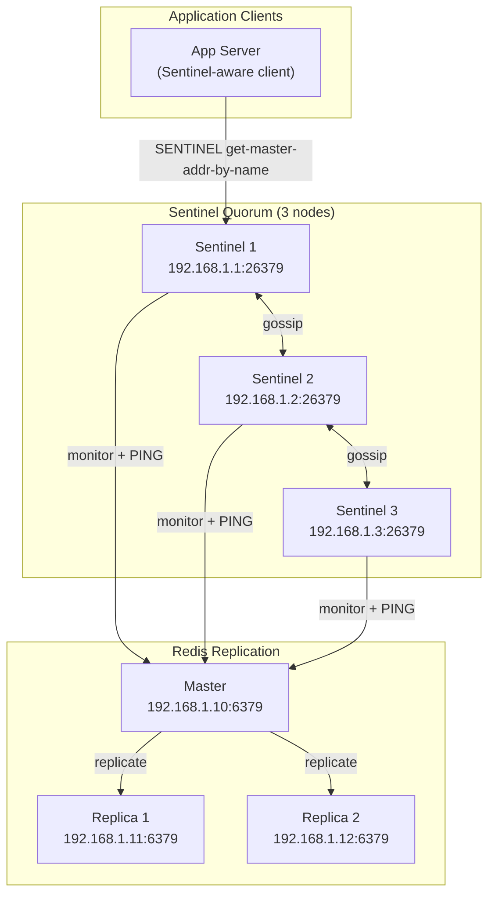
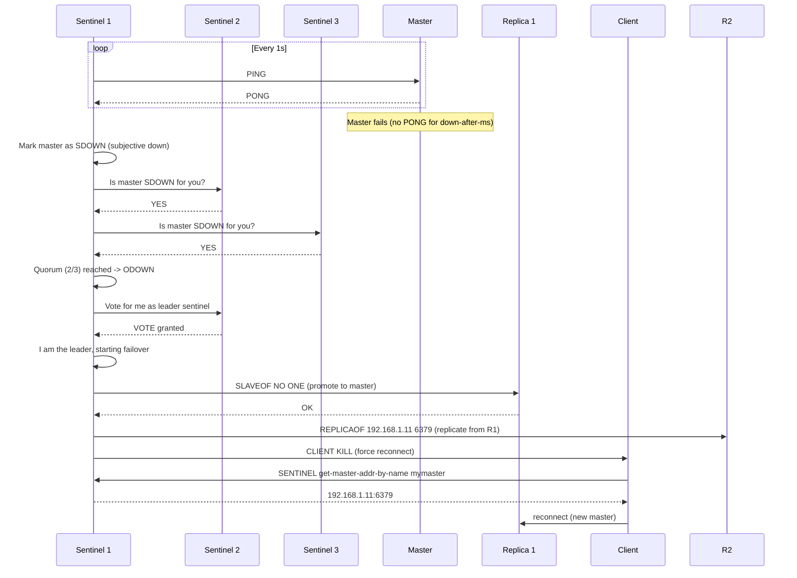

# Redis Sentinel

## Problem Statement

Design a high-availability Redis setup using Redis Sentinel for automatic failover — monitoring master health, electing a new master on failure, and reconfiguring clients without manual intervention.

## Scenario

Redis Sentinel is a critical component in modern distributed systems. In real-world applications, providing fast in-memory data access with persistence options. For example, major tech companies like Netflix, Uber, and Airbnb rely on similar solutions to handle millions of concurrent users and requests. The challenge is achieving this while maintaining sub-100ms latency, 99.99% availability, and gracefully handling 10x traffic spikes during peak demand. This component provides the foundational capability to solve these challenges reliably and efficiently at global scale.

## Users

- **Backend Engineers**: Responsible for implementing and maintaining this system component in production environments. They need to understand the architecture, trade-offs, failure modes, and operational considerations.
- **DevOps/SRE Teams**: Monitor system health, manage scaling policies, handle incidents, and ensure reliability SLAs are met. They need insights into performance characteristics, bottlenecks, and failure recovery mechanisms.
- **Data Engineers**: Design data pipelines and analytics around this system, requiring deep understanding of data flow, consistency guarantees, and throughput characteristics.
- **System Architects**: Make high-level architectural decisions that impact company infrastructure, requiring comprehensive understanding of capabilities, limitations, and scalability boundaries.
- **Security Teams**: Understand security implications, potential vulnerabilities, and compliance requirements for this component.

## PRD

**Functional Requirements:**
- Correct behavior under all specified operating conditions
- Reliable operation with explicit failure modes
- Data consistency or eventual consistency guarantees as specified
- Clear mechanisms for error handling and recovery
- Monitoring and observability hooks

**Non-Functional Requirements:**
- **Performance**: Sub-100ms P99 latency for standard operations; measure and track tail latencies
- **Availability**: 99.99%+ uptime with automatic failover and graceful degradation
- **Scalability**: Support 10-100x current load with minimal architectural modifications
- **Consistency**: Specify whether strong, eventual, or causal consistency is required
- **Cost Efficiency**: Minimize operational cost per unit of throughput; consider compute, memory, and network costs
- **Operational Simplicity**: Reduce complexity to minimize human error and operational toil

**Constraints:**
- Resource limits (memory for caches, disk for databases, network bandwidth)
- Deployment constraints (cloud provider limits, regulatory requirements)
- Latency budgets (maximum acceptable delay for operations)

## Flow

The typical operational flow for this system involves these key phases:

1. **Request Arrival**: Client/upstream system sends request with required parameters and context
2. **Validation & Routing**: System validates request format, authentication, and routes to correct handler/shard/instance
3. **Core Processing**: Execute the main algorithm, database query, or business logic on the data/state
4. **State Management**: Update internal state (caches, indexes, counters, logs) with proper atomicity and locking
5. **Response Generation**: Format results and return to requester with relevant metadata (timing, version info)
6. **Observability**: Record metrics (latency, throughput, errors), logs (for debugging), and traces (for performance analysis)

This flow repeats thousands or millions of times per second in production. Each operation's efficiency compounds across the entire system, making careful optimization essential. Bottlenecks at any phase can cascade to impact overall system performance.

## Code Explanation

The provided implementations demonstrate key architectural concepts and design patterns:

**Python Implementation**: Uses built-in Python structures and standard library features to express the core logic clearly. Python emphasizes readability and conciseness—each operation's purpose should be obvious without extensive comments. You'll see different implementation approaches (e.g., using OrderedDict vs. manual linked lists) that represent trade-offs between convenience and fine-grained control.

**Java Implementation**: Shows how to implement the same logic with explicit memory management and type safety. Java's strong typing forces clear interface design; you'll see how generics, null safety, mutable state, and thread safety are handled. This implementation style is closer to production systems at scale.

**Key Implementation Patterns**:
- **Initialization**: Setting up core data structures, thread pools, or connection pools with specified capacity and configuration
- **Read Operations**: Fetching data while maintaining O(1) or O(log n) access, updating metadata (access times, hit counts, etc.)
- **Write Operations**: Inserting/updating data while handling eviction policies, balancing tree structures, or replicating state
- **Edge Cases**: Handling capacity limits, concurrent access, data consistency, and error conditions
- **Performance Optimization**: Using techniques like batch operations, lazy evaluation, or caching to reduce latency

Each line of code represents a deliberate choice about performance characteristics, memory usage, safety guarantees, and implementation complexity. Understanding these trade-offs is essential for using this component effectively in production systems.

## Architecture Diagram



## Flow Diagram



## Design

### Sentinel Configuration

```
# sentinel.conf
sentinel monitor mymaster 192.168.1.10 6379 2
  # 2 = quorum needed to declare ODOWN

sentinel down-after-milliseconds mymaster 5000
  # Time without PONG before SDOWN

sentinel failover-timeout mymaster 60000
  # Max time for failover to complete

sentinel parallel-syncs mymaster 1
  # Replicas to sync simultaneously during failover
  # 1 = sequential (less disruption)

sentinel auth-pass mymaster secretpassword
  # Required if master has requirepass

min-replicas-to-write 1
min-replicas-max-lag 10
  # Master refuses writes if fewer than 1 replica is in sync
  # Prevents data loss on isolated master
```

### Failure Detection

```
SDOWN (Subjective Down):
  Single sentinel sees master as unreachable
  Conservative: might be network blip

ODOWN (Objective Down):
  Quorum (>= N) sentinels agree on SDOWN
  Triggers failover process

Quorum calculation:
  3 sentinels, quorum=2: can detect failure if 1 sentinel fails
  5 sentinels, quorum=3: can detect if 2 sentinels fail

Failover leader election:
  Sentinels vote for who runs the failover (Raft-like)
  Majority vote (>N/2 sentinels) required
  Leader sentinel orchestrates promotion
```

### Sentinel vs Cluster

```
Sentinel:
  - Single shard, vertical scaling
  - Simple setup
  - Automatic failover for single-instance HA
  - Client must use Sentinel-aware library
  - Transparent to application after initial config

Redis Cluster:
  - Horizontal scaling (multiple shards)
  - Higher complexity
  - Built-in HA (replicas per shard)
  - Different client protocol (hash slots)

When to use Sentinel:
  - Single Redis instance needs HA
  - Not large enough to warrant cluster
  - < 1TB data, < 1M ops/s
```

## Back-of-Envelope Calculations

```
Sentinel failover time:
  down-after-ms: 10s (detection)
  Leader election: 2s
  SLAVEOF NO ONE: 1s
  Replica re-sync: 2-5s
  Client reconnect: 1-2s
  Total: ~16-20 seconds

Data loss window:
  Async replication lag: ~1ms intra-DC
  Master fails: lose ~1ms of writes
  With min-replicas-max-lag=10: lose up to 10s if replica lags
  
Sentinel overhead:
  3 sentinels x 200MB RAM each = 600MB total
  PING overhead: 3 sentinels x 1 PING/s = minimal
  Gossip: ~1KB/s between sentinels

Client reconnect:
  3 app servers x connection pool 10 = 30 connections to re-establish
  TCP handshake + Redis auth: ~5ms each = 150ms total reconnect time
```

## Design Choices

| Setup | HA | Capacity | Complexity | Failover Time |
|---|---|---|---|---|
| Standalone | None | 1x | Low | Manual |
| Master + Replica | Read HA | 1x write | Low | Manual |
| Sentinel (3+3) | Write HA | 1x | Medium | 10-60s |
| Cluster (3+3) | Full HA | 3x | High | 30s per shard |
| Multi-region Sentinel | Cross-DC | 1x | High | Minutes |

## Python Implementation

```python
import socket
import time
import threading
from dataclasses import dataclass, field
from typing import Dict, List, Optional, Tuple
from enum import Enum
import random

class NodeState(Enum):
    ALIVE = "alive"
    SDOWN = "sdown"
    ODOWN = "odown"

@dataclass
class RedisNode:
    name: str
    host: str
    port: int
    is_master: bool = True
    replication_offset: int = 0
    alive: bool = True

@dataclass
class SentinelNode:
    sentinel_id: str
    host: str
    port: int
    _sdown_flags: Dict[str, bool] = field(default_factory=dict)

    def mark_sdown(self, node_name: str):
        self._sdown_flags[node_name] = True

    def is_sdown(self, node_name: str) -> bool:
        return self._sdown_flags.get(node_name, False)

class SentinelCluster:
    def __init__(self, quorum: int = 2):
        self.quorum = quorum
        self._sentinels: List[SentinelNode] = []
        self._nodes: Dict[str, RedisNode] = {}
        self._current_master: Optional[str] = None
        self._failover_in_progress = False
        self._epoch = 0
        self._votes: Dict[str, List[str]] = {}

    def add_sentinel(self, sentinel: SentinelNode):
        self._sentinels.append(sentinel)

    def add_redis_node(self, node: RedisNode):
        self._nodes[node.name] = node
        if node.is_master:
            self._current_master = node.name

    def _ping_node(self, sentinel: SentinelNode, node_name: str) -> bool:
        node = self._nodes.get(node_name)
        return node.alive if node else False

    def monitor_cycle(self):
        for sentinel in self._sentinels:
            for node_name, node in self._nodes.items():
                if not node.is_master:
                    continue
                alive = self._ping_node(sentinel, node_name)
                if not alive:
                    sentinel.mark_sdown(node_name)

    def check_odown(self, node_name: str) -> bool:
        sdown_count = sum(1 for s in self._sentinels if s.is_sdown(node_name))
        return sdown_count >= self.quorum

    def _elect_leader_sentinel(self) -> Optional[SentinelNode]:
        alive_sentinels = [s for s in self._sentinels]
        if not alive_sentinels:
            return None
        # Raft-like: first sentinel that reaches quorum wins
        votes: Dict[str, int] = {}
        for sentinel in alive_sentinels:
            candidate = random.choice(alive_sentinels).sentinel_id
            votes[candidate] = votes.get(candidate, 0) + 1
        winner = max(votes, key=votes.get)
        if votes[winner] >= len(alive_sentinels) // 2 + 1:
            return next(s for s in alive_sentinels if s.sentinel_id == winner)
        return alive_sentinels[0]

    def _select_new_master(self) -> Optional[str]:
        replicas = [n for n in self._nodes.values() if not n.is_master and n.alive]
        if not replicas:
            return None
        # Select replica with highest replication offset
        best = max(replicas, key=lambda n: n.replication_offset)
        return best.name

    def failover(self, failed_master_name: str) -> bool:
        if self._failover_in_progress:
            print("[Sentinel] Failover already in progress")
            return False

        if not self.check_odown(failed_master_name):
            print(f"[Sentinel] No ODOWN quorum for {failed_master_name}")
            return False

        self._failover_in_progress = True
        leader = self._elect_leader_sentinel()
        if not leader:
            self._failover_in_progress = False
            return False

        print(f"[Sentinel] Failover started by leader: {leader.sentinel_id}")

        # Mark failed master as dead
        failed_node = self._nodes[failed_master_name]
        failed_node.is_master = False

        # Promote new master
        new_master_name = self._select_new_master()
        if not new_master_name:
            print("[Sentinel] No suitable replica for promotion!")
            self._failover_in_progress = False
            return False

        new_master = self._nodes[new_master_name]
        new_master.is_master = True
        self._current_master = new_master_name
        self._epoch += 1

        print(f"[Sentinel] Promoted {new_master_name} ({new_master.host}:{new_master.port}) as new master")

        # Reconfigure other replicas
        for name, node in self._nodes.items():
            if name != new_master_name and not node.is_master and node.alive:
                print(f"[Sentinel] Reconfiguring {name} to replicate from {new_master_name}")

        self._failover_in_progress = False
        return True

    def get_master_addr(self) -> Optional[Tuple[str, int]]:
        if self._current_master:
            node = self._nodes.get(self._current_master)
            if node and node.alive and node.is_master:
                return node.host, node.port
        return None

class SentinelAwareClient:
    def __init__(self, sentinels: List[Tuple[str, int]], master_name: str = "mymaster"):
        self.sentinel_addrs = sentinels
        self.master_name = master_name
        self._master: Optional[Tuple[str, int]] = None
        self._sentinel_cluster: Optional[SentinelCluster] = None

    def connect(self, cluster: SentinelCluster):
        self._sentinel_cluster = cluster
        self._master = cluster.get_master_addr()
        if self._master:
            print(f"[Client] Connected to master at {self._master}")

    def execute(self, command: str, *args) -> Any:
        master = self._sentinel_cluster.get_master_addr() if self._sentinel_cluster else self._master
        if not master:
            raise ConnectionError("No master available")
        print(f"[Client] Execute {command} on {master}")
        return f"Result of {command}"

    def reconnect(self):
        self._master = self._sentinel_cluster.get_master_addr() if self._sentinel_cluster else None
        if self._master:
            print(f"[Client] Reconnected to new master: {self._master}")
        else:
            print("[Client] No master available yet")

# Demo
cluster = SentinelCluster(quorum=2)
sentinels = [
    SentinelNode("s1", "10.0.0.1", 26379),
    SentinelNode("s2", "10.0.0.2", 26379),
    SentinelNode("s3", "10.0.0.3", 26379),
]
for s in sentinels:
    cluster.add_sentinel(s)

nodes = [
    RedisNode("master", "10.0.1.1", 6379, is_master=True, replication_offset=1000),
    RedisNode("replica1", "10.0.1.2", 6379, is_master=False, replication_offset=999),
    RedisNode("replica2", "10.0.1.3", 6379, is_master=False, replication_offset=995),
]
for n in nodes:
    cluster.add_redis_node(n)

client = SentinelAwareClient([("10.0.0.1", 26379)])
client.connect(cluster)

print(f"\nCurrent master: {cluster.get_master_addr()}")
client.execute("SET", "key1", "value1")

print("\n=== Simulating Master Failure ===")
cluster._nodes["master"].alive = False
cluster.monitor_cycle()
print(f"SDOWN votes: {sum(1 for s in sentinels if s.is_sdown('master'))}")

cluster.failover("master")
print(f"\nNew master after failover: {cluster.get_master_addr()}")
client.reconnect()
```

## Java Implementation

```java
import java.util.*;

public class RedisSentinel {
    enum State { ALIVE, SDOWN, ODOWN }

    record RedisNode(String name, String host, int port, boolean isMaster, int replOffset) {}

    static class Sentinel {
        String id; Set<String> sdownFlags = new HashSet<>();
        Sentinel(String id) { this.id = id; }
        void markSdown(String name) { sdownFlags.add(name); }
        boolean isSdown(String name) { return sdownFlags.contains(name); }
    }

    static class SentinelCluster {
        List<Sentinel> sentinels = new ArrayList<>();
        Map<String, RedisNode> nodes = new HashMap<>();
        String masterName;
        int quorum;

        SentinelCluster(int quorum) { this.quorum = quorum; }
        void addSentinel(Sentinel s) { sentinels.add(s); }
        void addNode(RedisNode n) { nodes.put(n.name()); if (n.isMaster()) masterName = n.name(); }

        boolean failover(String failedMaster) {
            long sdownCount = sentinels.stream().filter(s -> s.isSdown(failedMaster)).count();
            if (sdownCount < quorum) return false;
            Optional<RedisNode> newMaster = nodes.values().stream()
                .filter(n -> !n.isMaster())
                .max(Comparator.comparingInt(RedisNode::replOffset));
            newMaster.ifPresent(n -> {
                masterName = n.name();
                System.out.println("Promoted: " + n.name() + " at " + n.host() + ":" + n.port());
            });
            return newMaster.isPresent();
        }

        String[] getMasterAddr() {
            RedisNode n = nodes.get(masterName);
            return n != null ? new String[]{n.host(), String.valueOf(n.port())} : null;
        }
    }

    public static void main(String[] args) {
        SentinelCluster cluster = new SentinelCluster(2);
        for (int i = 1; i <= 3; i++) cluster.addSentinel(new Sentinel("s" + i));
        cluster.addNode(new RedisNode("master", "10.0.1.1", 6379, true, 1000));
        cluster.addNode(new RedisNode("replica1", "10.0.1.2", 6379, false, 999));
        cluster.addNode(new RedisNode("replica2", "10.0.1.3", 6379, false, 990));

        System.out.println("Master: " + Arrays.toString(cluster.getMasterAddr()));
        cluster.sentinels.forEach(s -> s.markSdown("master"));
        cluster.failover("master");
        System.out.println("New master: " + Arrays.toString(cluster.getMasterAddr()));
    }
}
```

## Complexity

| Operation | Time |
|---|---|
| Sentinel PING check | O(1) per node |
| ODOWN detection | O(sentinels) |
| Leader election | O(sentinels) |
| Failover promotion | O(replicas) |
| Client reconnect | O(1) sentinel query |

## Common Questions & Answers

**Q: What is Redis and when do you use it?**

A: In-memory key-value data store with sub-millisecond latency. Used for caching (reduce DB load), sessions (user state), queues, real-time counters, leaderboards. Very fast but volatile (data loss on crash without persistence).

**Q: What data structures does Redis support?**

A: Strings (simple values), Lists (FIFO queues), Sets (unique values), Hashes (objects), Sorted Sets (leaderboards), Streams (Kafka-like), HyperLogLog (cardinality), Bitmaps (bitwise ops). Rich beyond simple cache.

**Q: How does Redis persistence work?**

A: RDB (snapshot): periodic point-in-time backup (fast, compact). AOF (append-only file): log all writes (durable, slower). BGSAVE/BGREWRITEAOF: background operations. Choose: speed vs. durability trade-off. Most use both.

**Q: What is Redis replication?**

A: Master-slave architecture: master accepts writes, slaves replicate. Read from master (strong consistency) or slaves (eventual, faster). Slaves can be read-only replicas or chain-replicate to others.

**Q: What is Redis Sentinel?**

A: High availability solution: monitors Redis instances, detects failures, promotes replica to master automatically. Requires 3+ Sentinel instances (majority quorum). Client connects via Sentinel instead of Redis directly.

**Q: What is Redis Cluster?**

A: Distributed Redis: data sharded across multiple nodes (hash slots). Auto-sharding, automatic failover, rebalancing. More complex than Sentinel. Required for massive scale (TB+ data).

**Q: How do you choose between Sentinel and Cluster?**

A: Sentinel: single master, high availability. Cluster: distributed, massive scale. Sentinel for most (simpler), Cluster only if need horizontal scaling. Data > memory = use Cluster.

**Q: How do you handle eviction when Redis runs out of memory?**

A: Set maxmemory policy: LRU, LFU, TTL, random, or no-eviction. LRU/LFU common for caching. TTL for session data. No-eviction blocks writes (safe but risky). Monitor memory usage constantly.

**Q: What is key expiration in Redis?**

A: Keys have optional TTL (time-to-live). After expiration, key automatically deleted. Lazy deletion (on access) + periodic cleanup. Use for session data, cache, or temporary counters. Check expiration policy for accuracy.

**Q: How do you secure Redis?**

A: Use password authentication (requirepass). ACLs (Redis 6+): per-user permissions. Run inside VPC (no internet access). Disable dangerous commands (FLUSHDB, CONFIG). TLS for remote connections.

## Follow-up Questions & Answers

**Q: How would you implement distributed locking with Redis?**

A: SET key value EX ttl NX (atomic: set if not exists with TTL). Acquire lock, execute critical section, delete key. Risk: crash loses lock (data consistency issue). Redlock solves this with multiple instances.

**Q: What is Redlock and what problem does it solve?**

A: Distributed lock across 5 Redis instances. Acquire lock on majority (quorum). Survives single instance failure. Overkill for most, but necessary for safety-critical sections. Trade: performance for correctness.

**Q: How would you implement rate limiting with Redis?**

A: Use sorted set with timestamps or hash with counters. Increment on each request, check against limit. Fast (O(log n)). Alternative: token bucket in Lua script. Faster than database.

**Q: How do you handle Redis memory limits and eviction policy?**

A: Set maxmemory (bytes), maxmemory-policy (LRU/LFU/TTL/random). Monitor hit rate (eviction = misses). Can also manually delete old keys or use cache-aside with database.

**Q: Can you use Redis for reliable message queues?**

A: Partially. Lists (basic) or Streams (better). Lists: FIFO, no persistence without RDB. Streams: replicas, consumer groups, reliable delivery (Kafka-like). For critical: use Kafka instead.

**Q: How would you implement Pub/Sub in Redis?**

A: Publisher sends to channel, subscribers receive. Fire-and-forget (no persistence). Good for notifications. Bad for reliable messaging (missed if subscriber offline). Better: Streams for reliable pub/sub.

**Q: How do you scale Redis beyond single node?**

A: Use Cluster (distributed), replicate read-heavy workload (slaves), or shard in application code. Cluster best for massive scale. Replication for read scaling. App sharding for distributed control.

**Q: Can you implement transactions in Redis?**

A: MULTI/EXEC: atomic batch of commands. Optimistic locking with WATCH. No rollback (all-or-nothing at command level). Use Lua scripts for complex atomic operations.

**Q: How would you debug Redis performance issues?**

A: SLOWLOG: find slow commands. MONITOR: see all commands in real-time. Memory analysis: MEMORY DOCTOR, key usage patterns. Network: latency between app and Redis. Profiling tools.

**Q: How do you backup and restore Redis?**

A: Backup: RDB snapshots, AOF files, or replication. Restore: copy files, or use Redis replication + replicaof. Backup strategy: periodic snapshots + AOF for durability. Test recovery regularly.

