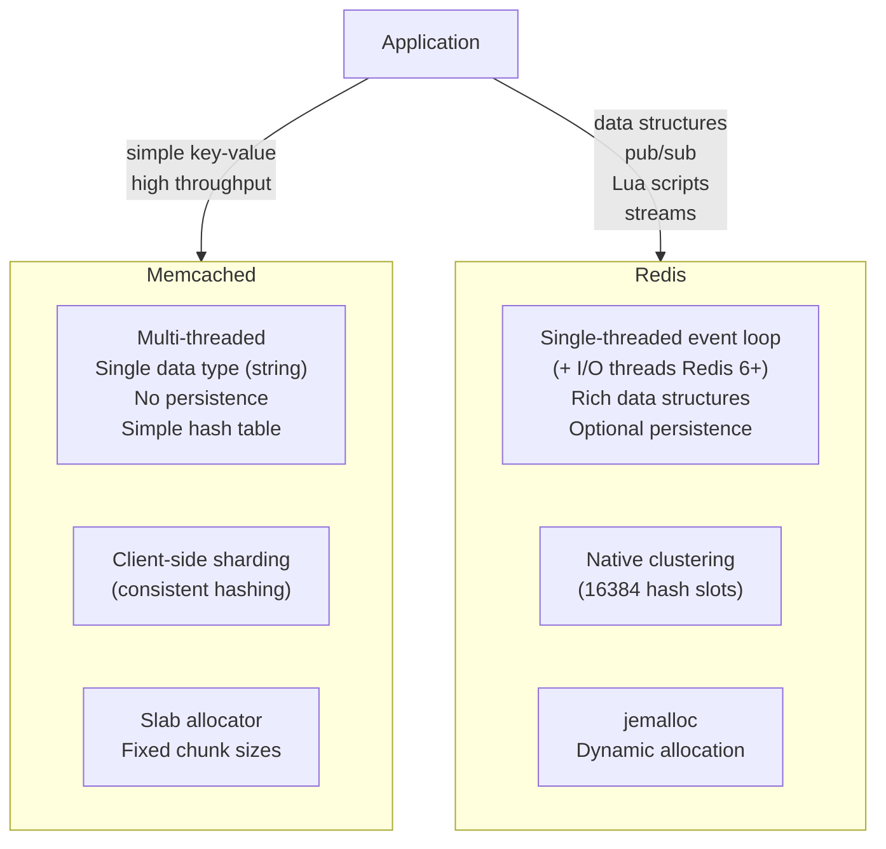
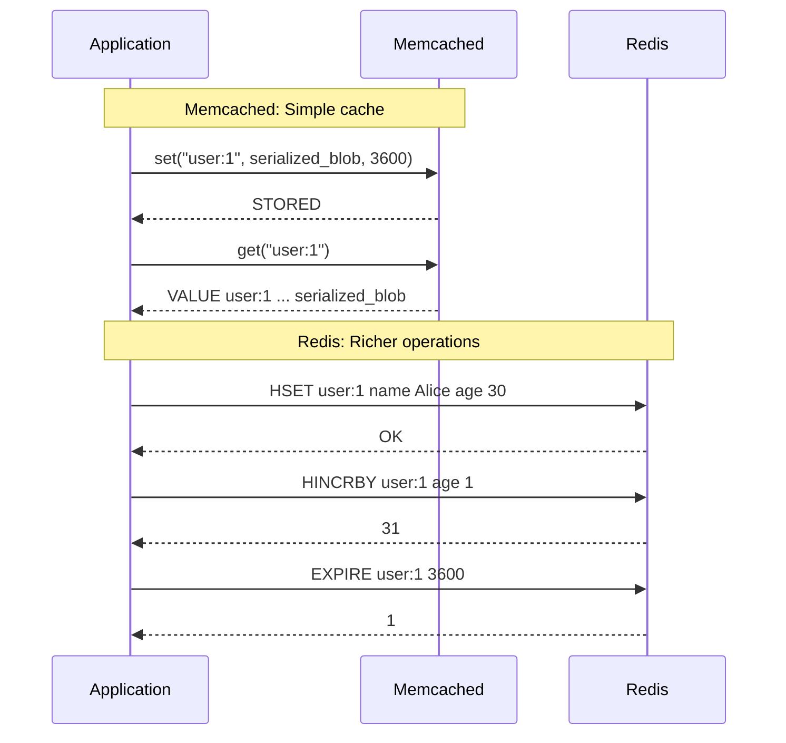

# Memcached vs Redis

## Problem Statement

Choose the right caching technology between Memcached and Redis — understanding their architectural differences, data model capabilities, persistence, clustering, and when each outperforms the other.

## Architecture Diagram



## Flow Diagram



## Design

### Core Differences

```
Memcached:
  Engine:    Multi-threaded C, simple hash table
  Data:      String only (binary-safe, max 1MB)
  Persistence: None (pure cache, restart = data loss)
  Replication: None native (client handles)
  Clustering: Client-side consistent hashing
  Lua:       Not supported
  Pub/Sub:   Not supported
  Atomic ops: CAS (Compare-And-Swap)
  Memory:    Slab allocator (pre-allocated chunks)
  Protocol:  Text + binary
  Config:    Minimal (very simple to operate)

Redis:
  Engine:    Single-threaded event loop + background threads
  Data:      String, List, Hash, Set, ZSet, Stream, HLL, Bitmap
  Persistence: RDB snapshots + AOF log
  Replication: Master-replica with async replication
  Clustering: Native Redis Cluster (hash slots)
  Lua:       EVAL scripts (atomic execution)
  Pub/Sub:   SUBSCRIBE/PUBLISH/keyspace notifications
  Atomic ops: MULTI/EXEC transactions + Lua
  Memory:    jemalloc dynamic allocation
  Protocol:  RESP (Redis Serialization Protocol)
  Config:    Extensive (150+ directives)
```

### Memcached Slab Allocator

```
Slab classes: pre-allocated memory chunks
  Class 1: 96 bytes
  Class 2: 120 bytes  
  ...
  Class 42: 1MB

Item stored in smallest slab that fits:
  Key + value = 150 bytes -> class 2 (120B slab)
  Problem: 150B item in 200B slab wastes 50B (25%)
  
Benefit:
  No memory fragmentation (OS never sees freed memory)
  Predictable allocation performance
  
Drawback:
  Wastes memory (avg 10-30% slab internal fragmentation)
  Fixed max item size = 1MB (configurable up to ~1MB)
  Re-used slabs: different-sized items compete for class

Redis jemalloc:
  Dynamic allocation, exact-fit chunks
  Lower internal fragmentation, higher external fragmentation
  mem_allocator_frag_ratio tracks fragmentation
```

### When to Use Each

```
Choose Memcached when:
  1. Pure caching only (no persistence needed)
  2. Multi-threaded performance at massive scale
     (Memcached scales linearly with CPU cores)
  3. Simple key-value with large blobs (binary serialized objects)
  4. Lowest operational complexity
  5. Memory efficiency for same-sized objects

Choose Redis when:
  1. Need data structures (sorted sets for leaderboards, etc.)
  2. Need persistence (reboot = cache survives)
  3. Need pub/sub or keyspace notifications
  4. Need atomic complex operations (Lua scripts)
  5. Need server-side TTL management with fine control
  6. Need clustering without client-side code changes
  7. Need streams (event log, task queues)
  8. Need HyperLogLog (cardinality estimation)
  9. Geospatial queries (GEOAGSEARCH)
  10. Sessions with complex session data (nested structures)

Common misconception:
  "Redis is slower" - FALSE for single-threaded workloads
  Memcached faster only for: massive multi-core, uniform key sizes
  Redis faster for: operations that would need client round-trips
```

### Memory Efficiency Comparison

```
Same data stored:
  User session: {id: 1, name: "Alice", role: "admin", csrf: "token"}
  
  Memcached: serialize to JSON (90B) -> slab class 5 (160B) -> 70B wasted
  Redis HASH: HSET user:1 id 1 name Alice role admin csrf token
    Overhead: ~100B per hash + field encoding
    Redis uses ziplist for small hashes (<128 fields, <64B values)
    Ziplist: ~50B for 4 small fields (more efficient!)
  
Redis ziplist optimization:
  hash-max-ziplist-entries 128 (default)
  hash-max-ziplist-value 64   (default)
  Below thresholds: contiguous memory (cache-friendly)
  Above: dict (hash table) for O(1) access
```

## Common Questions & Answers

**Q: Is Memcached faster than Redis?** A: In specific scenarios — Memcached is multi-threaded and can utilize all CPU cores for parallel key lookups of uniform-sized blobs. Redis is single-threaded (per core) so throughput plateaus sooner. But for most workloads (I/O bound, not CPU bound), Redis performs comparably. Redis 6.0+ added threaded I/O, narrowing the gap further.

**Q: Can you replace Memcached with Redis in most applications?** A: Yes in most cases. Redis is a strict superset of Memcached capabilities for caching. Only exception: very high memory efficiency with simple blobs (Memcached's slab allocator can be more efficient for fixed-size objects) or extreme multi-core CPU saturation scenarios.

**Q: Does Redis persistence slow down caching?** A: AOF with `fsync everysec` adds ~1-2ms per batch. RDB is background (fork) with no write path impact. For pure caching: use `save ""` and `appendonly no` — Redis with no persistence has similar performance to Memcached.

**Q: How does Memcached handle node failure?** A: It doesn't. Client hashes keys to nodes. If a node fails, those keys are simply missing (cache miss). Application must handle the miss and re-populate. No replication, no failover. For HA: run multiple servers and accept temporary miss rate increase.

**Q: What is CAS in Memcached and does Redis have it?** A: CAS (Compare-And-Swap) in Memcached: `gets` returns a token, `cas` updates only if token unchanged (prevents lost update). Redis equivalent: `WATCH` + `MULTI/EXEC` transaction — watch a key, if it changes before EXEC, transaction aborts. Redis also has `SET key value XX` (only-if-exists).

## Back-of-Envelope Calculations

```
Throughput comparison (single node):
  Memcached (8 cores): ~1-2M GET/s (8 threads)
  Redis (1 core): ~100-200K GET/s  
  Redis (1 core, pipeline 100): ~1M GET/s
  Redis 6+ (threaded I/O): ~500K-1M GET/s per instance

Memory comparison (1M sessions, 200B each):
  Total data: 200MB
  Memcached: ~240MB (20% slab waste average)
  Redis (ziplist): ~150MB (ziplist compresses small hashes)
  Redis (dict): ~280MB (hash table overhead per key)
  
  Threshold: Redis more efficient for structured small objects
              Memcached more efficient for large binary blobs

Horizontal scaling:
  Memcached: add nodes, client rebalances consistent hash ring
  Redis Cluster: add nodes, online resharding (MIGRATE)
  Both: linear capacity scaling

Replication:
  Memcached: none (you must write to all nodes)
  Redis: async replication <1ms intra-DC
```

## Design Choices

| Factor | Memcached | Redis |
|---|---|---|
| Data types | String only | 10+ types |
| Persistence | None | RDB + AOF |
| Clustering | Client-side | Native |
| Pub/Sub | No | Yes |
| Lua scripting | No | Yes |
| Multi-threading | Yes (all cores) | Partial (I/O threads) |
| Memory model | Slab allocator | jemalloc |
| Replication | None | Master-replica |
| Max value | 1MB | 512MB |
| Operations | GET/SET/DELETE/CAS | 250+ commands |

## Follow-up Questions

1. How does consistent hashing in Memcached clients minimize key redistribution when nodes are added/removed?
2. How do you migrate from Memcached to Redis without downtime?
3. What is Redis jemalloc memory fragmentation and how do you defragment?
4. How do you benchmark Redis vs Memcached for your specific workload using redis-benchmark?
5. How does Facebook/Meta use Memcached at scale (McRouter, regional pools)?

## Python Implementation

```python
from dataclasses import dataclass, field
from typing import Any, Dict, Optional, List, Tuple
import time
import hashlib
import json

@dataclass
class SlabClass:
    chunk_size: int
    chunks: List[Optional[bytes]] = field(default_factory=list)
    free_indices: List[int] = field(default_factory=list)

    def alloc(self, data: bytes) -> Optional[int]:
        if len(data) > self.chunk_size:
            return None
        if self.free_indices:
            idx = self.free_indices.pop()
            self.chunks[idx] = data
            return idx
        self.chunks.append(data)
        return len(self.chunks) - 1

    def free(self, idx: int):
        self.chunks[idx] = None
        self.free_indices.append(idx)

class MemcachedSimulator:
    SLAB_SIZES = [96, 120, 152, 192, 240, 304, 384, 480, 600, 752, 944, 1024*8, 1024*64, 1024*1024]

    def __init__(self, max_memory_mb: int = 64):
        self._slabs = [SlabClass(size) for size in self.SLAB_SIZES]
        self._index: Dict[str, Tuple[int, int, float, int]] = {}  # key -> (slab_idx, chunk_idx, expires_at, cas_token)
        self._cas_counter = 0
        self._hits = 0
        self._misses = 0
        self._evictions = 0

    def _slab_for(self, size: int) -> Optional[int]:
        for i, slab in enumerate(self._slabs):
            if slab.chunk_size >= size:
                return i
        return None

    def _serialize(self, key: str, value: Any, ttl: int) -> bytes:
        payload = json.dumps({"v": value}).encode()
        return payload

    def set(self, key: str, value: Any, ttl: int = 0) -> bool:
        data = self._serialize(key, value, ttl)
        encoded_key = key.encode()
        total = len(encoded_key) + len(data) + 48  # metadata overhead

        slab_idx = self._slab_for(total)
        if slab_idx is None:
            return False

        # Free old slot if exists
        if key in self._index:
            old_slab, old_chunk, _, _ = self._index[key]
            self._slabs[old_slab].free(old_chunk)

        chunk_idx = self._slabs[slab_idx].alloc(data)
        if chunk_idx is None:
            return False

        expires_at = time.time() + ttl if ttl > 0 else 0
        self._cas_counter += 1
        self._index[key] = (slab_idx, chunk_idx, expires_at, self._cas_counter)
        return True

    def get(self, key: str) -> Optional[Any]:
        entry = self._index.get(key)
        if entry is None:
            self._misses += 1
            return None
        slab_idx, chunk_idx, expires_at, _ = entry
        if expires_at > 0 and time.time() > expires_at:
            self._delete(key)
            self._misses += 1
            return None
        data = self._slabs[slab_idx].chunks[chunk_idx]
        if data is None:
            self._misses += 1
            return None
        self._hits += 1
        return json.loads(data)["v"]

    def gets(self, key: str) -> Tuple[Optional[Any], Optional[int]]:
        entry = self._index.get(key)
        if entry is None:
            return None, None
        slab_idx, chunk_idx, expires_at, cas_token = entry
        value = self.get(key)
        return value, cas_token if value is not None else None

    def cas(self, key: str, value: Any, cas_token: int, ttl: int = 0) -> str:
        entry = self._index.get(key)
        if entry is None:
            return "NOT_FOUND"
        _, _, _, current_token = entry
        if current_token != cas_token:
            return "EXISTS"  # Another client modified it
        self.set(key, value, ttl)
        return "STORED"

    def delete(self, key: str) -> bool:
        return self._delete(key)

    def _delete(self, key: str) -> bool:
        entry = self._index.pop(key, None)
        if entry:
            slab_idx, chunk_idx, _, _ = entry
            self._slabs[slab_idx].free(chunk_idx)
            return True
        return False

    def stats(self) -> dict:
        total = self._hits + self._misses
        return {
            "hits": self._hits, "misses": self._misses,
            "hit_rate": f"{self._hits / max(1, total) * 100:.1f}%",
            "keys": len(self._index),
        }

class MemcachedConsistentHashClient:
    def __init__(self, nodes: List[str], replicas: int = 150):
        self._ring: List[Tuple[int, str]] = []
        self._nodes: Dict[str, MemcachedSimulator] = {}
        for node in nodes:
            self._nodes[node] = MemcachedSimulator()
            for i in range(replicas):
                h = int(hashlib.md5(f"{node}:{i}".encode()).hexdigest(), 16)
                self._ring.append((h, node))
        self._ring.sort()

    def _get_node(self, key: str) -> str:
        h = int(hashlib.md5(key.encode()).hexdigest(), 16)
        for ring_hash, node in self._ring:
            if h <= ring_hash:
                return node
        return self._ring[0][1]

    def set(self, key: str, value: Any, ttl: int = 0) -> bool:
        return self._nodes[self._get_node(key)].set(key, value, ttl)

    def get(self, key: str) -> Optional[Any]:
        return self._nodes[self._get_node(key)].get(key)

class RedisSimulator:
    def __init__(self):
        self._store: Dict[str, Any] = {}
        self._expires: Dict[str, float] = {}
        self._hits = 0
        self._misses = 0

    def set(self, key: str, value: str, ex: Optional[int] = None, nx: bool = False) -> bool:
        if nx and key in self._store:
            return False
        self._store[key] = value
        if ex:
            self._expires[key] = time.time() + ex
        return True

    def get(self, key: str) -> Optional[str]:
        if key in self._expires and time.time() > self._expires[key]:
            del self._store[key]
            del self._expires[key]
            self._misses += 1
            return None
        val = self._store.get(key)
        if val is None:
            self._misses += 1
        else:
            self._hits += 1
        return val

    def hset(self, key: str, **fields) -> int:
        if key not in self._store:
            self._store[key] = {}
        self._store[key].update(fields)
        return len(fields)

    def hget(self, key: str, field: str) -> Optional[str]:
        h = self._store.get(key, {})
        return h.get(field)

    def hincrby(self, key: str, field: str, amount: int) -> int:
        if key not in self._store:
            self._store[key] = {}
        current = int(self._store[key].get(field, 0))
        self._store[key][field] = str(current + amount)
        return current + amount

    def zadd(self, key: str, mapping: Dict[str, float]) -> int:
        if key not in self._store:
            self._store[key] = {}
        self._store[key].update(mapping)
        return len(mapping)

    def zrange(self, key: str, start: int, stop: int, withscores: bool = False, rev: bool = False):
        zset = self._store.get(key, {})
        sorted_items = sorted(zset.items(), key=lambda x: x[1], reverse=rev)
        sliced = sorted_items[start:stop+1 if stop >= 0 else None]
        if withscores:
            return sliced
        return [k for k, _ in sliced]

    def stats(self) -> dict:
        total = self._hits + self._misses
        return {
            "hits": self._hits, "misses": self._misses,
            "hit_rate": f"{self._hits / max(1, total) * 100:.1f}%",
            "keys": len(self._store),
        }

# Demo: side-by-side comparison
print("=== Memcached vs Redis Comparison ===\n")

# Memcached: simple key-value
mc = MemcachedSimulator()
mc.set("user:1", {"name": "Alice", "role": "admin"}, ttl=3600)
print(f"Memcached GET: {mc.get('user:1')}")

# CAS demo
value, token = mc.gets("user:1")
print(f"Memcached GETS: value={value}, token={token}")
result = mc.cas("user:1", {"name": "Alice", "role": "superadmin"}, token)
print(f"Memcached CAS: {result}")

# Redis: rich operations
redis = RedisSimulator()
redis.hset("user:1", name="Alice", role="admin", score="100")
redis.hincrby("user:1", "score", 50)
print(f"\nRedis HGET score: {redis.hget('user:1', 'score')}")

# Leaderboard (only possible natively in Redis)
redis.zadd("leaderboard", {"alice": 1500.0, "bob": 1200.0, "carol": 1800.0})
top = redis.zrange("leaderboard", 0, 2, withscores=True, rev=True)
print(f"Redis leaderboard top 3: {top}")

# Consistent hashing client
print("\n=== Consistent Hash Distribution ===")
mc_cluster = MemcachedConsistentHashClient(["10.0.0.1:11211", "10.0.0.2:11211", "10.0.0.3:11211"])
keys = [f"key:{i}" for i in range(12)]
for key in keys:
    mc_cluster.set(key, f"value-{key}")
    node = mc_cluster._get_node(key)
    print(f"  {key} -> {node}")
```

## Java Implementation

```java
import java.util.*;

public class MemcachedVsRedis {
    static class MemcachedNode {
        Map<String, Object[]> store = new HashMap<>();  // key -> [value, expiresAt, casToken]
        long casCounter = 0;

        boolean set(String key, Object value, int ttlSec) {
            long exp = ttlSec > 0 ? System.currentTimeMillis() + ttlSec * 1000L : 0;
            store.put(key, new Object[]{value, exp, ++casCounter});
            return true;
        }

        Object get(String key) {
            Object[] entry = store.get(key);
            if (entry == null) return null;
            long exp = (long) entry[1];
            if (exp > 0 && System.currentTimeMillis() > exp) { store.remove(key); return null; }
            return entry[0];
        }

        Object[] gets(String key) {
            Object val = get(key);
            if (val == null) return null;
            Object[] entry = store.get(key);
            return new Object[]{val, entry[2]};  // [value, casToken]
        }

        String cas(String key, Object value, long token, int ttl) {
            Object[] entry = store.get(key);
            if (entry == null) return "NOT_FOUND";
            if (!entry[2].equals(token)) return "EXISTS";
            set(key, value, ttl);
            return "STORED";
        }
    }

    static class RedisNode {
        Map<String, Object> store = new HashMap<>();

        void hset(String key, String field, Object val) {
            store.computeIfAbsent(key, k -> new HashMap<String, Object>());
            ((Map<String, Object>) store.get(key)).put(field, val);
        }

        Object hget(String key, String field) {
            Map<?, ?> h = (Map<?, ?>) store.get(key);
            return h == null ? null : h.get(field);
        }

        long hincrby(String key, String field, long delta) {
            store.computeIfAbsent(key, k -> new HashMap<String, Object>());
            Map<String, Object> h = (Map<String, Object>) store.get(key);
            long cur = h.containsKey(field) ? Long.parseLong(h.get(field).toString()) : 0;
            h.put(field, cur + delta);
            return cur + delta;
        }

        void zadd(String key, String member, double score) {
            store.computeIfAbsent(key, k -> new TreeMap<Double, String>());
            ((TreeMap<Double, String>) store.get(key)).put(score, member);
        }

        List<Map.Entry<Double, String>> zrevrange(String key, int n) {
            TreeMap<Double, String> zset = (TreeMap<Double, String>) store.getOrDefault(key, new TreeMap<>());
            List<Map.Entry<Double, String>> result = new ArrayList<>(new TreeMap<>(Collections.reverseOrder()) {{ putAll(zset); }}.entrySet());
            return result.subList(0, Math.min(n, result.size()));
        }
    }

    public static void main(String[] args) {
        // Memcached: CAS demo
        MemcachedNode mc = new MemcachedNode();
        mc.set("user:1", Map.of("name", "Alice"), 3600);
        Object[] gotten = mc.gets("user:1");
        System.out.println("Memcached gets: " + gotten[0] + " token=" + gotten[1]);
        System.out.println("CAS result: " + mc.cas("user:1", Map.of("name", "Bob"), (long) gotten[1], 3600));

        // Redis: rich operations
        RedisNode redis = new RedisNode();
        redis.hset("user:1", "name", "Alice");
        redis.hset("user:1", "score", "100");
        System.out.println("Redis hincrby: " + redis.hincrby("user:1", "score", 50));

        redis.zadd("lb", "alice", 1500.0);
        redis.zadd("lb", "bob", 1200.0);
        redis.zadd("lb", "carol", 1800.0);
        System.out.println("Leaderboard top 3: " + redis.zrevrange("lb", 3));
    }
}
```

## Complexity

| Operation | Memcached | Redis |
|---|---|---|
| GET/SET | O(1) | O(1) |
| Multi-get | O(n) parallel | O(n) single-thread |
| Sorted set ops | N/A (client-side) | O(log n) |
| CAS | O(1) | O(1) via WATCH/EXEC |
| Expiry check | O(1) lazy | O(1) lazy + active |
| Memory alloc | O(1) slab | O(1) jemalloc |
