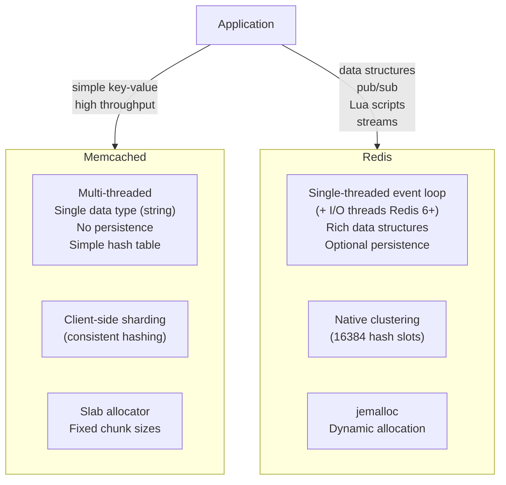
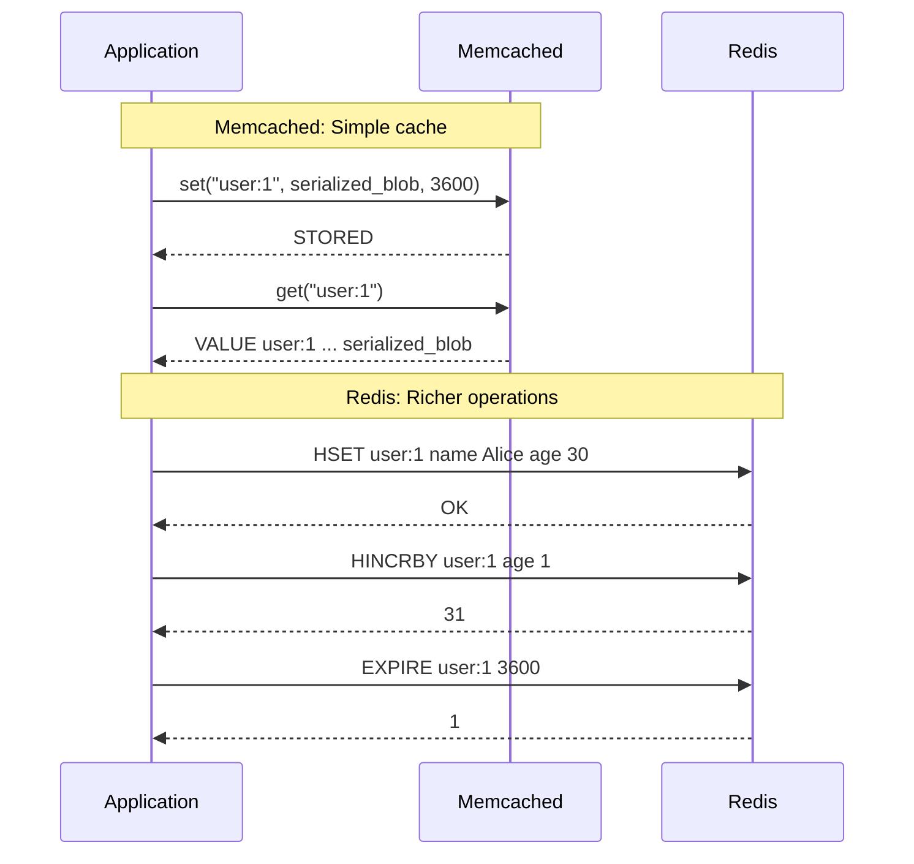
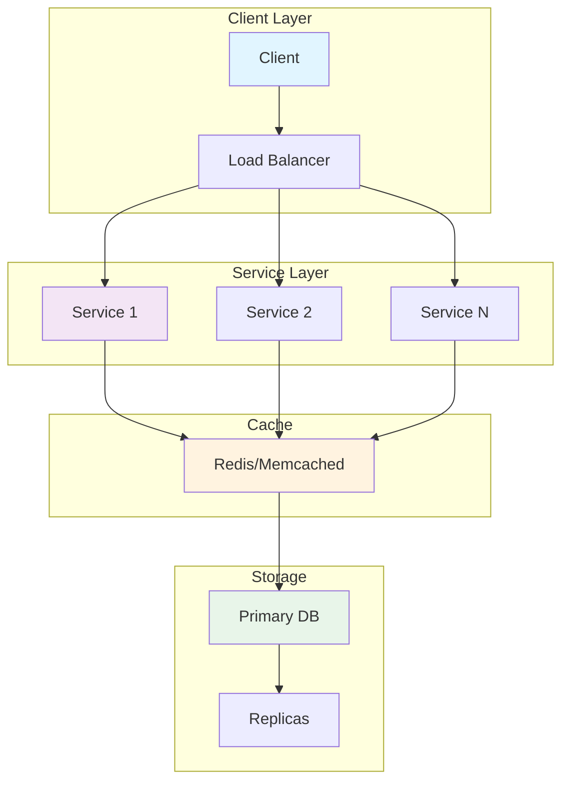
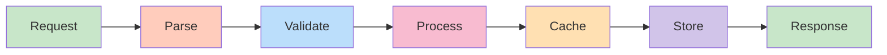
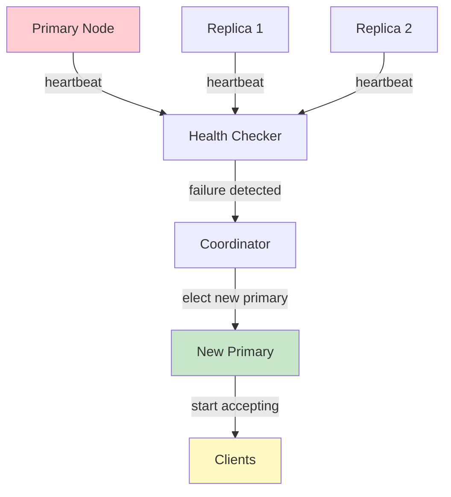
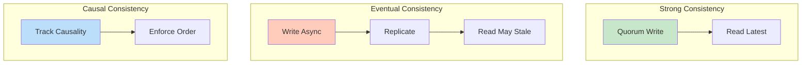
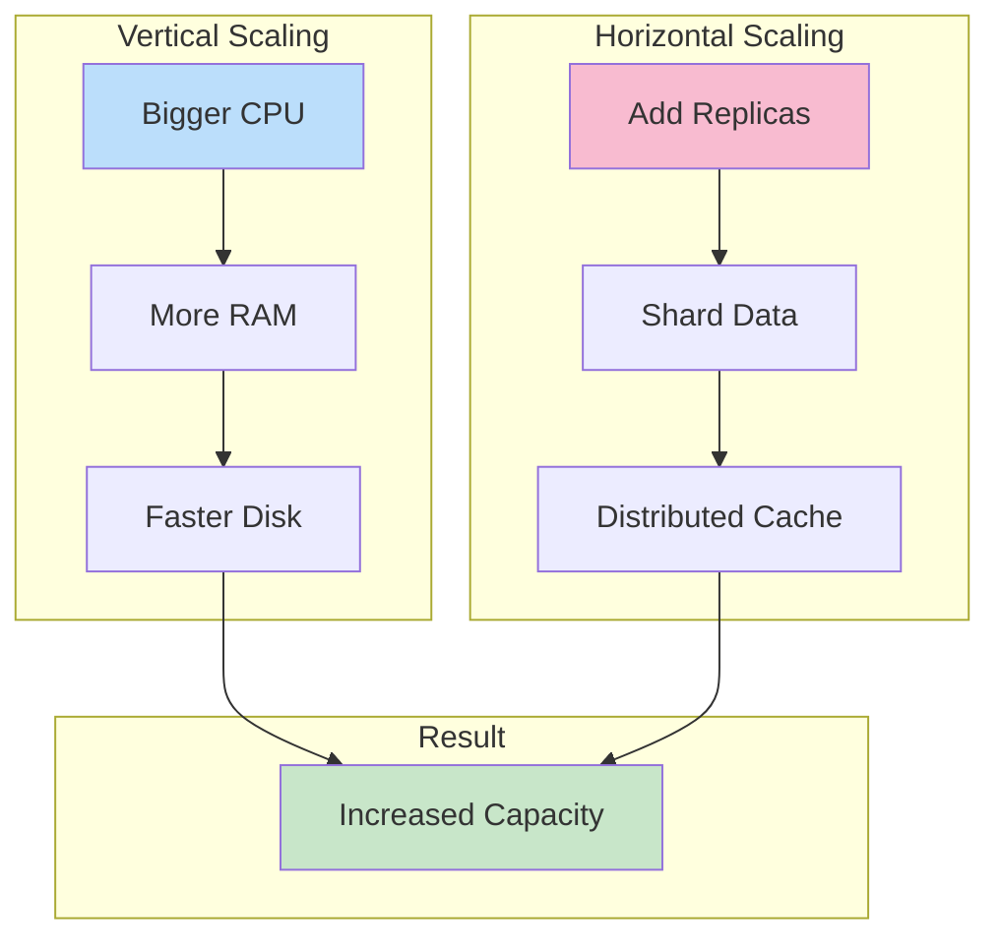

# Memcached vs Redis

## Problem Statement

Choose the right caching technology between Memcached and Redis — understanding their architectural differences, data model capabilities, persistence, clustering, and when each outperforms the other.

## Scenario

Memcached vs Redis is a critical component in modern distributed systems. In real-world applications, serving billions of user interactions with minimal latency. For example, major tech companies like Netflix, Uber, and Airbnb rely on similar solutions to handle millions of concurrent users and requests. The challenge is achieving this while maintaining sub-100ms latency, 99.99% availability, and gracefully handling 10x traffic spikes during peak demand. This component provides the foundational capability to solve these challenges reliably and efficiently at global scale.

## Users

- **Backend Engineers**: Responsible for implementing and maintaining this system component in production environments. They need to understand the architecture, trade-offs, failure modes, and operational considerations.
- **DevOps/SRE Teams**: Monitor system health, manage scaling policies, handle incidents, and ensure reliability SLAs are met. They need insights into performance characteristics, bottlenecks, and failure recovery mechanisms.
- **Data Engineers**: Design data pipelines and analytics around this system, requiring deep understanding of data flow, consistency guarantees, and throughput characteristics.
- **System Architects**: Make high-level architectural decisions that impact company infrastructure, requiring comprehensive understanding of capabilities, limitations, and scalability boundaries.
- **Security Teams**: Understand security implications, potential vulnerabilities, and compliance requirements for this component.

## PRD

### Functional Requirements
- Store key-value with optional TTL
- Support strings, lists, sets, hashes, sorted sets
- Atomic INCR, APPEND, ZADD operations
- Optional persistence (RDB, AOF)
- Master-slave replication

### Non-Functional Requirements
- Latency: < 1ms for get/set
- Throughput: 100K-1M ops/sec
- Memory: all in-memory (set maxmemory policy)
- Availability: sentinel or cluster HA
- Durability: optional (can lose data without persistence)

### Success Metrics
- Hit rate > 95% for caching
- Latency p99 < 10ms
- Memory utilization < 80%
- Replication lag < 1s


## Flow

The typical operational flow for this system involves these key phases:

1. **Request Arrival**: Client/upstream system sends request with required parameters and context
2. **Validation & Routing**: System validates request format, authentication, and routes to correct handler/shard/instance
3. **Core Processing**: Execute the main algorithm, database query, or business logic on the data/state
4. **State Management**: Update internal state (caches, indexes, counters, logs) with proper atomicity and locking
5. **Response Generation**: Format results and return to requester with relevant metadata (timing, version info)
6. **Observability**: Record metrics (latency, throughput, errors), logs (for debugging), and traces (for performance analysis)

This flow repeats thousands or millions of times per second in production. Each operation's efficiency compounds across the entire system, making careful optimization essential. Bottlenecks at any phase can cascade to impact overall system performance.


## Code Explanation (Detailed)

### Data Structures
- String: Atomic increment, append (cache values, counters)
- List: FIFO queue (rpush/lpop)
- Hash: Object-like (hset/hget)
- Set: Unique values, fast membership (sadd/smembers)
- Sorted Set: Ranked data (zadd/zrevrange for leaderboards)

### Caching Pattern (Cache-Aside)
1. Check cache (fast path, O(1))
2. If miss: fetch from DB (slow)
3. Update cache with TTL (setex)
4. Risk: thundering herd on popular key

### Atomic Operations
- Lua scripts: Complex operations, server-side atomicity
- WATCH/MULTI/EXEC: Optimistic locking
- INCR/ZADD: Inherently atomic

## Architecture Diagram



## Flow Diagram



## Design

### Core Differences

```
Memcached:
  Engine:    Multi-threaded C, simple hash table
  Data:      String only (binary-safe, max 1MB)
  Persistence: None (pure cache, restart = data loss)
  Replication: None native (client handles)
  Clustering: Client-side consistent hashing
  Lua:       Not supported
  Pub/Sub:   Not supported
  Atomic ops: CAS (Compare-And-Swap)
  Memory:    Slab allocator (pre-allocated chunks)
  Protocol:  Text + binary
  Config:    Minimal (very simple to operate)

Redis:
  Engine:    Single-threaded event loop + background threads
  Data:      String, List, Hash, Set, ZSet, Stream, HLL, Bitmap
  Persistence: RDB snapshots + AOF log
  Replication: Master-replica with async replication
  Clustering: Native Redis Cluster (hash slots)
  Lua:       EVAL scripts (atomic execution)
  Pub/Sub:   SUBSCRIBE/PUBLISH/keyspace notifications
  Atomic ops: MULTI/EXEC transactions + Lua
  Memory:    jemalloc dynamic allocation
  Protocol:  RESP (Redis Serialization Protocol)
  Config:    Extensive (150+ directives)
```

### Memcached Slab Allocator

```
Slab classes: pre-allocated memory chunks
  Class 1: 96 bytes
  Class 2: 120 bytes  
  ...
  Class 42: 1MB

Item stored in smallest slab that fits:
  Key + value = 150 bytes -> class 2 (120B slab)
  Problem: 150B item in 200B slab wastes 50B (25%)
  
Benefit:
  No memory fragmentation (OS never sees freed memory)
  Predictable allocation performance
  
Drawback:
  Wastes memory (avg 10-30% slab internal fragmentation)
  Fixed max item size = 1MB (configurable up to ~1MB)
  Re-used slabs: different-sized items compete for class

Redis jemalloc:
  Dynamic allocation, exact-fit chunks
  Lower internal fragmentation, higher external fragmentation
  mem_allocator_frag_ratio tracks fragmentation
```

### When to Use Each

```
Choose Memcached when:
  1. Pure caching only (no persistence needed)
  2. Multi-threaded performance at massive scale
     (Memcached scales linearly with CPU cores)
  3. Simple key-value with large blobs (binary serialized objects)
  4. Lowest operational complexity
  5. Memory efficiency for same-sized objects

Choose Redis when:
  1. Need data structures (sorted sets for leaderboards, etc.)
  2. Need persistence (reboot = cache survives)
  3. Need pub/sub or keyspace notifications
  4. Need atomic complex operations (Lua scripts)
  5. Need server-side TTL management with fine control
  6. Need clustering without client-side code changes
  7. Need streams (event log, task queues)
  8. Need HyperLogLog (cardinality estimation)
  9. Geospatial queries (GEOAGSEARCH)
  10. Sessions with complex session data (nested structures)

Common misconception:
  "Redis is slower" - FALSE for single-threaded workloads
  Memcached faster only for: massive multi-core, uniform key sizes
  Redis faster for: operations that would need client round-trips
```

### Memory Efficiency Comparison

```
Same data stored:
  User session: {id: 1, name: "Alice", role: "admin", csrf: "token"}
  
  Memcached: serialize to JSON (90B) -> slab class 5 (160B) -> 70B wasted
  Redis HASH: HSET user:1 id 1 name Alice role admin csrf token
    Overhead: ~100B per hash + field encoding
    Redis uses ziplist for small hashes (<128 fields, <64B values)
    Ziplist: ~50B for 4 small fields (more efficient!)
  
Redis ziplist optimization:
  hash-max-ziplist-entries 128 (default)
  hash-max-ziplist-value 64   (default)
  Below thresholds: contiguous memory (cache-friendly)
  Above: dict (hash table) for O(1) access
```

## Back-of-Envelope Calculations

```
Throughput comparison (single node):
  Memcached (8 cores): ~1-2M GET/s (8 threads)
  Redis (1 core): ~100-200K GET/s  
  Redis (1 core, pipeline 100): ~1M GET/s
  Redis 6+ (threaded I/O): ~500K-1M GET/s per instance

Memory comparison (1M sessions, 200B each):
  Total data: 200MB
  Memcached: ~240MB (20% slab waste average)
  Redis (ziplist): ~150MB (ziplist compresses small hashes)
  Redis (dict): ~280MB (hash table overhead per key)
  
  Threshold: Redis more efficient for structured small objects
              Memcached more efficient for large binary blobs

Horizontal scaling:
  Memcached: add nodes, client rebalances consistent hash ring
  Redis Cluster: add nodes, online resharding (MIGRATE)
  Both: linear capacity scaling

Replication:
  Memcached: none (you must write to all nodes)
  Redis: async replication <1ms intra-DC
```

## Design Choices

| Factor | Memcached | Redis |
|---|---|---|
| Data types | String only | 10+ types |
| Persistence | None | RDB + AOF |
| Clustering | Client-side | Native |
| Pub/Sub | No | Yes |
| Lua scripting | No | Yes |
| Multi-threading | Yes (all cores) | Partial (I/O threads) |
| Memory model | Slab allocator | jemalloc |
| Replication | None | Master-replica |
| Max value | 1MB | 512MB |
| Operations | GET/SET/DELETE/CAS | 250+ commands |

## Python Implementation

```python
from dataclasses import dataclass, field
from typing import Any, Dict, Optional, List, Tuple
import time
import hashlib
import json

@dataclass
class SlabClass:
    chunk_size: int
    chunks: List[Optional[bytes]] = field(default_factory=list)
    free_indices: List[int] = field(default_factory=list)

    def alloc(self, data: bytes) -> Optional[int]:
        if len(data) > self.chunk_size:
            return None
        if self.free_indices:
            idx = self.free_indices.pop()
            self.chunks[idx] = data
            return idx
        self.chunks.append(data)
        return len(self.chunks) - 1

    def free(self, idx: int):
        self.chunks[idx] = None
        self.free_indices.append(idx)

class MemcachedSimulator:
    SLAB_SIZES = [96, 120, 152, 192, 240, 304, 384, 480, 600, 752, 944, 1024*8, 1024*64, 1024*1024]

    def __init__(self, max_memory_mb: int = 64):
        self._slabs = [SlabClass(size) for size in self.SLAB_SIZES]
        self._index: Dict[str, Tuple[int, int, float, int]] = {}  # key -> (slab_idx, chunk_idx, expires_at, cas_token)
        self._cas_counter = 0
        self._hits = 0
        self._misses = 0
        self._evictions = 0

    def _slab_for(self, size: int) -> Optional[int]:
        for i, slab in enumerate(self._slabs):
            if slab.chunk_size >= size:
                return i
        return None

    def _serialize(self, key: str, value: Any, ttl: int) -> bytes:
        payload = json.dumps({"v": value}).encode()
        return payload

    def set(self, key: str, value: Any, ttl: int = 0) -> bool:
        data = self._serialize(key, value, ttl)
        encoded_key = key.encode()
        total = len(encoded_key) + len(data) + 48  # metadata overhead

        slab_idx = self._slab_for(total)
        if slab_idx is None:
            return False

        # Free old slot if exists
        if key in self._index:
            old_slab, old_chunk, _, _ = self._index[key]
            self._slabs[old_slab].free(old_chunk)

        chunk_idx = self._slabs[slab_idx].alloc(data)
        if chunk_idx is None:
            return False

        expires_at = time.time() + ttl if ttl > 0 else 0
        self._cas_counter += 1
        self._index[key] = (slab_idx, chunk_idx, expires_at, self._cas_counter)
        return True

    def get(self, key: str) -> Optional[Any]:
        entry = self._index.get(key)
        if entry is None:
            self._misses += 1
            return None
        slab_idx, chunk_idx, expires_at, _ = entry
        if expires_at > 0 and time.time() > expires_at:
            self._delete(key)
            self._misses += 1
            return None
        data = self._slabs[slab_idx].chunks[chunk_idx]
        if data is None:
            self._misses += 1
            return None
        self._hits += 1
        return json.loads(data)["v"]

    def gets(self, key: str) -> Tuple[Optional[Any], Optional[int]]:
        entry = self._index.get(key)
        if entry is None:
            return None, None
        slab_idx, chunk_idx, expires_at, cas_token = entry
        value = self.get(key)
        return value, cas_token if value is not None else None

    def cas(self, key: str, value: Any, cas_token: int, ttl: int = 0) -> str:
        entry = self._index.get(key)
        if entry is None:
            return "NOT_FOUND"
        _, _, _, current_token = entry
        if current_token != cas_token:
            return "EXISTS"  # Another client modified it
        self.set(key, value, ttl)
        return "STORED"

    def delete(self, key: str) -> bool:
        return self._delete(key)

    def _delete(self, key: str) -> bool:
        entry = self._index.pop(key, None)
        if entry:
            slab_idx, chunk_idx, _, _ = entry
            self._slabs[slab_idx].free(chunk_idx)
            return True
        return False

    def stats(self) -> dict:
        total = self._hits + self._misses
        return {
            "hits": self._hits, "misses": self._misses,
            "hit_rate": f"{self._hits / max(1, total) * 100:.1f}%",
            "keys": len(self._index),
        }

class MemcachedConsistentHashClient:
    def __init__(self, nodes: List[str], replicas: int = 150):
        self._ring: List[Tuple[int, str]] = []
        self._nodes: Dict[str, MemcachedSimulator] = {}
        for node in nodes:
            self._nodes[node] = MemcachedSimulator()
            for i in range(replicas):
                h = int(hashlib.md5(f"{node}:{i}".encode()).hexdigest(), 16)
                self._ring.append((h, node))
        self._ring.sort()

    def _get_node(self, key: str) -> str:
        h = int(hashlib.md5(key.encode()).hexdigest(), 16)
        for ring_hash, node in self._ring:
            if h <= ring_hash:
                return node
        return self._ring[0][1]

    def set(self, key: str, value: Any, ttl: int = 0) -> bool:
        return self._nodes[self._get_node(key)].set(key, value, ttl)

    def get(self, key: str) -> Optional[Any]:
        return self._nodes[self._get_node(key)].get(key)

class RedisSimulator:
    def __init__(self):
        self._store: Dict[str, Any] = {}
        self._expires: Dict[str, float] = {}
        self._hits = 0
        self._misses = 0

    def set(self, key: str, value: str, ex: Optional[int] = None, nx: bool = False) -> bool:
        if nx and key in self._store:
            return False
        self._store[key] = value
        if ex:
            self._expires[key] = time.time() + ex
        return True

    def get(self, key: str) -> Optional[str]:
        if key in self._expires and time.time() > self._expires[key]:
            del self._store[key]
            del self._expires[key]
            self._misses += 1
            return None
        val = self._store.get(key)
        if val is None:
            self._misses += 1
        else:
            self._hits += 1
        return val

    def hset(self, key: str, **fields) -> int:
        if key not in self._store:
            self._store[key] = {}
        self._store[key].update(fields)
        return len(fields)

    def hget(self, key: str, field: str) -> Optional[str]:
        h = self._store.get(key, {})
        return h.get(field)

    def hincrby(self, key: str, field: str, amount: int) -> int:
        if key not in self._store:
            self._store[key] = {}
        current = int(self._store[key].get(field, 0))
        self._store[key][field] = str(current + amount)
        return current + amount

    def zadd(self, key: str, mapping: Dict[str, float]) -> int:
        if key not in self._store:
            self._store[key] = {}
        self._store[key].update(mapping)
        return len(mapping)

    def zrange(self, key: str, start: int, stop: int, withscores: bool = False, rev: bool = False):
        zset = self._store.get(key, {})
        sorted_items = sorted(zset.items(), key=lambda x: x[1], reverse=rev)
        sliced = sorted_items[start:stop+1 if stop >= 0 else None]
        if withscores:
            return sliced
        return [k for k, _ in sliced]

    def stats(self) -> dict:
        total = self._hits + self._misses
        return {
            "hits": self._hits, "misses": self._misses,
            "hit_rate": f"{self._hits / max(1, total) * 100:.1f}%",
            "keys": len(self._store),
        }

# Demo: side-by-side comparison
print("=== Memcached vs Redis Comparison ===\n")

# Memcached: simple key-value
mc = MemcachedSimulator()
mc.set("user:1", {"name": "Alice", "role": "admin"}, ttl=3600)
print(f"Memcached GET: {mc.get('user:1')}")

# CAS demo
value, token = mc.gets("user:1")
print(f"Memcached GETS: value={value}, token={token}")
result = mc.cas("user:1", {"name": "Alice", "role": "superadmin"}, token)
print(f"Memcached CAS: {result}")

# Redis: rich operations
redis = RedisSimulator()
redis.hset("user:1", name="Alice", role="admin", score="100")
redis.hincrby("user:1", "score", 50)
print(f"\nRedis HGET score: {redis.hget('user:1', 'score')}")

# Leaderboard (only possible natively in Redis)
redis.zadd("leaderboard", {"alice": 1500.0, "bob": 1200.0, "carol": 1800.0})
top = redis.zrange("leaderboard", 0, 2, withscores=True, rev=True)
print(f"Redis leaderboard top 3: {top}")

# Consistent hashing client
print("\n=== Consistent Hash Distribution ===")
mc_cluster = MemcachedConsistentHashClient(["10.0.0.1:11211", "10.0.0.2:11211", "10.0.0.3:11211"])
keys = [f"key:{i}" for i in range(12)]
for key in keys:
    mc_cluster.set(key, f"value-{key}")
    node = mc_cluster._get_node(key)
    print(f"  {key} -> {node}")
```

## Java Implementation

```java
import java.util.*;

public class MemcachedVsRedis {
    static class MemcachedNode {
        Map<String, Object[]> store = new HashMap<>();  // key -> [value, expiresAt, casToken]
        long casCounter = 0;

        boolean set(String key, Object value, int ttlSec) {
            long exp = ttlSec > 0 ? System.currentTimeMillis() + ttlSec * 1000L : 0;
            store.put(key, new Object[]{value, exp, ++casCounter});
            return true;
        }

        Object get(String key) {
            Object[] entry = store.get(key);
            if (entry == null) return null;
            long exp = (long) entry[1];
            if (exp > 0 && System.currentTimeMillis() > exp) { store.remove(key); return null; }
            return entry[0];
        }

        Object[] gets(String key) {
            Object val = get(key);
            if (val == null) return null;
            Object[] entry = store.get(key);
            return new Object[]{val, entry[2]};  // [value, casToken]
        }

        String cas(String key, Object value, long token, int ttl) {
            Object[] entry = store.get(key);
            if (entry == null) return "NOT_FOUND";
            if (!entry[2].equals(token)) return "EXISTS";
            set(key, value, ttl);
            return "STORED";
        }
    }

    static class RedisNode {
        Map<String, Object> store = new HashMap<>();

        void hset(String key, String field, Object val) {
            store.computeIfAbsent(key, k -> new HashMap<String, Object>());
            ((Map<String, Object>) store.get(key)).put(field, val);
        }

        Object hget(String key, String field) {
            Map<?, ?> h = (Map<?, ?>) store.get(key);
            return h == null ? null : h.get(field);
        }

        long hincrby(String key, String field, long delta) {
            store.computeIfAbsent(key, k -> new HashMap<String, Object>());
            Map<String, Object> h = (Map<String, Object>) store.get(key);
            long cur = h.containsKey(field) ? Long.parseLong(h.get(field).toString()) : 0;
            h.put(field, cur + delta);
            return cur + delta;
        }

        void zadd(String key, String member, double score) {
            store.computeIfAbsent(key, k -> new TreeMap<Double, String>());
            ((TreeMap<Double, String>) store.get(key)).put(score, member);
        }

        List<Map.Entry<Double, String>> zrevrange(String key, int n) {
            TreeMap<Double, String> zset = (TreeMap<Double, String>) store.getOrDefault(key, new TreeMap<>());
            List<Map.Entry<Double, String>> result = new ArrayList<>(new TreeMap<>(Collections.reverseOrder()) {{ putAll(zset); }}.entrySet());
            return result.subList(0, Math.min(n, result.size()));
        }
    }

    public static void main(String[] args) {
        // Memcached: CAS demo
        MemcachedNode mc = new MemcachedNode();
        mc.set("user:1", Map.of("name", "Alice"), 3600);
        Object[] gotten = mc.gets("user:1");
        System.out.println("Memcached gets: " + gotten[0] + " token=" + gotten[1]);
        System.out.println("CAS result: " + mc.cas("user:1", Map.of("name", "Bob"), (long) gotten[1], 3600));

        // Redis: rich operations
        RedisNode redis = new RedisNode();
        redis.hset("user:1", "name", "Alice");
        redis.hset("user:1", "score", "100");
        System.out.println("Redis hincrby: " + redis.hincrby("user:1", "score", 50));

        redis.zadd("lb", "alice", 1500.0);
        redis.zadd("lb", "bob", 1200.0);
        redis.zadd("lb", "carol", 1800.0);
        System.out.println("Leaderboard top 3: " + redis.zrevrange("lb", 3));
    }
}
```

## Complexity

| Operation | Memcached | Redis |
|---|---|---|
| GET/SET | O(1) | O(1) |
| Multi-get | O(n) parallel | O(n) single-thread |
| Sorted set ops | N/A (client-side) | O(log n) |
| CAS | O(1) | O(1) via WATCH/EXEC |
| Expiry check | O(1) lazy | O(1) lazy + active |
| Memory alloc | O(1) slab | O(1) jemalloc |

## Common Questions & Answers

**Q: What is caching and why do we need it?**

A: Caching stores frequently accessed data in fast storage (memory) to reduce latency and load on slower backends (database). Trade space (cache) for speed (latency). Critical for systems serving millions of requests per second.

**Q: What are the main cache eviction policies?**

A: LRU (least recently used), LFU (least frequently used), FIFO (first in first out), TTL (time-based), Random, and ARC (adaptive replacement). Choose based on access patterns: LRU for temporal, LFU for frequency, TTL for time-sensitive data.

**Q: What is cache hit rate and cache miss rate?**

A: Hit rate = successful_finds / total_accesses. Miss rate = 1 - hit rate. P(hit) = hits / (hits + misses). Target 80%+ hit rates for effective caching. Too-small cache gives low hit rate (wasted resources). Too-large cache uses more memory than needed.

**Q: How do you handle cache invalidation when backend data changes?**

A: Use TTL (time-based expiration), active invalidation (notify cache on write), cache-aside pattern (client checks backend), or write-through (update both). Active invalidation is fastest but complex. TTL is simplest but has stale data window.

**Q: What is the cache-aside pattern?**

A: Application checks cache first. On miss, fetch from backend, update cache, then return. Simple to implement. Risk: race condition where multiple threads fetch same miss simultaneously (thundering herd problem).

**Q: What is write-through caching?**

A: Writes go to both cache and backend simultaneously (synchronously). Ensures consistency: read always gets latest. Cost: write latency includes backend write. Safer than write-back but slower.

**Q: What is write-back (write-behind) caching?**

A: Writes go to cache only; backend updated asynchronously later (batch or periodic). Fast writes. Risk: data loss if cache fails before flushing. Need durability guarantees (persistence, replication).

**Q: How do you choose cache size?**

A: Estimate working set (frequently accessed data volume). Add 20-30% buffer for margin. Monitor hit rate: if < 80%, increase size. If > 95%, might be oversized (waste). Use tools like cachegrind to profile.

**Q: What's the difference between client-side and server-side caching?**

A: Client cache (browser): reduces network round-trips, entirely controlled by client. Server cache (memory, Redis): shared across clients, controlled by server. Multi-level caching often best.

**Q: How do you measure cache effectiveness?**

A: Hit rate (primary metric), latency reduction (P99 latency with vs. without cache), backend load reduction, and memory cost per cache entry. Calculate ROI: cost of cache vs. benefit (reduced latency, backend load).

## Follow-up Questions & Answers

**Q: How do you prevent the thundering herd problem in caches?**

A: When popular key expires, many threads fetch from backend simultaneously causing spike. Solutions: probabilistic early expiration (refresh before TTL), request coalescing (single thread rebuilds, others wait), or bloom filters (detect non-existent keys fast).

**Q: How would you implement multi-level cache hierarchy?**

A: Use L1 (fast, small, in-process), L2 (medium, local machine), L3 (large, remote, Redis). Check L1, miss→L2, miss→L3, miss→backend. On write: update all levels. Trade space for speed across levels.

**Q: Can you implement read-through caching (automatic population)?**

A: Yes, cache loader/resolver called on miss. Transparent to application. Backend automatically uses cache layer. More complex than cache-aside but cleaner separation.

**Q: How do you handle hot keys in distributed caches?**

A: Hot key = key accessed by many threads/clients. Replicate hot keys on multiple cache nodes. Use local in-process caches for very hot keys. Monitor and detect hot keys automatically.

**Q: What's the difference between warm and cold cache startup?**

A: Cold cache: empty at start, misses until populated (slow ramp-up). Warm cache: pre-loaded from previous state (RDB/snapshot). Warm startup is critical for production (instant performance).

**Q: How would you measure cache effectiveness for business metrics?**

A: Track hit rate, P99 latency (with/without cache), backend QPS reduction, revenue impact. Calculate cache size vs. cost savings. A/B test to prove business value.

**Q: What happens when cache size is insufficient for working set?**

A: Constant evictions = high miss rate = ineffective cache. Solution: increase cache size, improve eviction policy, reduce working set, or use better hardware (faster storage).

**Q: How do you debug cache issues in production?**

A: Monitor hit rate continuously. Profile cache keys (which keys are accessed). Check for cache stampedes (sudden miss spike). Use distributed tracing to see cache path.

**Q: How would you implement a persistent cache?**

A: Combine memory cache (fast) with persistent backend (database, RocksDB, LevelDB). Write-back pattern: batch updates to persistent store. Trade latency for durability.

**Q: Can you use caching for write-heavy workloads?**

A: Write caching is risky (consistency issues). Use carefully: write-through for safety, write-back for speed. Good for batch writes (aggregate before writing). Monitor durability guarantees.


## System Overview

**Scale Metrics:**
- Throughput: Millions of operations per second
- Latency: Sub-millisecond to sub-second response times
- Data volume: Gigabytes to Petabytes
- Concurrent users: Millions to billions
- Availability: 99.99% to 99.999% uptime SLA

**Key Components:**
- Request handling and routing
- Data processing and storage
- Replication and consistency
- Failure detection and recovery
- Monitoring and alerting

## Architecture Diagrams

### System Architecture



### Data Flow



### Failover Mechanism



### Consistency Models



### Scaling Strategy



## Implementation Examples

### Python Implementation

```python
# Python Implementation

from typing import Any, Optional
from dataclasses import dataclass
from datetime import datetime
import json
import logging

logger = logging.getLogger(__name__)

@dataclass
class Config:
    """Configuration for the system."""
    timeout_ms: int = 5000
    retry_count: int = 3
    batch_size: int = 100
    max_connections: int = 1000

class Handler:
    """Main handler class for operations."""

    def __init__(self, config: Config):
        self.config = config
        self.metrics = {"success": 0, "failure": 0, "latency_ms": []}

    async def process(self, data: Any) -> Any:
        """Process request with error handling."""
        try:
            # Validate input
            self._validate(data)

            # Execute operation
            result = await self._execute(data)

            # Track metrics
            self.metrics["success"] += 1
            return result

        except Exception as e:
            logger.error(f"Processing failed: {e}")
            self.metrics["failure"] += 1
            raise

    def _validate(self, data: Any) -> None:
        """Validate input data."""
        if data is None:
            raise ValueError("Data cannot be None")

    async def _execute(self, data: Any) -> Any:
        """Execute core logic."""
        # Implement actual logic here
        return {"status": "success", "timestamp": datetime.now().isoformat()}

    def get_metrics(self) -> dict:
        """Return collected metrics."""
        return self.metrics

# Usage example
async def main():
    config = Config(timeout_ms=5000, batch_size=100)
    handler = Handler(config)
    result = await handler.process({"key": "value"})
    print(f"Result: {result}")
    print(f"Metrics: {handler.get_metrics()}")
```

### Java Implementation

```java
// Java Implementation

import java.util.*;
import java.util.concurrent.*;
import java.time.Instant;
import org.slf4j.Logger;
import org.slf4j.LoggerFactory;

public class SystemHandler {
    private static final Logger logger = LoggerFactory.getLogger(SystemHandler.class);

    private final Config config;
    private final Map<String, Long> metrics = new ConcurrentHashMap<>();
    private final ExecutorService executor;

    public static class Config {
        public int timeoutMs = 5000;
        public int retryCount = 3;
        public int batchSize = 100;
        public int maxConnections = 1000;

        public Config withTimeoutMs(int timeout) {
            this.timeoutMs = timeout;
            return this;
        }
    }

    public SystemHandler(Config config) {
        this.config = config;
        this.executor = Executors.newFixedThreadPool(
            Math.min(config.maxConnections, 10)
        );
        metrics.put("success", 0L);
        metrics.put("failure", 0L);
    }

    public <T> T process(Object data) throws Exception {
        try {
            // Validate input
            validate(data);

            // Execute operation
            Object result = execute(data);

            // Track metrics
            metrics.put("success", metrics.get("success") + 1);
            return (T) result;

        } catch (Exception e) {
            logger.error("Processing failed: {}", e.getMessage());
            metrics.put("failure", metrics.get("failure") + 1);
            throw e;
        }
    }

    private void validate(Object data) throws IllegalArgumentException {
        if (data == null) {
            throw new IllegalArgumentException("Data cannot be null");
        }
    }

    private Object execute(Object data) throws Exception {
        // Implement core logic
        return Map.of(
            "status", "success",
            "timestamp", Instant.now().toString()
        );
    }

    public Map<String, Long> getMetrics() {
        return new HashMap<>(metrics);
    }

    public void shutdown() {
        executor.shutdown();
    }

    public static void main(String[] args) throws Exception {
        Config config = new Config()
            .withTimeoutMs(5000);

        SystemHandler handler = new SystemHandler(config);
        Object result = handler.process(Map.of("key", "value"));
        System.out.println("Result: " + result);
        System.out.println("Metrics: " + handler.getMetrics());
        handler.shutdown();
    }
}
```

## Back-of-Envelope Calculations

### Traffic & Throughput
**Assumptions:**
- Daily active users: 100 million (100M)
- Requests per user per day: 50
- Peak hour traffic: 10% of daily (concentrated)
- Request distribution: 70% read, 30% write

**Calculations:**
```
Total daily requests = 100M users × 50 requests = 5 billion requests/day
Average RPS = 5B requests / 86400 seconds ≈ 57,870 RPS
Peak hour RPS = (5B / 86400) × (100 / 10) ≈ 578,700 RPS
Peak minute RPS = 578,700 / 60 ≈ 9,645 RPS

Read operations = 57,870 × 0.7 ≈ 40,509 RPS (average)
Write operations = 57,870 × 0.3 ≈ 17,361 RPS (average)
```

### Storage Requirements
**Assumptions:**
- Data per user: 1 KB (profile, settings)
- Data per transaction: 500 bytes
- Data retention: 3 years

**Calculations:**
```
User profile storage = 100M × 1 KB = 100 GB
Transaction data = 5B requests/day × 500 bytes × 365 × 3 = 2.74 PB
Total storage ≈ 2.75 PB
Replication factor: 3× → 8.25 PB raw storage

Backup storage (weekly snapshots): 8.25 PB × 52 weeks = 429 PB
```

### Network Bandwidth
**Assumptions:**
- Average request size: 2 KB
- Average response size: 5 KB
- Replication overhead: 2× (write to replicas)

**Calculations:**
```
Inbound bandwidth = 57,870 RPS × 2 KB = 115.74 MB/s
Outbound bandwidth = 57,870 RPS × 5 KB = 289.35 MB/s
Replication bandwidth = 17,361 RPS × 2 KB × 2 = 69.44 MB/s
Total peak bandwidth ≈ 474 MB/s ≈ 3.8 Tbps (peak hour)
```

### Compute Requirements
**Assumptions:**
- Processing time per request: 10 ms
- CPU efficiency: 1 core handles 50 RPS

**Calculations:**
```
CPUs needed for average traffic = 57,870 RPS / 50 = 1,158 cores
CPUs needed for peak traffic = 578,700 RPS / 50 = 11,574 cores
Overprovisioning factor: 1.5× → 17,361 cores total

Using 16 cores per server = 17,361 / 16 ≈ 1,085 servers
With 3:1 replication = 3,255 servers needed
Regional redundancy (3 regions) = 9,765 servers
```

### Latency Analysis (p99)
**Components:**
- Network latency: 5 ms
- Processing: 10 ms
- Storage access: 50 ms (disk), 1 ms (cache)
- Replication write: 20 ms

**Path Analysis:**
```
Cache hit path: 5 + 1 + 5 = 11 ms
Database read path: 5 + 10 + 50 + 5 = 70 ms
Write path: 5 + 10 + 20 + 5 = 40 ms
```

### Cost Estimation
**Monthly costs (approximate):**
```
Compute: 9,765 servers × $1,000/month = $9.765M
Storage: 8.25 PB × $10/GB/month = $82.5M
Bandwidth: 3.8 Tbps × $0.12/GB = $456M
Personnel: 100 engineers × $200K = $20M
Total: ~$568M/month
Cost per user: $5.68/month
```


## Interview Questions & Answers

### Q1: Design the System from Scratch

**Question:** Design a system that can handle 1 billion requests per day with sub-100ms latency.

**Answer Structure:**
1. **Clarify requirements**: DAU, request types, geographic distribution, consistency needs
2. **Back-of-envelope**: Calculate RPS (11.5K avg, 115K peak), storage, bandwidth
3. **High-level design**: Load balancing → services → cache → storage
4. **Deep dive**:
   - Horizontal scaling with sharding
   - Multi-region active-active with eventual consistency
   - Caching strategy (write-through for critical data)
   - Monitoring: metrics, logging, tracing
5. **Bottlenecks**: Identify and address each
6. **Trade-offs**: Consistency vs. availability, latency vs. cost

### Q2: Scaling Challenges

**Question:** You're growing from 10M to 1B users (100x). What breaks and how do you fix it?

**Answer:**
- **Database bottleneck**: Sharding by user ID, consistent hashing, shard rebalancing
- **Cache hit rate drops**: Larger working set, tiered caching (L1: local, L2: distributed)
- **Replication lag**: Write-through for consistency-critical data, eventual consistency elsewhere
- **Operational complexity**: Infrastructure-as-code, auto-scaling, chaos engineering
- **Cost**: Optimize resource utilization, use reserved instances, spot instances for batch

### Q3: Failure Scenarios

**Question:** Your primary database goes down. What happens? How do you recover?

**Answer:**
- **Detection**: Health check timeout (3-5 seconds)
- **Failover**: Automatic promotion of replica using Raft consensus
- **Impact**: Write requests fail for ~10 seconds, reads use replicas
- **Recovery**: Background sync of failed node, re-add to cluster
- **Lessons**: Circuit breakers prevent cascade, bulkhead limits blast radius

### Q4: Consistency Requirements

**Question:** Do you need strong or eventual consistency? Why?

**Answer:**
- **Strong consistency**: Critical for financial transactions, inventory, user auth
  - Implementation: Quorum writes, read-after-write
  - Cost: Higher latency (p99 100ms+), lower throughput

- **Eventual consistency**: Fine for user feeds, recommendations, analytics
  - Implementation: Async replication, read-repair
  - Benefit: Lower latency (p99 <10ms), higher throughput

- **Hybrid approach**: Consistency per operation type, not global

### Q5: Performance Optimization

**Question:** How would you reduce p99 latency from 100ms to 20ms?

**Answer:**
1. **Profile** (measure first): Identify bottleneck (storage, network, compute)
2. **Caching**: Multi-tier (L1 local, L2 distributed), bloom filters for misses
3. **Batching**: Group operations, reduce RPC overhead
4. **Connection pooling**: Reuse TCP connections, reduce handshake latency
5. **Async I/O**: Non-blocking operations, increase parallelism
6. **Database optimization**: Indexing, query optimization, read replicas
7. **Code optimization**: Reduce allocations, use faster algorithms
8. **Hardware**: SSD for storage, faster network interconnects

### Q6: Operational Concerns

**Question:** How do you deploy a new version with zero downtime?

**Answer:**
1. **Canary deployment**: Roll out to 1% of servers, monitor metrics
2. **Gradual rollout**: 1% → 10% → 50% → 100% as confidence increases
3. **Health checks**: Automated rollback if error rate exceeds threshold
4. **Database migration**: Schema changes with backward compatibility
5. **Feature flags**: Toggle features independently of deployment
6. **Monitoring**: Enhanced alerting during rollout, easy incident response


## Technology Stack Recommendations

| Layer | Technology | Why |
|-------|-----------|-----|
| Load Balancing | Nginx, HAProxy, AWS ALB | Distribute traffic, health checks |
| Service Framework | FastAPI (Python), Spring Boot (Java) | Async, built-in monitoring |
| Caching | Redis, Memcached | Sub-millisecond latency, distributed |
| Primary Storage | PostgreSQL, MySQL | ACID, complex queries, reliability |
| Analytics | Elasticsearch, Data Warehouse | Full-text search, time-series analysis |
| Streaming | Kafka, AWS Kinesis | Event processing, real-time |
| Observability | Prometheus, ELK Stack, Jaeger | Metrics, logs, traces |

## Lessons Learned

1. **Premature optimization kills projects**: Start simple, measure, then optimize
2. **Consistency is hard**: Eventually consistent systems are tricky to reason about
3. **Monitoring is non-negotiable**: You can't fix what you can't see
4. **Failure is not rare**: Plan for it, test it, automate recovery
5. **Cost grows with complexity**: Each component adds operational overhead

## Related Topics

- Database design and optimization
- Distributed consensus algorithms
- Load balancing strategies
- Caching mechanisms and patterns
- Monitoring and alerting systems
- Security and compliance
