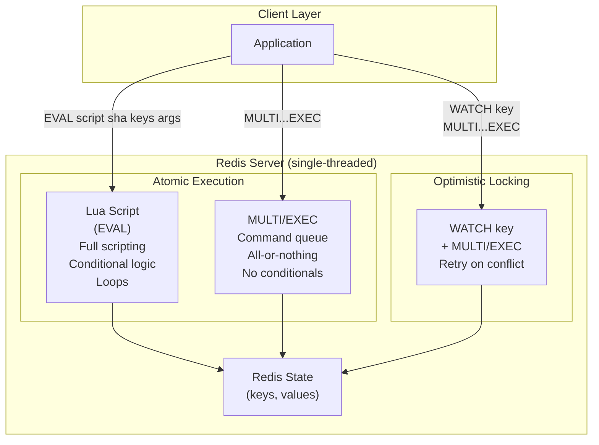
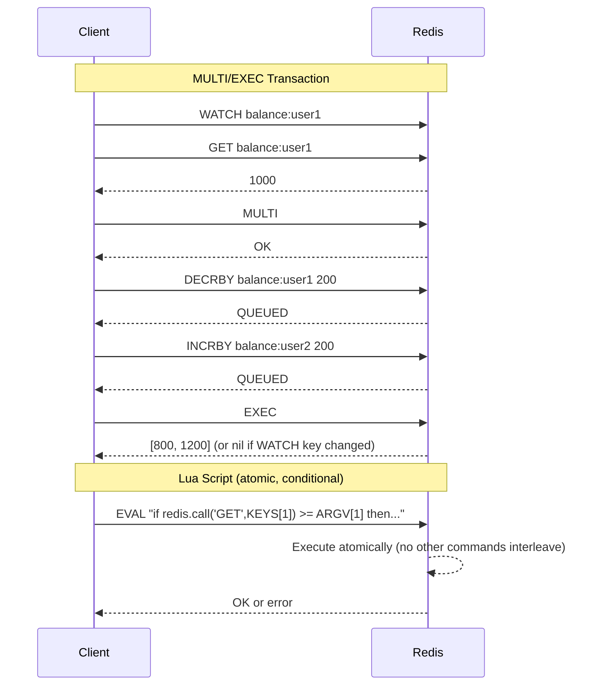

# Redis Lua Scripts and Transactions

## Problem Statement

Design atomic operations in Redis using Lua scripts and MULTI/EXEC transactions — enabling complex multi-key operations, check-and-set patterns, and rate limiters that execute atomically without race conditions.

## Architecture Diagram



## Flow Diagram



## Design

### MULTI/EXEC Transactions

```
Commands:
  MULTI       - start transaction queue
  COMMAND     - queued (returns QUEUED, not executed)
  EXEC        - execute all queued commands atomically
  DISCARD     - abort queued commands
  WATCH key   - optimistic lock: abort EXEC if key changed

Properties:
  Atomic: all commands run without interruption
  Isolated: no other client commands interleave
  NOT ACID: errors in EXEC don't rollback others
    Syntax error at QUEUE time: entire EXEC fails
    Runtime error at EXEC time: other commands succeed

WATCH example (check-and-set):
  WATCH balance
  current = GET balance
  if current < amount: DISCARD; error
  MULTI
  DECRBY balance amount
  EXEC
  if exec returns nil: retry (WATCH detected change)

Limitations:
  No conditional logic inside MULTI/EXEC block
  All commands must be known at MULTI time
  If you need "if this then that": use Lua instead
```

### Lua Scripts

```
EVAL script numkeys key [key ...] arg [arg ...]
EVALSHA sha1 numkeys key [key ...]

Properties:
  Atomic: entire script runs without interruption
  No partial execution: script either completes or errors
  Deterministic: must not use random, time (use KEYS/ARGV)
  Persistent: SCRIPT LOAD caches by SHA1

redis.call() vs redis.pcall():
  redis.call(): propagates error (stops script)
  redis.pcall(): catches error, returns error object

Key rule: ALL keys must be passed via KEYS[] array
  Allows Redis Cluster to route correctly
  Never hardcode key names in script body

Common use cases:
  Rate limiting (atomic increment + expire check)
  Distributed lock (SET NX + GET owner)
  Counter with threshold (don't exceed limit)
  Leaderboard update + notification trigger
  Inventory decrement (check > 0 before decrement)
```

### Rate Limiter Patterns

```
Sliding Window Rate Limiter (Lua):
  KEYS[1] = rate:user:1234
  ARGV[1] = current_timestamp_ms
  ARGV[2] = window_ms (60000)
  ARGV[3] = limit (100)
  
  Script:
    1. ZREMRANGEBYSCORE key 0 (now - window)
    2. count = ZCARD key
    3. if count >= limit: return 0 (rate limited)
    4. ZADD key now now
    5. EXPIRE key window_s
    6. return 1 (allowed)

Token Bucket (Lua):
  KEYS[1] = bucket:user:1234
  ARGV[1] = now, ARGV[2] = max_tokens, ARGV[3] = refill_rate
  
  Script:
    1. last_refill, tokens = HMGET key last_refill tokens
    2. elapsed = now - last_refill
    3. new_tokens = min(max, tokens + elapsed * rate)
    4. if new_tokens < 1: return 0
    5. HMSET key last_refill now tokens (new_tokens - 1)
    6. return 1

Fixed Window (simple, less accurate):
  key = rate:user:1234:minute:202601121430
  INCR key -> count
  if count == 1: EXPIRE key 60
  if count > limit: reject
```

### Distributed Lock (Redlock)

```
Single node:
  SET lock:resource owner_id NX EX 30
  if result == OK: acquired
  
  Release (Lua, atomic check-and-delete):
  if redis.call("GET", KEYS[1]) == ARGV[1] then
    return redis.call("DEL", KEYS[1])
  else
    return 0
  end
  
  Critical: must use Lua for release
  Without Lua: GET then DEL has a race condition
  (another owner may have acquired between GET and DEL)

Redlock (multi-node):
  Acquire on N/2+1 of N independent Redis instances
  All must succeed within clock_drift + retry_time
  If not: release all acquired locks
  
  Properties:
    Fault-tolerant: survives N/2 - 1 node failures
    Controversy: not 100% safe in async networks (Kleppmann)
    Use ZooKeeper/etcd for stronger guarantees
```

## Common Questions & Answers

**Q: What is the difference between MULTI/EXEC and Lua scripts?** A: MULTI/EXEC queues commands and runs them atomically but cannot branch (no if-then). Lua runs arbitrary scripting logic (loops, conditionals) atomically. Lua is strictly more powerful. MULTI/EXEC is simpler for straightforward multi-command atomicity; Lua required when logic depends on Redis values.

**Q: Why does Redis say transactions are not truly ACID?** A: Redis transactions are A (atomic execution) and I (isolated). But not D (durable by default — persistence is optional) and not "C" in the traditional sense. Runtime errors in EXEC don't roll back prior commands in the queue — only syntax errors at queue time fail the whole transaction.

**Q: How do you use Lua for a distributed lock release safely?** A: Always check-and-delete atomically: `if GET(lock) == my_id then DEL(lock)`. Without Lua, two operations (GET then DEL) have a race: you might delete another owner's lock. The Lua script runs atomically, so the check and delete happen without interruption.

**Q: What happens to a Lua script if it runs too long?** A: By default, if a Lua script runs >5 seconds (lua-time-limit=5000ms), Redis logs a warning and starts refusing new commands (returns BUSY error). The script can be killed with `SCRIPT KILL` (if it hasn't written) or `DEBUG RELOAD`. This is why scripts must be short and deterministic.

**Q: How does Redis Cluster affect EVAL scripts?** A: In Redis Cluster, all keys accessed in a script must be on the same slot (same node). Pass ALL keys via KEYS[] array — Redis validates they map to the same slot. Use hash tags `{prefix}` to force co-location. Cross-slot scripts fail with CROSSSLOT error.

## Back-of-Envelope Calculations

```
Lua script overhead:
  Startup per EVAL: ~1-2 microseconds
  EVALSHA (cached): <1 microsecond overhead vs EVAL
  Use SCRIPT LOAD + EVALSHA for production (no retransmit)

Rate limiter capacity:
  Sliding window with sorted set: O(log N) per request
  N = requests in window = 100 req/min window
  100K users x 100 requests/window = 10M entries
  Memory: 10M * 64 bytes = 640MB (1 sorted set per user)
  
  Optimization: use separate expiry keys (N keys, not sorted sets)
  Fixed window: 100K keys * 32 bytes = 3.2MB (much more efficient)

Distributed lock throughput:
  Lock acquisition = 1 SET NX EX: 100K locks/s per Redis
  Lock release = 1 EVALSHA: 100K releases/s
  Lock lifecycle = 2 ops: 50K lock cycles/s per Redis
  For 1M lock ops/s: ~20 Redis instances

WATCH retry overhead:
  High contention key: WATCH fails frequently
  10K concurrent clients watching same key: ~100% retry rate
  Use Lua instead (no retries needed): 10x throughput improvement
```

## Design Choices

| Pattern | Conditional Logic | Retry Needed | Complexity | Use Case |
|---|---|---|---|---|
| MULTI/EXEC | No | On WATCH conflict | Low | Simple multi-op |
| WATCH+MULTI/EXEC | Pre-check only | Yes (on conflict) | Medium | Optimistic CAS |
| Lua EVAL | Full scripting | No (atomic) | Medium | Complex logic |
| Lua EVALSHA | Full scripting | No (atomic) | Medium | Production (cached) |
| Redlock | N/A | On acquire fail | High | Distributed lock |

## Follow-up Questions

1. How do you implement a distributed semaphore using Redis Lua scripts?
2. What are the safety concerns with Redlock and how does fencing tokens address them?
3. How do you debug Lua scripts in Redis (SCRIPT DEBUG, redis-cli --ldb)?
4. How do you use Redis pipelines vs MULTI/EXEC for performance optimization?
5. How do you implement a distributed leaky bucket rate limiter in Redis?

## Python Implementation

```python
import time
import random
import threading
import hashlib
from typing import Any, Callable, Dict, List, Optional, Tuple
from dataclasses import dataclass, field

class RedisSimulator:
    def __init__(self):
        self._store: Dict[str, Any] = {}
        self._expires: Dict[str, float] = {}
        self._zsets: Dict[str, Dict[str, float]] = {}
        self._hashes: Dict[str, Dict[str, str]] = {}
        self._lock = threading.Lock()  # Simulate single-threaded atomicity

    def _is_expired(self, key: str) -> bool:
        exp = self._expires.get(key, 0)
        return exp > 0 and time.time() > exp

    def get(self, key: str) -> Optional[str]:
        if self._is_expired(key):
            self._store.pop(key, None)
            return None
        return self._store.get(key)

    def set(self, key: str, value: str, ex: int = 0, nx: bool = False, xx: bool = False) -> bool:
        if nx and key in self._store and not self._is_expired(key):
            return False
        if xx and (key not in self._store or self._is_expired(key)):
            return False
        self._store[key] = value
        if ex:
            self._expires[key] = time.time() + ex
        return True

    def delete(self, *keys: str) -> int:
        count = 0
        for key in keys:
            if key in self._store:
                del self._store[key]
                count += 1
        return count

    def incr(self, key: str) -> int:
        val = int(self._store.get(key, 0)) + 1
        self._store[key] = str(val)
        return val

    def incrby(self, key: str, amount: int) -> int:
        val = int(self._store.get(key, 0)) + amount
        self._store[key] = str(val)
        return val

    def expire(self, key: str, seconds: int):
        self._expires[key] = time.time() + seconds

    def zadd(self, key: str, mapping: Dict[str, float]) -> int:
        if key not in self._zsets:
            self._zsets[key] = {}
        self._zsets[key].update(mapping)
        return len(mapping)

    def zcard(self, key: str) -> int:
        return len(self._zsets.get(key, {}))

    def zremrangebyscore(self, key: str, min_score: float, max_score: float) -> int:
        zset = self._zsets.get(key, {})
        to_remove = [m for m, s in zset.items() if min_score <= s <= max_score]
        for m in to_remove:
            del zset[m]
        return len(to_remove)

    def hmget(self, key: str, *fields: str) -> List[Optional[str]]:
        h = self._hashes.get(key, {})
        return [h.get(f) for f in fields]

    def hmset(self, key: str, mapping: Dict[str, str]):
        if key not in self._hashes:
            self._hashes[key] = {}
        self._hashes[key].update(mapping)

    def eval_script(self, script_name: str, keys: List[str], args: List[str]) -> Any:
        with self._lock:  # Atomic: no other operation can interleave
            return self._scripts[script_name](self, keys, args)

    _scripts: Dict[str, Callable] = {}

class LuaScriptLibrary:
    def __init__(self, redis: RedisSimulator):
        self._redis = redis
        self._register_scripts()

    def _register_scripts(self):
        self._redis._scripts = {
            "sliding_window_rate_limit": self._sliding_window_rate_limit,
            "token_bucket": self._token_bucket,
            "acquire_lock": self._acquire_lock,
            "release_lock": self._release_lock,
            "atomic_transfer": self._atomic_transfer,
        }

    @staticmethod
    def _sliding_window_rate_limit(redis: RedisSimulator, keys: List[str], args: List[str]) -> int:
        key = keys[0]
        now = float(args[0])
        window_ms = float(args[1])
        limit = int(args[2])
        window_start = now - window_ms

        redis.zremrangebyscore(key, 0, window_start)
        count = redis.zcard(key)
        if count >= limit:
            return 0
        redis.zadd(key, {str(now): now})
        redis.expire(key, int(window_ms / 1000) + 1)
        return 1

    @staticmethod
    def _token_bucket(redis: RedisSimulator, keys: List[str], args: List[str]) -> int:
        key = keys[0]
        now = float(args[0])
        max_tokens = float(args[1])
        refill_rate = float(args[2])  # tokens per second

        vals = redis.hmget(key, "last_refill", "tokens")
        last_refill = float(vals[0]) if vals[0] else now
        tokens = float(vals[1]) if vals[1] else max_tokens

        elapsed = now - last_refill
        new_tokens = min(max_tokens, tokens + elapsed * refill_rate)

        if new_tokens < 1:
            return 0
        redis.hmset(key, {"last_refill": str(now), "tokens": str(new_tokens - 1)})
        return 1

    @staticmethod
    def _acquire_lock(redis: RedisSimulator, keys: List[str], args: List[str]) -> int:
        lock_key = keys[0]
        owner = args[0]
        ttl = int(args[1])
        return 1 if redis.set(lock_key, owner, ex=ttl, nx=True) else 0

    @staticmethod
    def _release_lock(redis: RedisSimulator, keys: List[str], args: List[str]) -> int:
        lock_key = keys[0]
        owner = args[0]
        current = redis.get(lock_key)
        if current == owner:
            redis.delete(lock_key)
            return 1
        return 0

    @staticmethod
    def _atomic_transfer(redis: RedisSimulator, keys: List[str], args: List[str]) -> int:
        src_key, dst_key = keys[0], keys[1]
        amount = int(args[0])
        src_val = int(redis.get(src_key) or 0)
        if src_val < amount:
            return -1  # Insufficient balance
        redis._store[src_key] = str(src_val - amount)
        dst_val = int(redis.get(dst_key) or 0)
        redis._store[dst_key] = str(dst_val + amount)
        return 1

class RateLimiter:
    def __init__(self, redis: RedisSimulator, scripts: LuaScriptLibrary):
        self._redis = redis
        self._scripts = scripts

    def sliding_window(self, user_id: str, limit: int = 100, window_s: int = 60) -> bool:
        key = f"rl:sw:{user_id}"
        now_ms = time.time() * 1000
        result = self._redis.eval_script(
            "sliding_window_rate_limit",
            [key], [str(now_ms), str(window_s * 1000), str(limit)]
        )
        return result == 1

    def token_bucket(self, user_id: str, max_tokens: float = 10, refill_rate: float = 1.0) -> bool:
        key = f"rl:tb:{user_id}"
        result = self._redis.eval_script(
            "token_bucket",
            [key], [str(time.time()), str(max_tokens), str(refill_rate)]
        )
        return result == 1

class DistributedLock:
    def __init__(self, redis: RedisSimulator, scripts: LuaScriptLibrary):
        self._redis = redis
        self._scripts = scripts
        self._owner = f"owner-{random.randint(1000, 9999)}"

    def acquire(self, resource: str, ttl: int = 30) -> bool:
        result = self._redis.eval_script(
            "acquire_lock",
            [f"lock:{resource}"], [self._owner, str(ttl)]
        )
        return result == 1

    def release(self, resource: str) -> bool:
        result = self._redis.eval_script(
            "release_lock",
            [f"lock:{resource}"], [self._owner]
        )
        return result == 1

    def with_lock(self, resource: str, ttl: int = 30):
        class _Context:
            def __init__(self_, lock: "DistributedLock"):
                self_._lock = lock
            def __enter__(self_):
                acquired = self_._lock.acquire(resource, ttl)
                if not acquired:
                    raise RuntimeError(f"Could not acquire lock: {resource}")
                return self_
            def __exit__(self_, *args):
                self_._lock.release(resource)
        return _Context(self)

# Demo
redis = RedisSimulator()
scripts = LuaScriptLibrary(redis)
limiter = RateLimiter(redis, scripts)

print("=== Sliding Window Rate Limiter (100 req/min) ===")
allowed = sum(1 for _ in range(110) if limiter.sliding_window("user:1", limit=100, window_s=60))
print(f"Allowed: {allowed}/110 (expected ~100)")

print("\n=== Token Bucket (10 max tokens, 1 token/s refill) ===")
results = [limiter.token_bucket("user:2", max_tokens=10, refill_rate=1.0) for _ in range(15)]
print(f"Results: {results}")
print(f"Allowed: {sum(results)}/15 (first 10 pass, rest fail)")

print("\n=== Distributed Lock ===")
lock = DistributedLock(redis, scripts)

# Setup accounts
redis.set("balance:alice", "1000")
redis.set("balance:bob", "500")

# Atomic transfer
with lock.with_lock("transfer:alice:bob"):
    result = redis.eval_script("atomic_transfer", ["balance:alice", "balance:bob"], ["200"])
    print(f"Transfer 200 Alice->Bob: {'success' if result == 1 else 'failed'}")

print(f"Alice balance: {redis.get('balance:alice')}")
print(f"Bob balance: {redis.get('balance:bob')}")

# Lock contention
lock2 = DistributedLock(redis, scripts)
a1 = lock.acquire("resource:x", ttl=10)
a2 = lock2.acquire("resource:x", ttl=10)
print(f"\nLock contention: lock1={a1}, lock2={a2} (only one succeeds)")
lock.release("resource:x")
a3 = lock2.acquire("resource:x", ttl=10)
print(f"After release: lock2 retry={a3}")
```

## Java Implementation

```java
import java.util.*;
import java.util.concurrent.*;

public class RedisLuaTransactions {
    static class RedisNode {
        Map<String, String> store = new ConcurrentHashMap<>();
        Map<String, Long> expires = new ConcurrentHashMap<>();
        Map<String, Map<String, Double>> zsets = new ConcurrentHashMap<>();
        private final Object mutex = new Object();

        boolean set(String k, String v, long ttlMs, boolean nx) {
            synchronized (mutex) {
                if (nx && store.containsKey(k)) return false;
                store.put(k, v);
                if (ttlMs > 0) expires.put(k, System.currentTimeMillis() + ttlMs);
                return true;
            }
        }

        String get(String k) {
            Long exp = expires.get(k);
            if (exp != null && System.currentTimeMillis() > exp) { store.remove(k); expires.remove(k); return null; }
            return store.get(k);
        }

        // Sliding window rate limit (Lua-equivalent atomic execution)
        int slidingWindowRateLimit(String key, long nowMs, long windowMs, int limit) {
            synchronized (mutex) {
                Map<String, Double> zset = zsets.computeIfAbsent(key, k -> new LinkedHashMap<>());
                long windowStart = nowMs - windowMs;
                zset.entrySet().removeIf(e -> e.getValue() <= windowStart);
                if (zset.size() >= limit) return 0;
                zset.put(String.valueOf(nowMs), (double) nowMs);
                return 1;
            }
        }

        // Atomic check-and-delete (Lua release lock equivalent)
        int releaseLock(String lockKey, String owner) {
            synchronized (mutex) {
                if (owner.equals(get(lockKey))) { store.remove(lockKey); return 1; }
                return 0;
            }
        }

        // Atomic balance transfer
        int atomicTransfer(String src, String dst, int amount) {
            synchronized (mutex) {
                int srcBal = Integer.parseInt(store.getOrDefault(src, "0"));
                if (srcBal < amount) return -1;
                int dstBal = Integer.parseInt(store.getOrDefault(dst, "0"));
                store.put(src, String.valueOf(srcBal - amount));
                store.put(dst, String.valueOf(dstBal + amount));
                return 1;
            }
        }
    }

    public static void main(String[] args) {
        RedisNode redis = new RedisNode();

        // Rate limiter
        System.out.println("=== Rate Limiter (100 req/min) ===");
        int allowed = 0;
        for (int i = 0; i < 110; i++) {
            if (redis.slidingWindowRateLimit("rl:user1", System.currentTimeMillis(), 60000, 100) == 1) allowed++;
        }
        System.out.println("Allowed: " + allowed + "/110");

        // Distributed lock + atomic transfer
        redis.set("bal:alice", "1000", 0, false);
        redis.set("bal:bob", "500", 0, false);
        String owner = "thread-1";
        boolean acquired = redis.set("lock:transfer", owner, 30000, true);
        System.out.println("Lock acquired: " + acquired);
        int r = redis.atomicTransfer("bal:alice", "bal:bob", 200);
        System.out.println("Transfer: " + (r == 1 ? "success" : "failed"));
        int released = redis.releaseLock("lock:transfer", owner);
        System.out.println("Lock released: " + (released == 1));
        System.out.println("Alice: " + redis.get("bal:alice") + ", Bob: " + redis.get("bal:bob"));
    }
}
```

## Complexity

| Operation | Time | Atomicity | Conditional |
|---|---|---|---|
| MULTI/EXEC | O(commands) | Yes | No |
| WATCH + MULTI/EXEC | O(commands) | Yes (or abort) | Pre-check only |
| EVAL Lua | O(script) | Yes | Full |
| EVALSHA | O(script) | Yes | Full |
| Sliding window RL (Lua) | O(log N) | Yes | Yes |
| Token bucket (Lua) | O(1) | Yes | Yes |
| Distributed lock (Lua) | O(1) | Yes | Yes |
